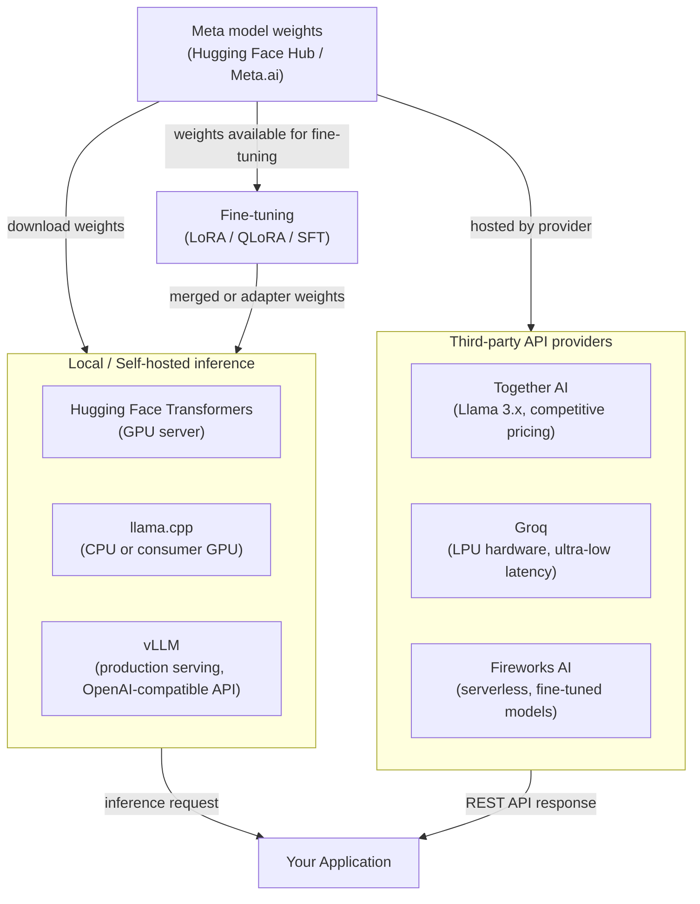

# Meta Llama

## Definição

O Llama (Large Language Model Meta AI) da Meta é uma família de grandes modelos de linguagem de pesos abertos lançada pela Meta AI Research. Diferentemente de modelos totalmente proprietários distribuídos apenas por uma API paga, os modelos Llama são lançados com pesos que desenvolvedores podem baixar, inspecionar, modificar e redistribuir sob a licença comunitária personalizada da Meta. Isso significa que organizações podem executar inferência inteiramente dentro de sua própria infraestrutura, sem rotear dados por um serviço de nuvem de terceiros — uma vantagem significativa para cargas de trabalho sensíveis à privacidade. A série começou em 2023 com Llama 1 e Llama 2, e atingiu um marco importante com a geração **Llama 3**.

A **família Llama 3** abrange múltiplos tamanhos e especializações. O lançamento base do Llama 3 incluiu variantes de 8B e 70B com ajuste de instrução e base. Lançamentos subsequentes introduziram o **Llama 3.1** (com 405B de parâmetros, janela de contexto de 128K estendida e melhorias multilíngues), **Llama 3.2** (modelos leves de 1B e 3B para uso em dispositivos, mais variantes multimodais de visão de 11B e 90B) e **Llama 3.3** (um modelo de 70B com desempenho multilíngue e de raciocínio significativamente melhorado). Juntos, cobrem um amplo espectro desde implantação em borda até desempenho próximo à fronteira.

O espaço de modelos de pesos abertos está na interseção de um debate filosófico e prático: **aberto vs. fechado**. Defensores de pesos abertos argumentam que transparência, auditabilidade, inovação comunitária e controle de custos superam a conveniência de uma API gerenciada. Os críticos apontam que modelos grandes de pesos abertos são caros de servir em escala, exigem expertise de engenharia para implantar e proteger, e que "pesos abertos" não é o mesmo que "open source" — os dados de treinamento e a metodologia completa permanecem proprietários. Na prática, a maioria das organizações acaba em uma abordagem híbrida: usando modelos de pesos abertos para cargas de trabalho sensíveis ou com restrição de custos, enquanto ainda dependem de provedores de API fechados para capacidade de ponta.

## Como funciona

### Implantação local — transformers, llama.cpp, vLLM

A maneira mais direta de executar modelos Llama é localmente usando Hugging Face **Transformers**, que fornece uma interface Python unificada sobre centenas de arquiteturas de modelos. Para modelos menores (7B–13B) em hardware de consumidor, o **llama.cpp** é o padrão ouro: é um motor de inferência em C/C++ puro com suporte a quantização GGUF que pode executar o Llama 3 8B em quantização de 4 bits em uma CPU de laptop ou GPU modesta com latência aceitável. Para serving em produção em escala, o **vLLM** é a solução recomendada — implementa PagedAttention para gerenciamento eficiente de cache KV, habilita batching contínuo e expõe uma API REST compatível com OpenAI, facilitando a substituição do Llama por qualquer integração GPT-4 com alterações mínimas de código. Cada opção ocupa um ponto diferente na curva de trade-off entre latência, throughput e hardware.

### Provedores de API de terceiros — Together AI, Groq, Fireworks AI

Para equipes que querem a flexibilidade de modelos de pesos abertos sem o ônus de infraestrutura, vários provedores especializados hospedam modelos Llama via APIs gerenciadas. O **Together AI** oferece modelos Llama 3.x com preços competitivos por token e um SDK Python que espelha a interface da OpenAI. O **Groq** executa modelos Llama em hardware LPU (Language Processing Unit) personalizado, entregando latência extremamente baixa (frequentemente dígito único de milissegundos por token) adequada para aplicações interativas. O **Fireworks AI** foca em implantações de modelos ajustados e sem servidor com forte foco na experiência do desenvolvedor. Esses provedores são particularmente valiosos para trabalhos de prova de conceito, cargas de trabalho em pico ou equipes sem infraestrutura de GPU.

### Fine-tuning de pesos abertos

Uma das vantagens mais atraentes dos modelos de pesos abertos é o acesso completo ao fine-tuning. Organizações podem adaptar o Llama a tarefas específicas de domínio, requisitos de estilo ou perfis de segurança usando fine-tuning supervisionado (SFT) e aprendizado por reforço a partir de feedback humano (RLHF). Na prática, a maioria dos praticantes usa fine-tuning com eficiência de parâmetros via **LoRA** (Low-Rank Adaptation) ou **QLoRA** (LoRA em pesos quantizados), que reduz os requisitos de memória GPU em 4–10x. Os pesos do adaptador ajustado são minúsculos em comparação com o modelo base e podem ser mesclados ou carregados separadamente. Ferramentas como **Hugging Face TRL**, **Axolotl** e **LLaMA-Factory** fornecem loops de treinamento de alto nível para fine-tuning do Llama com código mínimo.



## Quando usar / Quando NÃO usar

| Use quando | Evite quando |
|----------|------------|
| A privacidade de dados é primordial — indústrias regulamentadas, PII, IP confidencial que não deve sair da sua infraestrutura | Você precisa de capacidade de fronteira de ponta (GPT-4o / Claude 3.5 ainda superam o Llama 3 em muitos benchmarks de raciocínio complexo) |
| Controle de custos em alto volume — os custos de API por token se acumulam rapidamente; auto-hospedar modelos grandes pode ser significativamente mais barato acima de certos limites de QPS | Você não tem capacidade de engenharia de ML para gerenciar infraestrutura de GPU, manter modelos atualizados e lidar com patches de segurança |
| Você precisa fazer fine-tuning do modelo em dados proprietários para personalizar profundamente o comportamento ou estilo | Você precisa de uma API gerenciada pronta para produção com SLAs, auto-escalonamento e zero overhead operacional hoje |
| Você quer auditabilidade completa e a capacidade de inspecionar pesos do modelo para conformidade ou red-teaming | Sua carga de trabalho requer grounding web em tempo real ou áudio/vídeo multimodal nativo (o Llama 3.2 adiciona visão, mas não está à par com o Gemini 1.5) |
| Você quer executar inferência no dispositivo sem dependência de rede (Llama 3.2 1B/3B, llama.cpp) | Sua equipe está avaliando modelos rapidamente e a velocidade de iteração importa mais do que o controle de dados |

## Comparações

| Critério | Meta Llama 3.x | OpenAI GPT-4o | Mistral (pesos abertos) |
|-----------|---------------|--------------|------------------------|
| Disponibilidade de pesos | Download de pesos abertos (licença comunitária) | Apenas API fechada | Pesos abertos para 7B / Mixtral; fechado para Mistral Large |
| Maior tamanho de modelo | 405B (Llama 3.1) | Não divulgado | ~141B efetivos (Mixtral 8x22B) |
| Auto-hospedagem | Totalmente suportado; llama.cpp, vLLM, Transformers | Não é possível | Totalmente suportado; mesma cadeia de ferramentas que o Llama |
| Opções de API gerenciada | Together AI, Groq, Fireworks, AWS Bedrock, Azure AI | OpenAI direto, Azure OpenAI | La Plateforme (mistral.ai), Together AI |
| Fine-tuning | Sim — LoRA, QLoRA, SFT em pesos completos | API de fine-tuning apenas para GPT-3.5/4o-mini | Sim — mesma cadeia de ferramentas de pesos abertos |
| Multimodal | Llama 3.2 (visão 11B/90B) | GPT-4o (texto + imagem, áudio nativamente) | Apenas texto para modelos abertos; Pixtral via API |
| Soberania de dados europeia | Possível com auto-hospedagem em região da UE | Limitado (apenas regiões Azure UE) | Provedor nativo da UE (sede em Paris) |

## Exemplos de código

```python
# meta_llama_examples.py
# Demonstrates two deployment paths:
#   1. Local inference with Hugging Face Transformers
#   2. Third-party API via Together AI (OpenAI-compatible interface)
#
# pip install transformers accelerate torch together

# ─────────────────────────────────────────────────────────────────────────────
# Path 1: Local inference with Hugging Face Transformers
# Requires a GPU with enough VRAM (e.g. RTX 3090 for 8B in bfloat16,
# or use load_in_4bit=True with bitsandbytes for lower VRAM).
# ─────────────────────────────────────────────────────────────────────────────
from transformers import AutoTokenizer, AutoModelForCausalLM
import torch


def local_llama_inference(prompt: str, model_id: str = "meta-llama/Meta-Llama-3.1-8B-Instruct"):
    """
    Run Llama 3.1 8B Instruct locally.
    Requires a Hugging Face token with access granted at meta-llama/Meta-Llama-3.1-8B-Instruct.
    Set HF_TOKEN environment variable or pass token= to from_pretrained.
    """
    tokenizer = AutoTokenizer.from_pretrained(model_id)
    model = AutoModelForCausalLM.from_pretrained(
        model_id,
        torch_dtype=torch.bfloat16,
        device_map="auto",          # automatically distribute across available GPUs
        # load_in_4bit=True,        # uncomment for QLoRA / low VRAM inference
    )

    # Llama 3 instruct models use a chat template
    messages = [
        {"role": "system", "content": "You are a helpful data science assistant."},
        {"role": "user", "content": prompt},
    ]
    input_ids = tokenizer.apply_chat_template(
        messages,
        add_generation_prompt=True,
        return_tensors="pt",
    ).to(model.device)

    outputs = model.generate(
        input_ids,
        max_new_tokens=512,
        temperature=0.6,
        top_p=0.9,
        do_sample=True,
        eos_token_id=tokenizer.eos_token_id,
    )

    # Decode only the generated tokens (skip the input)
    generated = outputs[0][input_ids.shape[-1]:]
    return tokenizer.decode(generated, skip_special_tokens=True)


# ─────────────────────────────────────────────────────────────────────────────
# Path 2: Together AI — managed Llama API (OpenAI-compatible)
# Requires a Together AI account: https://api.together.ai
# pip install together
# ─────────────────────────────────────────────────────────────────────────────
from together import Together


def together_ai_inference(prompt: str):
    """
    Call Llama 3.1 405B via Together AI's managed inference API.
    Together AI uses an OpenAI-compatible interface, so the openai SDK
    also works — just point base_url at https://api.together.xyz/v1.
    """
    client = Together(api_key="YOUR_TOGETHER_API_KEY")

    response = client.chat.completions.create(
        model="meta-llama/Meta-Llama-3.1-405B-Instruct-Turbo",
        messages=[
            {"role": "system", "content": "You are a helpful data science assistant."},
            {"role": "user", "content": prompt},
        ],
        max_tokens=512,
        temperature=0.6,
        top_p=0.9,
    )

    return response.choices[0].message.content


# ─────────────────────────────────────────────────────────────────────────────
# Path 3: vLLM — production-grade OpenAI-compatible server (run separately)
# Start server: vllm serve meta-llama/Meta-Llama-3.1-8B-Instruct --port 8000
# Then query it as if it were the OpenAI API:
# ─────────────────────────────────────────────────────────────────────────────
from openai import OpenAI


def vllm_server_inference(prompt: str, base_url: str = "http://localhost:8000/v1"):
    """
    Query a locally running vLLM server.
    vLLM exposes an OpenAI-compatible API at /v1/chat/completions.
    """
    client = OpenAI(api_key="not-needed-for-local", base_url=base_url)

    response = client.chat.completions.create(
        model="meta-llama/Meta-Llama-3.1-8B-Instruct",
        messages=[{"role": "user", "content": prompt}],
        max_tokens=256,
        temperature=0.7,
    )
    return response.choices[0].message.content


# ─────────────────────────────────────────────────────────────────────────────
if __name__ == "__main__":
    test_prompt = "Explain the bias-variance tradeoff in machine learning."

    # Uncomment to run local inference (requires GPU + HF access)
    # print("=== Local (Transformers) ===")
    # print(local_llama_inference(test_prompt))

    print("=== Together AI ===")
    print(together_ai_inference(test_prompt))

    # Uncomment if you have a vLLM server running
    # print("=== vLLM Server ===")
    # print(vllm_server_inference(test_prompt))
```

## Recursos práticos

- [Repositório GitHub do Llama (Meta)](https://github.com/meta-llama/llama-models) — Cards de modelos oficiais, instruções de download e a licença comunitária para toda a família Llama 3.
- [Llama 3 no Hugging Face](https://huggingface.co/meta-llama) — Pesos dos modelos, arquivos de tokenizer e fine-tunes da comunidade; requer uma conta no Hugging Face com acesso concedido.
- [llama.cpp](https://github.com/ggerganov/llama.cpp) — Motor de inferência leve em C/C++ com quantização GGUF; a ferramenta preferida para implantação em CPU e GPU de consumidor.
- [Documentação do Together AI](https://docs.together.ai/) — Referência da API Llama gerenciada, preços e guias de fine-tuning para modelos de pesos abertos hospedados.
- [Documentação do vLLM](https://docs.vllm.ai/) — Framework de serving em produção com PagedAttention, batching contínuo e servidor compatível com OpenAI.

## Veja também

- [Provedores de modelos](/docs/model-providers)
- [Inferência local](/docs/local-inference)
- [Infraestrutura](/docs/infrastructure)
- [LLMs — Fine-tuning](/docs/llms/fine-tuning)
- [Comparação Meta Llama → Mistral](/docs/model-providers/mistral)
