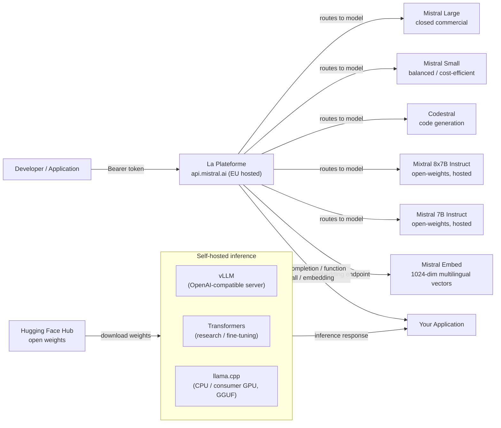

# Mistral AI

## Definição

A Mistral AI é uma startup francesa de IA fundada em 2023 que rapidamente se estabeleceu como uma das players mais influentes no ecossistema europeu de IA. A filosofia definidora da empresa é uma **abordagem dupla**: lançar modelos de pesos abertos eficientes para a comunidade de pesquisa e ecossistema de desenvolvedores, enquanto simultaneamente oferece uma plataforma de API comercial (**La Plateforme**) com modelos premium e recursos empresariais. Essa combinação tornou a Mistral particularmente popular entre desenvolvedores que querem experimentar livremente antes de se comprometer com uma implantação paga, e com empresas europeias que buscam um provedor de IA soberano com infraestrutura compatível com o RGPD hospedada em data centers da UE.

Os lançamentos de pesos abertos da Mistral têm sido notavelmente eficientes para sua contagem de parâmetros. O **Mistral 7B**, lançado em setembro de 2023, superou o Llama 2 13B na maioria dos benchmarks apesar de ser quase metade do tamanho — principalmente por usar Grouped-Query Attention (GQA) para inferência rápida e uma janela de contexto de 32K incomum nessa escala. O **Mixtral 8x7B** introduziu uma arquitetura Mixture of Experts (MoE) com oito redes feed-forward especialistas por camada, ativando apenas duas por token. Isso dá ao Mixtral a contagem de parâmetros efetivos de 13B durante a inferência, enquanto tem 47B de parâmetros totais — entregando qualidade próxima de modelos de 70B com menor custo computacional. Lançamentos subsequentes estenderam a linha comercial com **Mistral Small**, **Mistral Medium** e **Mistral Large**, este último competindo com modelos da classe GPT-4 em raciocínio complexo e tarefas de codificação.

Os pontos fortes da Mistral se concentram em eficiência, desempenho multilíngue (particularmente em idiomas europeus — francês, espanhol, alemão, italiano) e uma API amigável ao desenvolvedor que segue de perto a interface da OpenAI. A empresa também é notável dentro do panorama de governança de IA por participar ativamente das discussões sobre o AI Act da UE e se posicionar como uma alternativa europeia responsável às APIs de laboratórios de fronteira dos EUA.

## Como funciona

### API La Plateforme

A La Plateforme (`api.mistral.ai`) é a API de inferência gerenciada da Mistral, construída em torno da interface de chat completions da OpenAI. As requisições são estruturadas como `{"model": "...", "messages": [...]}` — qualquer biblioteca cliente construída para a API da OpenAI pode ser redirecionada com uma única alteração de `base_url`. A API serve tanto os modelos comerciais proprietários da Mistral (Mistral Large, Mistral Small, Mistral Medium, Codestral) quanto os modelos de pesos abertos (Mistral 7B Instruct, Mixtral 8x7B Instruct, Mixtral 8x22B Instruct). A autenticação usa tokens Bearer. A La Plateforme é hospedada em data centers europeus, tornando-a uma escolha natural para organizações com requisitos de residência de dados na UE. Limites de taxa, faturamento e gerenciamento de chaves de API são acessíveis pelo console da Mistral em `console.mistral.ai`.

### Modelos de pesos abertos — Mistral 7B, Mixtral 8x7B, Mistral Large

Os modelos principais de pesos abertos são distribuídos via Hugging Face e podem ser auto-hospedados usando a cadeia de ferramentas padrão Transformers, vLLM ou llama.cpp (formato GGUF). O **Mistral 7B** é ideal para experimentos de fine-tuning, implantação on-premises e ambientes com recursos limitados. O **Mixtral 8x7B** oferece qualidade significativamente maior com custo de parâmetros ativos apenas marginalmente maior e é uma escolha popular para auto-hospedagem em produção. O **Mixtral 8x22B** escala mais para tarefas que exigem raciocínio mais profundo. O **Mistral Large** é um modelo comercial fechado disponível apenas via La Plateforme e parceiros de nuvem selecionados (Azure AI, AWS Bedrock, Google Cloud). Os modelos de pesos abertos usam um mecanismo de atenção de janela deslizante com janela de contexto de 32K, tokenização BPE com vocabulário de 32K e um tokenizador baseado em sentencepiece compatível com o SDK Python oficial da mistralai.

### Function calling

A Mistral suporta function calling estruturado (também chamado de uso de ferramentas) tanto nos modelos instruct de pesos abertos quanto em todos os modelos da La Plateforme. A interface espelha o parâmetro `tools` da OpenAI: você passa uma lista de definições de ferramentas com JSON Schema, o modelo retorna um array `tool_calls` especificando qual função invocar e com quais argumentos, sua aplicação executa a função, e o resultado é retornado como uma mensagem com role `tool` para continuar a conversa. O function calling da Mistral é particularmente útil para construir fluxos de trabalho agênticos, pipelines de extração de dados e camadas de orquestração de API sem overhead adicional de engenharia de prompts.

### Embeddings

A La Plateforme fornece um endpoint de embedding de texto (`/v1/embeddings`) suportado pelo Mistral Embed, um modelo de embedding dedicado que produz vetores densos de 1024 dimensões. O modelo de embedding se destaca em similaridade semântica, recuperação e tarefas de classificação em múltiplos idiomas europeus. A interface é idêntica à API de embeddings da OpenAI: passe uma string ou lista de strings, receba vetores de ponto flutuante. O Mistral Embed é um dos endpoints de embedding com melhor custo-benefício disponíveis, sendo bem adequado para indexação de documentos em grande escala em pipelines de RAG multilíngues.



## Quando usar / Quando NÃO usar

| Use quando | Evite quando |
|----------|------------|
| Você precisa de residência de dados na UE e infraestrutura de IA compatível com o RGPD de fábrica | Você precisa de entrada multimodal nativa de imagem/vídeo/áudio (a Mistral é apenas texto, exceto Pixtral que é apenas via API e em estágio inicial) |
| Você quer uma API compatível com OpenAI com custo mínimo de migração das integrações GPT existentes | Você precisa da capacidade absolutamente mais alta em raciocínio complexo em múltiplas etapas — o Mistral Large fica atrás do GPT-4o e Claude 3.5 Sonnet em alguns benchmarks difíceis |
| A eficiência importa — o Mixtral 8x7B oferece alta qualidade com menor custo computacional ativo do que modelos densos com desempenho equivalente | Você precisa de um ecossistema extenso de fine-tunes de terceiros e suporte da comunidade (a Meta Llama tem uma comunidade aberta maior) |
| Idiomas europeus multilíngues (francês, espanhol, alemão, italiano) são centrais ao seu caso de uso | Sua carga de trabalho requer contexto longo acima de 32K tokens em modelos de pesos abertos (o Llama 3.1 oferece 128K) |
| Você quer auto-hospedar um modelo de pesos abertos e potencialmente fazer fine-tuning com dados proprietários | Você precisa de inferência no dispositivo / na borda com modelos de menos de 1B de parâmetros (Llama 3.2 1B/3B preenche esse nicho melhor) |

## Comparações

| Critério | Mistral AI | Meta Llama 3.x | OpenAI GPT-4o |
|-----------|-----------|---------------|--------------|
| Disponibilidade de pesos | Aberto para 7B, Mixtral 8x7B, 8x22B; fechado para Mistral Large | Aberto para todos os tamanhos (8B a 405B) | Apenas API fechada |
| Localização do provedor de API | UE (Paris); nativo para RGPD | Hosts de terceiros baseados nos EUA (Together, Groq) | EUA (regiões Azure UE disponíveis) |
| Arquitetura MoE | Sim (Mixtral 8x7B, 8x22B) | Não (transformer denso) | Não divulgado |
| Function calling | Uso completo de ferramentas em todos os modelos instruct/API | Sim (Llama 3.x) | Sim (maduro, mais documentado) |
| Multilíngue (idiomas UE) | Forte — objetivo central de design | Bom, mas com ênfase de treinamento centrada nos EUA | Forte em todos os principais idiomas |
| Suporte a fine-tuning | Pesos abertos: LoRA/QLoRA; beta de fine-tuning via API | Pesos abertos: fine-tuning completo disponível | API de fine-tuning apenas para modelos menores |
| API de embedding | Mistral Embed (1024 dimensões, multilíngue) | Não disponível diretamente pela Meta | text-embedding-3-small/large |
| Janela de contexto (modelos abertos) | 32K tokens | 128K tokens (Llama 3.1+) | 128K tokens |

## Prós e contras

| Prós | Contras |
|------|------|
| Forte relação eficiência-qualidade, especialmente Mixtral 8x7B vs modelos densos de qualidade similar | Janela de contexto de pesos abertos (32K) é menor que a 128K do Llama 3.1 |
| API hospedada na UE com forte posicionamento RGPD; apela a clientes empresariais europeus | Ecossistema de comunidade menor e menos fine-tunes da comunidade comparado ao Llama |
| Interface compatível com OpenAI minimiza o esforço de migração | Sem capacidade multimodal nativa em modelos de pesos abertos prontos para produção |
| Lançamentos de pesos abertos genuinamente úteis que superam seu nível | Mistral Large ainda fica atrás dos modelos de primeira linha da OpenAI e Anthropic nos benchmarks mais difíceis |

## Exemplos de código

```python
# mistral_examples.py
# Demonstrates chat completion and function calling with the mistralai Python SDK.
# pip install mistralai

from mistralai import Mistral
import json

# ── Configuration ─────────────────────────────────────────────────────────────
# Get your API key at: https://console.mistral.ai/api-keys
client = Mistral(api_key="YOUR_MISTRAL_API_KEY")


# ── 1. Chat completion ─────────────────────────────────────────────────────────
def chat_completion_example():
    """Standard multi-turn chat with Mistral Large."""
    response = client.chat.complete(
        model="mistral-large-latest",
        messages=[
            {
                "role": "system",
                "content": (
                    "You are a senior machine learning engineer. "
                    "Provide concise, technically accurate answers."
                ),
            },
            {
                "role": "user",
                "content": "What are the key differences between MoE and dense transformer architectures?",
            },
        ],
        temperature=0.4,
        max_tokens=512,
    )

    print("=== Chat Completion ===")
    print(response.choices[0].message.content)
    print(f"\nModel : {response.model}")
    print(f"Usage : {response.usage}")


# ── 2. Function calling ────────────────────────────────────────────────────────
def function_calling_example():
    """
    Mistral function calling (tool use).
    The model decides which tool to call and with what arguments.
    Your application executes the function and returns the result.
    """
    # Define available tools with JSON Schema
    tools = [
        {
            "type": "function",
            "function": {
                "name": "get_model_benchmark",
                "description": (
                    "Retrieves benchmark scores for a specified language model "
                    "on a given benchmark suite."
                ),
                "parameters": {
                    "type": "object",
                    "properties": {
                        "model_name": {
                            "type": "string",
                            "description": "The name of the model, e.g. 'mixtral-8x7b'",
                        },
                        "benchmark": {
                            "type": "string",
                            "enum": ["MMLU", "HumanEval", "GSM8K", "HellaSwag"],
                            "description": "The benchmark suite to query.",
                        },
                    },
                    "required": ["model_name", "benchmark"],
                },
            },
        }
    ]

    # First turn — model decides to call a tool
    messages = [
        {
            "role": "user",
            "content": "What is Mixtral 8x7B's score on the MMLU benchmark?",
        }
    ]

    response = client.chat.complete(
        model="mistral-large-latest",
        messages=messages,
        tools=tools,
        tool_choice="auto",
    )

    assistant_message = response.choices[0].message
    print("=== Function Calling — Step 1: model requests tool call ===")
    print(f"Tool calls: {assistant_message.tool_calls}")

    # Simulate executing the tool
    if assistant_message.tool_calls:
        tool_call = assistant_message.tool_calls[0]
        function_args = json.loads(tool_call.function.arguments)
        print(f"\nExecuting: {tool_call.function.name}({function_args})")

        # Simulated function result
        tool_result = {
            "model": function_args["model_name"],
            "benchmark": function_args["benchmark"],
            "score": 70.6,
            "source": "Open LLM Leaderboard (Hugging Face)",
        }

        # Second turn — return the tool result and get the final response
        messages.append({"role": "assistant", "content": None, "tool_calls": assistant_message.tool_calls})
        messages.append({
            "role": "tool",
            "tool_call_id": tool_call.id,
            "content": json.dumps(tool_result),
        })

        final_response = client.chat.complete(
            model="mistral-large-latest",
            messages=messages,
            tools=tools,
        )

        print("\n=== Function Calling — Step 2: final answer ===")
        print(final_response.choices[0].message.content)


# ── 3. Embeddings ──────────────────────────────────────────────────────────────
def embeddings_example(texts: list[str]):
    """
    Generate multilingual embeddings with Mistral Embed.
    Returns 1024-dimensional dense vectors suitable for semantic search and RAG.
    """
    response = client.embeddings.create(
        model="mistral-embed",
        inputs=texts,
    )

    print("\n=== Embeddings ===")
    for i, embedding_obj in enumerate(response.data):
        vec = embedding_obj.embedding
        print(f"Text    : {texts[i][:60]}...")
        print(f"Dims    : {len(vec)}")
        print(f"First 5 : {vec[:5]}\n")


# ── Entry point ────────────────────────────────────────────────────────────────
if __name__ == "__main__":
    chat_completion_example()
    function_calling_example()
    embeddings_example([
        "L'intelligence artificielle transforme l'industrie.",
        "Machine learning models require careful evaluation.",
        "Die Verarbeitung natürlicher Sprache verbessert sich rasant.",
    ])
```

## Recursos práticos

- [Documentação da Mistral AI](https://docs.mistral.ai/) — Referência completa da API cobrindo chat, embeddings, function calling, fine-tuning e todos os modelos disponíveis.
- [Console La Plateforme](https://console.mistral.ai/) — Gerenciamento de chaves de API, painéis de uso e playground de modelos para testes interativos.
- [Modelos Mistral no Hugging Face](https://huggingface.co/mistralai) — Pesos oficiais dos modelos para Mistral 7B, Mixtral 8x7B e Mixtral 8x22B com instruções de download e cards de modelos.
- [SDK Python mistralai no PyPI](https://pypi.org/project/mistralai/) — Código-fonte do SDK, changelog e exemplos de código para todos os recursos da API.

## Veja também

- [Provedores de modelos](/docs/model-providers)
- [Meta Llama](/docs/model-providers/meta-llama)
- [Inferência local](/docs/local-inference)
- [RAG — Embeddings](/docs/rag/embeddings)
