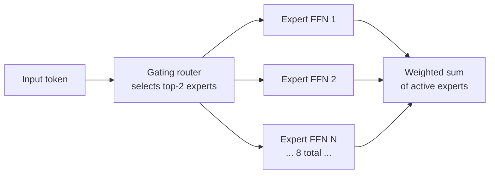

# Mistral AI

## Definição

**Mistral AI** é uma empresa de IA francesa fundada em 2023 que oferece tanto modelos de pesos abertos quanto uma plataforma de API comercial. A estratégia distinta da Mistral consiste em lançar modelos de pesos abertos de alta qualidade (permitindo auto-hospedagem e fine-tuning) enquanto oferece uma API comercial para implantações empresariais. Essa dualidade permite que eles atendam desenvolvedores que querem controle total, empresas que precisam de serviços gerenciados e equipes de pesquisa que querem construir em cima de modelos de base abertos.

A família de modelos da Mistral inclui: **Mistral 7B** (seu modelo de referência inicial que supera o Llama 2 13B sendo menor), **Mixtral 8x7B** (um modelo Mixture-of-Experts de pesos abertos que alcança desempenho equivalente ao GPT-3.5 enquanto ativa apenas 2 especialistas de 8 na inferência, reduzindo consideravelmente a carga computacional), **Mistral Small** e **Mistral Large** (modelos de API comercial otimizados para diferentes pontos de preço), **Codestral** (especializado em geração de código), **Mistral Embed** (modelos de embeddings), e **Mistral NeMo** (um modelo 12B desenvolvido em colaboração com a NVIDIA). A Mistral se distingue por seu forte desempenho multilíngue, particularmente em francês, espanhol, alemão e italiano, refletindo sua origem europeia.

## Como funciona

### A arquitetura Mixture of Experts (MoE)

O Mixtral 8x7B apresenta a arquitetura MoE da Mistral, que é fundamental para entender por que os modelos Mistral são eficientes:



Em uma arquitetura transformer padrão, cada token passa pela mesma camada Feed-Forward Network (FFN). MoE substitui a FFN por N "especialistas" (redes menores) e um roteador aprendido que seleciona os K melhores especialistas para cada token. Com 8 especialistas e K=2, o Mixtral 8x7B tem ~47B de parâmetros no total mas usa apenas ~13B na inferência — oferecendo qualidade próxima a um modelo 40B com a velocidade de um modelo 13B.

### API La Plateforme

A API comercial da Mistral (La Plateforme) expõe os modelos Mistral via formato compatível com OpenAI, simplificando a migração do OpenAI. Ela suporta completions de chat, embeddings, modo JSON e chamadas de função. O fine-tuning está disponível para Mistral Small e outros modelos.

### Modelos de pesos abertos

Os modelos de pesos abertos da Mistral (Mistral 7B, Mixtral 8x7B, Mistral NeMo) são lançados no Hugging Face sob licenças Apache 2.0, permitindo uso comercial sem restrições de redistribuição. Eles podem ser executados localmente via Ollama, llama.cpp ou vLLM.

## Quando usar / Quando NÃO usar

| Usar Mistral quando | Evitar ou considerar alternativas quando |
|---------------------|------------------------------------------|
| O desempenho multilíngue é importante, particularmente para idiomas europeus | Você precisa de multimodalidade (visão, áudio) — a Mistral foca em texto |
| Você quer pesos abertos mas precisa de suporte de qualidade comercial | Você precisa de janelas de contexto muito longas — as janelas de contexto da Mistral (8K–128K dependendo do modelo) podem ser mais curtas que Gemini ou Claude |
| A eficiência é crítica — o Mixtral é um dos melhores modelos por watt/dólar | Tarefas de raciocínio complexas requerem as últimas capacidades de ponta |
| Residência de dados na Europa é necessária — a Mistral oferece opções de hospedagem na UE | Você precisa de um ecossistema amplo com muitas integrações de terceiros |
| Implantação edge requer modelos pequenos e eficientes | — |

## Comparações

| Critérios | Mistral Large 2 | GPT-4o | Claude 3.7 Sonnet | Llama 3.1 70B |
|-----------|-----------------|--------|-------------------|---------------|
| Disponibilidade dos pesos | Alguns modelos (7B, Mixtral) | Não | Não | Sim |
| Janela de contexto | 128K | 128K | 200K | 128K |
| Multilíngue | Excelente (foco europeu) | Bom | Bom | Bom |
| Preço API (modelo principal) | ~$2/1M tokens | ~$2,5/1M tokens | ~$3/1M tokens | ~$0,9/1M tokens (hospedado) |
| Arquitetura | Densa + MoE | Densa | Densa | Densa |
| Código | Codestral especializado | Forte | Forte | Code Llama |

## Exemplos de código

### API Mistral via La Plateforme

```python
# Mistral API via La Plateforme
# pip install mistralai

import os
from mistralai import Mistral

client = Mistral(api_key=os.environ["MISTRAL_API_KEY"])

# Basic chat completion
response = client.chat.complete(
    model="mistral-large-latest",
    messages=[
        {"role": "system", "content": "You are a helpful assistant."},
        {"role": "user", "content": "Explain the Mixture of Experts architecture in 3 sentences."},
    ],
    temperature=0.3,
    max_tokens=256,
)
print(response.choices[0].message.content)
```

### Modo JSON com Mistral

```python
# JSON mode with Mistral API
# pip install mistralai

import os, json
from mistralai import Mistral

client = Mistral(api_key=os.environ["MISTRAL_API_KEY"])

response = client.chat.complete(
    model="mistral-small-latest",
    messages=[
        {
            "role": "user",
            "content": (
                "Extract the following from this text as JSON with keys "
                "'company', 'founded', 'country': "
                "Mistral AI was founded in 2023 in Paris, France."
            ),
        }
    ],
    response_format={"type": "json_object"},
    temperature=0,
)

data = json.loads(response.choices[0].message.content)
print(data)
```

### Pesos abertos Mistral com Ollama

```python
# Mistral open-weights via Ollama
# Install Ollama from https://ollama.com, then: ollama pull mistral

import requests

def chat_mistral(prompt: str) -> str:
    response = requests.post(
        "http://localhost:11434/api/generate",
        json={"model": "mistral", "prompt": prompt, "stream": False},
    )
    return response.json()["response"]

if __name__ == "__main__":
    answer = chat_mistral("What are the main differences between MoE and dense transformer models?")
    print(answer)
```

### Chamada de função com Mistral

```python
# Function calling with Mistral
# pip install mistralai

import os, json
from mistralai import Mistral
from mistralai.models import UserMessage, ToolMessage

client = Mistral(api_key=os.environ["MISTRAL_API_KEY"])

tools = [
    {
        "type": "function",
        "function": {
            "name": "get_exchange_rate",
            "description": "Get the current exchange rate between two currencies",
            "parameters": {
                "type": "object",
                "properties": {
                    "from_currency": {"type": "string", "description": "Source currency code"},
                    "to_currency": {"type": "string", "description": "Target currency code"},
                },
                "required": ["from_currency", "to_currency"],
            },
        },
    }
]

messages = [{"role": "user", "content": "What is the EUR to USD exchange rate?"}]

# First call
response = client.chat.complete(
    model="mistral-large-latest",
    messages=messages,
    tools=tools,
    tool_choice="auto",
)

msg = response.choices[0].message
messages.append(msg)

# Execute tool and add result
if msg.tool_calls:
    for tc in msg.tool_calls:
        # Simulated result
        result = {"from": "EUR", "to": "USD", "rate": 1.08}
        messages.append(
            ToolMessage(tool_call_id=tc.id, content=json.dumps(result))
        )

# Final answer
final = client.chat.complete(model="mistral-large-latest", messages=messages)
print(final.choices[0].message.content)
```

## Recursos práticos

- [Documentação Mistral AI](https://docs.mistral.ai/) — Documentação completa da API incluindo endpoints, parâmetros e guias de fine-tuning
- [Mistral no Hugging Face](https://huggingface.co/mistralai) — Pesos de código aberto, cartões de modelo e contribuições da comunidade
- [SDK Python Mistral](https://github.com/mistralai/client-python) — Cliente oficial com exemplos de streaming, chamadas de função e modo JSON
- [Preços Mistral](https://mistral.ai/technology/#pricing) — Preços por token para todos os modelos de API incluindo Mistral Small, Large e Codestral

## Veja também

- [Provedores de modelos](/docs/model-providers)
- [Meta Llama](/docs/model-providers/meta-llama)
- [OpenAI](/docs/model-providers/openai)
- [Engenharia de prompts](/docs/prompt-engineering)
- [Ajuste fino](/docs/fine-tuning)
- [MLOps](/docs/mlops)
