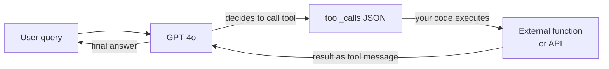

# OpenAI

## Definição

**OpenAI** é uma empresa de pesquisa em IA e plataforma para desenvolvedores sediada em San Francisco. Fundada em 2015 e amplamente conhecida pelo lançamento do ChatGPT no final de 2022, a OpenAI opera uma das APIs de modelos mais amplamente usadas do setor. A plataforma oferece aos desenvolvedores acesso programático a uma família de modelos abrangendo linguagem, visão, áudio e geração de imagens — tornando-a uma solução completa para a maioria dos casos de uso de IA generativa.

A linha de modelos da OpenAI em 2025 inclui: **GPT-4o** (modelo multimodal principal que processa texto, imagens e áudio em um único modelo), **GPT-4o-mini** (variante otimizada para custo em tarefas de alto volume), a série de modelos de raciocínio **o** — **o1**, **o1-mini**, **o3** e **o3-mini** — que usam raciocínio estendido em cadeia para matemática, codificação e análise complexa, **DALL-E 3** para geração de imagens a partir de texto, **Whisper** para transcrição de fala em texto e **TTS** (texto para fala) para síntese de áudio. Modelos de embeddings (text-embedding-3-small e text-embedding-3-large) potencializam busca semântica e pipelines de RAG.

Da perspectiva de plataforma, a OpenAI oferece uma API em camadas com preços baseados em uso, um Playground para testes interativos, uma Batch API para inferência em lote assíncrono com 50% de redução de custo, fine-tuning para GPT-4o-mini e GPT-3.5-turbo, uma Assistants API para interações agênticas com estado e um framework Evals para avaliação sistemática de modelos. O SDK Python (`openai`) e um SDK TypeScript/Node.js são as principais bibliotecas clientes, e o formato da API se tornou um padrão de facto que outros provedores (Mistral, Together, Groq) parcialmente espelham.

## Como funciona

### API de chat completions

O endpoint de chat completions (`POST /v1/chat/completions`) é o núcleo da plataforma OpenAI. Você envia um array de mensagens com roles (`system`, `user`, `assistant`) e recebe uma completação. A mensagem `system` define a persona e restrições do assistente; mensagens `user` carregam a entrada do usuário; mensagens `assistant` representam turnos anteriores do modelo para conversas multiturno. O streaming é suportado via server-sent events para que a resposta possa ser exibida token por token. Temperatura e top-p controlam a aleatoriedade da resposta; `max_tokens` limita o comprimento da saída.

```mermaid
flowchart LR
  Client[Client app] -->|POST messages array| ChatAPI[/v1/chat/completions]
  ChatAPI -->|model routing| Selector{Model\nselector}
  Selector -->|standard| GPT4o[GPT-4o]
  Selector -->|reasoning| O3[o3 / o1]
  Selector -->|budget| Mini[GPT-4o-mini]
  GPT4o -->|stream or complete| Resp[JSON response]
  O3 --> Resp
  Mini --> Resp
  Resp --> Client
```

### Function calling e ferramentas

O function calling (também chamado de "uso de ferramentas") permite que o modelo invoque ferramentas externas produzindo JSON estruturado em vez de texto livre. Você declara schemas de ferramentas na requisição; o modelo decide quando chamar uma ferramenta e preenche seus argumentos. Seu código executa a função e retorna o resultado como uma mensagem `tool`; o modelo então usa esse resultado para produzir sua resposta final. Esta é a base da maioria dos frameworks de agentes: o modelo atua como uma camada de raciocínio e roteamento enquanto a computação real acontece no seu código.



### API de embeddings

O endpoint de embeddings (`POST /v1/embeddings`) converte texto em vetores numéricos densos. Esses vetores codificam significado semântico: textos similares produzem vetores similares. `text-embedding-3-large` (3072 dimensões) oferece a melhor qualidade de recuperação; `text-embedding-3-small` (1536 dimensões) é mais rápido e barato. Embeddings são a espinha dorsal de pipelines de [RAG](/docs/rag): você embeda documentos no momento de indexação e embeda consultas no momento de busca, depois recupera documentos por similaridade de cosseno.

### APIs de imagem e áudio

**DALL-E 3** (`POST /v1/images/generations`) gera imagens a partir de prompts de texto. Você especifica tamanho (1024×1024, 1792×1024 ou 1024×1792), qualidade (standard ou HD) e estilo (vivid ou natural). **Whisper** (`POST /v1/audio/transcriptions`) transcreve arquivos de áudio com alta precisão em 57+ idiomas. **TTS** (`POST /v1/audio/speech`) converte texto em fala com som natural com seis vozes integradas. Essas APIs compartilham o mesmo modelo de autenticação e faturamento das APIs de texto, facilitando a construção de pipelines multimodais em uma única aplicação.

## Quando usar / Quando NÃO usar

| Use a OpenAI quando | Evite ou considere alternativas quando |
|-----------------|--------------------------------------|
| Você precisa do ecossistema mais amplo: bibliotecas, tutoriais e suporte da comunidade todos usam OpenAI por padrão | Sua carga de trabalho envolve dados altamente sensíveis ou regulamentados que você não pode enviar para um provedor de terceiros nos EUA |
| Você quer suporte multimodal (texto + imagem + áudio) de um único fornecedor | Você precisa fazer fine-tuning profundo ou controlar todos os aspectos do modelo — modelos de pesos abertos oferecem mais flexibilidade |
| Você precisa de raciocínio avançado em matemática, código ou problemas de lógica (série o1, o3) | Os custos em escala são proibitivos — em volumes muito altos de tokens, hospedar modelos de pesos abertos frequentemente supera o preço por token |
| Você está construindo function calling ou fluxos de trabalho de agentes — as saídas estruturadas e chamadas de ferramentas da OpenAI são maduras | Você precisa de uma experiência não centrada no inglês — Qwen ou Mistral podem ter melhor desempenho em certos idiomas |
| Você quer a Assistants API para agentes com estado, habilitados para arquivos, sem construir a camada de estado você mesmo | Você precisa de saídas determinísticas reproduzíveis de uma versão de modelo congelada — a OpenAI atualiza modelos em base contínua |

## Comparações

| Critério | OpenAI | Anthropic | Google Gemini |
|----------|--------|-----------|---------------|
| Modelo principal | GPT-4o | Claude 3.7 Sonnet / Opus | Gemini 2.5 Pro |
| Modelo de raciocínio | o3, o1 | Extended thinking (Claude 3.7) | Gemini 2.5 Pro (thinking) |
| Janela de contexto | 128K (GPT-4o), 200K (o1) | 200K | Até 1M (Gemini 1.5 Pro) |
| Entrada multimodal | Texto, imagem, áudio, vídeo | Texto, imagem | Texto, imagem, áudio, vídeo, código |
| Opção de pesos abertos | Não | Não | Gemma (parcial) |
| Function / tool calling | Maduro, amplamente adotado | Forte, com computer use | Maduro, ecossistema Google |
| Preços (modelo principal) | ~$2.50/1M tokens de entrada (GPT-4o) | ~$3/1M tokens de entrada (Sonnet) | ~$1.25/1M tokens de entrada (Gemini 1.5 Pro) |
| Abordagem de segurança | API de moderação, políticas de uso | IA Constitucional, calibração de recusas | Diretrizes de IA responsável |
| Residência de dados | EUA (padrão), opções empresariais | EUA (padrão), opções empresariais | Multi-região, Google Cloud |
| Melhor para | Ecossistema mais amplo, ferramentas de agentes, raciocínio | Documentos longos, segurança, instrução nuançada | Contexto longo, multimodal, usuários Google Cloud |

## Prós e contras

| Prós | Contras |
|------|------|
| API padrão do setor adotada pela maioria dos frameworks e bibliotecas | Modelo fechado — sem visibilidade nos pesos ou dados de treinamento |
| Linha de modelos mais ampla: linguagem, visão, áudio, imagem em uma plataforma | Hospedado nos EUA por padrão; residência de dados é limitada |
| Modelos da série o se destacam em matemática, código e lógica | Os preços podem ser altos em escala comparado a modelos abertos auto-hospedados |
| Ecossistema forte: cookbook, evals, fine-tuning, batch API | Versões de modelos mudam continuamente — o comportamento pode mudar sem aviso |
| Limites de taxa confiáveis e SLAs empresariais | Sem oferta verdadeira de pesos abertos |

## Exemplos de código

### Chat completion com streaming

```python
from openai import OpenAI

client = OpenAI(api_key="sk-...")  # or set OPENAI_API_KEY env var

# Basic completion
response = client.chat.completions.create(
    model="gpt-4o",
    messages=[
        {"role": "system", "content": "You are a concise technical assistant."},
        {"role": "user", "content": "Explain embeddings in two sentences."},
    ],
    temperature=0.2,
    max_tokens=256,
)
print(response.choices[0].message.content)

# Streaming response
with client.chat.completions.stream(
    model="gpt-4o",
    messages=[{"role": "user", "content": "Write a haiku about APIs."}],
) as stream:
    for text in stream.text_stream:
        print(text, end="", flush=True)
```

### Function calling

```python
import json
from openai import OpenAI

client = OpenAI()

# Define a tool schema
tools = [
    {
        "type": "function",
        "function": {
            "name": "get_weather",
            "description": "Get the current weather for a city",
            "parameters": {
                "type": "object",
                "properties": {
                    "city": {"type": "string", "description": "City name"},
                    "unit": {"type": "string", "enum": ["celsius", "fahrenheit"]},
                },
                "required": ["city"],
            },
        },
    }
]

messages = [{"role": "user", "content": "What's the weather in Tokyo?"}]

# First call — model may decide to call a tool
response = client.chat.completions.create(
    model="gpt-4o",
    messages=messages,
    tools=tools,
    tool_choice="auto",
)

msg = response.choices[0].message
messages.append(msg)

# If the model called a tool, execute it and return the result
if msg.tool_calls:
    for tc in msg.tool_calls:
        args = json.loads(tc.function.arguments)
        # Simulated function execution
        result = {"city": args["city"], "temp": "18°C", "condition": "Partly cloudy"}
        messages.append({
            "role": "tool",
            "tool_call_id": tc.id,
            "content": json.dumps(result),
        })

# Second call — model uses the tool result to answer
final = client.chat.completions.create(model="gpt-4o", messages=messages)
print(final.choices[0].message.content)
```

### Embeddings para busca semântica

```python
from openai import OpenAI
import numpy as np

client = OpenAI()

def embed(texts: list[str], model: str = "text-embedding-3-small") -> list[list[float]]:
    response = client.embeddings.create(input=texts, model=model)
    return [item.embedding for item in response.data]

# Index documents
docs = [
    "Python is a high-level programming language.",
    "OpenAI provides a REST API for language models.",
    "RAG combines retrieval with generation.",
]
doc_vectors = embed(docs)

# Query
query = "How do I call OpenAI from Python?"
query_vector = embed([query])[0]

# Cosine similarity
def cosine_sim(a, b):
    a, b = np.array(a), np.array(b)
    return float(np.dot(a, b) / (np.linalg.norm(a) * np.linalg.norm(b)))

scores = [(cosine_sim(query_vector, dv), doc) for dv, doc in zip(doc_vectors, docs)]
scores.sort(reverse=True)
for score, doc in scores:
    print(f"{score:.3f}  {doc}")
```

## Recursos práticos

- [Referência da API OpenAI](https://platform.openai.com/docs/api-reference) — Documentação completa dos endpoints com schemas de requisição/resposta
- [Preços OpenAI](https://openai.com/api/pricing/) — Preços por token para todos os modelos incluindo descontos em lote
- [OpenAI Cookbook](https://cookbook.openai.com/) — Exemplos práticos cobrindo function calling, RAG, fine-tuning, evals e mais
- [Visão geral dos modelos OpenAI](https://platform.openai.com/docs/models) — IDs de modelos, janelas de contexto, capacidades e cronogramas de descontinuação
- [SDK Python OpenAI no GitHub](https://github.com/openai/openai-python) — Código-fonte, changelog e guias de migração

## Veja também

- [Provedores de modelos](/docs/model-providers) — Visão geral e comparação de todos os provedores
- [Estudo de caso: ChatGPT](/docs/case-studies/chatgpt) — Para uma análise mais profunda da arquitetura do modelo, veja o estudo de caso do ChatGPT
- [Anthropic](/docs/model-providers/anthropic) — Família de modelos Claude, uso de ferramentas, contexto longo
- [Engenharia de prompts](/docs/prompt-engineering) — Técnicas que se aplicam a todos os modelos OpenAI
- [Agentes](/docs/agents) — Construindo fluxos de trabalho agênticos com function calling
- [RAG](/docs/rag) — Usando embeddings OpenAI em geração aumentada por recuperação
