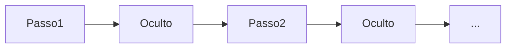

# Redes neurais recorrentes (RNN)

## Definição

RNNs processam sequências mantendo um estado oculto que é atualizado a cada passo. Elas (e variantes como LSTM) eram o padrão para modelagem de sequências antes dos Transformers.

São uma escolha natural para [NLP](/docs/nlp), séries temporais e quaisquer dados ordenados onde o contexto do passado importa. Os [Transformers](/docs/transformers) as substituíram amplamente na modelagem de linguagem devido à paralelização e ao tratamento de dependências de longo alcance, mas RNNs ainda aparecem em cenários de streaming ou baixa latência.

## Como funciona

A cada **passo**, o modelo recebe a entrada atual (ex.: um token ou frame) e o **estado oculto** anterior. Calcula uma saída (ex.: uma predição ou a próxima representação oculta) e atualiza o estado oculto para o próximo passo. A recorrência é desenrolada no tempo para treinamento (retropropagação através do tempo); na inferência, o estado oculto é passado passo a passo. Variantes **LSTM** e **GRU** adicionam portas para mitigar gradientes que desaparecem. Entradas e saídas podem ser um-para-um, um-para-muitos ou muitos-para-um dependendo da tarefa (ex.: rotulação de sequência vs. sequência para sequência).

## Casos de uso

RNNs se encaixam em problemas com entrada ou saída sequencial onde a ordem e o contexto temporal importam.

- Rotulação de sequências (ex.: reconhecimento de entidades nomeadas, etiquetagem POS)
- Previsão de séries temporais e detecção de anomalias
- Modelagem de sequências de fala e texto (antes dos Transformers dominarem)

## Documentação externa

- [Entendendo redes LSTM (Olah)](https://colah.github.io/posts/2015-08-Understanding-LSTMs/)
- [PyTorch – Modelos de sequência e RNNs](https://pytorch.org/tutorials/beginner/sequence_models_tutorial.html)

## Veja também

- [Transformers](/docs/transformers)
- [NLP](/docs/nlp)
