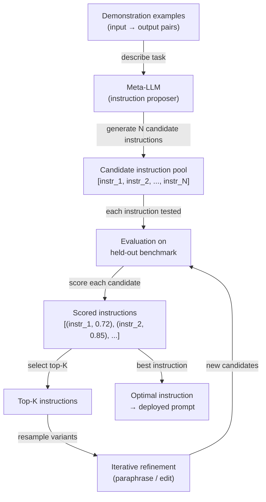

# Engenharia Automática de Prompts (APE)

## Definição

A Engenharia Automática de Prompts (APE) é a prática de usar um modelo de linguagem para gerar e otimizar instruções de prompts em vez de escrevê-las manualmente. Introduzida por Zhou et al. (2022) no artigo *Large Language Models Are Human-Level Prompt Engineers*, a APE enquadra o design de prompts como um problema de síntese de programas: dado um conjunto de pares de demonstração entrada-saída, encontrar a instrução em linguagem natural que, quando inserida antes do prompt, maximiza o desempenho da tarefa em um conjunto de avaliação reservado. A busca, pontuação e refinamento de instruções candidatas são todos realizados programaticamente — o papel do ser humano muda de autor de prompts para definidor de tarefas e projetista de métricas.

A motivação para automatizar o design de prompts é prática. A engenharia manual de prompts é demorada, frágil e tendenciosa pelas intuições do engenheiro humano sobre como os modelos de linguagem processam texto. Pequenas mudanças no enunciado — "Pense passo a passo" vs "Vamos pensar cuidadosamente passo a passo" — produzem diferenças mensuráveis de precisão que são impossíveis de prever sem testes empíricos. A APE substitui esse processo de tentativa e erro por uma busca sistemática: gere um grande conjunto de instruções candidatas, avalie cada uma em um benchmark e mantenha as melhores. Essa é a mesma filosofia de design por trás da busca de hiperparâmetros no ML clássico — os humanos especificam o objetivo, as máquinas fazem a busca.

A APE é distinta do ajuste fino de prompts suaves (que otimiza embeddings contínuos de tokens via gradiente descendente) e do fine-tuning (que atualiza os pesos do modelo). A APE opera inteiramente no espaço da linguagem natural usando modelos congelados. Isso a torna agnóstica em relação ao modelo, interpretável — você pode ler e entender a instrução vencedora — e implantável sem qualquer infraestrutura de treinamento. A troca é que o espaço de busca discreto da linguagem natural é vasto e não diferenciável, então a APE depende de amostragem, heurísticas de pontuação e refinamento iterativo em vez de otimização baseada em gradiente.

## Como funciona



### Geração de candidatos

O loop da APE começa com um conjunto de exemplos de demonstração — pares entrada-saída que ilustram a tarefa alvo. Esses exemplos são passados para um meta-LLM (o mesmo ou um modelo diferente) com um meta-prompt que pede para inferir a instrução que produziria as saídas dadas a partir das entradas fornecidas. Meta-prompts típicos parecem com: *"Aqui estão pares entrada-saída. Qual é a instrução que produz essas saídas? Gere 10 instruções candidatas diversas."* Ao amostrar com temperatura > 0, o meta-LLM produz um conjunto diversificado de instruções candidatas que diferem em formulação, enquadramento e especificidade. A qualidade e diversidade desse conjunto inicial determinam diretamente o teto da otimização.

### Pontuação

Cada instrução candidata é instanciada como um prefixo no prompt (ou como a mensagem de sistema) e avaliada em relação a um benchmark reservado. A função de pontuação é específica da tarefa: precisão para classificação, correção de execução para geração de código, ROUGE ou BERTScore para sumarização, ou um juiz LLM secundário para tarefas abertas. A decisão de design fundamental é se a pontuação é calculada com o próprio meta-LLM (usando estimativas de log-probabilidade de saídas corretas) ou com um avaliador específico da tarefa separado. A pontuação por log-probabilidade é mais rápida, mas pode superajustar à calibração do meta-LLM. A pontuação por avaliador separado é mais confiável, mas requer dados rotulados.

### Refinamento iterativo

Após a pontuação inicial, as melhores K instruções candidatas são selecionadas para refinamento. O meta-LLM é solicitado a parafrasear, estender ou combinar os melhores candidatos — gerando um novo conjunto de variantes semanticamente relacionadas, mas textualmente distintas. Esse loop de refinamento é executado por um número fixo de iterações ou até que um limiar de pontuação alvo seja alcançado. Cada iteração estreita a busca em torno de regiões promissoras do espaço de instruções, análogo à busca evolucionária ou escalada de colina sobre uma paisagem discreta. Na prática, uma ou duas rodadas de refinamento após um grande conjunto inicial (N ≥ 50) tende a recuperar a maior parte do ganho alcançável.

## Comparações

| Critério | APE | Engenharia manual de prompts | Fine-tuning |
|----------|-----|------------------------------|-------------|
| Esforço humano | Baixo — definir tarefa e métrica | Alto — autoria e teste iterativos | Alto — coleta de dados e execuções de treinamento |
| Requer dados rotulados | Sim — para pontuação | Não — pode ser feito empiricamente | Sim — tipicamente milhares de exemplos |
| Pesos do modelo atualizados | Não | Não | Sim |
| Saída interpretável | Sim — instrução em linguagem natural | Sim | Não — mudanças de pesos são opacas |
| Generaliza entre modelos | Sim — re-executar busca por modelo | Parcialmente | Não — vinculado ao modelo base |
| Latência na inferência | Nenhuma — sem overhead em tempo de execução | Nenhuma | Nenhuma |
| Custo | Médio — N × M chamadas de avaliação | Baixo | Alto — tempo de GPU |
| Melhor para | Tarefas com uma métrica clara e ≥ 50 exemplos | Novas tarefas sem uma métrica | Tarefas de alto volume onde ganhos de precisão justificam o treinamento |

## Quando usar / Quando NÃO usar

| Use quando | Evite quando |
|------------|--------------|
| Você tem um conjunto de avaliação rotulado e pode definir uma métrica de pontuação clara | A tarefa não tem uma métrica automatizada confiável — a APE não pode buscar sem um sinal |
| A iteração manual de prompts está levando mais de um dia e a precisão ainda está estagnada | Você precisa de um resultado imediatamente — a APE requer múltiplas chamadas de API de LLM para avaliação |
| Você está implantando o mesmo prompt para muitos usuários e mesmo 1-2% de ganho de precisão importa | Seu conjunto de demonstrações é muito pequeno (< 10 exemplos) — a pontuação será ruidosa |
| Você quer auditar a melhor instrução encontrada para segurança antes da implantação | A tarefa requer criatividade ou julgamento subjetivo onde uma única métrica é enganosa |
| Você está usando DSPy ou um framework similar onde a otimização de prompts está integrada | O fine-tuning já está planejado — a APE otimiza prompts, não pesos |

## Exemplos de código

### Loop básico de APE com OpenAI

```python
# Minimal APE implementation: generate instructions, score, return best
# pip install openai

import os
import re
from openai import OpenAI

client = OpenAI(api_key=os.environ["OPENAI_API_KEY"])

# ----- Task definition --------------------------------------------------------
# Demonstrations: pairs of (input, expected_output)
DEMOS = [
    ("The movie was absolutely fantastic, I loved every minute.", "positive"),
    ("Terrible film, waste of time and money.", "negative"),
    ("It was okay, nothing special but not bad either.", "neutral"),
    ("A masterpiece of modern cinema.", "positive"),
    ("I walked out after 20 minutes.", "negative"),
]

# Held-out evaluation set for scoring
EVAL_SET = [
    ("A stunning visual experience with weak writing.", "positive"),  # debatable but positive
    ("Boring, predictable, and too long.", "negative"),
    ("I enjoyed it more than I expected.", "positive"),
    ("Neither good nor bad — forgettable.", "neutral"),
    ("One of the best films of the decade.", "positive"),
]


# ----- Step 1: Generate candidate instructions --------------------------------
def generate_instructions(demos: list[tuple[str, str]], n: int = 10) -> list[str]:
    """Ask a meta-LLM to infer N candidate instructions from demo pairs."""
    demo_text = "\n".join(f'Input: "{inp}"\nOutput: "{out}"' for inp, out in demos)
    meta_prompt = (
        f"Here are input-output example pairs for a text classification task:\n\n"
        f"{demo_text}\n\n"
        f"Generate {n} diverse natural-language instructions that, when prepended to "
        f"an input text, would cause a language model to produce the correct output. "
        f"Return one instruction per line, numbered."
    )
    resp = client.chat.completions.create(
        model="gpt-4o-mini",
        messages=[{"role": "user", "content": meta_prompt}],
        temperature=0.9,
        max_tokens=800,
    )
    raw = resp.choices[0].message.content
    lines = [re.sub(r"^\d+[\.\)]\s*", "", l).strip() for l in raw.splitlines()]
    return [l for l in lines if len(l) > 20]  # filter out empty / too-short lines


# ----- Step 2: Score an instruction on the eval set --------------------------
def score_instruction(instruction: str, eval_set: list[tuple[str, str]]) -> float:
    """Return accuracy of the instruction on the eval set."""
    correct = 0
    for text, expected in eval_set:
        prompt = f"{instruction}\n\nText: {text}\nLabel:"
        resp = client.chat.completions.create(
            model="gpt-4o-mini",
            messages=[{"role": "user", "content": prompt}],
            temperature=0,
            max_tokens=5,
        )
        prediction = resp.choices[0].message.content.strip().lower()
        if expected.lower() in prediction:
            correct += 1
    return correct / len(eval_set)


# ----- Step 3: Iterative refinement of top-K instructions --------------------
def refine_instructions(top_instructions: list[str], n_variants: int = 5) -> list[str]:
    """Ask the meta-LLM to paraphrase the top instructions to get variants."""
    instr_text = "\n".join(f"- {i}" for i in top_instructions)
    refine_prompt = (
        f"Here are high-performing instructions for a sentiment classification task:\n"
        f"{instr_text}\n\n"
        f"Generate {n_variants} new instructions that paraphrase or combine the above "
        f"to potentially improve performance. Return one per line."
    )
    resp = client.chat.completions.create(
        model="gpt-4o-mini",
        messages=[{"role": "user", "content": refine_prompt}],
        temperature=0.7,
        max_tokens=500,
    )
    raw = resp.choices[0].message.content
    lines = [l.strip().lstrip("- ") for l in raw.splitlines()]
    return [l for l in lines if len(l) > 20]


# ----- APE main loop ---------------------------------------------------------
def run_ape(
    demos: list[tuple[str, str]],
    eval_set: list[tuple[str, str]],
    n_candidates: int = 10,
    top_k: int = 3,
    n_refinement_rounds: int = 1,
) -> dict:
    print("=== APE: Generating initial candidates ===")
    candidates = generate_instructions(demos, n=n_candidates)
    print(f"Generated {len(candidates)} candidates.\n")

    all_scored: list[tuple[str, float]] = []

    for round_num in range(n_refinement_rounds + 1):
        print(f"--- Round {round_num + 1}: Scoring {len(candidates)} instructions ---")
        round_scores = []
        for instr in candidates:
            score = score_instruction(instr, eval_set)
            round_scores.append((instr, score))
            print(f"  [{score:.0%}] {instr[:80]}{'...' if len(instr) > 80 else ''}")
        all_scored.extend(round_scores)

        if round_num < n_refinement_rounds:
            top = [i for i, _ in sorted(round_scores, key=lambda x: -x[1])[:top_k]]
            candidates = refine_instructions(top, n_variants=n_candidates // 2)
            print()

    best_instr, best_score = max(all_scored, key=lambda x: x[1])
    return {"instruction": best_instr, "score": best_score, "all_scored": all_scored}


if __name__ == "__main__":
    result = run_ape(DEMOS, EVAL_SET, n_candidates=8, top_k=3, n_refinement_rounds=1)
    print(f"\n=== Best instruction (accuracy {result['score']:.0%}) ===")
    print(result["instruction"])
```

### Usando DSPy para APE estruturada

```python
# DSPy provides a higher-level abstraction for automatic prompt optimization.
# pip install dspy-ai

import dspy

# Configure DSPy with your LLM backend
lm = dspy.LM("openai/gpt-4o-mini", api_key=os.environ["OPENAI_API_KEY"])
dspy.configure(lm=lm)


# Define the task as a DSPy signature
class SentimentClassifier(dspy.Signature):
    """Classify the sentiment of a movie review as positive, negative, or neutral."""
    review: str = dspy.InputField(desc="A movie review text")
    sentiment: str = dspy.OutputField(desc="One of: positive, negative, neutral")


# Wrap in a module
class SentimentModule(dspy.Module):
    def __init__(self):
        self.classify = dspy.Predict(SentimentClassifier)

    def forward(self, review: str) -> dspy.Prediction:
        return self.classify(review=review)


# Training examples
trainset = [
    dspy.Example(review=inp, sentiment=out).with_inputs("review")
    for inp, out in [
        ("Absolutely loved it!", "positive"),
        ("Worst movie ever.", "negative"),
        ("It was fine, nothing memorable.", "neutral"),
    ]
]


# Use MIPROv2 optimizer to automatically engineer the prompt
def optimize_with_dspy():
    module = SentimentModule()
    optimizer = dspy.MIPROv2(metric=dspy.evaluate.answer_exact_match, auto="light")
    optimized = optimizer.compile(module, trainset=trainset)
    print(optimized.classify.extended_signature)  # shows the optimized instruction
    return optimized


if __name__ == "__main__":
    optimized_module = optimize_with_dspy()
    result = optimized_module(review="A surprisingly moving and well-acted drama.")
    print(result.sentiment)
```

## Recursos práticos

- [Large Language Models Are Human-Level Prompt Engineers (Zhou et al., 2022)](https://arxiv.org/abs/2211.01910) — O artigo original da APE; introduz a formulação de indução de instruções, a busca iterativa de Monte Carlo e resultados de benchmark em 24 tarefas de NLP.
- [DSPy: Compiling Declarative Language Model Calls into Self-Improving Pipelines (Khattab et al., 2023)](https://arxiv.org/abs/2310.03714) — O framework que operacionaliza a otimização no estilo APE como uma abstração de primeira classe; veja também [dspy.ai](https://dspy.ai).
- [Automatic Prompt Optimization with "Gradient Descent" and Beam Search (Pryzant et al., 2023)](https://arxiv.org/abs/2305.03495) — Estende a APE com uma abordagem de "gradiente textual" que usa feedback gerado por LLM como sinal de gradiente substituto.
- [PromptBreeder: Self-Referential Self-Improvement Via Prompt Evolution (Fernando et al., 2023)](https://arxiv.org/abs/2309.16797) — Uma abordagem evolucionária de APE que também evolui os meta-prompts usados para geração de instruções.

## Veja também

- [Engenharia de prompts](/docs/prompt-engineering)
- [Autoavaliação e calibração](/docs/prompt-engineering/self-evaluation-calibration)
- [Fine-tuning](/docs/llms/fine-tuning)
