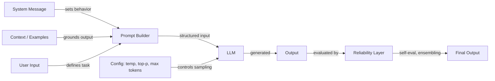

# Engenharia de prompts

## Definição

Engenharia de prompts é a prática de elaborar textos de entrada — instruções, exemplos, restrições e contexto — para controlar o comportamento de modelos de linguagem de grande escala sem modificar seus pesos. É a interface primária entre a intenção humana e a saída do modelo, abrangendo desde a formulação simples de instruções até sofisticadas estratégias de raciocínio em múltiplas etapas.

A disciplina abrange três áreas interligadas. **Configuração** cobre os parâmetros de amostragem (temperatura, Top-K, Top-P) e os controles de geração (máximo de tokens, sequências de parada) que moldam como o modelo produz tokens. **Técnicas** incluem abordagens estruturadas como chain-of-thought, auto-consistência, step-back prompting e prompts de sistema/papel, que guiam o processo de raciocínio do modelo. **Confiabilidade** aborda métodos para tornar as saídas mais confiáveis — desviesamento, ensembling de prompts e autoavaliação.

À medida que os LLMs avançam para sistemas em produção, a engenharia de prompts evoluiu de experimentação ad-hoc para uma prática sistemática. Ferramentas como [DSPy](https://dspy-docs.vercel.app/) e [Engenharia Automática de Prompts](/docs/prompt-engineering/automatic-prompt-engineering) até automatizam partes do processo. Seja construindo um chatbot, um assistente de código ou um pipeline de extração de dados, a engenharia de prompts é a primeira e mais acessível alavanca para melhorar a qualidade das saídas.

## Como funciona

### O pipeline de prompts

Toda interação com um LLM começa com um prompt — uma entrada estruturada que pode incluir uma mensagem de sistema, instruções do usuário, exemplos e contexto recuperado. O modelo processa essa entrada e gera a saída token por token, moldada tanto pelo conteúdo do prompt quanto pela configuração de amostragem.

### Configuração vs. técnica

Os parâmetros de configuração (temperatura, Top-K, Top-P, máximo de tokens) operam no nível de amostragem de tokens — afetam *como* o modelo seleciona cada token. As técnicas (chain-of-thought, auto-consistência, step-back) operam no nível de design do prompt — afetam *sobre o que* o modelo raciocina. Ambas as camadas interagem: a auto-consistência requer alta temperatura para gerar caminhos de raciocínio diversos, enquanto a extração de saída estruturada funciona melhor com baixa temperatura para determinismo.

### A camada de confiabilidade

A engenharia avançada de prompts adiciona uma camada de confiabilidade sobre o prompting básico. Isso inclui executar múltiplos prompts em paralelo (ensembling), fazer o modelo criticar sua própria saída (autoavaliação) e aplicar estratégias de desviesamento para reduzir erros sistemáticos. Esses métodos trocam custo computacional por qualidade de saída e são especialmente importantes em aplicações de alto risco.

## Recursos práticos

- [OpenAI — Guia de engenharia de prompts](https://platform.openai.com/docs/guides/prompt-engineering) — Guia abrangente cobrindo boas práticas e estratégias
- [Anthropic — Design de prompts](https://docs.anthropic.com/en/docs/build-with-claude/prompt-engineering/overview) — Documentação oficial de prompting da Anthropic
- [Learn Prompting](https://learnprompting.org/) — Curso de código aberto cobrindo técnicas de engenharia de prompts
- [Prompt Engineering Guide (DAIR.AI)](https://www.promptingguide.ai/) — Guia mantido pela comunidade com artigos e técnicas
- [Documentação DSPy](https://dspy-docs.vercel.app/) — Framework para otimização programática de prompts

## Veja também

- [Temperatura, Top-K, Top-P](/docs/prompt-engineering/temperature-top-k-top-p)
- [Máximo de tokens e sequências de parada](/docs/prompt-engineering/max-tokens-stop-sequences)
- [Saídas estruturadas](/docs/prompt-engineering/structured-outputs)
- [Prompts de sistema, papel e contextuais](/docs/prompt-engineering/system-role-contextual-prompting)
- [Auto-consistência](/docs/prompt-engineering/self-consistency)
- [Step-back prompting](/docs/prompt-engineering/step-back-prompting)
- [Engenharia Automática de Prompts (APE)](/docs/prompt-engineering/automatic-prompt-engineering)
- [Técnicas de desviesamento](/docs/prompt-engineering/debiasing-techniques)
- [Ensembling de prompts](/docs/prompt-engineering/prompt-ensembling)
- [Autoavaliação e calibração](/docs/prompt-engineering/self-evaluation-calibration)
- [LLMs](/docs/llms)
- [Chain-of-thought](/docs/reasoning-patterns/cot)
- [RAG](/docs/rag)
- [Agentes de IA](/docs/agents)
