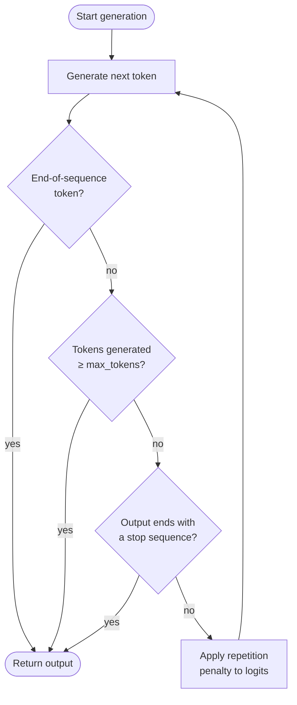

# Máximo de tokens e sequências de parada

## Definição

Máximo de tokens, sequências de parada e penalidades de repetição são parâmetros de controle de geração que determinam quando o modelo para de gerar e como ele lida com conteúdo repetido. Enquanto os parâmetros de amostragem como temperatura moldam *o que* o modelo diz, os parâmetros de controle de geração moldam *quanto* ele diz, *onde* ele para e *quão variado* permanece ao longo de uma resposta longa. Toda API de LLM expõe alguma versão desses controles, e entendê-los é essencial para construir pipelines confiáveis e econômicos.

**Máximo de tokens** define um limite superior rígido no número de tokens que o modelo pode gerar em uma única resposta. Ele age como um teto de segurança: o modelo para no momento em que emitiria um token que excede esse orçamento. Não é um comprimento alvo — o modelo pode parar mais cedo se gerar um token de fim de sequência naturalmente. Escolher um valor de máximo de tokens adequado importa tanto para o custo (você normalmente é cobrado por token de saída) quanto para a correção (uma resposta truncada pode deixar objetos JSON abertos, interromper uma cadeia de raciocínio no meio do pensamento ou entregar resultados parciais para sistemas downstream).

**Sequências de parada** fornecem condições de parada semânticas: uma ou mais strings que, quando geradas, fazem o modelo parar imediatamente (a própria string de parada é excluída da saída). Elas são indispensáveis para geração estruturada — envolver a saída do LLM em um delimitador conhecido e usar o delimitador de fechamento como sequência de parada torna a extração trivial e robusta. **Penalidades de repetição** (penalidade de frequência e penalidade de presença na OpenAI; não expostas nativamente na API de mensagens da Anthropic) reduzem a probabilidade de regenerar tokens que já apareceram, desencorajando o looping e o texto de preenchimento que pode surgir em gerações longas.

## Como funciona



Cada token gerado passa por três pontos de verificação em sequência: detecção de fim de sequência, aplicação do orçamento de máximo de tokens e correspondência de sequência de parada. Se nenhuma das condições de parada for acionada, a penalidade de repetição é aplicada aos logits para o próximo token antes que a amostragem seja retomada.

### Máximo de tokens

O parâmetro `max_tokens` (chamado `max_tokens_to_sample` em SDKs mais antigos da Anthropic, agora `max_tokens`) é um campo obrigatório ou fortemente recomendado na maioria das APIs de LLM. Defini-lo muito baixo arrisca saída truncada; defini-lo desnecessariamente alto desperdiça computação e aumenta a latência em endpoints de streaming. Uma heurística prática: estime o comprimento esperado da saída e defina `max_tokens` para 1,5–2× essa estimativa como um teto seguro. Para saídas estruturadas como JSON, perfile a contagem máxima de tokens do seu esquema e adicione um buffer de 20%.

### Sequências de parada

As sequências de parada são definidas como uma lista de strings. O modelo verifica sua saída após cada token e para assim que o texto gerado termina com qualquer entrada na lista. Padrões comuns incluem `["###", "\n\n", "</answer>", "```"]` para templates de prompt estruturados, `["\nHuman:", "\nUser:"]` para simuladores de chat que não devem gerar o próximo turno do usuário, e delimitadores de fechamento como `["</json>"]` para extração com tag. As sequências de parada são correspondidas contra o texto gerado bruto, não contra limites tokenizados, portanto strings multi-token funcionam corretamente. Um ponto importante: a sequência de parada *não* é incluída no texto retornado, portanto sua lógica de análise deve contabilizar sua ausência.

### Penalidades de repetição

A API da OpenAI expõe dois parâmetros de penalidade distintos. **Penalidade de frequência** (`frequency_penalty`, intervalo −2,0 a 2,0) reduz o logit de um token em proporção a quantas vezes ele já apareceu no texto gerado — desencorajando a repetição de palavras usadas com frequência. **Penalidade de presença** (`presence_penalty`, intervalo −2,0 a 2,0) aplica uma redução de logit fixa a qualquer token que tenha aparecido pelo menos uma vez, independentemente da frequência — desencorajando a reutilização de qualquer token já visto. Valores positivos reduzem a repetição; valores negativos a encorajam. Valores no intervalo 0,1–0,5 são tipicamente suficientes para suprimir looping sem degradar significativamente a qualidade da saída. Valores acima de 1,0 podem fazer o modelo evitar palavras de conexão úteis e degradar a coerência.

## Quando usar / Quando NÃO usar

| Cenário | Configurações recomendadas | Evite |
|---------|---------------------------|-------|
| Respostas factuais curtas ou classificações | `max_tokens=50–150`; nenhuma sequência de parada necessária | `max_tokens` muito alto; desperdiça orçamento e pode convidar preenchimento |
| Extração JSON estruturada ou com tag | Parar no delimitador de fechamento (por exemplo, `["</json>"]`); `max_tokens` dimensionado para o esquema de pior caso | Omitir sequências de parada; o modelo pode acrescentar prosa após a chave de fechamento |
| Simulação de chat multi-turno | Sequências de parada `["\nHuman:", "\nUser:"]` para evitar que o modelo gere o próximo turno do usuário | Sem sequências de parada; o modelo vai alucinar o próximo turno da conversa |
| Geração de forma longa (ensaios, relatórios) | Alto `max_tokens` (2048–4096+); leve `frequency_penalty=0.2` para evitar frases repetitivas | `frequency_penalty > 1.0`; quebra a coerência estilística e evita termos repetidos legítimos |
| Geração de código | Parar em delimitadores apropriados à linguagem (por exemplo, backtick triplo); `max_tokens` dimensionado para o comprimento da função | `presence_penalty > 0.5`; nomes de variáveis e palavras-chave precisam se repetir — penalidades prejudicam a correção |
| Inferência em lote sensível ao custo | Defina `max_tokens` firmemente para o comprimento de saída esperado no 95º percentil | Deixar `max_tokens` no máximo da API (por exemplo, 4096) quando a saída típica é de 100 tokens |

## Exemplos de código

### OpenAI — max_tokens, stop e frequency_penalty

```python
# OpenAI SDK: max_tokens, stop sequences, and repetition penalties
# pip install openai

import os
from openai import OpenAI

client = OpenAI(api_key=os.environ["OPENAI_API_KEY"])


def extract_with_controls(
    text: str,
    max_tokens: int = 512,
    stop: list[str] | None = None,
    frequency_penalty: float = 0.0,
    presence_penalty: float = 0.0,
) -> str:
    """Call the chat API with full generation-control parameters."""
    response = client.chat.completions.create(
        model="gpt-4o",
        messages=[
            {
                "role": "system",
                "content": (
                    "You are a structured data extractor. "
                    "Output only valid JSON between <json> and </json> tags."
                ),
            },
            {"role": "user", "content": f"Extract key facts from:\n\n{text}"},
        ],
        max_tokens=max_tokens,
        stop=stop or ["</json>"],
        frequency_penalty=frequency_penalty,
        presence_penalty=presence_penalty,
        temperature=0,
    )
    raw = response.choices[0].message.content
    # Strip the opening tag; closing tag was consumed by stop sequence
    return raw.replace("<json>", "").strip()


if __name__ == "__main__":
    article = (
        "SpaceX launched its Starship rocket on March 14, 2024. "
        "The vehicle reached an altitude of 210 km before completing a controlled reentry. "
        "It was the third integrated flight test of the system."
    )

    # Tight budget extraction
    result = extract_with_controls(
        article,
        max_tokens=256,
        stop=["</json>"],
        frequency_penalty=0.1,
    )
    print(result)

    # Long-form summary with anti-repetition penalty
    summary_resp = client.chat.completions.create(
        model="gpt-4o",
        messages=[{"role": "user", "content": f"Write a 3-paragraph summary of: {article}"}],
        max_tokens=600,
        frequency_penalty=0.4,
        presence_penalty=0.1,
        temperature=0.6,
    )
    print(summary_resp.choices[0].message.content)
```

### Anthropic — max_tokens e stop_sequences

```python
# Anthropic SDK: max_tokens and stop_sequences
# pip install anthropic

import os
import anthropic

client = anthropic.Anthropic(api_key=os.environ["ANTHROPIC_API_KEY"])


def generate_with_controls(
    prompt: str,
    max_tokens: int = 512,
    stop_sequences: list[str] | None = None,
) -> tuple[str, str]:
    """
    Returns (text_content, stop_reason).
    stop_reason is 'end_turn', 'max_tokens', or 'stop_sequence'.
    """
    message = client.messages.create(
        model="claude-opus-4-5",
        max_tokens=max_tokens,
        stop_sequences=stop_sequences or [],
        messages=[{"role": "user", "content": prompt}],
        temperature=0,
    )
    text = "".join(block.text for block in message.content if hasattr(block, "text"))
    return text, message.stop_reason


if __name__ == "__main__":
    # JSON extraction with stop sequence on closing delimiter
    json_prompt = (
        "Extract the event name, date, and location from the following text as JSON "
        "between <json> and </json> tags:\n\n"
        "The annual PyCon US conference will be held in Pittsburgh, PA on May 14-22, 2025."
    )
    output, reason = generate_with_controls(
        json_prompt,
        max_tokens=256,
        stop_sequences=["</json>"],
    )
    print(f"Stop reason: {reason}")
    print(output)

    # Constrained generation — stop before model generates a second answer
    answer_prompt = "Answer in one sentence: What is gradient descent?"
    answer, reason = generate_with_controls(
        answer_prompt,
        max_tokens=100,
        stop_sequences=["\n\n"],
    )
    print(f"Stop reason: {reason}")
    print(answer)
```

## Recursos práticos

- [OpenAI — Referência de API: chat completions](https://platform.openai.com/docs/api-reference/chat/create) — Referência completa de parâmetros para `max_tokens`, `stop`, `frequency_penalty` e `presence_penalty`
- [Anthropic — Referência de API: messages](https://docs.anthropic.com/en/api/messages) — Referência para `max_tokens` e `stop_sequences` na API de Mensagens
- [OpenAI — Gerenciando tokens](https://platform.openai.com/docs/guides/text-generation/managing-tokens) — Guia para contar tokens, entender janelas de contexto e dimensionar `max_tokens` adequadamente
- [Hugging Face — Controlando geração de texto](https://huggingface.co/docs/transformers/main_classes/text_generation) — Documentação de baixo nível sobre `max_new_tokens`, `eos_token_id`, `repetition_penalty` e parâmetros relacionados na biblioteca Transformers
- [tiktoken (tokenizador OpenAI)](https://github.com/openai/tiktoken) — Biblioteca de contagem de tokens para estimar orçamentos de tokens de saída antes de fazer chamadas de API

## Veja também

- [Engenharia de prompts](/docs/prompt-engineering)
- [Temperatura, Top-K, Top-P](/docs/prompt-engineering/temperature-top-k-top-p)
- [Saídas estruturadas](/docs/prompt-engineering/structured-outputs)
- [Auto-consistência](/docs/prompt-engineering/self-consistency)
- [LLMs](/docs/llms)
- [Chain-of-thought](/docs/reasoning-patterns/cot)
