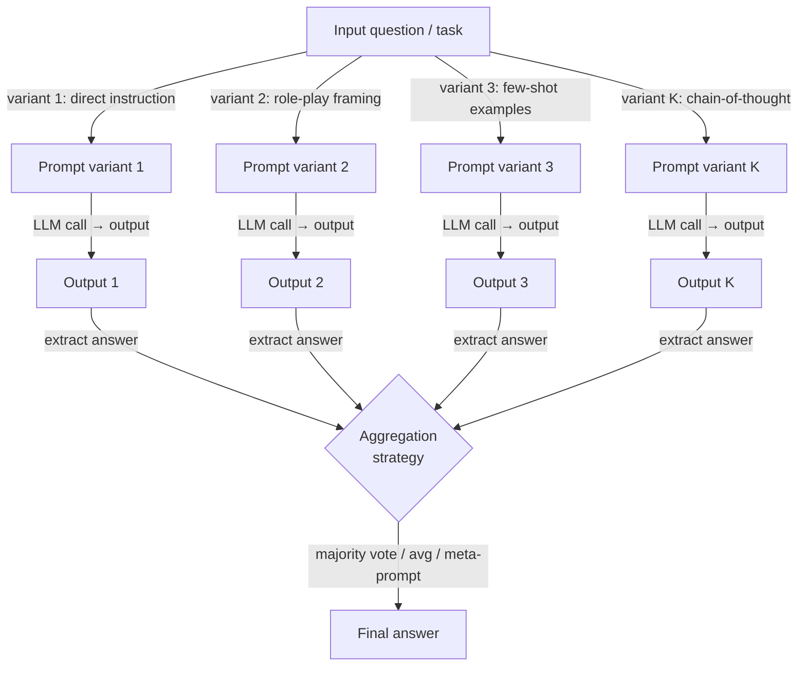

# Ensembling de prompts

## Definição

O ensembling de prompts é uma técnica de prompting que gera múltiplas formulações estruturalmente diferentes da mesma questão ou tarefa, submete todas elas a um modelo de linguagem e depois combina as saídas resultantes em uma única resposta final. A intuição central é emprestada dos ensembles clássicos de aprendizado de máquina (bagging, boosting, stacking): nenhum preditor único é perfeito, mas um comitê diversificado de preditores imperfeitos tende a ser mais confiável do que qualquer membro individual, porque seus erros são parcialmente não correlacionados e portanto se cancelam na agregação.

A distinção crítica entre ensembling de prompts e auto-consistência é a fonte da diversidade. Na auto-consistência, você executa o *mesmo* prompt N vezes com temperatura > 0 e depende da amostragem estocástica para produzir caminhos de raciocínio diversos. No ensembling de prompts, você deliberadamente elabora *prompts diferentes* — variando o enquadramento, a atribuição de papel, a formulação da instrução, os exemplos de few-shot ou o formato de saída — e executa cada um (tipicamente com temperatura 0 ou baixa) para produzir saídas diversas, porém determinísticas. A auto-consistência explora a variância introduzida pela amostragem; o ensembling de prompts explora a variância introduzida pelo design de prompts. Na prática, as duas abordagens são complementares e podem ser combinadas.

O ensembling de prompts é especialmente valioso em dois cenários. Primeiro, quando você não tem certeza de qual formulação de prompt é ótima para uma tarefa e não pode avaliar alternativas em escala — executar múltiplos candidatos e votar sobre suas saídas fornece o benefício do melhor prompt sem precisar identificá-lo com antecedência. Segundo, quando uma tarefa é de alto risco e o modo de falha de um único prompt é inaceitável — um ensemble fornece uma trilha de auditoria suave, porque a dispersão dos votos entre diferentes respostas é um sinal direto da incerteza do modelo. O custo principal é latência e tokens: K variantes de prompt requerem K chamadas de inferência, que podem ser paralelizadas, mas não eliminadas.

## Como funciona



### Estratégias de variação de prompt

A qualidade de um ensemble depende fortemente da *diversidade* das variantes de prompt. Se todas as variantes forem superficialmente diferentes, mas estruturalmente idênticas, o ensemble degenera em direção à amostragem repetida. As estratégias de variação eficazes incluem:

**Variação de papel e persona.** Atribuir diferentes personas de especialistas (por exemplo, "Você é um médico cauteloso", "Você é um cientista de dados", "Você é um engenheiro pragmático") muda a distribuição prévia do modelo sobre respostas plausíveis e ativa diferentes registros de conhecimento. A variação de papel é especialmente eficaz para tarefas com múltiplos enquadramentos válidos.

**Variação na formulação da instrução.** A mesma tarefa pode ser formulada como uma pergunta ("Qual é o nível de risco de...?"), um comando ("Avalie o nível de risco de...") ou uma completação ("O nível de risco de ... é"), e essas diferenças superficiais mudam mensuravelmente a distribuição de saída do modelo. Parafrasear a instrução central é a forma de variação de menor esforço.

**Variação dos exemplos de few-shot.** O uso de diferentes conjuntos de exemplos em contexto muda qual parte do conhecimento do modelo o contexto de few-shot ativa. Rotacionar por conjuntos de exemplos extraídos de diferentes subdomínios da distribuição de treinamento aumenta substancialmente a diversidade do ensemble, especialmente para tarefas de classificação.

**Variação de chain-of-thought vs. resposta direta.** Incluir uma ou mais variantes de CoT juntamente com variantes de resposta direta combina os benefícios de qualidade de raciocínio do CoT com os benefícios de velocidade do prompting direto. As variantes de CoT tipicamente recebem mais peso na agregação porque são mais confiáveis, mas variantes diretas podem prevalecer em casos em que o CoT leva o modelo a pensar demais sobre questões simples.

**Variação do formato de saída.** Pedir a resposta como um objeto JSON, como uma lista numerada ou como uma frase de texto livre pode eliciar diferentes níveis de precisão. Variantes de saída estruturada são mais fáceis de analisar e agregar programaticamente.

### Métodos de agregação

Depois de ter K saídas, você precisa reduzi-las a uma única resposta. A escolha do método de agregação deve corresponder ao tipo de saída:

**Votação majoritária** funciona melhor para saídas discretas (rótulos de classificação, respostas factuais curtas, seleções de múltipla escolha). É robusta a variantes adversariais ou confusas, não requer chamadas de modelo adicionais e imita diretamente como a auto-consistência opera. Empates podem ser desfeitos por log-probabilidade ou simplesmente retornando as respostas empatadas com suas contagens de votos para revisão humana.

**Média de pontuação** é apropriada quando cada variante retorna uma pontuação numérica ou probabilidade em vez de um rótulo. A média é sensível a valores discrepantes; a agregação por mediana é mais robusta quando variantes individuais podem produzir valores extremos.

**Agregação por meta-prompt (LLM-como-juiz)** envia todas as K saídas para uma segunda chamada de LLM instruída a sintetizar ou selecionar a melhor resposta. Este é o método mais poderoso, mas mais caro, e introduce um segundo ponto de falha de LLM. É mais útil quando a tarefa requer geração aberta (resumos, código, ensaios) onde a votação majoritária não é aplicável.

**Votação ponderada** atribui pesos diferentes a variantes diferentes com base em sua precisão histórica em um conjunto de validação reservado. Se você tiver dados rotulados e puder medir quais variantes têm melhor desempenho, a ponderação supera significativamente a votação uniforme — mas requer esforço de calibração antecipado.

## Quando usar / Quando NÃO usar

| Use quando | Evite quando |
|------------|--------------|
| Você não tem certeza de qual formulação de prompt funciona melhor e não pode avaliá-las individualmente em escala | A latência é uma restrição rígida — K chamadas paralelas ainda têm a latência da chamada mais lenta |
| A tarefa é de alto risco e o modo de falha de um único prompt é inaceitável | O orçamento de tokens é severamente limitado e você não pode se dar ao luxo de K completações |
| Saídas de diferentes enquadramentos de prompt fornecem perspectivas complementares (por exemplo, diagnóstico médico de múltiplos ângulos especializados) | O modelo já alcança precisão máxima com um único prompt bem ajustado — retornos decrescentes |
| Você quer um sinal de incerteza integrado (dispersão de votos = desacordo do modelo) | O espaço de saída é contínuo ou aberto de uma forma que torna votar ou fazer média sem sentido |
| Você está construindo um pipeline de produção onde a sensibilidade ao prompt deve ser amortecida | Você não tem a infraestrutura de engenharia para executar e agregar chamadas paralelas de LLM |

## Comparações

| Critério | Ensembling de prompts | Auto-consistência | Prompt único |
|----------|-----------------------|------------------|--------------|
| Fonte de diversidade | Designs de prompt diferentes | Amostragem estocástica de um prompt | Nenhuma |
| Número de chamadas de LLM | K (número de variantes, tipicamente 3–10) | N (tipicamente 10–40) | 1 |
| Temperatura | Baixa (0–0,3) por variante | Alta (0,5–0,8) | Dependente da tarefa |
| Melhoria de precisão | Alta para tarefas sensíveis à formulação do prompt | Alta para raciocínio em múltiplas etapas | Linha de base |
| Requer esforço de engenharia de prompts | Sim — projetar variantes diversas | Não — apenas um prompt necessário | Moderado |
| Lida com saída aberta | Sim, via agregação por meta-prompt | Não — votação majoritária requer respostas discretas | Sim |
| Melhor caso de uso | Tarefas com sensibilidade ao prompt ou múltiplos enquadramentos válidos | Matemática, raciocínio simbólico, QA factual | Tarefas simples e bem definidas com um bom prompt conhecido |

## Exemplos de código

### Ensembling de prompts com múltiplos templates usando OpenAI

```python
# Prompt ensembling: run K prompt variants and aggregate by majority vote
# pip install openai

import os
from collections import Counter
from openai import OpenAI

client = OpenAI(api_key=os.environ["OPENAI_API_KEY"])

# Five structurally different prompt variants for the same classification task
PROMPT_VARIANTS = [
    # 1. Direct instruction
    "Is the following customer review positive, negative, or neutral? "
    "Reply with exactly one word.\n\nReview: {review}",

    # 2. Role-play framing
    "You are a sentiment analysis expert. Classify the sentiment of the "
    "review below as positive, negative, or neutral. Output only the label.\n\nReview: {review}",

    # 3. Few-shot examples
    "Review: 'The product broke in two days.' → negative\n"
    "Review: 'Decent quality for the price.' → neutral\n"
    "Review: 'Absolutely love it, will buy again!' → positive\n"
    "Review: '{review}' →",

    # 4. Chain-of-thought variant
    "Analyze the sentiment of this review step by step, then state the "
    "final label (positive / negative / neutral) on the last line.\n\nReview: {review}",

    # 5. Completion framing
    "The overall sentiment expressed in the review '{review}' is",
]


def call_variant(prompt: str, model: str = "gpt-4o-mini") -> str:
    """Call the LLM with a single prompt variant and return the raw response."""
    resp = client.chat.completions.create(
        model=model,
        messages=[{"role": "user", "content": prompt}],
        temperature=0.0,
        max_tokens=80,
    )
    return resp.choices[0].message.content.strip()


def extract_label(text: str) -> str | None:
    """Extract a sentiment label from raw model output."""
    text_lower = text.lower()
    for label in ("positive", "negative", "neutral"):
        if label in text_lower:
            return label
    return None


def ensemble_sentiment(review: str) -> dict:
    """Run all prompt variants and aggregate by majority vote."""
    raw_outputs, labels = [], []

    for i, template in enumerate(PROMPT_VARIANTS):
        prompt = template.format(review=review)
        raw = call_variant(prompt)
        label = extract_label(raw)
        raw_outputs.append(raw)
        if label:
            labels.append(label)
        print(f"  Variant {i + 1}: {label!r}  (raw: {raw[:60]!r})")

    if not labels:
        return {"answer": None, "votes": {}}

    counts = Counter(labels)
    winner, top_votes = counts.most_common(1)[0]
    return {
        "answer": winner,
        "confidence": top_votes / len(labels),
        "votes": dict(counts),
        "raw_outputs": raw_outputs,
    }


if __name__ == "__main__":
    review = (
        "The delivery was fast but the item looks nothing like the photos. "
        "I'm disappointed and won't order again."
    )
    result = ensemble_sentiment(review)
    print(f"\nFinal answer : {result['answer']}")
    print(f"Confidence   : {result['confidence']:.0%}")
    print(f"Vote counts  : {result['votes']}")
```

### Ensemble ponderado com conjunto de validação reservado

```python
# Weighted prompt ensembling: calibrate variant weights from a validation set
# pip install openai scikit-learn

import os
from collections import defaultdict
from openai import OpenAI
from sklearn.metrics import accuracy_score

client = OpenAI(api_key=os.environ["OPENAI_API_KEY"])


def evaluate_variant(template: str, examples: list[dict]) -> float:
    """Return accuracy of a single prompt variant on a labeled dataset."""
    preds = []
    for ex in examples:
        prompt = template.format(review=ex["text"])
        raw = call_variant(prompt)   # reuse function from above
        preds.append(extract_label(raw) or "neutral")
    return accuracy_score([ex["label"] for ex in examples], preds)


def weighted_ensemble(review: str, templates: list[str], weights: list[float]) -> str:
    """Aggregate variant outputs with per-variant weights."""
    scores: dict[str, float] = defaultdict(float)
    for template, weight in zip(templates, weights):
        raw = call_variant(template.format(review=review))
        label = extract_label(raw)
        if label:
            scores[label] += weight
    return max(scores, key=scores.__getitem__) if scores else "neutral"


if __name__ == "__main__":
    # Dummy validation set — replace with real labeled examples
    val_set = [
        {"text": "Great product!", "label": "positive"},
        {"text": "Terrible quality.", "label": "negative"},
        {"text": "It's okay I guess.", "label": "neutral"},
    ]
    # Calibrate weights (accuracy on val set)
    weights = [evaluate_variant(t, val_set) for t in PROMPT_VARIANTS]
    print("Variant weights:", [f"{w:.2f}" for w in weights])

    review = "Arrived on time but packaging was damaged."
    answer = weighted_ensemble(review, PROMPT_VARIANTS, weights)
    print("Weighted ensemble answer:", answer)
```

## Recursos práticos

- [Diverse Demonstrations Improve In-context Compositional Generalization (Levy et al., 2022)](https://arxiv.org/abs/2212.06800) — Mostra que exemplos de few-shot diversos, a espinha dorsal da variação de prompts, melhoram significativamente a generalização em relação a demonstrações amostradas aleatoriamente.
- [Self-Consistency Improves Chain of Thought Reasoning in Language Models (Wang et al., 2022)](https://arxiv.org/abs/2203.11171) — O parente mais próximo do ensembling de prompts; background essencial para entender a agregação sobre múltiplas saídas de LLM.
- [Prompt Sensitivity and Prompt Ensembling for LLMs (Mizrahi et al., 2024)](https://arxiv.org/abs/2401.00595) — Estuda diretamente quanto a precisão do LLM varia entre prompts parafraseados e demonstra que o ensembling sobre paráfrases fecha a maior parte da lacuna.
- [Universal Self-Consistency for Large Language Model Generation (Chen et al., 2023)](https://arxiv.org/abs/2311.17311) — Estende a auto-consistência para geração aberta via agregação por meta-prompt, fazendo a ponte entre ensembling por votação majoritária e saídas de formato livre.

## Veja também

- [Engenharia de prompts](/docs/prompt-engineering)
- [Auto-consistência](/docs/prompt-engineering/self-consistency)
- [Engenharia automática de prompts](/docs/prompt-engineering/automatic-prompt-engineering)
