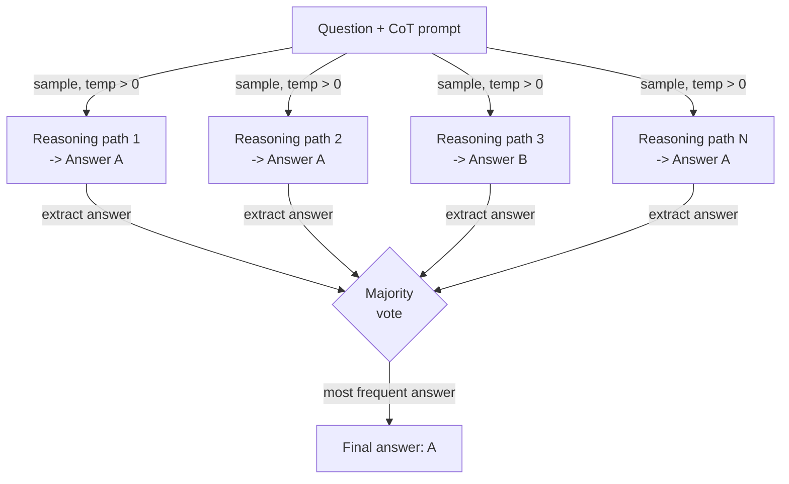

# Auto-consistência

## Definição

A auto-consistência é uma técnica de prompting introduzida por Wang et al. (2022) que aborda uma fraqueza fundamental do prompting chain-of-thought (CoT): um único caminho de raciocínio pode levar a uma resposta confiante, porém errada. O insight é que respostas corretas tendem a ser robustas — múltiplos caminhos de raciocínio independentes que abordam um problema de diferentes ângulos devem convergir para a mesma resposta — enquanto respostas incorretas tendem a ser frágeis e inconsistentes entre caminhos. Ao amostrar muitas cadeias de raciocínio com temperatura > 0 e tomando a votação majoritária sobre suas respostas finais, a auto-consistência age como um método de ensemble fraco, mas prático, que reduz significativamente os erros de raciocínio sem qualquer ajuste fino do modelo.

A relação com o CoT é direta: a auto-consistência é CoT com amostragem repetida. Um prompt CoT padrão produz uma cadeia de raciocínio e uma resposta; a auto-consistência produz N cadeias (tipicamente 10–40) e N respostas, depois as agrega. A configuração de temperatura é crítica: você precisa de diversidade nos caminhos de raciocínio, então a decodificação gananciosa (temperatura=0) derrota o propósito. Uma temperatura no intervalo 0,5–0,8 geralmente fornece diversidade suficiente para votação efetiva, mantendo cada cadeia individual coerente. Em benchmarks como GSM8K (problemas de palavras matemáticas), AQuA (raciocínio algébrico) e SVAMP, a auto-consistência melhora a precisão do CoT em 10–20 pontos percentuais ao custo de N vezes mais chamadas de inferência.

O que torna a auto-consistência praticamente útil — e distinta de simplesmente adicionar uma etapa de autoavaliação — é que ela não requer chamadas de modelo adicionais para "verificar" ou "criticar". O mecanismo de votação é puramente estatístico: a resposta que aparece com mais frequência entre N amostras vence. Isso a torna simples de implementar, agnóstica em relação ao modelo e direta de ajustar (simplesmente varie N). A principal limitação é o custo: N completações custam N vezes mais. A auto-consistência é, portanto, melhor aplicada a tarefas onde a precisão vale o orçamento de inferência — matemática, raciocínio em múltiplas etapas e classificação de alto risco — em vez de aplicações sensíveis à latência ou ao custo de tokens.

## Como funciona



### Gerando caminhos de raciocínio diversos

O primeiro passo é solicitar ao modelo um prompt CoT padrão de few-shot — um conjunto de triplas de exemplo (pergunta, raciocínio passo a passo, resposta) seguidas pela nova pergunta. A diferença fundamental em relação ao CoT padrão é que você chama a API N vezes com temperatura > 0 em vez de uma vez com temperatura 0. Cada chamada é estatisticamente independente; o modelo explora uma decomposição diferente do problema, pode usar diferentes variáveis intermediárias ou ordens de cálculo, e pode até cometer erros intermediários diferentes — mas se a resposta subjacente for correta, a maioria dos caminhos ainda chegará a ela. O número de amostras N é um hiperparâmetro: mais amostras reduzem a variância, mas aumentam o custo. No artigo original, N=40 é usado para máxima precisão; na prática, N=10–20 frequentemente recupera a maior parte do benefício com menor custo.

### Extraindo e normalizando respostas

Após coletar N completações, você deve extrair a resposta final de cada cadeia de raciocínio. Para prompts CoT bem estruturados, a resposta está tipicamente na última frase após uma frase como "The answer is..." ou "Therefore, X." Para respostas numéricas, a normalização importa: "3/4", "0,75" e "75%" são a mesma resposta e devem ser mapeadas para a mesma forma canônica antes da votação. Para tarefas de classificação ou resposta curta, a extração geralmente é uma correspondência de substring ou uma análise simples. A robustez da extração é a parte mais frágil do pipeline — se o modelo produz uma cadeia que não termina com uma resposta claramente analisável, esse caminho deve ser descartado ou atribuído a um bucket "desconhecido".

### Votação majoritária

A etapa de agregação é uma contagem de frequência sobre as respostas extraídas. A resposta mais comum vence. Empates podem ser desfeitos escolhendo a resposta do caminho com maior log-probabilidade, ou simplesmente retornando as respostas empatadas com suas contagens de votos para revisão humana. A intuição estatística é que os erros são diversos (respostas erradas diferentes por razões diferentes) enquanto as respostas corretas são concentradas (a maioria dos caminhos chega à mesma resposta certa). Essa propriedade é mais forte em tarefas com uma resposta correta única, como aritmética, raciocínio simbólico e QA baseado em fatos. Para tarefas de geração aberta — sumarização, escrita criativa, código — a auto-consistência é menos aplicável porque a votação majoritária sobre ensaios não é bem definida.

## Quando usar / Quando NÃO usar

| Use quando | Evite quando |
|------------|--------------|
| A tarefa tem uma única resposta correta e a precisão do CoT é insuficiente | A latência é uma restrição rígida (N vezes as chamadas de inferência são inaceitáveis) |
| Raciocínio aritmético ou algébrico em múltiplas etapas com taxas de erro conhecidas | O custo de tokens é a principal preocupação e você não pode se dar ao luxo de N completações |
| Classificação de alto risco onde alguns pontos percentuais de precisão importam | A tarefa é geração aberta onde a votação majoritária não é significativa |
| Você quer melhoria de precisão sem ajuste fino ou modelos adicionais | O modelo já alcança precisão próxima do máximo em N=1 — retornos decrescentes |
| Os caminhos de raciocínio precisam ser auditáveis (você pode inspecionar todas as N cadeias) | A extração de respostas é não confiável devido ao formato de saída inconsistente |

## Comparações

| Critério | Auto-consistência | Chain-of-thought (CoT) | Autoavaliação |
|----------|------------------|------------------------|----------------|
| Número de chamadas de LLM | N (tipicamente 10–40) | 1 | 2 (gerar + criticar) |
| Melhoria de precisão | Alta — 10–20pp em benchmarks de raciocínio | Moderada — substancial sobre prompting direto | Moderada — depende da qualidade da autocrítica do modelo |
| Custo | Alto — linear em N | Baixo | Baixo-moderado |
| Complexidade de implementação | Baixa — amostrar N vezes e votar | Muito baixa | Moderada — requer projetar um prompt de crítica |
| Funciona sem feedback externo | Sim | Sim | Sim |
| Melhor tipo de tarefa | Matemática, raciocínio simbólico, QA factual | A maioria das tarefas de raciocínio | Tarefas onde o modelo pode detectar seus próprios erros |
| Nota | Mais confiável que CoT, mas proporcionalmente mais caro | Linha de base mais simples — tente antes de usar auto-consistência | Complementar — pode ser combinado para ganhos adicionais |

## Exemplos de código

### Auto-consistência com a API OpenAI

```python
# Self-consistency: sample N CoT paths and take majority vote
# pip install openai

import os, re
from collections import Counter
from openai import OpenAI

client = OpenAI(api_key=os.environ["OPENAI_API_KEY"])

FEW_SHOT = """Q: Roger has 5 tennis balls. He buys 2 cans with 3 each. How many now?
A: 5 + (2 x 3) = 5 + 6 = 11. The answer is 11.

Q: Cafeteria had 23 apples, used 20, bought 6 more. How many now?
A: 23 - 20 = 3. 3 + 6 = 9. The answer is 9.

Q: {question}
A:"""


def extract_answer(text: str) -> str | None:
    m = re.search(r"[Tt]he answer is\s+([^.\n]+)", text)
    return m.group(1).strip().rstrip(".,;") if m else None


def self_consistency(question: str, n: int = 10, temp: float = 0.7) -> dict:
    """Sample n CoT paths and return majority vote answer with confidence."""
    answers, completions = [], []
    for i in range(n):
        resp = client.chat.completions.create(
            model="gpt-4o-mini",
            messages=[{"role": "user", "content": FEW_SHOT.format(question=question)}],
            temperature=temp,
            max_tokens=300,
        )
        text = resp.choices[0].message.content.strip()
        completions.append(text)
        ans = extract_answer(text)
        if ans:
            answers.append(ans)
        print(f"  Path {i+1:>2}: {ans!r}")

    if not answers:
        return {"answer": None, "votes": {}}
    counts = Counter(answers)
    winner, votes = counts.most_common(1)[0]
    return {"answer": winner, "confidence": votes / len(answers), "votes": dict(counts)}


if __name__ == "__main__":
    q = ("Janet's ducks lay 16 eggs per day. She eats 3 and bakes with 4. "
         "She sells the rest at $2/egg. How much does she make daily?")
    r = self_consistency(q, n=10)
    print(f"\nAnswer    : {r['answer']}")
    print(f"Confidence: {r['confidence']:.0%}")
    print(f"Votes     : {r['votes']}")
```

### Normalização de resposta numérica para votação robusta

```python
# Normalize numeric answers before majority voting
# Handles fractions, decimals, currency, and percentage strings

import re
from collections import Counter
from fractions import Fraction


def normalize_numeric(raw: str) -> str:
    """Canonicalize a raw answer string to a float string for voting."""
    raw = raw.strip().lower()
    raw = re.sub(r"[$%,]", "", raw)
    m = re.match(r"^(\d+)/(\d+)$", raw)
    if m:
        return str(float(Fraction(int(m.group(1)), int(m.group(2)))))
    try:
        return str(float(raw))
    except ValueError:
        return raw


def majority_vote(answers: list[str]) -> str | None:
    normalized = [normalize_numeric(a) for a in answers]
    return Counter(normalized).most_common(1)[0][0] if normalized else None


if __name__ == "__main__":
    raw = ["18", "18.0", "$18", "18", "17", "18", "18", "17", "18", "18"]
    print("Majority:", majority_vote(raw))  # -> "18.0"
```

## Recursos práticos

- [Self-Consistency Improves Chain of Thought Reasoning in Language Models (Wang et al., 2022)](https://arxiv.org/abs/2203.11171) — Artigo original com benchmarks em GSM8K, AQuA, SVAMP, StrategyQA e ARC.
- [Chain-of-Thought Prompting Elicits Reasoning in Large Language Models (Wei et al., 2022)](https://arxiv.org/abs/2201.11903) — O artigo de CoT sobre o qual a auto-consistência se baseia; background essencial.
- [OpenAI — Referência de API: chat completions](https://platform.openai.com/docs/api-reference/chat/create) — Referência para os parâmetros `temperature`, `n` e `logprobs` usados em implementações de auto-consistência.
- [Anthropic — Visão geral de engenharia de prompts](https://docs.anthropic.com/en/docs/build-with-claude/prompt-engineering/overview) — Inclui orientação sobre amostragem e chain-of-thought para modelos Claude.

## Veja também

- [Engenharia de prompts](/docs/prompt-engineering)
- [Chain-of-thought (CoT)](/docs/reasoning-patterns/cot)
- [Ensembling de prompts](/docs/prompt-engineering/prompt-ensembling)
