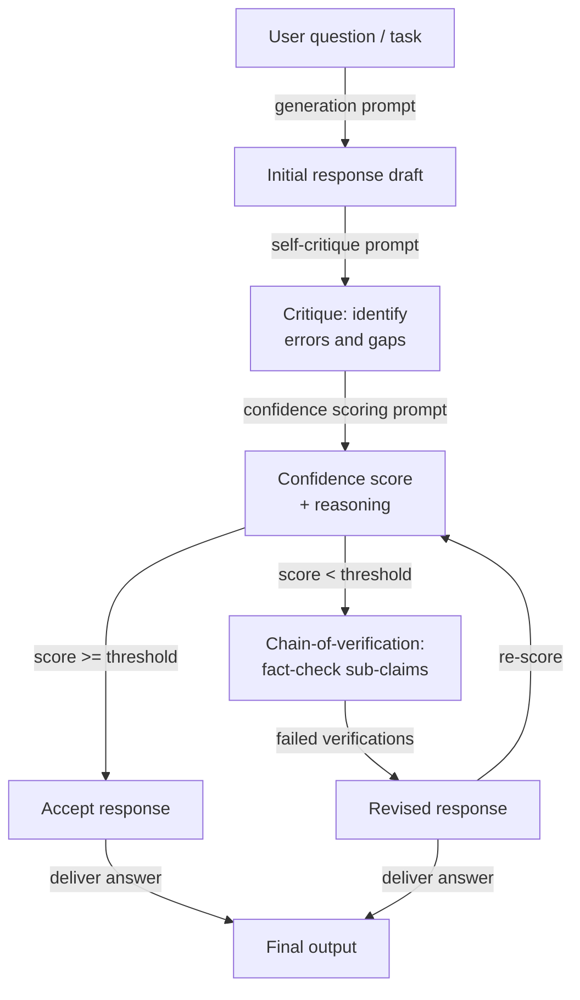

# Autoavaliação e calibração

## Definição

A autoavaliação refere-se a solicitar a um modelo de linguagem que critique, verifique ou pontue sua própria saída gerada anteriormente. Em vez de tratar a primeira resposta do modelo como final, uma etapa de autoavaliação pede ao modelo que aja como seu próprio revisor — verificando erros factuais, inconsistências lógicas, raciocínio incompleto ou falha em seguir instruções — e então ou sinalizando problemas ou gerando uma resposta melhorada. O modelo usa os mesmos pesos e janela de contexto para ambos os papéis, o que é tanto um ponto forte (nenhum modelo adicional é necessário) quanto uma limitação fundamental (o modelo pode ter pontos cegos sistemáticos que não consegue autodetectar).

A calibração é a dimensão quantitativa mais restrita da autoavaliação. Um modelo é *bem calibrado* se sua confiança expressa corresponde à sua precisão empírica: quando diz estar 80% confiante, deve estar correto aproximadamente 80% das vezes. A maioria dos LLMs está mal calibrada por padrão — expressam alta confiança mesmo em perguntas que respondem incorretamente, um fenômeno conhecido como *superconfiança* ou *excesso epistêmico*. As técnicas de calibração solicitam ao modelo que produza uma pontuação de confiança numérica explícita junto com cada resposta, e então o sistema pode usar essa pontuação para encaminhar respostas incertas para revisão humana, para acionar etapas de verificação adicionais, ou para se abster de responder completamente.

Juntas, a autoavaliação e a calibração abordam dois modos de falha distintos, mas relacionados. A autoavaliação aborda a *correção*: o modelo produziu uma resposta, mas está correta? A calibração aborda a *consciência de incerteza*: o modelo sabe quando não sabe? Ambas são necessárias para implantar LLMs em configurações de alto risco. Um modelo que detecta seus próprios erros é mais confiável; um modelo que sabe o que não sabe é mais digno de confiança. As técnicas cobertas aqui — autocrítica, pontuação de confiança e cadeia de verificação — são componentes cada vez mais padrão dos pipelines de LLM em produção.

## Como funciona



### Autocrítica

A autocrítica é o método de autoavaliação mais simples. Após gerar uma resposta inicial, você acrescenta um segundo prompt que pede ao modelo que revise sua própria saída com base em critérios explícitos. Bons prompts de autocrítica são *específicos* sobre o que verificar: precisão factual, consistência lógica, completude, aderência às instruções, tom ou segurança. Prompts vagos como "Esta resposta é boa?" produzem críticas superficiais e rasas. Prompts específicos como "Liste quaisquer afirmações factuais na resposta sobre as quais você está menos de 90% confiante, e explique por quê" produzem feedback acionável.

A qualidade da autocrítica melhora substancialmente quando você instrui o modelo a adotar uma postura adversarial — a procurar ativamente problemas em vez de confirmar que a resposta está bem. Frases como "Desafie cada afirmação-chave", "Encontre pelo menos uma falha" e "A que um cético objetaria?" inclinam o modelo em direção a críticas úteis em vez de validação. A IA constitucional (Anthropic, 2022) sistematiza isso definindo um conjunto de "princípios" que o modelo deve verificar na resposta antes de revisá-la — efetivamente criando uma rubrica de crítica estruturada que pode ser auditada.

Um modo de falha crítico da autocrítica é a *validação sycophantic*: o modelo elogia sua própria resposta e não encontra problemas, especialmente quando a resposta original já era plausível, mas errada. Isso é mais pronunciado em modelos menores e menos pronunciado em modelos que foram ajustados com dados de crítica. As mitigações incluem: usar uma instância de modelo separada para crítica, injetar erros deliberados no rascunho para testar se a etapa de crítica os detecta, e exigir que a crítica seja uma lista estruturada em vez de prosa livre (tornando "sem problemas" uma afirmação mais difícil de defender).

### Calibração e pontuação de confiança

Os prompts de pontuação de confiança pedem ao modelo que produza uma probabilidade explícita ou avaliação ordinal junto com cada resposta. Uma versão mínima é uma solicitação simples acrescentada ao prompt de resposta: "Após sua resposta, declare sua confiança como uma porcentagem de 0 a 100, onde 100 significa que você tem certeza e 0 significa que você está chutando." Versões mais sofisticadas pedem um detalhamento por afirmação: "Para cada afirmação factual em sua resposta, avalie sua confiança (alta / média / baixa) e identifique a fonte de incerteza."

As pontuações de confiança numéricas dos LLMs devem ser tratadas com ceticismo. As probabilidades verbalizadas brutas não são bem calibradas no sentido estatístico — um modelo que diz "70% confiante" não está sistematicamente correto 70% das vezes nessas perguntas. No entanto, elas são *monotonicamente úteis*: questões onde o modelo relata baixa confiança tendem a ser mais difíceis e mais propensas a erros do que questões onde ele relata alta confiança. Isso significa que as pontuações de confiança verbalizadas são úteis para *classificar* e *encaminhar* (enviar respostas de baixa confiança para revisão), mesmo que não sejam úteis para estimação de probabilidade exata.

A calibração pode ser melhorada post-hoc por meio de escalonamento de temperatura ou escalonamento de Platt aplicado às log-probabilidades do modelo, mas esses requerem um conjunto de dados rotulado. No nível do prompt, você pode melhorar a calibração relativa pedindo ao modelo que compare sua confiança com questões de referência de dificuldade conhecida ("Estou tão confiante quanto estaria sobre a capital da França vs. uma data histórica obscura").

### Cadeia de verificação

A cadeia de verificação (CoVe, Dhuliawala et al., 2023) estrutura a autoavaliação como um pipeline de verificação em múltiplas etapas: gerar uma resposta de referência, então planejar explicitamente um conjunto de perguntas de verificação que confirmariam ou refutariam as afirmações-chave nessa resposta, responder a essas perguntas de verificação de forma independente (sem olhar para a resposta original para reduzir o viés de confirmação) e, finalmente, produzir uma resposta revisada informada pelos resultados da verificação. Essa decomposição é importante porque força o modelo a separar a *geração de afirmações* da *verificação de afirmações*, reduzindo a chance de que o mesmo erro de raciocínio se propague por ambas as etapas.

As perguntas de verificação devem ser atômicas — cada uma deve testar uma única subafirmação específica. Por exemplo, se a resposta de referência afirma "O Python 3.10 introduziu correspondência de padrões estruturais e o operador walrus", as perguntas de verificação devem ser: "Em qual versão do Python foi introduzida a correspondência de padrões estruturais?" e "Em qual versão do Python foi introduzido o operador walrus?" Responder a essas independentemente frequentemente revela erros factuais que a resposta original afirmou com confiança.

## Quando usar / Quando NÃO usar

| Use quando | Evite quando |
|------------|--------------|
| A tarefa é de alto risco e a precisão factual é crítica (médico, jurídico, financeiro) | A latência é uma restrição rígida — a autoavaliação adiciona pelo menos uma rodada completa de inferência |
| Você quer um sinal de incerteza integrado sem um modelo avaliador separado | O domínio do modelo é um onde a autoavaliação é sistematicamente não confiável (por exemplo, eventos muito recentes além do corte de treinamento) |
| A qualidade da saída é altamente variável entre execuções e você precisa de um mecanismo de filtragem | A tarefa é simples e bem restrita — o overhead de autoavaliação excede o benefício de precisão |
| Você precisa encaminhar respostas incertas para revisão humana automaticamente | O modelo é muito pequeno para produzir autocríticas confiáveis (< 7B parâmetros tipicamente produz autoavaliação pobre) |
| As respostas contêm múltiplas afirmações factuais independentes que podem ser verificadas atomicamente | Você precisa de calibração de probabilidade exata — as pontuações de confiança verbalizadas não são estatisticamente calibradas |
| Construindo um pipeline onde o modelo deve detectar suas próprias alucinações | A geração original já está no máximo de precisão — a autocrítica adiciona custo sem ganho de precisão |

## Comparações

| Critério | Autoavaliação | Auto-consistência | Avaliação externa |
|----------|--------------|------------------|-------------------|
| Chamadas de modelo adicionais | 1–3 (crítica, pontuação, verificação) | N (tipicamente 10–40) | 1 (avaliador separado) |
| Requer modelo separado | Não — o mesmo modelo se revisa | Não | Sim — tipicamente um modelo mais forte ou especializado |
| Detecta erros factuais | Sim, se a autocrítica for bem solicitada | Parcialmente — fatos inconsistentes podem sobreviver à votação majoritária | Sim, de forma mais confiável |
| Fornece pontuação de incerteza | Sim — avaliação de confiança explícita | Implícita — dispersão de votos é um proxy para confiança | Sim — o avaliador pode produzir uma pontuação |
| Reduz alucinação | Sim, especialmente com CoVe | Parcialmente — a votação reduz, mas não elimina a alucinação | De forma mais confiável, mas adiciona custo e latência |
| Esforço de implementação | Moderado — requer design cuidadoso do prompt de crítica | Baixo — amostrar N vezes e votar | Alto — requer prompt de avaliador, chamada de API separada, possivelmente um modelo separado |
| Melhor caso de uso | Q&A de alto risco de turno único, geração factual | Matemática e raciocínio em múltiplas etapas | Pipelines empresariais com fortes requisitos de correção |

## Exemplos de código

### Autoavaliação com etapa de crítica usando o SDK da Anthropic

```python
# Self-evaluation pipeline: generate → critique → score → revise
# pip install anthropic

import os
from anthropic import Anthropic

client = Anthropic(api_key=os.environ["ANTHROPIC_API_KEY"])
MODEL = "claude-opus-4-5"


def generate_initial(question: str) -> str:
    """Step 1: Generate an initial response."""
    response = client.messages.create(
        model=MODEL,
        max_tokens=512,
        messages=[{"role": "user", "content": question}],
    )
    return response.content[0].text.strip()


def critique_response(question: str, response: str) -> str:
    """Step 2: Critique the initial response for errors and gaps."""
    prompt = f"""You are a rigorous fact-checker and critic. Review the response below and identify:
1. Any factual claims you are less than fully confident about
2. Logical inconsistencies or gaps in reasoning
3. Missing context that would be important for the user

Question: {question}

Response to critique:
{response}

Provide a structured critique. If you find no issues, you must still explain why you believe the response is correct. Do not simply validate the response."""

    critique = client.messages.create(
        model=MODEL,
        max_tokens=512,
        messages=[{"role": "user", "content": prompt}],
    )
    return critique.content[0].text.strip()


def score_confidence(question: str, response: str, critique: str) -> dict:
    """Step 3: Produce an explicit confidence score based on the critique."""
    prompt = f"""Given the question, the response, and the critique below, assign a confidence score.

Question: {question}

Response:
{response}

Critique:
{critique}

Output in this exact format:
CONFIDENCE: [integer 0-100]
REASONING: [one sentence explaining the score]
SHOULD_REVISE: [yes/no]"""

    result = client.messages.create(
        model=MODEL,
        max_tokens=128,
        messages=[{"role": "user", "content": prompt}],
    )
    text = result.content[0].text.strip()

    # Parse structured output
    confidence, reasoning, should_revise = None, "", False
    for line in text.splitlines():
        if line.startswith("CONFIDENCE:"):
            try:
                confidence = int(line.split(":", 1)[1].strip())
            except ValueError:
                pass
        elif line.startswith("REASONING:"):
            reasoning = line.split(":", 1)[1].strip()
        elif line.startswith("SHOULD_REVISE:"):
            should_revise = "yes" in line.lower()

    return {"confidence": confidence, "reasoning": reasoning, "should_revise": should_revise}


def revise_response(question: str, initial: str, critique: str) -> str:
    """Step 4: Produce a revised response informed by the critique."""
    prompt = f"""Revise the response below to address the issues identified in the critique.
Preserve correct information. Be explicit about any remaining uncertainty.

Question: {question}

Original response:
{initial}

Critique to address:
{critique}

Revised response:"""

    revised = client.messages.create(
        model=MODEL,
        max_tokens=512,
        messages=[{"role": "user", "content": prompt}],
    )
    return revised.content[0].text.strip()


def self_evaluate(question: str, confidence_threshold: int = 75) -> dict:
    """Full self-evaluation pipeline: generate, critique, score, conditionally revise."""
    print("=== Step 1: Generating initial response ===")
    initial = generate_initial(question)
    print(initial[:200], "...\n" if len(initial) > 200 else "\n")

    print("=== Step 2: Critiquing response ===")
    critique = critique_response(question, initial)
    print(critique[:200], "...\n" if len(critique) > 200 else "\n")

    print("=== Step 3: Scoring confidence ===")
    score = score_confidence(question, initial, critique)
    print(f"Confidence : {score['confidence']}")
    print(f"Reasoning  : {score['reasoning']}")
    print(f"Revise?    : {score['should_revise']}\n")

    final = initial
    if score["should_revise"] or (score["confidence"] is not None and score["confidence"] < confidence_threshold):
        print("=== Step 4: Revising response ===")
        final = revise_response(question, initial, critique)
        print(final[:200], "...\n" if len(final) > 200 else "\n")
    else:
        print("=== Step 4: Skipped — confidence above threshold ===\n")

    return {
        "question": question,
        "initial_response": initial,
        "critique": critique,
        "confidence_score": score,
        "final_response": final,
        "was_revised": final != initial,
    }


if __name__ == "__main__":
    q = ("What were the main causes of the 2008 financial crisis, "
         "and which regulatory changes were enacted in response?")
    result = self_evaluate(q, confidence_threshold=80)
    print("=== Final answer ===")
    print(result["final_response"])
    print(f"\nRevised: {result['was_revised']}")
    print(f"Confidence: {result['confidence_score']['confidence']}")
```

### Cadeia de verificação para afirmações factuais

```python
# Chain-of-Verification (CoVe): decompose claims, verify independently, revise
# pip install anthropic

import os
from anthropic import Anthropic

client = Anthropic(api_key=os.environ["ANTHROPIC_API_KEY"])
MODEL = "claude-opus-4-5"


def extract_verification_questions(response: str) -> list[str]:
    """Generate atomic verification questions for each factual claim."""
    prompt = f"""Read the response below and generate a list of atomic verification questions
— one per distinct factual claim. Each question should be answerable independently
without referring to the original response.

Response:
{response}

Output as a numbered list of questions only. No preamble."""

    result = client.messages.create(
        model=MODEL,
        max_tokens=400,
        messages=[{"role": "user", "content": prompt}],
    )
    text = result.content[0].text.strip()
    questions = []
    for line in text.splitlines():
        line = line.strip()
        if line and line[0].isdigit():
            # Strip leading number and punctuation
            q = line.lstrip("0123456789.)- ").strip()
            if q:
                questions.append(q)
    return questions


def verify_claim(question: str) -> dict:
    """Answer a single verification question independently."""
    prompt = f"""Answer the following question as accurately as possible.
If you are uncertain, say so explicitly and explain why.

Question: {question}

Answer:"""

    result = client.messages.create(
        model=MODEL,
        max_tokens=150,
        messages=[{"role": "user", "content": prompt}],
    )
    answer = result.content[0].text.strip()
    uncertain = any(w in answer.lower() for w in ("uncertain", "unsure", "not sure", "don't know", "unclear"))
    return {"question": question, "answer": answer, "uncertain": uncertain}


def revise_with_verifications(original_response: str, verifications: list[dict]) -> str:
    """Produce a revised response informed by independent verification results."""
    verification_block = "\n".join(
        f"Q: {v['question']}\nA: {v['answer']}\n" for v in verifications
    )
    prompt = f"""Revise the response below using the independent verification answers provided.
Correct any inaccuracies. Where verifications indicate uncertainty, acknowledge that uncertainty explicitly.

Original response:
{original_response}

Independent verifications:
{verification_block}

Revised response:"""

    result = client.messages.create(
        model=MODEL,
        max_tokens=600,
        messages=[{"role": "user", "content": prompt}],
    )
    return result.content[0].text.strip()


def chain_of_verification(question: str) -> dict:
    """Full CoVe pipeline for a factual question."""
    # Step 1: Baseline response
    baseline = client.messages.create(
        model=MODEL,
        max_tokens=400,
        messages=[{"role": "user", "content": question}],
    ).content[0].text.strip()

    # Step 2: Plan verification questions
    vqs = extract_verification_questions(baseline)
    print(f"Generated {len(vqs)} verification questions.")

    # Step 3: Answer each verification question independently
    verifications = [verify_claim(q) for q in vqs]
    uncertain_count = sum(1 for v in verifications if v["uncertain"])
    print(f"Uncertain claims: {uncertain_count}/{len(verifications)}")

    # Step 4: Revise using verification results
    revised = revise_with_verifications(baseline, verifications)

    return {
        "question": question,
        "baseline": baseline,
        "verification_questions": vqs,
        "verifications": verifications,
        "revised": revised,
        "uncertain_claims": uncertain_count,
    }


if __name__ == "__main__":
    q = "Summarize the key milestones in the development of transformer models from 2017 to 2023."
    result = chain_of_verification(q)
    print("\n=== Baseline ===")
    print(result["baseline"])
    print("\n=== Revised (after CoVe) ===")
    print(result["revised"])
    print(f"\nUncertain claims flagged: {result['uncertain_claims']}/{len(result['verifications'])}")
```

## Recursos práticos

- [Self-Refine: Iterative Refinement with Self-Feedback (Madaan et al., 2023)](https://arxiv.org/abs/2303.17651) — Introduz e avalia a autocrítica iterativa e revisão em sete tarefas diversas de geração de texto; a referência fundamental para pipelines de autoavaliação.
- [Chain-of-Verification Reduces Hallucination in Large Language Models (Dhuliawala et al., 2023)](https://arxiv.org/abs/2309.11495) — Propõe o CoVe, a abordagem de planejamento de verificação estruturada descrita neste artigo, com experimentos em QA baseada em listas e geração de forma longa.
- [Constitutional AI: Harmlessness from AI Feedback (Bai et al., 2022)](https://arxiv.org/abs/2212.08073) — Demonstra autocrítica sistemática contra um conjunto definido de princípios em escala; o precedente de produção para rubricas de autoavaliação estruturadas.
- [Language Models (Mostly) Know What They Know (Kadavath et al., 2022)](https://arxiv.org/abs/2207.05221) — Estuda se os LLMs podem relatar com precisão sua própria incerteza; mostra que a calibração é possível, mas imperfeita, fornecendo a base empírica para técnicas de pontuação de confiança.
- [Calibration of Large Language Models Using Their Generations (Kapoor et al., 2024)](https://arxiv.org/abs/2403.07221) — Pesquisa métodos de calibração post-hoc incluindo confiança verbalizada e os compara com linhas de base de log-probabilidade nas famílias GPT-4 e Claude.

## Veja também

- [Engenharia de prompts](/docs/prompt-engineering)
- [Auto-consistência](/docs/prompt-engineering/self-consistency)
- [Técnicas de desviesamento](/docs/prompt-engineering/debiasing-techniques)
- [Métricas de avaliação](/docs/evaluation-metrics)
