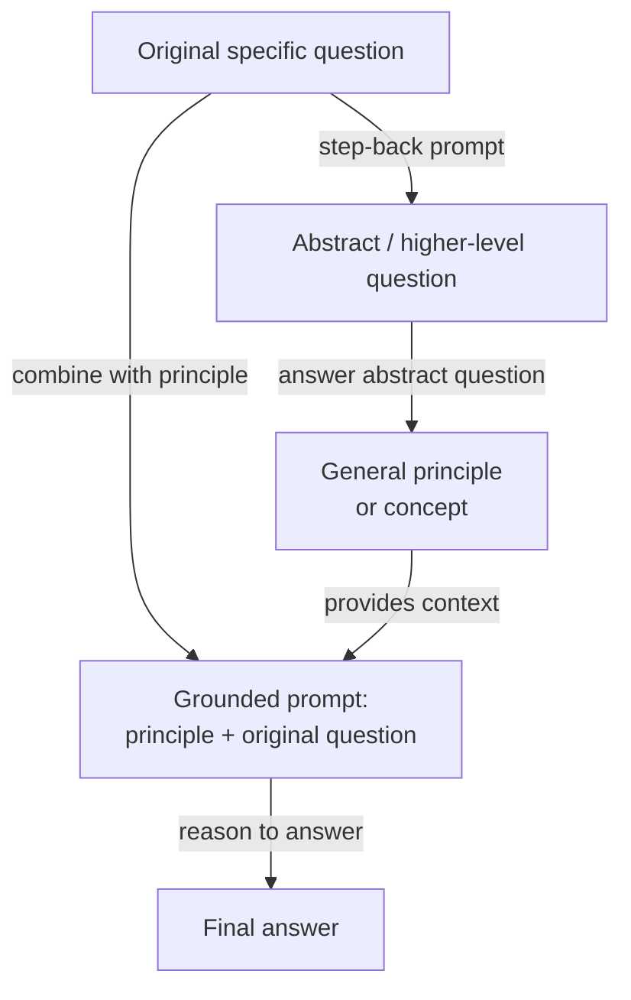

# Step-back prompting

## Definição

O step-back prompting é uma técnica de prompting em duas etapas introduzida por Zheng et al. (2023) no Google DeepMind. A ideia central é enganosamente simples: antes de pedir ao modelo que responda a uma pergunta específica e potencialmente difícil, primeiro faça-lhe uma versão mais abstrata e de nível superior da mesma pergunta — e então use a resposta do modelo a essa pergunta abstrata como contexto ao responder à original. A técnica é fundamentada na observação de que os LLMs frequentemente falham em perguntas factuais ou de raciocínio específicas não porque lhes falta o conhecimento relevante, mas porque a especificidade da pergunta ativa o "contexto de recuperação" errado nas representações internas do modelo. Dar um passo atrás para um nível mais alto de abstração ativa conhecimento mais amplo e confiável, que então fundamenta a resposta final.

O insight por trás do step-back prompting é baseado em como especialistas abordam problemas difíceis. Um físico perguntado "O que acontece com a pressão em um gás se a temperatura aumenta a volume constante?" pode primeiro lembrar a lei do gás ideal (PV = nRT) como base geral antes de aplicá-la ao caso específico — em vez de pular diretamente para uma resposta que corre o risco de confundir variáveis. O step-back prompting instrui o modelo a fazer o mesmo: gerar um princípio ou conceito geral que fundamenta a pergunta específica, depois raciocinar a partir desse princípio até a resposta. Isso efetivamente adiciona uma etapa de andaime conceitual que reduz a chance de correspondência de padrões superficial levar a uma resposta errada.

No artigo original, o step-back prompting é demonstrado com exemplos de few-shot que ensinam o modelo como "dar um passo atrás" adequadamente para um determinado domínio. Para perguntas de física, a pergunta abstrata tipicamente pede a lei ou princípio físico relevante. Para perguntas de história, pede o contexto histórico mais amplo. Para perguntas médicas, pede a fisiologia relevante. A técnica é agnóstica em relação ao modelo e não requer ajuste fino — é puramente uma intervenção no nível do prompt. Nos benchmarks MMLU e TimeQA, o step-back prompting supera tanto o chain-of-thought padrão quanto as linhas de base de recuperação aumentada em perguntas difíceis e intensivas em conhecimento.

## Como funciona



### Etapa 1 — Gerando a pergunta abstrata

O primeiro passo é solicitar ao modelo que identifique uma pergunta de nível superior que subsume a original. Isso é tipicamente feito com um prompt de few-shot contendo exemplos específicos do domínio de pares (pergunta específica, pergunta abstrata). Por exemplo, se a pergunta original é "Qual é o ponto de fusão do arsenieto de gálio?", a pergunta abstrata pode ser "Quais são as propriedades termodinâmicas e cristalográficas dos semicondutores III-V?" A pergunta abstrata deve ser geral o suficiente para ativar conhecimento relevante amplo, mas não tão geral a ponto de ser não informativa. Obter o nível correto de abstração é o principal desafio de engenharia de prompts, e exemplos de few-shot são essenciais para direcionar o modelo ao nível de abstração apropriado para um determinado domínio.

### Etapa 2 — Respondendo à pergunta abstrata

Com a pergunta abstrata gerada, o modelo a responde. Essa resposta tipicamente assume a forma de um princípio geral, uma definição, uma lei física ou um resumo do contexto de fundo relevante. A propriedade chave desta etapa é que a pergunta abstrata é geralmente mais fácil para o modelo responder de forma confiável do que a pergunta específica original — ela ativa representações bem aprendidas e factualmente fundamentadas em vez de casos extremos ou fatos numéricos específicos que são mais propensos a alucinação. A resposta à pergunta abstrata torna-se um bloco de contexto que restringe e informa a etapa final de raciocínio.

### Etapa 3 — Respondendo à pergunta original usando a abstração como contexto

A etapa final combina o princípio abstrato com a pergunta específica original em um único prompt: "Dado este contexto: [resposta abstrata], responda à pergunta específica: [pergunta original]." O modelo agora raciocina a partir de uma base conceitual sólida em vez de tentar recuperar diretamente um fato específico. Isso reduz o risco de alucinação em perguntas intensivas em fatos e melhora a consistência lógica do raciocínio em múltiplas etapas. No artigo original, essa etapa final também usa chain-of-thought, tornando o step-back prompting componível com CoT: a etapa de abstração fundamenta o raciocínio, e o CoT o torna explícito.

## Quando usar / Quando NÃO usar

| Use quando | Evite quando |
|------------|--------------|
| A pergunta requer conhecimento factual específico onde o modelo é propenso a alucinação | Perguntas simples onde o prompting direto já funciona de forma confiável |
| O domínio tem uma hierarquia clara de princípios gerais a instâncias específicas (física, química, história) | A pergunta abstrata é difícil de definir — tarefas sem uma distinção natural geral/específica |
| O modelo responde a perguntas específicas de forma inconsistente, mas é confiável nos princípios gerais | A latência é crítica — duas chamadas de LLM dobram o tempo de resposta |
| Você quer reduzir a alucinação em benchmarks intensivos em conhecimento sem RAG | A pergunta é puramente matemática ou simbólica — CoT sozinho geralmente é suficiente |
| Exemplos de few-shot para o domínio estão disponíveis para ensinar o modelo como dar um passo atrás | O orçamento de tokens é apertado — a resposta abstrata adiciona tokens ao prompt final |

## Comparações

| Critério | Step-back prompting | Chain-of-thought (CoT) | Auto-consistência |
|----------|--------------------|-----------------------|------------------|
| Número de chamadas de LLM | 2 (abstrato + final) | 1 | N (tipicamente 10–40) |
| Mecanismo central | Abstração para fundamentação para raciocínio | Raciocínio explícito passo a passo | Múltiplos caminhos independentes + votação majoritária |
| Benefício principal | Reduz alucinação em perguntas intensivas em conhecimento | Melhora o raciocínio lógico em múltiplas etapas | Reduz a variância nos resultados de raciocínio |
| Custo | 2x linha de base | 1x linha de base | Nx linha de base |
| Requer exemplos de few-shot | Sim — para ensinar o comportamento de dar um passo atrás | Sim — para melhores resultados | Sim — CoT de few-shot como prompt base |
| Melhor tipo de tarefa | QA intensiva em conhecimento, ciências, história | Matemática, lógica, código | Matemática, raciocínio simbólico, QA factual |
| Componível com CoT | Sim — recomendado combinar ambos | N/A | Sim — prompt base usa CoT |
| Nota | Complementar à auto-consistência; ambos podem ser empilhados para ganhos adicionais | Linha de base mais simples — tente antes do step-back | Mais caro; use quando a alta precisão justifica o custo Nx |

## Exemplos de código

### Step-back prompting com OpenAI — implementação de duas chamadas

```python
# Step-back prompting: abstraction-then-answer, two API calls
# pip install openai

import os
from openai import OpenAI

client = OpenAI(api_key=os.environ["OPENAI_API_KEY"])

STEP_BACK_FEW_SHOT = """Help identify a broader abstract question underpinning a specific one.

Original: At what temperature does gallium arsenide melt?
Step-back: What are the thermodynamic properties of III-V semiconductors?

Original: What was the immediate cause of the US entering World War I?
Step-back: What geopolitical tensions shaped US foreign policy before WWI?

Original: Patient has peripheral edema, elevated JVP, orthopnea. Diagnosis?
Step-back: What are the hallmark signs of right-sided and left-sided heart failure?

Original: {question}
Step-back:"""

GROUNDED = """Using the background context below, answer the specific question step by step.

Background (general principles):
{background}

Specific question:
{question}

Let's think step by step:"""


def generate_step_back(question: str) -> str:
    resp = client.chat.completions.create(
        model="gpt-4o",
        messages=[{"role": "user", "content": STEP_BACK_FEW_SHOT.format(question=question)}],
        temperature=0, max_tokens=150,
    )
    return resp.choices[0].message.content.strip()


def answer_abstract(abstract_q: str) -> str:
    resp = client.chat.completions.create(
        model="gpt-4o",
        messages=[
            {"role": "system", "content": "Answer with accurate background principles (3-5 sentences)."},
            {"role": "user", "content": abstract_q},
        ],
        temperature=0, max_tokens=300,
    )
    return resp.choices[0].message.content.strip()


def answer_with_step_back(question: str) -> str:
    abstract_q = generate_step_back(question)
    background  = answer_abstract(abstract_q)
    resp = client.chat.completions.create(
        model="gpt-4o",
        messages=[{"role": "user", "content": GROUNDED.format(
            background=background, question=question)}],
        temperature=0, max_tokens=500,
    )
    return resp.choices[0].message.content.strip()


if __name__ == "__main__":
    q = "Why did Soviet collectivization in the early 1930s lead to famine in Ukraine?"
    print(answer_with_step_back(q))
```

### Step-back prompting com Anthropic — chamada única com saída estruturada

```python
# Step-back prompting in one Anthropic call: structured three-part format
# pip install anthropic

import os
import anthropic

client = anthropic.Anthropic(api_key=os.environ["ANTHROPIC_API_KEY"])

SYSTEM = """You are an expert reasoning assistant. For each question, respond in three parts:

## Abstract question:
A broader, general question capturing the underlying principle.

## Background context:
Answer the abstract question with relevant principles and definitions (3-5 sentences).

## Final answer:
Use the background to reason step-by-step to the specific answer."""

EXAMPLE = [
    {"role": "user", "content": "Ideal gas: 2 mol, 300 K, 0.05 m^3. What is the pressure?"},
    {"role": "assistant", "content": """## Abstract question:
What is the ideal gas law and how does it relate P, V, n, and T?

## Background context:
PV = nRT, where P is pressure (Pa), V is volume (m^3), n is moles, R = 8.314 J/mol/K, T is Kelvin. Rearranged: P = nRT / V.

## Final answer:
P = (2 x 8.314 x 300) / 0.05 = 99,768 Pa (about 0.985 atm)."""},
]


def step_back(question: str) -> str:
    response = client.messages.create(
        model="claude-opus-4-5",
        max_tokens=800,
        system=SYSTEM,
        messages=EXAMPLE + [{"role": "user", "content": question}],
    )
    return response.content[0].text


if __name__ == "__main__":
    q = "A patient is given furosemide. How does it cause hypokalemia?"
    print(step_back(q))
```

## Recursos práticos

- [Take a Step Back: Evoking Reasoning via Abstraction in Large Language Models (Zheng et al., 2023)](https://arxiv.org/abs/2310.06117) — Artigo original do Google DeepMind com benchmarks em MMLU, TimeQA e MedQA.
- [Chain-of-Thought Prompting Elicits Reasoning in Large Language Models (Wei et al., 2022)](https://arxiv.org/abs/2201.11903) — O artigo de CoT sobre o qual o step-back prompting se baseia e com o qual é avaliado.
- [Anthropic — Visão geral de engenharia de prompts](https://docs.anthropic.com/en/docs/build-with-claude/prompt-engineering/overview) — Cobre estruturação de prompt de sistema e design de exemplo de few-shot.
- [OpenAI — Guia de engenharia de prompts](https://platform.openai.com/docs/guides/prompt-engineering) — Orientação prática sobre prompting de few-shot, estratégias de raciocínio e estrutura de saída.

## Veja também

- [Engenharia de prompts](/docs/prompt-engineering)
- [Chain-of-thought (CoT)](/docs/reasoning-patterns/cot)
- [Auto-consistência](/docs/prompt-engineering/self-consistency)
