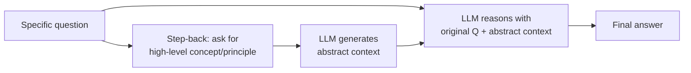

# Step-back prompting

## Definição

O step-back prompting é uma técnica de prompting em duas etapas desenvolvida pelo DeepMind na qual o LLM é primeiro solicitado a gerar uma pergunta ou princípio de alto nível ("dar um passo atrás") antes de resolver a pergunta original específica. Essa abstração intencional força o modelo a recuperar conceitos, princípios ou procedimentos gerais relevantes — colocando-o num estado de conhecimento que melhora o raciocínio subsequente e reduz erros factuais.

Por exemplo, em vez de perguntar diretamente "Qual é a temperatura do corpo em repouso de uma estrela de nêutrons?", o step-back prompting insere primeiro uma etapa de abstração: "Quais princípios físicos governam a temperatura de uma estrela de nêutrons?" O modelo então gera uma discussão sobre os princípios de física de estrelas de nêutrons compactas antes de responder à pergunta específica. A resposta final é condicionada tanto pela pergunta original quanto pelo contexto abstrato gerado, frequentemente resultando em respostas mais precisas e melhor raciocínadas.

## Como funciona



### Etapa 1: Pergunta de recuo

Construir ou gerar uma versão mais geral e abstrata da pergunta. Isso pode ser feito manualmente ("Antes de responder, primeiro identifique os princípios ou conceitos gerais relevantes") ou gerado dinamicamente pelo mesmo modelo com um meta-prompt: "Qual é a pergunta de nível superior da qual esta pergunta é um caso específico?"

### Etapa 2: Recuperação do contexto abstrato

Pedir ao LLM para primeiro responder à pergunta abstrata. Essa resposta serve como contexto de raciocínio — ela ativa conhecimentos relevantes e estabelece o quadro conceitual apropriado.

### Etapa 3: Responder à pergunta original

Fornecer o contexto abstrato gerado junto com a pergunta original e pedir a resposta final. O modelo agora tem um rico contexto de andaime para guiar seu raciocínio.

## Quando usar / Quando NÃO usar

| Cenário | Recomendado | Evitar |
|---------|-------------|--------|
| Perguntas científicas ou técnicas que requerem conhecimento de primeiros princípios | Sim — a abstração recupera conceitos relevantes | Perguntas simples de busca de fatos — overhead desnecessário |
| Resolução de problemas matemáticos em múltiplas etapas | Sim — identifica primeiro o tipo de problema e a estratégia | Tarefas criativas — a abstração pode sufocar a novidade |
| Perguntas e respostas baseadas em documentos longos | Sim — o recuo ajuda a identificar passagens de documentos relevantes | Quando a latência é crítica — duas chamadas de LLM aumentam o tempo de resposta |
| Raciocínio jurídico ou médico | Sim — recupera princípios relevantes antes dos detalhes do caso | Quando perguntas gerais poderiam levar a contexto enganoso |

## Exemplos de código

### Step-back prompting em duas etapas

```python
# Step-back prompting: two-step abstraction then answer
# pip install openai

import os
from openai import OpenAI

client = OpenAI(api_key=os.environ["OPENAI_API_KEY"])

STEP_BACK_META = (
    "You are an expert at identifying the high-level concept or principle "
    "behind a specific question. Given a specific question, generate the "
    "most relevant high-level question that, when answered, would provide "
    "the conceptual foundation needed to answer the original question."
)

ANSWER_SYSTEM = (
    "You are an expert assistant. Use the provided background knowledge "
    "to give a thorough, accurate answer to the question."
)


def step_back_question(specific_question: str) -> str:
    """Generate the abstract/high-level version of the question."""
    resp = client.chat.completions.create(
        model="gpt-4o",
        messages=[
            {"role": "system", "content": STEP_BACK_META},
            {"role": "user", "content": specific_question},
        ],
        temperature=0,
        max_tokens=150,
    )
    return resp.choices[0].message.content.strip()


def get_abstract_context(abstract_question: str) -> str:
    """Answer the abstract question to get background knowledge."""
    resp = client.chat.completions.create(
        model="gpt-4o",
        messages=[
            {"role": "user", "content": abstract_question},
        ],
        temperature=0,
        max_tokens=400,
    )
    return resp.choices[0].message.content.strip()


def answer_with_step_back(specific_question: str) -> dict:
    """Full step-back pipeline."""
    abstract_q = step_back_question(specific_question)
    context = get_abstract_context(abstract_q)

    final_prompt = (
        f"Background knowledge:\n{context}\n\n"
        f"Now answer this specific question using the background above:\n{specific_question}"
    )
    resp = client.chat.completions.create(
        model="gpt-4o",
        messages=[
            {"role": "system", "content": ANSWER_SYSTEM},
            {"role": "user", "content": final_prompt},
        ],
        temperature=0,
        max_tokens=400,
    )
    return {
        "original_question": specific_question,
        "step_back_question": abstract_q,
        "abstract_context": context,
        "final_answer": resp.choices[0].message.content.strip(),
    }


if __name__ == "__main__":
    question = (
        "If the temperature inside a gas cloud collapses to form a star "
        "rises above 10 million Kelvin, what nuclear process begins?"
    )
    result = answer_with_step_back(question)
    print(f"Original:      {result['original_question']}")
    print(f"\nStep-back Q:   {result['step_back_question']}")
    print(f"\nContext:\n{result['abstract_context']}")
    print(f"\nFinal answer:\n{result['final_answer']}")
```

### Step-back prompting com Anthropic

```python
# Step-back prompting with Anthropic
# pip install anthropic

import os
import anthropic

client = anthropic.Anthropic(api_key=os.environ["ANTHROPIC_API_KEY"])


def step_back_pipeline(question: str) -> str:
    # Step 1: Generate abstract question
    abstract_resp = client.messages.create(
        model="claude-opus-4-5",
        max_tokens=150,
        system=(
            "Given a specific question, write the most relevant general/abstract "
            "question whose answer would provide helpful background for answering "
            "the specific question. Output only the abstract question."
        ),
        messages=[{"role": "user", "content": question}],
        temperature=0,
    )
    abstract_q = abstract_resp.content[0].text.strip()

    # Step 2: Answer abstract question
    context_resp = client.messages.create(
        model="claude-opus-4-5",
        max_tokens=400,
        messages=[{"role": "user", "content": abstract_q}],
        temperature=0,
    )
    context = context_resp.content[0].text.strip()

    # Step 3: Answer original with context
    final_resp = client.messages.create(
        model="claude-opus-4-5",
        max_tokens=400,
        system="Use the provided background knowledge to answer the question accurately.",
        messages=[
            {
                "role": "user",
                "content": (
                    f"Background knowledge:\n{context}\n\n"
                    f"Question: {question}"
                ),
            }
        ],
        temperature=0,
    )
    print(f"Abstract question: {abstract_q}\n")
    print(f"Background context:\n{context}\n")
    return final_resp.content[0].text.strip()


if __name__ == "__main__":
    q = "What happened to the economy of Weimar Germany in 1923?"
    answer = step_back_pipeline(q)
    print(f"Final answer:\n{answer}")
```

## Recursos práticos

- [Zheng et al., 2023 — Take a Step Back (DeepMind)](https://arxiv.org/abs/2310.06117) — Paper original apresentando o step-back prompting com avaliação em STEM, conhecimento do mundo e raciocínio — mostra ganhos significativos em relação à CoT direta e DECOMP
- [Wei et al., 2022 — Chain-of-Thought Prompting](https://arxiv.org/abs/2201.11903) — Trabalho fundador sobre prompts de raciocínio do qual o step-back prompting se inspira e melhora
- [Press et al., 2022 — Measuring and Narrowing the Compositionality Gap](https://arxiv.org/abs/2210.03350) — Prompting por decomposição (Least-to-Most), uma técnica complementar de abstração

## Veja também

- [Engenharia de prompts](/docs/prompt-engineering)
- [Cadeia de pensamento](/docs/reasoning-patterns/cot)
- [Autoconsistência](/docs/prompt-engineering/self-consistency)
- [Prompts de sistema, de papel e contextuais](/docs/prompt-engineering/system-role-contextual-prompting)
- [LLMs](/docs/llms)
