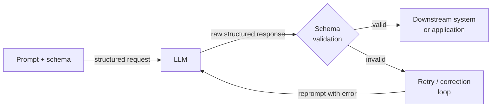

# Saídas estruturadas

## Definição

Saídas estruturadas referem-se à prática de restringir ou guiar um LLM para produzir dados legíveis por máquina — mais comumente JSON — em vez de prosa de forma livre. Em um pipeline de produção, a diferença entre um LLM que retorna uma resposta correta e um que retorna uma resposta correta em formato analisável é a diferença entre uma demonstração e um sistema implantável. Um serviço downstream que precisa extrair um nome de produto, um rótulo de sentimento ou uma lista de itens de ação não pode operar de forma confiável em texto não estruturado; ele precisa de uma forma garantida que possa desserializar, validar e encaminhar.

A evolução das técnicas de saída estruturada acompanha a maturação das APIs de LLM. Os primeiros sistemas dependiam de instruções frágeis de prompt ("responda apenas com JSON válido") combinadas com análise de regex e loops de tentativa. Essa abordagem quebrava sempre que o modelo adicionava um preâmbulo explicativo, envolvia o JSON em um bloco de código markdown, ou violava sutilmente o esquema em casos extremos. A próxima geração introduziu a chamada de função (OpenAI, meados de 2023) e o uso de ferramentas (Anthropic), que movem a definição do esquema para fora do prompt e para um parâmetro de API de primeira classe, permitindo que o modelo seja explicitamente treinado e restrito no contrato de saída. Mais recentemente, os provedores introduziram decodificação restrita por gramática estrita que torna a conformidade com o esquema uma garantia rígida no nível do token, não uma instrução suave de prompt.

Entender qual técnica aplicar — e por quê — é importante para qualquer pessoa construindo pipelines que dependem da saída do LLM. O modo JSON é o ponto de entrada mais simples, mas não fornece validação de esquema. A chamada de função / uso de ferramentas fornece um esquema tipado e análise estruturada na resposta da API, mas requer a definição de esquemas de ferramenta antecipadamente. As bibliotecas de extração baseadas em Pydantic (Instructor, analisadores de saída LangChain) ficam acima da camada da API e adicionam validação em nível Python, tentativa automática em violações de esquema e definição ergonômica de modelo. A escolha certa depende da complexidade do esquema alvo, da criticidade da validação e de quanto lógica de tentativa/correção você quer que a biblioteca lide por você.

## Como funciona



### Modo JSON

O modo JSON é o mecanismo de saída estruturada mais básico. Quando habilitado, o modelo é restrito a produzir apenas JSON válido como sua saída de nível superior. Na API da OpenAI isso é ativado definindo `response_format={"type": "json_object"}` na requisição; na API da Anthropic um efeito similar pode ser alcançado preenchendo o turno do assistente com `{`. O modo JSON garante validade sintática (a saída sempre pode ser analisada por `json.loads`), mas não valida contra nenhum esquema — o modelo pode retornar `{"result": "yes"}` quando você esperava `{"score": 0.87, "label": "positive", "confidence": 0.92}`. Você deve adicionar validação de esquema (por exemplo, com Pydantic ou `jsonschema`) como uma etapa separada e implementar lógica de tentativa para incompatibilidades de esquema. O modo JSON é melhor adequado para estruturas simples e planas onde o risco de desvio de esquema é baixo.

### Chamada de função e uso de ferramentas

A chamada de função (OpenAI) e o uso de ferramentas (Anthropic) representam um avanço qualitativo. Em vez de incorporar o esquema de saída no prompt do sistema, você o declara como uma definição de ferramenta ou função com um objeto JSON Schema. A API retorna a saída do modelo como um bloco `tool_use` estruturado com um dicionário `input` analisado, separado de qualquer conteúdo de texto. Esse desacoplamento é significativo: o texto e os dados estruturados vivem em partes diferentes da resposta, e a própria API lida com a análise JSON. Você obtém anotações de tipo para cada campo, semântica de campo obrigatório vs. opcional, restrições de enumeração e suporte a objetos aninhados — todos aplicados pelo esquema no nível da API. O modo estrito da OpenAI (2024) vai além ao habilitar a decodificação restrita, tornando a aderência ao esquema uma garantia rígida. O uso de ferramentas é a escolha certa para extrair dados estruturados de documentos, preencher registros de banco de dados ou acionar chamadas de API downstream com argumentos tipados.

### Extração baseada em esquema com Pydantic

Bibliotecas como [Instructor](https://github.com/jxnl/instructor) e os analisadores de saída do LangChain envolvem a API de chamada de função / uso de ferramentas com uma interface centrada em Pydantic. Você define seu esquema de saída como uma subclasse `pydantic.BaseModel` e passa a classe do modelo para a biblioteca; ela gera automaticamente o JSON Schema para a definição de ferramenta, chama a API, valida a resposta em relação ao seu modelo e tenta novamente com feedback de erro de validação se o esquema for violado. Essa abordagem é a mais ergonômica para praticantes de Python porque a saída é um objeto Python totalmente tipado — não um dicionário bruto — com validação de campo, valores padrão e suporte a modelo aninhado. A tentativa automática com contexto de erro reduz dramaticamente a taxa de violações silenciosas de esquema. O custo é uma dependência de biblioteca adicional e uso de tokens ligeiramente maior quando erros de validação acionam mensagens de tentativa.

## Quando usar / Quando NÃO usar

| Use quando | Evite quando |
|------------|--------------|
| A saída do LLM deve ser consumida programaticamente (resposta de API, inserção em banco de dados, acionador de fluxo de trabalho) | A saída é lida apenas por humanos e nenhuma análise downstream é necessária |
| Você precisa de um objeto Python tipado e validado em vez de uma string bruta | O esquema é tão simples (string única ou número) que o texto simples é mais fácil de analisar |
| Construindo pipelines onde violações de esquema causariam corrupção silenciosa de dados | A latência é extremamente apertada e você não pode se dar ao luxo do overhead de loops de tentativa |
| A extração envolve estruturas aninhadas, arrays ou campos com restrição de enumeração | Você está no início da prototipagem e o esquema de saída ainda não está estável |
| Você precisa de comportamento de extração reproduzível e testável entre versões do modelo | O modelo que você está usando tem suporte ruim para uso de ferramentas / chamada de função |

## Exemplos de código

### OpenAI — modo JSON com validação Pydantic

```python
# Structured extraction with OpenAI JSON mode + Pydantic validation
# pip install openai pydantic

import json, os
from pydantic import BaseModel, ValidationError
from openai import OpenAI

client = OpenAI(api_key=os.environ["OPENAI_API_KEY"])


class SentimentResult(BaseModel):
    label: str       # "positive" | "negative" | "neutral"
    score: float     # 0.0 - 1.0
    key_phrases: list[str]


def extract_sentiment(text: str, max_retries: int = 3) -> SentimentResult:
    system = (
        "You are a sentiment analysis engine. Respond ONLY with valid JSON: "
        '{"label": "positive"|"negative"|"neutral", "score": <float>, "key_phrases": [...]}'
    )
    for attempt in range(max_retries):
        resp = client.chat.completions.create(
            model="gpt-4o-mini",
            response_format={"type": "json_object"},
            messages=[{"role": "system", "content": system},
                      {"role": "user", "content": f"Analyze: {text}"}],
            temperature=0,
        )
        try:
            return SentimentResult(**json.loads(resp.choices[0].message.content))
        except (json.JSONDecodeError, ValidationError) as e:
            if attempt == max_retries - 1:
                raise RuntimeError(f"Validation failed: {e}") from e
    raise RuntimeError("Unreachable")


if __name__ == "__main__":
    r = extract_sentiment("The model is fast, but docs leave much to be desired.")
    print(r.label, r.score, r.key_phrases)
```

### OpenAI — chamada de função com esquema estrito

```python
# Structured extraction with OpenAI function calling (strict mode)
# pip install openai

import os, json
from openai import OpenAI

client = OpenAI(api_key=os.environ["OPENAI_API_KEY"])

TOOL = {
    "type": "function",
    "function": {
        "name": "extract_product_info",
        "description": "Extract structured product info from a description.",
        "strict": True,
        "parameters": {
            "type": "object",
            "properties": {
                "product_name": {"type": "string"},
                "price_usd":    {"type": "number"},
                "features":     {"type": "array", "items": {"type": "string"}},
                "in_stock":     {"type": "boolean"},
            },
            "required": ["product_name", "price_usd", "features", "in_stock"],
            "additionalProperties": False,
        },
    },
}


def extract_product(description: str) -> dict:
    resp = client.chat.completions.create(
        model="gpt-4o",
        tools=[TOOL],
        tool_choice={"type": "function", "function": {"name": "extract_product_info"}},
        messages=[{"role": "system", "content": "Extract product information."},
                  {"role": "user", "content": description}],
        temperature=0,
    )
    return json.loads(resp.choices[0].message.tool_calls[0].function.arguments)


if __name__ == "__main__":
    desc = ("AcmePro X200 headphones — ships now at $149.99. "
            "Features: 40-hour battery, ANC, USB-C charging.")
    print(json.dumps(extract_product(desc), indent=2))
```

### Anthropic — uso de ferramentas para extração estruturada

```python
# Structured extraction with Anthropic tool use
# pip install anthropic pydantic

import os
from pydantic import BaseModel
import anthropic

client = anthropic.Anthropic(api_key=os.environ["ANTHROPIC_API_KEY"])

TOOL = {
    "name": "extract_meeting_notes",
    "description": "Extract structured meeting notes. Always call this tool.",
    "input_schema": {
        "type": "object",
        "properties": {
            "summary": {"type": "string"},
            "action_items": {
                "type": "array",
                "items": {
                    "type": "object",
                    "properties": {
                        "owner":    {"type": "string"},
                        "task":     {"type": "string"},
                        "due_date": {"type": "string"},
                    },
                    "required": ["owner", "task", "due_date"],
                },
            },
            "decisions": {"type": "array", "items": {"type": "string"}},
        },
        "required": ["summary", "action_items", "decisions"],
    },
}


class ActionItem(BaseModel):
    owner: str
    task: str
    due_date: str | None


class MeetingNotes(BaseModel):
    summary: str
    action_items: list[ActionItem]
    decisions: list[str]


def extract_meeting_notes(transcript: str) -> MeetingNotes:
    resp = client.messages.create(
        model="claude-opus-4-5",
        max_tokens=1024,
        tools=[TOOL],
        tool_choice={"type": "tool", "name": "extract_meeting_notes"},
        messages=[{"role": "user", "content": f"Extract notes:\n\n{transcript}"}],
    )
    for block in resp.content:
        if block.type == "tool_use":
            return MeetingNotes(**block.input)
    raise RuntimeError("No tool_use block")


if __name__ == "__main__":
    notes = extract_meeting_notes("""
        Alice: New pricing model starts Q3. Bob: I'll update the pricing page by June 15.
        Carol: I'll brief legal by end of week. Alice: We dropped the free tier.
    """)
    print("Summary:", notes.summary)
    print("Decisions:", notes.decisions)
    for item in notes.action_items:
        print(f"  [{item.owner}] {item.task} — due {item.due_date}")
```

## Comparações

| Critério | Modo JSON | Chamada de função / Uso de ferramentas | Baseado em Pydantic (Instructor) |
|----------|-----------|----------------------------------------|----------------------------------|
| Aplicação do esquema | Apenas sintática (JSON válido, sem esquema) | Estrutural (campos, tipos, obrigatório) | Estrutural + semântica (validadores, restrições de campo) |
| Superfície de API | Parâmetro `response_format` | Parâmetros `tools` + `tool_choice` | Wrapper de biblioteca sobre ferramentas |
| Tipo de saída | String bruta requerendo `json.loads` | Dicionário analisado nos argumentos da chamada de ferramenta | Instância de modelo Pydantic tipada |
| Tentativa em falha | Manual — deve implementar você mesmo | Manual | Automática — a biblioteca lida com tentativa com contexto de erro |
| Esquemas aninhados | Possível, mas propenso a erros | Bem suportado via JSON Schema | Primeira classe via BaseModel aninhado |
| Melhor para | Estruturas simples e planas; prototipagem rápida | Extração de produção e despacho de API tipado | Esquemas complexos com necessidades de validação em nível Python |

## Recursos práticos

- [OpenAI — Guia de saídas estruturadas](https://platform.openai.com/docs/guides/structured-outputs) — Guia oficial cobrindo modo JSON, chamada de função e modo estrito com decodificação restrita.
- [Anthropic — Documentação de uso de ferramentas](https://docs.anthropic.com/en/docs/build-with-claude/tool-use) — Referência completa para definir esquemas de ferramenta e lidar com blocos tool_use nas respostas do Claude.
- [Biblioteca Instructor (jxnl/instructor)](https://github.com/jxnl/instructor) — A biblioteca mais amplamente usada para extração centrada em Pydantic; suporta OpenAI, Anthropic e outros backends.
- [Documentação Pydantic](https://docs.pydantic.dev/) — Referência essencial para definir esquemas, validadores e modelos aninhados usados em pipelines de extração.

## Veja também

- [Engenharia de prompts](/docs/prompt-engineering)
- [LLMs](/docs/llms)
- [Agentes](/docs/agents)
