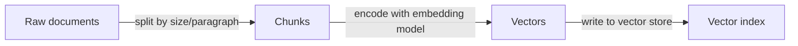
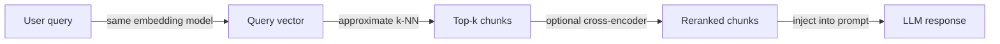

# Arquitetura RAG

## Definição

A arquitetura RAG (Retrieval-Augmented Generation) define como documentos brutos são transformados em conhecimento recuperável e como esse conhecimento é injetado em um LLM no momento da inferência. A pipeline tem duas fases principais: uma fase de **indexação** offline que processa e armazena documentos, e uma fase de **recuperação** online que busca contexto relevante para cada consulta do usuário.

As decisões de design nessa arquitetura afetam diretamente a qualidade, a latência e o custo do sistema final. O tamanho do fragmento controla quanto contexto cada segmento recuperado carrega — fragmentos menores são mais precisos mas podem carecer de contexto, enquanto fragmentos maiores reduzem o recall de recuperação. A escolha do modelo de [embedding](/docs/rag/embeddings) determina quão semanticamente significativo é o espaço vetorial, e se usar recuperação densa, esparsa ou híbrida afeta a cobertura para consultas tanto semânticas quanto baseadas em palavras-chave.

Configurações avançadas estendem a pipeline base com reescrita de consultas (reformulação antes do embedding), recuperação multi-hop (encadeamento de múltiplas recuperações), reranking (um cross-encoder que reavalia candidatos top-k) e extração de citações (atribuição de respostas a fragmentos de origem). Cada extensão adiciona latência e complexidade mas pode melhorar significativamente a qualidade das respostas para casos de uso exigentes. Ver [bancos de dados vetoriais](/docs/rag/vector-databases) para opções de indexação.

## Como funciona

### Fase de indexação

Os documentos são ingeridos, divididos em fragmentos e armazenados em um índice vetorial.



### Fase de recuperação

No momento da consulta, a consulta é convertida em embedding, e fragmentos similares são recuperados e opcionalmente reordenados.



**Fragmento:** Os documentos são divididos em segmentos (por parágrafo, sentença ou contagem fixa de tokens); sobreposição e metadados podem ser adicionados a cada fragmento. **Incorporar e indexar:** Os fragmentos são codificados em vetores via um modelo de [embedding](/docs/rag/embeddings) e armazenados em um [banco de dados vetorial](/docs/rag/vector-databases). **Consulta:** A consulta do usuário é incorporada com o mesmo codificador; **recuperar** obtém os k fragmentos mais similares via busca densa ou híbrida. **Classificar:** Um reranker opcional (ex. cross-encoder) reavalia os melhores candidatos antes de serem formatados no prompt do LLM.

## Quando usar / Quando NÃO usar

| Cenário | Usar | Não usar |
|---|---|---|
| A base de conhecimento é grande e frequentemente atualizada | Sim — chunking + indexação lida com a escala | Não — o ajuste fino é caro para retreinar |
| As respostas precisam de atribuição de fontes | Sim — os fragmentos carregam metadados de proveniência | Não — a geração vanilla do LLM perde a atribuição |
| As consultas são muito específicas por palavras-chave | Sim — a recuperação híbrida combina densa + esparsa | Não — a recuperação puramente densa pode perder correspondências exatas |
| O conhecimento cabe na janela de contexto | Talvez — mais simples preencher o prompt diretamente | Sim — não precisa de camada de recuperação |
| A latência em tempo real é crítica | Com otimizações — cache, modelos menores | Evitar reranking + multi-hop com orçamentos de latência muito baixos |

## Comparações

| Abordagem | Tamanho do fragmento | Tipo de recuperação | Reranker | Uso típico |
|---|---|---|---|---|
| RAG ingênuo | 512 tokens fixos | Apenas densa | Nenhum | Prototipagem |
| RAG avançado | Semântico / sobreposição | Híbrida (densa + BM25) | Cross-encoder | Q&A de produção |
| RAG modular | Variável, com metadados | Híbrida + filtros | Reranker aprendido | Busca empresarial |
| RAG multi-hop | Pequeno para precisão | Densa por hop | Opcional | Raciocínio complexo |

## Prós e contras

| Prós | Contras |
|---|---|
| Mantém o conhecimento atualizado sem retreinar | Adiciona latência de indexação e recuperação |
| Fornece atribuição de fontes para as respostas | A estratégia de fragmentação impacta significativamente a qualidade |
| Escala para milhões de documentos | Requer manutenção de um índice vetorial |
| Combinável com reranking e filtragem | O desalinhamento consulta-documento pode prejudicar o recall |

## Exemplos de código

```python
from langchain_openai import OpenAIEmbeddings, ChatOpenAI
from langchain_community.vectorstores import Chroma
from langchain.text_splitter import RecursiveCharacterTextSplitter
from langchain.chains import RetrievalQA

# --- Indexing ---
splitter = RecursiveCharacterTextSplitter(chunk_size=512, chunk_overlap=64)
docs = splitter.create_documents([open("document.txt").read()])

embeddings = OpenAIEmbeddings()
vectorstore = Chroma.from_documents(docs, embeddings)

# --- Retrieval + Generation ---
retriever = vectorstore.as_retriever(search_kwargs={"k": 4})
qa_chain = RetrievalQA.from_chain_type(
    llm=ChatOpenAI(model="gpt-4o-mini"),
    retriever=retriever,
    return_source_documents=True,
)

result = qa_chain.invoke({"query": "What does the document say about X?"})
print(result["result"])
```

## Recursos práticos

- [LangChain – RAG architecture](https://python.langchain.com/docs/use_cases/question_answering/) — Passo a passo RAG de ponta a ponta com componentes LangChain
- [LlamaIndex – Document processing and indexing](https://docs.llamaindex.ai/en/stable/module_guides/loading/) — Pipelines de ingestão, fragmentação e indexação
- [Anthropic – RAG best practices](https://docs.anthropic.com/en/docs/build-with-claude/retrieval-augmented-generation) — Guia RAG específico para Claude e dicas

## Veja também

- [RAG](/docs/rag)
- [Bancos de dados vetoriais](/docs/rag/vector-databases)
- [Embeddings](/docs/rag/embeddings)
