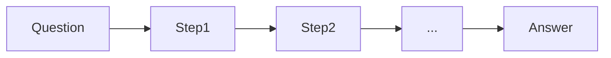

# Cadeia de pensamento (CoT)

## Definição

O prompting de cadeia de pensamento (CoT) pede ao modelo para gerar etapas intermediárias de raciocínio antes da resposta final answer. This often improves accuracy on math, logic, and multi-step tasks.

É one of the simplest [raciocínio patterns](/docs/reasoning-patterns): sem ferramentas ou busca, apenas prompting. Use quando the task benefits from explicit steps (por ex. arithmetic, deduction) and you want to avoid [fine-tuning](/docs/llms/fine-tuning). For exploring multiple solution paths, see [tree of thoughts](/docs/reasoning-patterns/tot); for tool-using agents, see [ReAct](/docs/reasoning-patterns/react).

## Como funciona

Você dá ao modelo uma **pergunta** (ou tarefa) e pede para raciocinar passo a passo. O modelo produz **Passo1**, **Passo2**, … (intermediate raciocínio) and then the **answer**. **Zero-shot CoT**: add “Let’s think passo a passo” (or similar) to the prompt. **Few-shot CoT**: include example (question, steps, answer) triples so the model mimics the format. The model generates the sequence in one pass; you can optionally parse the steps and verify or score them. Quality depends on [prompt engineering](/docs/prompt-engineering) and model capability.

## Casos de uso

Chain-of-thought é mais útil quando a tarefa se beneficia de etapas intermediárias explícitas (matemática, lógica, código).

- Math and arithmetic where intermediate steps improve accuracy
- Logic puzzles and multi-step deduction
- Code or projeto raciocínio where showing steps aids debugging

## Documentação externa

- [Chain-of-Thought Prompting (Wei et al.)](https://arxiv.org/abs/2201.11903) — CoT paper
- [OpenAI – Prompt engineering](https://platform.openai.com/docs/guides/prompt-engineering) — Includes raciocínio and step-by-step guidance

## Veja também

- [Tree of thoughts](/docs/reasoning-patterns/tot)
- [Prompt engineering](/docs/prompt-engineering)
