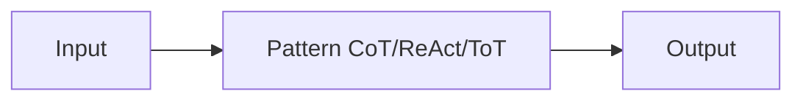

# Padrões de raciocínio

## Definição

Padrões de raciocínio são formas estruturadas de provocar ou organizar o raciocínio do modelo: chain-of-thought (step-by-step), tree-of-thoughts (explore branches), ReAct (reason + act), and RDD (recuperação-decisão-projeto), among others. Using a clear pattern improves **reliability** (more consistent raciocínio) and **debuggability** (you can inspect steps or actions).

Eles são used in [prompt engineering](/docs/llms/prompt-engineering) (por ex. CoT) and inside [agents](/docs/agents) (por ex. ReAct, RDD). Choosing a pattern depends on the task: CoT for math/raciocínio, ReAct for tool use, ToT for search/planning, RDD for spec compliance.

## Como funciona

You feed **input** (question, task) into a **pattern**: the pattern constrains how the model reasons or acts (por ex. “think passo a passo”, or thought–action–observation loops). The model produces an **output** (answer, action sequence). Prompts or system projeto encourage the model to show raciocínio (por ex. “Think passo a passo”) or to interleave thought and action. Patterns can be combined (por ex. [CoT](/docs/reasoning-patterns/cot) inside an [agent](/docs/agents) loop). See the linked pages for each pattern’s details.

## Casos de uso

Different patterns suit different needs: CoT for stepwise raciocínio, ReAct for tool use, ToT for search and planning.

- CoT: math, logic, and multi-step raciocínio tasks
- ReAct: tool-using agents that reason before each action
- ToT: search and planning over multiple solution branches

## Documentação externa

- [Chain-of-Thought Prompting (Wei et al.)](https://arxiv.org/abs/2201.11903) — CoT paper
- [ReAct: Synergizing Reasoning and Acting (Yao et al.)](https://arxiv.org/abs/2210.03629) — ReAct paper
- [Tree of Thoughts (Yao et al.)](https://arxiv.org/abs/2305.10601) — ToT paper

## Veja também

- [Chain-of-thought](/docs/reasoning-patterns/cot)
- [Tree of thoughts](/docs/reasoning-patterns/tot)
- [ReAct](/docs/reasoning-patterns/react)
- [RDD](/docs/reasoning-patterns/rdd)
