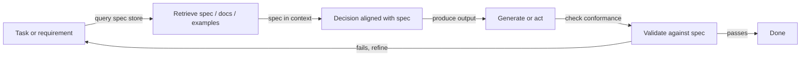
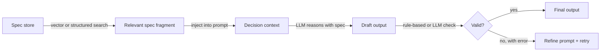

# Recuperação-decisão-design (RDD)

## Definição

**RDD (recuperação-decisão-design)** é um padrão de raciocínio que une **recuperação** (obtenção de especificações, documentos ou exemplos relevantes), **decisão** (tomada de decisões alinhadas com especificações ou políticas) e **design** (produção de saídas que satisfazem requisitos). É frequentemente usado no desenvolvimento baseado em especificações: o comportamento é guiado por especificações explícitas que são recuperadas e aplicadas durante a geração.

Ao contrário de [CoT](/docs/reasoning-patterns/cot), que gera raciocínio a partir do conhecimento interno do modelo, ou de [ReAct](/docs/reasoning-patterns/react), que intercala raciocínio com chamadas arbitrárias de ferramentas, RDD restringe cada decisão contra uma fonte de verdade recuperada. Isso o torna especialmente adequado para domínios regulados (jurídico, conformidade, segurança) ou fluxos de trabalho de engenharia onde código ou configurações devem estar em conformidade com especificações documentadas.

RDD pode ser implementado como um pipeline de etapa única (recuperar → decidir → gerar → validar) ou como um loop dentro de um [agente](/docs/agents), onde a validação com falha aciona a nova recuperação e o refinamento. O padrão é componível: o passo de recuperação do RDD pode ser alimentado por um pipeline [RAG](/docs/rag), e seu loop de agente pode usar [ReAct](/docs/reasoning-patterns/react) para raciocínio em nível de passo.

## Como funciona

### Ciclo RDD



### Passos em detalhes



1. **Recuperação:** Dada a tarefa atual, recuperar fragmentos de especificação relevantes, exemplos ou restrições (p. ex. de um armazenamento vetorial ou especificações estruturadas).
2. **Decisão:** Usar o contexto recuperado para decidir os próximos passos, as ações permitidas ou o formato de saída — a especificação está sempre em contexto durante o raciocínio.
3. **Design:** Gerar ou executar em linha com a especificação; validar opcionalmente as saídas contra a especificação antes de retornar.

Isso pode ser implementado em um loop de [agente](/docs/agents): recuperar especificação → raciocinar com a especificação em contexto → agir ou gerar → validar → repetir. A validação com falha aciona a nova recuperação (possivelmente com uma consulta diferente) ou o refinamento do prompt.

## Quando usar / Quando NÃO usar

| Cenário | Usar RDD | Não usar RDD |
|---|---|---|
| Gerar código que deve estar em conformidade com uma especificação de API | Sim — recuperar a spec, gerar, validar | Não — codificação livre sem restrições formais |
| Geração de documentos orientada por conformidade | Sim — recuperar política, gerar saída alinhada | Não — escrita criativa sem regras estritas |
| Agentes operando em domínios regulados (jurídico, segurança) | Sim — cada decisão está fundamentada na política recuperada | Não — Q&A casual sem requisitos de conformidade |
| Engenharia com documentos de design versionados | Sim — as specs mudam; RDD sempre recupera a mais recente | Não — CRUD simples sem especificação formal |
| Inferência em tempo real com orçamentos de latência apertados | Não — recuperação + validação adiciona latência | Sim — geração direta é mais rápida para tarefas sem restrições |

## Comparações

| Padrão | Usa conhecimento recuperado | Valida saída | Baseado em spec | Melhor para |
|---|---|---|---|---|
| CoT | Não (conhecimento interno do modelo) | Não | Não | Matemática, lógica |
| ReAct | Via chamadas de ferramentas | Não | Não | Agentes de uso geral com ferramentas |
| RAG | Sim (documentos) | Não | Não | Q&A de conhecimento |
| RDD | Sim (specs e documentos) | Sim | Sim | Conformidade, geração baseada em spec |

## Prós e contras

| Prós | Contras |
|---|---|
| As saídas se alinham com as specs explicitamente recuperadas | Requer um armazenamento de specs bem mantido e consultável |
| Reduz a deriva e o comportamento ad-hoc | Recuperação extra e validação adicionam custo e latência |
| Trilha de auditoria: fragmentos de spec são rastreáveis na saída | Lacunas na cobertura da spec levam a decisões insuficientemente restritas |
| Componível com RAG e ReAct | O design e manutenção de specs é sua própria carga de trabalho contínua |
| Adapta-se a fluxos regulados ou de segurança crítica | A lógica de validação deve ser mantida sincronizada com as atualizações da spec |

## Exemplos de código

```python
from openai import OpenAI
from langchain_community.vectorstores import Chroma
from langchain_openai import OpenAIEmbeddings

client = OpenAI()
# Assume a Chroma vector store pre-loaded with spec fragments
spec_store = Chroma(
    collection_name="api_spec",
    embedding_function=OpenAIEmbeddings(),
)

def rdd_generate(task: str) -> str:
    # 1. Retrieve relevant spec fragments
    spec_docs = spec_store.similarity_search(task, k=3)
    spec_context = "\n\n".join(d.page_content for d in spec_docs)

    # 2. Decision + Design: generate with spec in context
    prompt = (
        f"You must follow the specifications below exactly.\n\n"
        f"SPECIFICATIONS:\n{spec_context}\n\n"
        f"TASK: {task}\n\n"
        f"Generate an output that strictly complies with the specifications."
    )
    response = client.chat.completions.create(
        model="gpt-4o-mini",
        messages=[{"role": "user", "content": prompt}],
    )
    draft = response.choices[0].message.content

    # 3. Validate (simple: ask model to check conformance)
    validation_prompt = (
        f"Check if the following output complies with the spec. "
        f"Reply with PASS or FAIL and a brief reason.\n\n"
        f"SPEC:\n{spec_context}\n\nOUTPUT:\n{draft}"
    )
    validation = client.chat.completions.create(
        model="gpt-4o-mini",
        messages=[{"role": "user", "content": validation_prompt}],
    ).choices[0].message.content

    if "FAIL" in validation.upper():
        return f"[Validation failed: {validation}]\nDraft:\n{draft}"
    return draft

result = rdd_generate("Generate a JSON API request to create a new user.")
print(result)
```

## Recursos práticos

- [RAG paper (Lewis et al.)](https://arxiv.org/abs/2005.11401) — Componente de recuperação usado como base para o passo de recuperação de specs do RDD
- [LangChain – Agents and tools](https://python.langchain.com/docs/concepts/agents/) — Padrões de orquestração para construir loops de estilo RDD
- [Constitutional AI (Anthropic)](https://arxiv.org/abs/2212.08073) — Ideia relacionada: usar princípios recuperados para guiar e validar as saídas do modelo

## Veja também

- [Desenvolvimento baseado em especificações](/docs/spec-driven-development)
- [RAG](/docs/rag)
- [Agentes](/docs/agents)
- [ReAct](/docs/reasoning-patterns/react)
