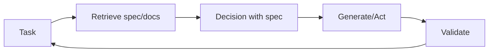

# Recuperação-decisão-projeto (RDD)

## Definição

**RDD (recuperação-decisão-projeto)** é um padrão de raciocínio que conecta **recuperação** (busca de especificações, documentoscs, or examples), **decisão** (making choices aligned with specs or policies), and **projeto** (producing outputs that satisfy requirements). É often used in spec-driven development: behavior is guided by explicit specifications that are retrieved and enforced during generation.

## Como funciona

1. **Retrieval:** Given the current task, retrieve relevant specification fragments, examples, or constraints (por ex. from a vector store or structured specs).
2. **Decision:** Use the retrieved context to decide next steps, allowed actions, or output format.
3. **Projeto:** Gerar ou executar de acordo com a especificação; opcionalmente validar saídas contra a especificação.

Isso pode ser implementado em um loop de [agente](/docs/agents): recuperar especificação → raciocinar com a especificação no contexto → agir ou gerar → validar → repetir. O diagram below shows the cycle: **task** triggers **retrieve**; retrieved spec feeds **decisão**; **generate/act** produces output; **validate** checks against the spec and can loop back to the task (por ex. retry or refine).

## Casos de uso

RDD is a fit when outputs must align with retrievable specs (compliance, policy, or documented requirements).

- Spec-driven agents that retrieve requirements and validate outputs
- Compliance and policy-aware generation (por ex. legal, safety)
- Code or config generation aligned with documented specs

## Vantagens e desvantagens

| Pros | Cons |
|------|------|
| Outputs align with specs | Requires good spec coverage and recuperação |
| Reduces drift and ad-hoc behavior | Extra recuperação and validation cost |
| Fits regulated or safety-critical flows | Spec projeto and maintenance overhead |

## Documentação externa

- [RAG paper (Lewis et al.)](https://arxiv.org/abs/2005.11401) — Retrieval component used in RDD
- [LangChain – Agents and tools](https://python.langchain.com/docs/concepts/agents/) — Orchestration patterns

## Veja também

- [Spec-driven development](/docs/spec-driven-development)
- [RAG](/docs/rag)
- [Agents](/docs/agents)
- [ReAct](/docs/reasoning-patterns/react)
