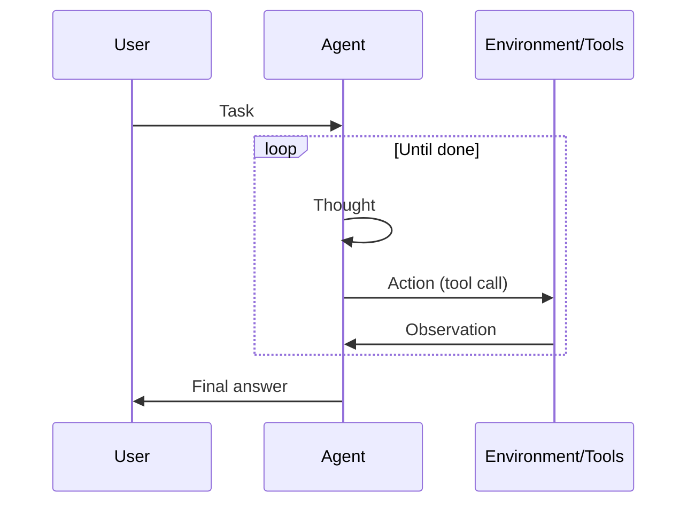

# ReAct (Reasoning + Acting)

## Definição

ReAct é um paradigma onde o modelo alterna **raciocínio** (o que fazer a seguir, por quê) e **ação** (chamadas de ferramentas). A observação do ambiente feeds back into the next raciocínio step, forming a loop until the task is done.

É the standard pattern for [agents](/docs/agents) que usam ferramentas: cada ação é precedida por um pensamento, o que reduz o uso cego ou repetitivo de ferramentas. Ften combined with [chain-of-thought](/docs/reasoning-patterns/cot) (raciocínio inside the thought) and with [RDD](/docs/reasoning-patterns/rdd) when specs guide decisãos.

## Como funciona

Formato do prompt é **Pensamento → Ação → Observação → Pensamento → … → Resposta Final**. O **usuário** dá uma **tarefa**; o **agent** produces a **thought** (raciocínio about what to do), then an **action** (por ex. tool call). The **environment/tools** return an **observation**, which is appended to the context for the next thought. The loop continues until the agent outputs a final answer. The model decides when to call tools and when to conclude, which reduces arbitrary or repetitive actions. The sequence diagram below summarizes this flow; frameworks like LangChain implement ReAct-style agents with tool registration and message handling.

## Casos de uso

ReAct fits agent workflows where each tool call should be preceded by a clear raciocínio step.

- Agents that use tools (search, calculator, API) with explicit raciocínio
- Reducing arbitrary or repetitive chamadas de ferramentas by interleaving thought
- Debuggable agent behavior via visible thought–action–observation traces

## Documentação externa

- [ReAct: Synergizing Reasoning and Acting in LLMs (Yao et al.)](https://arxiv.org/abs/2210.03629) — Original ReAct paper
- [LangChain – ReAct agent](https://python.langchain.com/docs/concepts/agents/) — ReAct-style agents in LangChain

## Veja também

- [Agents](/docs/agents)
- [Chain-of-thought](/docs/reasoning-patterns/cot)
- [RDD](/docs/reasoning-patterns/rdd)
