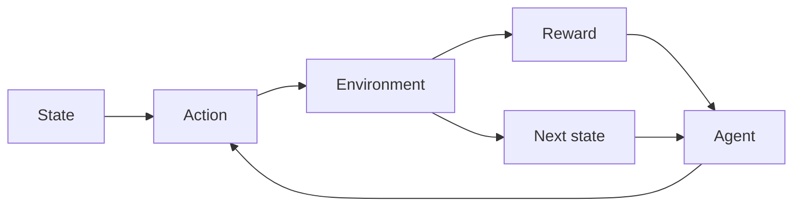

# Reinforcement learning (RL)

## Definição

O aprendizado por reforço treina agentes para maximizar a recompensa acumulada in an environment. The agent takes actions, receives observations and rewards, and improves its policy (por ex. value-based, policy gradient, actor-critic).

Se diferencia de [supervised](/docs/fundamentals/machine-learning) and [unsupervised](/docs/fundamentals/machine-learning) learning porque o feedback é sparse and delayed (rewards), and the agent must explore. Used in games, robotics, and [LLM](/docs/llms) alignment (RLHF). For high-dimensional states/actions, see [deep RL](/docs/drl).

## Como funciona

O cenário é geralmente um **MDP**: o **agente** vê um **estado**, escolhe uma **ação**, e o **ambiente** retornas a **reward** and **next state**. The agent improves its policy (mapping from state to action) to maximize cumulative reward. **Value-based** methods (por ex. Q-learning, DQN) learn a value function and derive the policy; **policy gradient** methods (por ex. PPO, SAC) optimize the policy directly. Exploration (por ex. epsilon-greedy, entropy bonus) is needed because rewards are only observed for actions taken. Algorithms differ in how they handle off-policy data, continuous actions, and scaling to large state spaces.

## Casos de uso

Reinforcement learning applies wherever an agent learns from rewards and sequential decisãos (games, control, alignment).

- Game playing (por ex. Atari, Go, poker) and simulation
- Robotics control and continuous control (por ex. manipulation)
- LLM alignment (por ex. RLHF) and sequential decisão systems

## Documentação externa

- [Reinforcement Learning (Sutton & Barto)](http://incompleteideas.net/book/the-book-2nd.html) — Free online book
- [Spinning Up in Deep RL (OpenAI)](https://spinningup.openai.com/)

## Veja também

- [Deep RL](/docs/drl)
- [Machine learning](/docs/fundamentals/machine-learning)
- [Agents](/docs/agents)
