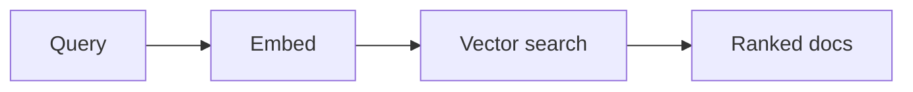

# Busca semântica

## Definição

Semantic search retrieves items by meaning rather than exact keywords. Query and documents are embedded; recuperação returns the most similar vectors (por ex. cosine similarity or ANN search).

É the recuperação backbone of [RAG](/docs/rag): see [embeddings](/docs/rag/embeddings) and [vector databases](/docs/rag/vector-databases) for how vectors are produced and stored. Use quando users express intent in natural language and you want “similar meaning” rather than literal keyword match. Combines well with keyword (hybrid search) when exact terms matter.

## Como funciona

A **consulta** (e opcionalmente filtros) é enviada a um modelo de **embedding** que produz um vetor. **Busca vetorial** (por ex. k-NN or approximate k-NN over an index of document vectors) returns the **ranked docs** (or chunk IDs) with highest similarity (por ex. cosine or dot product). Embedding models are trained so that semantically similar text maps to nearby vectors; the same model is used for queries and documents. Indexing can be offline (batch) or incremental; scale and latency determine whether you need an approximate index (HNSW, IVF) and a dedicated [vector database](/docs/rag/vector-databases).

## Casos de uso

Semantic search is used whenever you need to find items by meaning rather than exact keywords (RAG, recommendations, dedup).

- RAG recuperação: finding relevant chunks for a user query
- Recommendation and “similar item” search
- Duplicate or near-duplicate detection in document sets

## Documentação externa

- [Sentence-BERT](https://www.sbert.net/) — Dense recuperação models
- [LangChain – Vector stores](https://python.langchain.com/docs/concepts/vectorstores/)

## Veja também

- [Embeddings](/docs/rag/embeddings)
- [Vector databases](/docs/rag/vector-databases)
- [RAG](/docs/rag)
