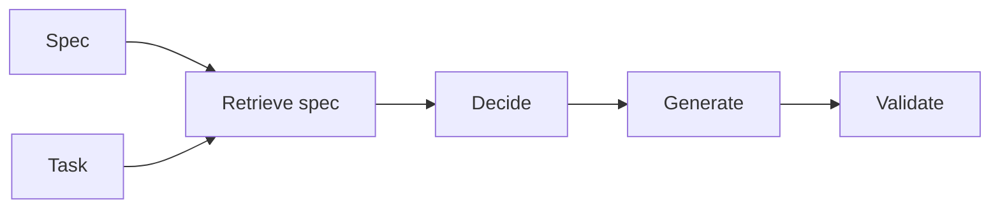

# Desenvolvimento orientado a especificações

## Definição

Spec-driven development constrói sistemas de IA (agents, pipelines, tools) a partir de especificações explícitas: requirements, output formats, allowed actions, and constraints. Specs are retrieved and used at runtime (por ex. in RDD) so behavior stays aligned with intent.

É especially useful for [agents](/docs/agents) and [RDD](/docs/reasoning-patterns/rdd): instead of encoding all rules in weights or prompts, you maintain specs (por ex. in docs or a knowledge base) and retrieve them at runtime. Fits regulated domains and teams that want behavior to be auditable and updatable sem retreinar.

## Como funciona

Você **escreve especificações** (linguagem natural, esquemas ou regras estruturadas) e as indexa para recuperação (por ex. em um armazenamento vetorial store or structured repo). At runtime, the **task** (and optionally the current state) is used to **retrieve** relevant spec fragments. The model or agent **decides** (por ex. next step, allowed actions) and **generates** (output, tool call) with the spec in context. **Validate** checks the output against the spec (por ex. schema, rules); if validation fails, you can retry or surface an error. This keeps generation and decisãos aligned with the spec without baking everything into [prompt engineering](/docs/llms/prompt-engineering) or [fine-tuning](/docs/llms/fine-tuning).

## Casos de uso

Spec-driven development fits when behavior must stay aligned with retrievable requirements (RDD, compliance, or safety).

- Building agents that retrieve and follow specs (por ex. RDD pattern)
- Enforcing output format and constraints (JSON, allowed actions)
- Regulated or safety-critical flows where behavior must match requirements

## Documentação externa

- [LangChain – Structured output](https://python.langchain.com/docs/concepts/output_parsers/) — Enforcing output format from LLMs
- [OpenAI – Structured outputs](https://platform.openai.com/docs/guides/structured-outputs)

## Veja também

- [RDD](/docs/reasoning-patterns/rdd)
- [Agents](/docs/agents)
- [Prompt engineering](/docs/llms/prompt-engineering)
