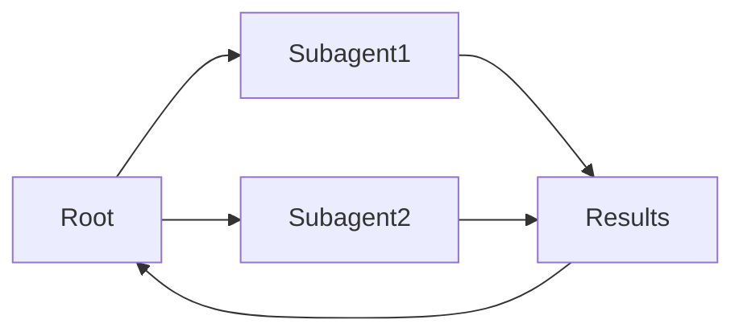

# Subagentes

## Definição

**Subagentes** são agentes que se situam dentro de uma hierarquia: um agente pai delega subtarefas a agentes filhos (subagentes), que por sua vez podem delegar a mais subagentes. Isso estrutura a complexix work and keeps each agent focused.

Eles são uma forma de implementar sistemas [multi-agente](/docs/agents/multi-agent-systems) com uma cadeia clara de responsabilidaty. The root [agent](/docs/agents) owns the user-facing goal; subagents handle focused sub-tasks (por ex. [recuperação](/docs/rag), code execution, validation). Often used with [spec-driven development](/docs/spec-driven-development) or [RDD](/docs/reasoning-patterns/rdd) so subagents receive and follow specs.

## Como funciona

O agente **raiz** recebe a tarefa, divide-a em subtarefas e as atribui ao **Subagente1**, **Subagente2**, etc. (por papel ou capacidade). Cada subagente executa seu próprio loop (possivelmente com ferramentas e um LLM) and returns **results** to the root. The root **aggregates** results (por ex. merges, selects, or passes to another subagent) and either continues the loop or returns to the user. Subagents can be specialized (por ex. recuperação, code, critique) and use the same or different models. Clear contracts (inputs/outputs or tools) and error handling make the hierarchy debuggable and reusable.

## Casos de uso

Subagents ajudam quando uma tarefa se divide naturalmente em subtarefas focadas que podem ser delegadas e agregadas.

- Root agent delegating recuperação, generation, and validation to subagents
- Complex workflows (por ex. research, code review) with focused sub-tasks
- Reusing the same subagent in different parent workflows

## Documentação externa

- [From Prototypes to Agents with ADK – Google Codelabs](https://codelabs.developers.google.com/your-first-agent-with-adk#0) — ADK multi-agent systems with hierarchy
- [LangChain – Multi-agent workflows](https://python.langchain.com/docs/concepts/multi_agent/) — Workflow and subagent patterns

## Vantagens e desvantagens

| Pros | Cons |
|------|------|
| Clear separation of concerns | Coordination and latency |
| Scalable to complex tasks | Need clear contracts and error handling |
| Reusable subagent capabilities | Debugging across hierarchy can be hard |

## Veja também

- [Agents](/docs/agents)
- [Multi-agent systems](/docs/agents/multi-agent-systems)
- [RDD](/docs/reasoning-patterns/rdd)
- [Spec-driven development](/docs/spec-driven-development)
