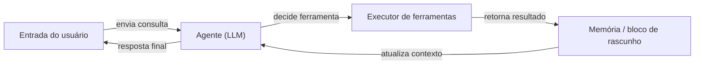

# LangChain

## Definição

LangChain é um framework de código aberto para criar aplicações impulsionadas por [grandes modelos de linguagem](/docs/llms). Ele fornece abstrações composáveis para prompts, chains, agentes e recuperação, permitindo que desenvolvedores conectem provedores de modelos, armazenamentos de memória, ferramentas e carregadores de documentos com mínimo de código repetitivo. O framework inclui integrações pré-construídas para dezenas de provedores de LLM (OpenAI, Anthropic, Mistral, local via Ollama) e armazenamentos de vetores (Pinecone, Chroma, FAISS).

Em seu núcleo, o LangChain se centra no conceito de **chains**: sequências de etapas onde a saída de uma etapa alimenta a próxima. **Agentes** estendem as chains dando ao LLM um loop de raciocínio: ele decide qual ferramenta chamar, recebe o resultado e continua até produzir uma resposta final. O LangSmith, a plataforma de observabilidade complementar, fornece rastreamento, avaliação e gerenciamento de conjuntos de dados para aplicações LangChain em produção.

Ele complementa o [LlamaIndex](/docs/tools/llamaindex) (que enfatiza a indexação de dados e a qualidade da recuperação) focando em orquestração composável e loops de agentes. Use o LangChain quando precisar de encadeamento flexível, fluxos de trabalho de [engenharia de prompts](/docs/prompt-engineering) de múltiplas etapas, ou [agentes com ferramentas](/docs/agents), e quiser um grande ecossistema de integrações prontas.

## Como funciona

### Componentes

O LangChain decompõe uma aplicação LLM em componentes modulares: **LLMs / modelos de chat** (o backend de inferência), **templates de prompt** (construção de entrada estruturada), **parsers de saída** (extração estruturada), **retrievers** (buscar documentos relevantes de um [banco de dados vetorial](/docs/rag/vector-databases)) e **ferramentas** (APIs externas, busca, execução de código).

### Chains e LCEL

A **LangChain Expression Language (LCEL)** compõe componentes com uma sintaxe de pipe (`prompt | llm | parser`). A chain resultante é lazy, streamável e processável em lote. Uma chain RAG simples: recuperar documentos → formatar em prompt → chamar o LLM → parsear a resposta.

### Agentes



### Observabilidade com LangSmith

O LangSmith envolve chains e agentes com registro de rastreamento, habilitando análise de latência, testes de prompts e avaliação orientada por conjuntos de dados sem modificar o código da aplicação.

## Quando usar / Quando NÃO usar

| Cenário | Usar LangChain | NÃO usar LangChain |
|----------|--------------|----------------------|
| Criar agentes que chamam múltiplas APIs e ferramentas | Sim — abstrações de agentes e integrações de ferramentas são de primeira classe | |
| RAG sobre documentos próprios com configuração rápida | Sim — muitos carregadores e integrações de retrievers | |
| RAG de produção com chunking profundo e ajuste de recuperação | | Preferir [LlamaIndex](/docs/tools/llamaindex) para controle detalhado |
| Completações de turno único sem recuperação ou ferramentas | | O overhead é desnecessário; chamar a API diretamente |
| Rastreamento e avaliação de chamadas LLM em produção | Sim — integração com LangSmith | |
| Orçamento de latência apertado e dependências mínimas | | O overhead do framework pode adicionar latência; considerar um cliente leve |

## Comparações

| Funcionalidade | LangChain | LlamaIndex |
|---------|-----------|------------|
| Foco principal | Orquestração, chains, agentes | Indexação e recuperação de dados |
| Suporte a agentes | Primeira classe (chamada de ferramentas, LCEL) | Via query engines como ferramentas |
| Controle de RAG | Alto nível, muitas integrações | Chunking detalhado, parsers de nós |
| Observabilidade | LangSmith (rastreamento, evals) | Via integrações |
| Curva de aprendizado | Moderada | Moderada |
| Melhor para | Fluxos de trabalho de múltiplas etapas, agentes | RAG profundo sobre grandes corpus de documentos |

## Prós e contras

| Prós | Contras |
|------|------|
| Grande ecossistema de integrações (100+ LLMs, stores, ferramentas) | Abstrações podem ocultar erros e adicionar dificuldade de depuração |
| LCEL torna as chains composáveis e streameáveis | A superfície da API muda frequentemente entre versões |
| LangSmith fornece rastreamento e avaliações de nível produção | Pode adicionar latência e overhead de dependências para casos de uso simples |
| Comunidade forte e documentação | Múltiplas formas de fazer a mesma coisa podem ser confusas |

## Exemplos de código

```python
# Chain RAG mínima usando LangChain Expression Language (LCEL)
from langchain_openai import ChatOpenAI, OpenAIEmbeddings
from langchain_community.vectorstores import FAISS
from langchain_core.prompts import ChatPromptTemplate
from langchain_core.output_parsers import StrOutputParser
from langchain_core.runnables import RunnablePassthrough

# 1. Construir um armazenamento de vetores a partir de documentos
texts = ["LangChain composes LLM pipelines.", "LCEL uses pipe syntax."]
vectorstore = FAISS.from_texts(texts, embedding=OpenAIEmbeddings())
retriever = vectorstore.as_retriever()

# 2. Definir prompt
prompt = ChatPromptTemplate.from_template(
    "Answer based on context:\n{context}\n\nQuestion: {question}"
)

# 3. Compor chain com LCEL
chain = (
    {"context": retriever, "question": RunnablePassthrough()}
    | prompt
    | ChatOpenAI(model="gpt-4o-mini")
    | StrOutputParser()
)

print(chain.invoke("What does LCEL use?"))
# -> "LCEL uses pipe syntax."
```

## Dicas para uso eficaz

- Usar LCEL (sintaxe de pipe) em vez do `LLMChain` legado para todo código novo — ele é streamável, processável em lote e mais fácil de depurar.
- Instrumentar cada chain e agente com rastreamento LangSmith desde o primeiro dia; adicionar rastreamento retroativamente é mais difícil.
- Manter as descrições de ferramentas curtas e precisas — a capacidade do agente de selecionar a ferramenta correta depende da qualidade da descrição.
- Usar `RunnablePassthrough` e `RunnableParallel` para passar dados pela chain sem transformá-los.
- Para RAG de produção, adicionar reranking (p.ex. Cohere rerank) entre o retriever e o LLM para melhorar a qualidade das respostas.

## Recursos práticos

- [Documentação LangChain](https://python.langchain.com/docs/) — Referência completa de API, guias e tutoriais
- [LangChain — Agentes](https://python.langchain.com/docs/concepts/agents/) — Conceitos de agentes e como criar agentes que chamam ferramentas
- [LangChain — RAG](https://python.langchain.com/docs/use_cases/question_answering/) — Casos de uso de perguntas e respostas e recuperação
- [LangSmith](https://smith.langchain.com/) — Rastreamento, avaliação e gerenciamento de conjuntos de dados
- [Visão geral do LCEL](https://python.langchain.com/docs/expression_language/) — Compor chains com sintaxe de pipe

## Veja também

- [RAG](/docs/rag)
- [Agentes](/docs/agents)
- [LlamaIndex](/docs/tools/llamaindex)
