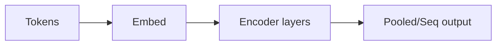

# BERT

## Definição

BERT é um modelo **encoder** de transformer pré-treinado com modelagem de linguagem mascarada (MLM) e predição de próxima sentença. Produz embeddings contextuais que são ajustados para tarefas de NLP posteriores.

Diferente dos decoders estilo [GPT](/docs/transformers/gpt), BERT usa contexto **bidirecional** (esquerda e direita de cada token), o que ajuda em tarefas de compreensão (ex.: classificação [NLP](/docs/nlp), NER, QA) em vez de geração aberta. É frequentemente usado como encoder congelado ou ajustado em pipelines de [RAG](/docs/rag) e busca.

## Como funciona

Os **tokens** são tokenizados e embutidos (embeddings de token + posição). As **camadas de encoder** aplicam auto-atenção bidirecional e FFNs; a representação de cada token é influenciada por todos os outros tokens. A saída pode ser **pooled** (ex.: [CLS] para tarefas a nível de sentença) ou **sequencial** (um vetor por token para NER, QA). Pré-treinamento: mascarar tokens aleatoriamente e predizê-los (MLM), e predizer se duas sentenças são consecutivas (NSP). O **ajuste fino** adiciona uma cabeça de tarefa (ex.: classificador linear) e atualiza o modelo (ou apenas a cabeça) em dados rotulados.

## Casos de uso

Modelos estilo BERT se destacam quando você precisa de representações contextuais ricas para compreensão (classificação, NER, QA) em vez de geração.

- Reconhecimento de entidades nomeadas e extração de relações
- Busca e recuperação (matching semântico, ranking de relevância)
- Resposta a perguntas e inferência de linguagem natural

## Documentação externa

- [BERT: Pre-training of Deep Bidirectional Transformers (Devlin et al.)](https://arxiv.org/abs/1810.04805)
- [Hugging Face – BERT](https://huggingface.co/docs/transformers/model_doc/bert)

## Veja também

- [Transformers](/docs/transformers)
- [GPT](/docs/transformers/gpt)
- [NLP](/docs/nlp)
