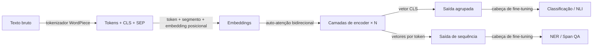

# BERT

## Definição

BERT é um modelo transformer de **encoder** pré-treinado com modelagem de linguagem mascarada (MLM) e previsão de próxima sentença. Ele produz embeddings contextuais que são fine-tunados para tarefas NLP downstream.

Ao contrário dos decoders estilo [GPT](/docs/transformers/gpt), o BERT usa contexto **bidirecional** (esquerda e direita de cada token), o que ajuda em tarefas de compreensão (por ex. classificação [NLP](/docs/nlp), NER, QA) em vez de geração aberta. É frequentemente usado como encoder congelado ou fine-tunado em pipelines de [RAG](/docs/rag) e busca.

O objetivo de pré-treinamento do BERT é elegantemente simples: mascarar aleatoriamente 15% dos tokens em uma entrada e treinar o modelo para prevê-los usando o contexto circundante completo. Isso força o encoder a desenvolver representações ricas e dependentes do contexto para cada token em vez de memorizar estatísticas superficiais. No fine-tuning, uma pequena cabeça de tarefa (uma ou duas camadas lineares) é adicionada sobre o encoder pré-treinado e treinada em dados rotulados — frequentemente alcançando bom desempenho com apenas alguns milhares de exemplos. Variantes como RoBERTa (receita de treinamento melhorada), DistilBERT (destilado para velocidade) e DeBERTa (atenção desacoplada) melhoraram o original mantendo o paradigma somente-encoder.

## Funcionamento



### Tokenização e embedding

Os **tokens** são produzidos pelo tokenizador WordPiece, que adiciona um token especial [CLS] no início e [SEP] entre/após segmentos. O embedding de cada token é a soma do seu embedding de token, embedding de segmento e embedding posicional.

### Encoder bidirecional

As **camadas de encoder** aplicam auto-atenção bidirecional: ao contrário de modelos causais, cada token pode se concentrar em todos os outros tokens em ambas as direções. Isso produz representações profundamente conscientes do contexto. Empilhar 12 ou 24 dessas camadas (BERT-Base / BERT-Large) fornece representações universais poderosas.

### Saída e fine-tuning

A saída pode ser **agrupada** (o vetor [CLS] para tarefas no nível da sentença) ou a **sequência** completa (um vetor por token para NER, QA). O **fine-tuning** adiciona uma cabeça de tarefa (por ex. classificador linear) e atualiza o modelo inteiro ou apenas a cabeça em dados rotulados.

## Quando usar / Quando NÃO usar

| Cenário | Usar BERT? | Notas |
|---------|-----------|-------|
| Classificação de texto (sentimento, intenção) | Sim | Token [CLS] + cabeça linear é muito eficaz |
| Reconhecimento de entidades nomeadas (NER) | Sim | Saídas por token adequam-se à rotulagem de spans |
| Busca semântica / recuperação | Sim | Variantes fine-tunadas ou bi-encoder (por ex. Sentence-BERT) |
| Geração de texto aberta | Não | Usar decoder estilo GPT |
| Documentos muito longos (\>512 tokens) | Com cautela | Usar Longformer ou estratégias de janela deslizante |
| Tarefas de geração zero-shot | Não | BERT requer fine-tuning para geração |

## Comparações

| Aspecto | BERT (somente encoder) | GPT (somente decoder) |
|---------|----------------------|----------------------|
| Direção do contexto | Bidirecional | Unidirecional (causal) |
| Força principal | Compreensão / classificação | Geração |
| Objetivo de pré-treinamento | MLM mascarado + NSP | Previsão do próximo token |
| Estilo de fine-tuning | Adicionar pequena cabeça de tarefa | Prompting ou fine-tuning supervisionado |
| Capacidade de geração | Baixa (não projetado para isso) | Excelente |
| Qualidade de embedding (recuperação) | Excelente (com bi-encoder) | Moderada sem fine-tuning |

## Vantagens e desvantagens

| Vantagens | Desvantagens |
|---------|------------|
| Representações contextuais sólidas | Não pode gerar texto de forma autorregressiva |
| Fine-tuning eficiente em conjuntos de dados pequenos | Máximo de 512 tokens (arquitetura base) |
| Variantes pré-treinadas amplamente disponíveis | Requer dados rotulados para a maioria das tarefas |
| Padrões de atenção interpretáveis | Mais fraco do que modelos classe GPT-4 em raciocínio complexo |

## Exemplos de código

```python
# Fine-tuning BERT for text classification with Hugging Face Transformers
from transformers import AutoTokenizer, AutoModelForSequenceClassification, Trainer, TrainingArguments
from datasets import Dataset
import torch

# Minimal synthetic dataset for demonstration
texts  = ["I love this product!", "Terrible experience.", "It was okay I guess.", "Absolutely fantastic!"]
labels = [1, 0, 0, 1]  # 1 = positive, 0 = negative

tokenizer = AutoTokenizer.from_pretrained("bert-base-uncased")

def tokenize(batch):
    return tokenizer(batch["text"], truncation=True, padding="max_length", max_length=64)

dataset = Dataset.from_dict({"text": texts, "label": labels})
dataset = dataset.map(tokenize, batched=True)
dataset.set_format("torch", columns=["input_ids", "attention_mask", "label"])

model = AutoModelForSequenceClassification.from_pretrained("bert-base-uncased", num_labels=2)

training_args = TrainingArguments(
    output_dir="./bert-sentiment",
    num_train_epochs=3,
    per_device_train_batch_size=2,
    logging_steps=5,
    save_strategy="no",
)

trainer = Trainer(model=model, args=training_args, train_dataset=dataset)
trainer.train()
print("Fine-tuning concluído.")
```

## Recursos práticos

- [BERT: Pré-treinamento de Transformers Bidirecionais Profundos (Devlin et al.)](https://arxiv.org/abs/1810.04805) — Artigo original
- [Hugging Face – BERT](https://huggingface.co/docs/transformers/model_doc/bert) — Referência de API e fichas de modelos
- [Sentence-BERT](https://www.sbert.net/) — Variante BERT otimizada para similaridade semântica e recuperação densa

## Veja também

- [Transformers](/docs/transformers)
- [GPT](/docs/transformers/gpt)
- [NLP](/docs/nlp)
