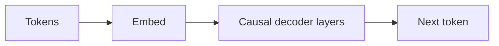

# GPT

## Definição

GPT refere-se a modelos transformer somente-decoder treinados para prever o próximo token (autorregressivo). Escalar esses modelos levou aos grandes modelos de linguagem (LLMs) atuais, capazes de tarefas few-shot e zero-shot.

O projeto somente-decoder é ideal para **geração**: a cada passo o modelo se condiciona nos tokens anteriores e prevê o próximo. Os [LLMs](/docs/llms) construídos sobre essa ideia são então ajustados com instruções e alinhados (ex.: RLHF) para chat e uso de ferramentas. Para tarefas apenas de compreensão, encoders estilo [BERT](/docs/transformers/bert) podem ser mais eficientes em parâmetros.

## Como funciona

Os **tokens** são embutidos e alimentados em **camadas causais de decoder**: cada posição só pode atender a si mesma e posições anteriores (auto-atenção mascarada), então o modelo não pode "ver" o futuro. O **próximo token** é previsto a partir da representação da última posição (geralmente com uma camada linear e softmax sobre o vocabulário). O **treinamento** maximiza a probabilidade do próximo token dado o contexto anterior (teacher forcing). A **inferência** gera autorregressivamente: amostrar ou escolher avidamente o próximo token, adicioná-lo e repetir até uma condição de parada. [Prompt engineering](/docs/prompt-engineering) e [ajuste fino](/docs/llms/fine-tuning) moldam como o modelo usa esse mecanismo para tarefas.

## Casos de uso

Modelos somente-decoder são a base do chat, código e qualquer tarefa que se beneficie de geração autorregressiva ou prompting few-shot.

- Geração de texto e código (completação, resumo, diálogo)
- Classificação few-shot e zero-shot via prompts
- Assistentes e chatbots baseados em modelos ajustados com instruções

## Documentação externa

- [Improving Language Understanding by Generative Pre-Training (OpenAI)](https://cdn.openai.com/research-covers/language-unsupervised/language_understanding_paper.pdf)
- [Hugging Face – GPT-2](https://huggingface.co/docs/transformers/model_doc/gpt2)

## Veja também

- [Transformers](/docs/transformers)
- [LLMs](/docs/llms)
- [Prompt engineering](/docs/prompt-engineering)
