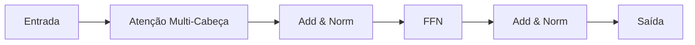

# Transformers

## Definição

Transformers são arquiteturas neurais baseadas em **auto-atenção**: cada token atende a todos os outros para calcular representações contextuais. Evitam recorrência e permitem paralelização, escalando para sequências muito longas e modelos grandes (BERT, GPT, etc.).

Sustentam os [LLMs](/docs/llms) modernos e foram estendidos para modelos [multimodais](/docs/multimodal-ai) e de [visão](/docs/cv). Variantes somente-encoder ([BERT](/docs/transformers/bert)) e somente-decoder ([GPT](/docs/transformers/gpt)) são as mais comuns hoje; o layout encoder-decoder continua sendo usado para tarefas de sequência para sequência.

## Como funciona

- **Atenção:** Query, Key, Value são calculados a partir das entradas; os pesos de atenção combinam valores.
- **Atenção multi-cabeça:** Múltiplas cabeças de atenção capturam diferentes relações.
- **Encoder-decoder ou somente-decoder:** O encoder (ex.: BERT) vê a sequência completa; o decoder (ex.: GPT) usa mascaramento causal para geração autorregressiva.

O diagrama mostra um bloco: a entrada passa pela atenção multi-cabeça (com add e norm), depois uma rede feed-forward (FFN), depois add e norm novamente. Pilhas de encoder usam atenção bidirecional; pilhas de decoder usam atenção causal (mascarada) para que cada posição veja apenas tokens anteriores. Conexões residuais e normalização de camada estabilizam o treinamento. Empilhar muitos blocos e escalar largura e profundidade produz os grandes modelos usados para [NLP](/docs/nlp) e além.

## Casos de uso

Transformers sustentam a maioria dos sistemas modernos de NLP e multimodais; variantes somente-encoder, somente-decoder e encoder-decoder se adequam a diferentes tarefas.

- Estilo BERT: reconhecimento de entidades nomeadas, relevância de busca, resposta a perguntas
- Estilo GPT: geração de texto, completação de código, chat e diálogo
- Transformers multimodais para tarefas de visão-linguagem

## Vantagens e desvantagens

| Vantagens | Desvantagens |
|-----------|--------------|
| Paralelizável, escalável | Alto custo computacional e de memória |
| Forte em dependências de longo alcance | Requer grandes volumes de dados |
| Arquitetura unificada para muitas tarefas | Desafios de interpretabilidade |

## Documentação externa

- [Attention Is All You Need (Vaswani et al.)](https://arxiv.org/abs/1706.03762) — Artigo original do Transformer
- [Hugging Face – Resumo dos modelos](https://huggingface.co/docs/transformers/model_summary) — Famílias de modelos Transformer
- [The Illustrated Transformer](https://jalammar.github.io/illustrated-transformer/) — Explicação visual da arquitetura

## Veja também

- [BERT](/docs/transformers/bert)
- [GPT](/docs/transformers/gpt)
- [LLMs](/docs/llms)
