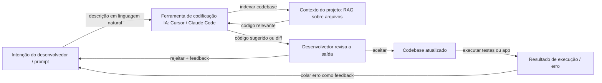

# Vibe Coding

## Definição

Vibe coding é um estilo de desenvolvimento de software onde se trabalha **iterativamente com assistência de IA**: você descreve a intenção em linguagem natural, obtém código ou edições de um [LLM](/docs/llms) ou ferramenta de codificação, e então refina por feedback e contexto em vez de escrever cada linha do zero. O "vibe" é o fluxo solto e exploratório — você dirige por intenção e intuição, e o modelo preenche os detalhes de implementação. O foco é reduzir a fricção: ideias vão do pensamento ao código funcional em minutos em vez de horas, com o desenvolvedor agindo como diretor e revisor em vez de digitador.

Vibe coding contrasta com abordagens totalmente spec-first ou plan-then-code (p. ex. [desenvolvimento guiado por especificação](/docs/spec-driven-development)): você frequentemente começa com uma ideia aproximada e deixa a [engenharia de prompts](/docs/prompt-engineering), os [agentes](/docs/agents) e ferramentas (p. ex. [Cursor](/docs/tools/cursor), [Claude Code](/docs/tools/claude-code)) sugerir e editar código. O papel do desenvolvedor muda de escrever sintaxe para descrever objetivos, avaliar saídas e direcionar para a correção. É mais produtivo quando o desenvolvedor mantém compreensão suficiente do codebase para detectar erros — vibe coding não elimina a necessidade de julgamento de engenharia, apenas muda onde esse julgamento é aplicado.

A prática é possibilitada por uma nova geração de ferramentas de codificação de IA que fornecem contexto em nível de projeto: codebases indexadas, edições de múltiplos arquivos, acesso ao terminal e loops agênticos que podem escrever, executar e corrigir código autonomamente. Ferramentas como Cursor, Windsurf e Claude Code vão além do autocomplete para agir como agentes colaborativos que entendem o projeto completo. A recuperação no estilo [RAG](/docs/rag) mantém as sugestões ancoradas no seu codebase real em vez de exemplos genéricos. O resultado é particularmente útil para protótipos, scripts, boilerplate, testes e refatorações — tarefas onde a intenção é fácil de declarar, mas a implementação é tediosa de escrever.

## Como funciona

### O loop de intenção-feedback

O núcleo do vibe coding é um loop rápido: declarar uma intenção, revisar a saída, fornecer feedback, repetir. Ao contrário do desenvolvimento em cascata, não há requisito de especificar completamente os requisitos antes de começar. Você pode explorar pedindo ao modelo para "tentar algumas abordagens" e escolhendo a que parece certa. As sugestões do modelo se tornam andaimes que você refina, em vez de um artefato completo que você aceita integralmente.

### Contexto e ferramentas



### Modos agênticos e autônomos

Ferramentas modernas suportam vibe coding agêntico: a IA pode executar comandos de terminal, ler a saída de erros e se autocorrigir em múltiplas iterações sem intervenção do desenvolvedor. Isso é útil para tarefas repetitivas (gerar suites de teste, migrar APIs), mas requer que o desenvolvedor estabeleça limites claros e revise o diff final — loops agênticos podem fazer mudanças em cascata difíceis de desfazer.

## Quando usar / Quando NÃO usar

| Usar quando | Evitar quando |
|-------------|--------------|
| Prototipagem ou scripting onde velocidade importa mais que arquitetura | Sistemas críticos para segurança ou altamente regulados onde código não revisado é inaceitável |
| Gerar boilerplate, testes ou migrações onde a intenção é fácil de declarar | O codebase é tão complexo que o modelo carece de contexto suficiente para evitar bugs sutis |
| Aprender ou explorar um codebase ou biblioteca desconhecida | É necessário entender completamente cada linha de código produzida (p. ex. para revisão de segurança) |
| Iterar rapidamente em design de UI ou API para validar ideias | Manutenibilidade de longo prazo requer padrões consistentes e decisões de arquitetura deliberadas |

## Comparações

| Abordagem | Ponto de partida | Especificação necessária | Melhor para |
|-----------|-----------------|--------------------------|------------|
| Vibe coding | Intenção aproximada | Não | Protótipos, scripts, exploração |
| Desenvolvimento guiado por especificação | Especificação explícita | Sim | Sistemas regulados, agentes, conformidade |
| TDD (test-first) | Casos de teste | Parcialmente | Funcionalidades de produção com critérios de aceitação claros |
| Programação em par (humano + humano) | Contexto compartilhado | Varia | Problemas complexos que requerem raciocínio profundo |

## Prós e contras

| Prós | Contras |
|------|---------|
| Iteração rápida e menos digitação | Pode obscurecer a compreensão se você nunca ler o código |
| Bom para exploração e aprendizado | Pode produzir código frágil ou sobreajustado sem revisão |
| Baixa fricção para tarefas pequenas e protótipos | Difícil de escalar para sistemas grandes e consistentes sem especificações |
| Funciona bem com [agentes](/docs/agents) e integrações de IDE | Depende fortemente da qualidade do modelo, janela de contexto e integração de ferramentas |
| Reduz a energia de ativação para começar uma nova tarefa | Loops agênticos podem fazer mudanças em cascata indesejadas |

## Exemplos de código

### Sessão de exemplo de vibe coding com Claude Code (shell)

```bash
# Iniciar Claude Code no diretório do seu projeto
claude

# Descrever o que você quer — sem necessidade de especificar a implementação exata
> Adicione um middleware de rate limiting ao aplicativo Express.
>  Use uma janela deslizante de 100 requisições por minuto por IP.
>  Retorne 429 com um cabeçalho Retry-After quando o limite for excedido.

# Claude Code vai:
# 1. Ler a configuração Express existente
# 2. Instalar a biblioteca apropriada (p. ex. express-rate-limit)
# 3. Escrever e inserir o middleware
# 4. Atualizar os imports

# Revisar o diff e então iterar
> Na verdade use Redis para o armazenamento do rate limit para que funcione em múltiplas instâncias.

# Aceitar o diff final e executar os testes
> Execute a suite de testes existente e corrija quaisquer falhas.
```

## Recursos práticos

- [Documentação do Claude Code](https://docs.anthropic.com/en/docs/claude-code/overview) — Agente de codificação IA baseado em terminal da Anthropic
- [Documentação do Cursor](https://docs.cursor.com/) — IDE IA-first com sugestões contextuais do codebase e edição agêntica
- [Kiro – Spec-driven e Autopilot](https://kiro.dev/) — Ferramenta que equilibra especificações estruturadas com fluxo de desenvolvimento guiado por IA
- [Andrej Karpathy – Vibe coding (Twitter/X)](https://x.com/karpathy/status/1886192184808149165) — Cunhagem e descrição do termo por seu criador
- [Windsurf (Codeium)](https://codeium.com/windsurf) — IDE agêntico com Cascade, um fluxo de codificação agêntico multiarquivo

## Veja também

- [Desenvolvimento guiado por especificação](/docs/spec-driven-development) — Abordagem mais estruturada, especificação primeiro
- [Agentes](/docs/agents) — IA que pode escrever e editar código
- [Cursor](/docs/tools/cursor) — IDE construído para codificação assistida por IA
- [Engenharia de prompts](/docs/prompt-engineering)
