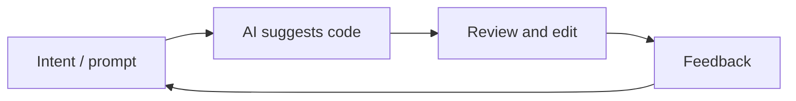

# Vibe Coding

## Definição

Vibe coding é um estilo de desenvolvimento de software em que se trabalha **iterativamente com assistência de IA**: você descreve a intenção em linguagem natural, get code or edits from an [LLM](/docs/llms) or coding tool, then refine by feedback and context rather than writing every line from scratch. The “vibe” is the loose, exploratory flow—you steer by intent and feel, and the model fills in implementation details.

It contrasts with fully spec-first or plan-then-code approaches (por ex. [spec-driven development](/docs/spec-driven-development)): you often start with a rough idea and let [prompt engineering](/docs/llms/prompt-engineering), [agents](/docs/agents), and tools (por ex. [Cursor](/docs/tools/cursor), [Claude Code](/docs/tools/claude-code)) suggest and edit code. Useful for prototypes, scripting, and tasks where speed and iteration matter more than upfront projeto.

## Como funciona

You give the **model** (or IDE tool) **context**: open files, cursor position, or a short prompt (“add a test for this”, “refactor to use async”). O **modelo** retorna código sugerido ou diffs; você **accept, edit, or reject** and optionally add **feedback** (“use a different library”, “make it shorter”). The loop repeats until the result matches what you want. Tools often provide project-aware context (indexed codebase, [RAG](/docs/rag)-style recuperação) so suggestions stay relevant. Success depends on clear intent, good tooling, and knowing when to take over or refine the output.

## Casos de uso

Vibe coding funciona quando você quer avançar rápido com assistência de IA e está disposto a iterar no ciclo em vez de definir a especificação primeiro.

- Prototyping and scripting (por ex. one-off scripts, small tools)
- Boilerplate, tests, and refactors where the intent is easy to state
- Learning or exploring a codebase by asking the AI to implement or explain
- Combinação com [agentes](/docs/agents) ou [agentes autônomos](/docs/autonomous-agents) que escrevem e editam código a partir de descriptions

## Vantagens e desvantagens

| Pros | Cons |
|------|------|
| Fast iteration and less typing | Can obscure understanding if you never read the code |
| Good for exploration and learning | May produce brittle or overfitted code without review |
| Low friction for small tasks | Hard to scale to large, consistent systems without specs |
| Works well with [agents](/docs/agents) and IDEs | Depends on model quality and context |

## Documentação externa

- [Antigravity – Vibe coding](https://www.antigravityai.io/) — Agent-first IDE that emphasizes vibe coding
- [Kiro – Spec-driven and Autopilot](https://kiro.dev/) — Balancing structure with AI-driven flow

## Veja também

- [Spec-driven development](/docs/spec-driven-development) — More structured, spec-first approach
- [Agents](/docs/agents) — AI that can write and edit code
- [Cursor](/docs/tools/cursor) — IDE built for AI-assisted coding
- [Prompt engineering](/docs/llms/prompt-engineering)
