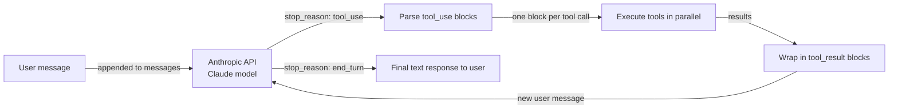

# Anthropic Tool Use

## 定义

**Anthropic Tool Use**（有时称为"函数调用"）是 Claude 以结构化、可靠的方式与外部系统交互的原生机制。不是要求 Claude 输出文本然后解析其中的函数名和参数，而是在 API 请求中将工具描述为 JSON 模式，Claude 返回一个包含确切工具名称和经过验证的参数 JSON 对象的结构化 `tool_use` 块。您的代码执行工具，将结果包装在 `tool_result` 块中，并将其作为对话的下一轮发送回 Claude——这个循环持续到 Claude 生成最终文本响应为止。

设计哲学是有意的极简主义：Anthropic Tool Use 是模型 API 的一种能力，而非框架。没有编排层、没有内置内存、没有代理循环——这些都由您自己编写。这提供了最大控制权和最小的抽象开销。对于简单到中等的工具使用场景，结果简洁、可读且易于调试。对于复杂的多代理系统，您通常会将 Anthropic Tool Use 与 LangGraph 等框架或自定义编排器结合使用。

Claude 模型已经专门针对工具使用进行了训练，这意味着它们在以下方面表现出色：决定*何时*调用工具（不会不必要地调用）、*如何*从自然语言中正确填充参数，以及*如何*通过请求澄清而非幻觉参数来优雅地处理模糊或欠规范的请求。并行工具调用（单个响应中的多个 `tool_use` 块）和多轮工具使用（最终答案之前的多轮工具调用）均原生支持。

## 工作原理

### 工具定义：JSON Schema

每个工具被描述为一个具有三个必填字段的 JSON 对象：`name`（字符串标识符）、`description`（关于工具功能及使用时机的自然语言说明——这是引导 Claude 决策的最重要字段）和 `input_schema`（定义预期参数的 JSON Schema 对象）。`input_schema` 遵循标准 JSON Schema 草案，支持字符串、数字、布尔值、数组、对象类型、必填字段、枚举值和嵌套模式。Claude 读取工具描述来决定调用哪个工具；更精确的描述会带来更准确的工具选择。

### tool_use 和 tool_result 消息类型

当 Claude 决定使用工具时，它返回一个带有 `stop_reason: "tool_use"` 的响应，以及包含一个或多个 `tool_use` 块的 `content` 数组。每个块都有一个 `id`（唯一字符串，如 `"toulu_01abc..."`）、一个 `name`（与您的工具定义之一匹配）和一个 `input`（包含已验证参数的 JSON 对象）。您的应用程序提取这些块，执行每个工具调用，并构建一个 `role: "user"` 的新消息，其内容是 `tool_result` 块列表——每个工具调用对应一个，通过 `tool_use_id` 匹配。这种往返持续直到 Claude 返回带有纯文本响应的 `stop_reason: "end_turn"`。

### 并行工具调用

当 Claude 确定多个工具可以同时调用时，它可以在单个响应中发出多个 `tool_use` 块——例如，同时搜索两个不同的数据库或获取三个城市的天气。您的应用程序应检测多个 `tool_use` 块并并行执行它们（例如使用 `asyncio.gather` 或线程池），然后构建 `tool_result` 回复。与顺序的单次调用相比，并行调用大幅降低了总延迟。

### 多轮工具使用

复杂任务通常需要多轮工具调用才能让 Claude 生成最终答案：查找实体，然后获取其详细信息，再从这些详细信息计算某些内容。每轮在对话历史中添加一条助手消息（带有 `tool_use` 块）和一条用户消息（带有 `tool_result` 块）。每次 API 调用都会完整发送对话历史，让 Claude 对已尝试的内容和结果有完整的上下文。这种无状态设计意味着您负责维护和修剪消息列表——没有内置的内存或状态管理。



## 何时使用 / 何时不使用

| 使用场景 | 避免场景 |
|---|---|
| 您希望直接控制工具调用循环，无需框架开销 | 您需要多代理协调层——Anthropic Tool Use 是单代理的 |
| 您需要与 Claude 特定功能（流式传输、扩展思考）最紧密的集成 | 您需要框架便利功能，如自动内存、内置工具库或角色管理 |
| 您的用例有 1–10 个工具和定义良好的对话流程 | 您的工具集非常大，需要大规模的语义工具选择 |
| 您正在构建生产系统并希望最小化依赖项 | 您希望使用预构建集成快速原型设计（改用 LangChain 或 CrewAI） |
| 您需要最大可移植性——只需 Anthropic SDK 和您自己的代码 | 您的团队更喜欢声明式代理配置而不是编写编排代码 |

## 比较

| 标准 | Anthropic Tool Use | OpenAI Function Calling |
|---|---|---|
| **模式格式** | JSON Schema，包含 `name`、`description`、`input_schema` 字段 | JSON Schema，包含 `name`、`description`、`parameters` 字段——结构几乎相同 |
| **流式工具调用** | 支持：`input_json_delta` 事件实时流式传输参数令牌 | 支持：通过 delta 事件进行 `function_call` 参数流式传输 |
| **并行工具调用** | 支持：单个响应中的多个 `tool_use` 块 | 支持：单个响应中的多个 `tool_calls` 条目 |
| **可靠性 / 参数准确性** | 强：Claude 模型专门针对精确工具使用进行训练 | 强：GPT-4 级别模型具有强大的函数调用能力 |
| **模型支持** | Claude 3 系列及以上（Haiku、Sonnet、Opus） | GPT-3.5-turbo、GPT-4、GPT-4o 及以上 |
| **工具结果格式** | 带有 `tool_use_id` 引用的 `tool_result` 内容块 | 带有 `tool_call_id` 引用的 `tool` 角色消息 |
| **扩展功能** | 计算机使用工具（测试版）、文档工具 | 代码解释器、文件搜索（Assistants API） |

## 代码示例

```python
import anthropic
import json
from typing import Any

# Initialize the Anthropic client
client = anthropic.Anthropic()  # reads ANTHROPIC_API_KEY from environment

# --- Tool definitions using JSON Schema ---
# The 'description' field is critical: Claude uses it to decide when to call each tool.
# The 'input_schema' defines the expected arguments with types and required fields.

tools = [
    {
        "name": "get_weather",
        "description": (
            "Get current weather information for a specific city. "
            "Use this when the user asks about weather conditions, temperature, or forecasts."
        ),
        "input_schema": {
            "type": "object",
            "properties": {
                "city": {
                    "type": "string",
                    "description": "The city name, e.g. 'London' or 'New York'",
                },
                "units": {
                    "type": "string",
                    "enum": ["celsius", "fahrenheit"],
                    "description": "Temperature unit. Defaults to celsius.",
                },
            },
            "required": ["city"],
        },
    },
    {
        "name": "search_knowledge_base",
        "description": (
            "Search an internal knowledge base for information on AI topics. "
            "Use this when the user asks a factual question about AI frameworks, models, or concepts."
        ),
        "input_schema": {
            "type": "object",
            "properties": {
                "query": {
                    "type": "string",
                    "description": "The search query string",
                },
                "max_results": {
                    "type": "integer",
                    "description": "Maximum number of results to return. Default: 3.",
                    "minimum": 1,
                    "maximum": 10,
                },
            },
            "required": ["query"],
        },
    },
    {
        "name": "create_summary",
        "description": (
            "Create a structured summary of provided content. "
            "Use this to format research findings or information into a clean summary."
        ),
        "input_schema": {
            "type": "object",
            "properties": {
                "content": {
                    "type": "string",
                    "description": "The content to summarize",
                },
                "format": {
                    "type": "string",
                    "enum": ["bullet_points", "paragraph", "table"],
                    "description": "Output format for the summary",
                },
            },
            "required": ["content", "format"],
        },
    },
]

# --- Tool execution functions ---
# In production, these would call real APIs. Here they return simulated results.

def get_weather(city: str, units: str = "celsius") -> dict:
    """Simulated weather API call."""
    return {
        "city": city,
        "temperature": 22 if units == "celsius" else 72,
        "units": units,
        "condition": "partly cloudy",
        "humidity": "65%",
    }

def search_knowledge_base(query: str, max_results: int = 3) -> list[dict]:
    """Simulated knowledge base search."""
    return [
        {"title": f"Result {i+1} for '{query}'", "snippet": f"Relevant information about {query}..."}
        for i in range(min(max_results, 3))
    ]

def create_summary(content: str, format: str) -> str:
    """Simulated summary creation."""
    if format == "bullet_points":
        return f"• Key point from: {content[:50]}...\n• Additional insight\n• Conclusion"
    return f"Summary: {content[:100]}..."

def execute_tool(tool_name: str, tool_input: dict) -> Any:
    """Dispatch tool calls to the appropriate function."""
    if tool_name == "get_weather":
        return get_weather(**tool_input)
    elif tool_name == "search_knowledge_base":
        return search_knowledge_base(**tool_input)
    elif tool_name == "create_summary":
        return create_summary(**tool_input)
    else:
        return {"error": f"Unknown tool: {tool_name}"}

# --- Multi-turn tool use loop ---

def run_agent(user_message: str) -> str:
    """
    Run a multi-turn tool use loop until Claude produces a final answer.
    Returns the final text response.
    """
    messages = [{"role": "user", "content": user_message}]

    while True:
        response = client.messages.create(
            model="claude-opus-4-5",
            max_tokens=4096,
            tools=tools,
            messages=messages,
            system=(
                "You are a helpful AI assistant with access to weather data, "
                "a knowledge base, and a summary tool. "
                "Use tools when needed to answer questions accurately."
            ),
        )

        # Append the assistant's response to the conversation history
        messages.append({"role": "assistant", "content": response.content})

        # Check if we're done
        if response.stop_reason == "end_turn":
            # Extract the final text from the response content
            for block in response.content:
                if hasattr(block, "text"):
                    return block.text
            return "No text response found."

        # Handle tool use: execute all tool_use blocks
        if response.stop_reason == "tool_use":
            tool_results = []

            for block in response.content:
                if block.type == "tool_use":
                    print(f"  Calling tool: {block.name}({json.dumps(block.input)})")

                    # Execute the tool and get the result
                    result = execute_tool(block.name, block.input)

                    # Wrap result in a tool_result block
                    # The tool_use_id links this result to the specific tool call
                    tool_results.append({
                        "type": "tool_result",
                        "tool_use_id": block.id,
                        "content": json.dumps(result),  # serialize to string
                    })

            # Add tool results as a user message to continue the conversation
            messages.append({"role": "user", "content": tool_results})

        else:
            # Unexpected stop reason — return what we have
            break

    return "Agent loop ended unexpectedly."

# --- Run examples ---

print("Example 1: Weather + Knowledge base (potential parallel calls)")
answer = run_agent(
    "What is the weather in Paris right now, and also search for information about LangGraph?"
)
print("Answer:", answer)

print("\nExample 2: Multi-turn tool use")
answer = run_agent(
    "Search for information about CrewAI and then create a bullet-point summary of the results."
)
print("Answer:", answer)
```

## 实用资源

- [Anthropic Tool Use 文档](https://docs.anthropic.com/en/docs/build-with-claude/tool-use) — 官方指南，涵盖工具定义、消息流程、并行调用和工具描述最佳实践。
- [Anthropic Python SDK 参考](https://github.com/anthropics/anthropic-sdk-python) — 完整 SDK，包含类型化响应对象、异步支持和工具使用流式传输。
- [Anthropic cookbook：工具使用示例](https://github.com/anthropics/anthropic-cookbook/tree/main/tool_use) — 演示单工具和多工具模式、并行调用和计算机使用的实用笔记本。
- [OpenAI Function Calling 文档](https://platform.openai.com/docs/guides/function-calling) — 比较两种方法的有用参考；尽管命名不同，概念紧密对应。

## 另请参阅

- [代理框架概述](/docs/agents/frameworks-overview)
- [AI 代理](/docs/agents)
- [多代理系统](/docs/agents/multi-agent-systems)
- [ReAct](/docs/reasoning-patterns/react)
