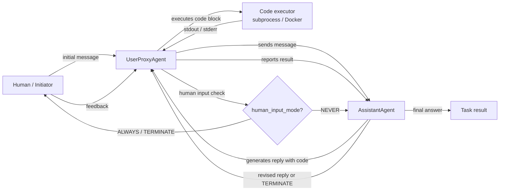

# AutoGen

## 定义

AutoGen 是微软研究院开发的开源框架，用于构建**多代理对话式 AI 系统**。其核心理念很简单：代理通过在结构化对话中交换消息来进行通信，框架负责处理路由、轮次控制和终止逻辑。与 CrewAI 等将代理定义为具有任务角色的框架不同，AutoGen 代理主要由其**对话行为**来定义——它们如何响应消息、是否能执行代码，以及何时将控制权移交给另一个代理或人类。

框架最重要的原语是 `ConversableAgent`——一个可以根据配置扮演任何角色的基类。两个专门化子类涵盖了最常见的模式：`AssistantAgent`（由 LLM 支持，以计划和代码进行响应）和 `UserProxyAgent`（可选由人工或代码执行器支持，在本地运行代码并反馈结果）。这种双代理模式开箱即用非常强大：您得到一个代码编写循环，助手提出解决方案，代理执行并报告结果，无需额外的脚手架。

AutoGen 还支持**群聊**，三个或更多代理在由 `GroupChatManager` 管理的共享对话中轮流发言。这支持专家小组、辩论循环和模块化流水线等模式，其中每个代理处理特定步骤。人机协作是一等功能：`UserProxyAgent` 可以在任何时刻暂停并向人类寻求输入，非常适合您希望在中途检查或重定向代理的研究和实验工作流程。

## 工作原理

### ConversableAgent：通用构建块

`ConversableAgent` 是所有 AutoGen 代理的基类。它持有系统消息、可选的 LLM 配置、注册函数（工具）列表以及一组关于何时终止对话的规则（`is_termination_msg`）。每个代理都有一个 `generate_reply` 方法，根据对话历史决定接下来发送什么消息。代理可以被设置为人工代理（暂停并请求输入）、LLM 代理（使用 LLM 生成回复）或执行器代理（无需 LLM 调用即运行代码）。这种灵活性意味着单一基类涵盖了从完全自动化到完全手动代理的整个范围。

### AssistantAgent 和 UserProxyAgent

`AssistantAgent` 是预配置为有用 AI 助手的 `ConversableAgent`：它有一个默认系统消息，鼓励它为需要计算的任务提出 Python 代码块。`UserProxyAgent` 预配置为在本地 Docker 容器或子进程中执行代码块、报告结果，并在无法自动继续时可选地向人类请求输入。它们共同构成了典型的 AutoGen 双代理循环：助手建议代码，代理运行它，输出反馈给助手，循环继续直到任务完成或触发终止条件。这种模式对于数据分析、自动化脚本编写和机器学习实验特别强大。

### 群聊和 GroupChatManager

对于包含三个或更多代理的工作流，AutoGen 提供 `GroupChat` 和 `GroupChatManager`。`GroupChat` 保存参与代理列表和共享消息历史。`GroupChatManager` 本身是一个 `ConversableAgent`，充当主持人：在每条消息之后，它选择下一个发言者（通过轮询规则、自定义选择器函数或基于 LLM 的选择策略）。群聊支持研究员、程序员和审查员轮流发言的专家小组模式，或每个代理处理一个阶段的多步骤流水线。管理器还可以在满足全局条件时终止对话。

### 代码执行和人机协作

AutoGen 的代码执行层是可配置的：代理可以在本地（子进程）、Docker 容器（隔离）或通过自定义执行器运行代码。当 `human_input_mode="NEVER"` 时，`UserProxyAgent` 会自动检测并执行助手消息中的代码块。将 `human_input_mode` 设置为 `"ALWAYS"` 或 `"TERMINATE"` 会在执行前需要人工批准，从而为生产或敏感工作流启用安全的人机协作模式。这使 AutoGen 特别适合代理编码任务、数据科学自动化以及希望人类在结果生效前审查输出的研究环境。



## 适用场景 / 不适用场景

| 适用场景 | 不适用场景 |
|---|---|
| 您需要代理在工作流中编写和执行代码 | 不需要代码执行且对话开销不必要 |
| 您希望在可配置的检查点进行人机协作 | 完全自动化的流水线，不需要人工干预 |
| 您的工作流涉及研究、实验或迭代优化 | 您需要声明式、有主见的 API——AutoGen 需要更多手动配置 |
| 您希望使用多代理专家小组或辩论模式（群聊） | 您需要确定性、可测试的流水线——非确定性对话更难进行单元测试 |
| 您正在原型化代理编码助手或数据科学自动化 | 生产延迟至关重要——多轮对话循环会增加显著开销 |

## 比较

| 标准 | AutoGen | CrewAI | LangGraph |
|---|---|---|---|
| **核心隐喻** | 代理作为对话参与者 | 代理作为角色扮演的团队成员 | 代理行为作为有状态图 |
| **状态管理** | 隐式：GroupChat 中的共享消息历史 | 隐式：任务上下文和团队内存 | 显式：跨节点共享的 TypedDict 状态 |
| **代码执行** | 一等功能：UserProxyAgent 自动执行代码块 | 仅通过外部工具 | 通过图中的工具节点 |
| **人机协作** | 一等功能：每个代理上的 `human_input_mode` | 有限：仅手动干预 | 一等功能：图节点上的 `interrupt_before` / `interrupt_after` |
| **学习曲线** | 中等：对 Python 开发者直觉上易于理解，但群聊路由可能复杂 | 低：声明式 API 易于学习 | 高：需要基于图的思维方式 |

## 代码示例

```python
import os
import autogen

# --- LLM configuration ---
# AutoGen uses a list of configs for load balancing / fallback.
# Set your OPENAI_API_KEY or use an Anthropic-compatible config.
llm_config = {
    "config_list": [
        {
            "model": "gpt-4o",
            "api_key": os.environ.get("OPENAI_API_KEY"),
        }
    ],
    "temperature": 0.1,
    "timeout": 120,
}

# --- Two-agent pattern: AssistantAgent + UserProxyAgent ---
# The assistant writes code; the proxy executes it and reports results.

assistant = autogen.AssistantAgent(
    name="data_analyst",
    system_message=(
        "You are a data analysis expert. When given a task, write Python code to solve it. "
        "Always verify your results by printing them. "
        "Reply TERMINATE when the task is fully complete."
    ),
    llm_config=llm_config,
)

user_proxy = autogen.UserProxyAgent(
    name="user_proxy",
    human_input_mode="NEVER",       # fully automated; change to "ALWAYS" for human review
    max_consecutive_auto_reply=10,  # safety limit on auto-replies
    is_termination_msg=lambda msg: "TERMINATE" in msg.get("content", ""),
    code_execution_config={
        "work_dir": "/tmp/autogen_workspace",
        "use_docker": False,         # set True to execute in an isolated Docker container
    },
)

# Kick off the two-agent conversation
user_proxy.initiate_chat(
    assistant,
    message=(
        "Analyze the following data and compute the mean, median, and standard deviation. "
        "Data: [12, 45, 23, 67, 34, 89, 11, 56, 78, 42]"
    ),
)


# --- Group chat pattern: researcher, coder, reviewer ---
# Three specialized agents collaborate on a more complex task.

researcher = autogen.AssistantAgent(
    name="researcher",
    system_message=(
        "You are a research specialist. Find information and summarize findings. "
        "Do not write code — delegate code tasks to the coder."
    ),
    llm_config=llm_config,
)

coder = autogen.AssistantAgent(
    name="coder",
    system_message=(
        "You are a Python expert. Write clean, well-commented code when asked. "
        "Always include error handling and print results clearly."
    ),
    llm_config=llm_config,
)

reviewer = autogen.AssistantAgent(
    name="reviewer",
    system_message=(
        "You are a critical reviewer. After the researcher and coder have finished, "
        "review the outputs for accuracy and completeness. "
        "Reply TERMINATE when you are satisfied with the result."
    ),
    llm_config=llm_config,
)

group_proxy = autogen.UserProxyAgent(
    name="group_proxy",
    human_input_mode="NEVER",
    max_consecutive_auto_reply=15,
    is_termination_msg=lambda msg: "TERMINATE" in msg.get("content", ""),
    code_execution_config={"work_dir": "/tmp/autogen_group", "use_docker": False},
)

# GroupChat manages turn order and shared message history
group_chat = autogen.GroupChat(
    agents=[group_proxy, researcher, coder, reviewer],
    messages=[],
    max_round=12,
    speaker_selection_method="auto",  # LLM-based speaker selection
)

manager = autogen.GroupChatManager(
    groupchat=group_chat,
    llm_config=llm_config,
)

group_proxy.initiate_chat(
    manager,
    message=(
        "Research the top 3 Python libraries for data visualization in 2025. "
        "Then write a code example using the most popular one to plot a bar chart."
    ),
)
```

## 实用资源

- [AutoGen 官方文档](https://microsoft.github.io/autogen/) — 完整的框架参考，涵盖代理、群聊、代码执行和工具使用。
- [AutoGen GitHub 仓库](https://github.com/microsoft/autogen) — 源代码、问题跟踪器和丰富的示例笔记本。
- [AutoGen 论文："AutoGen: Enabling Next-Gen LLM Applications via Multi-Agent Conversation"（Wu 等人，2023）](https://arxiv.org/abs/2308.08155) — 激发对话驱动多代理设计的原始研究论文。
- [AutoGen Studio](https://microsoft.github.io/autogen/docs/autogen-studio/getting-started) — 用于构建和测试 AutoGen 工作流的无代码 UI，适合原型设计。

## 另请参阅

- [代理框架概述](/docs/agents/frameworks-overview)
- [CrewAI](/docs/agents/crewai)
- [LangGraph](/docs/agents/langgraph)
- [多代理系统](/docs/agents/multi-agent-systems)
- [AI 代理](/docs/agents)
