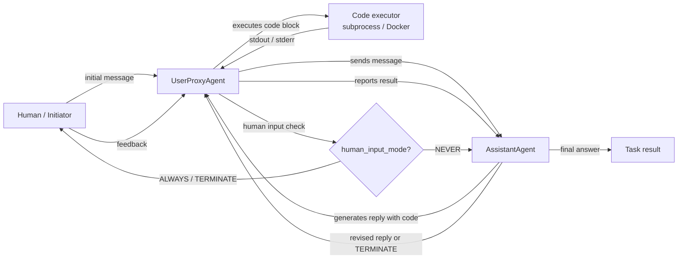

# AutoGen

## 定义

AutoGen 是由 Microsoft Research 开发的开源框架，用于构建**多代理对话式 AI 系统**。其核心理念简单：代理通过在结构化对话中交换消息进行通信，框架处理路由、轮流和终止逻辑。与 CrewAI 等将代理定义为具有任务的角色的基于角色的框架不同，AutoGen 代理主要由其**对话行为**定义——它们如何响应消息、是否可以执行代码，以及何时将控制权移交给另一个代理或人类。

框架最重要的基本组件是 `ConversableAgent`——一个可以根据配置扮演任何角色的基类。两个特化版本涵盖最常见的模式：`AssistantAgent`（由 LLM 支持，用计划和代码响应）和 `UserProxyAgent`（可选地由人类或代码执行器支持，在本地运行代码并反馈结果）。这种双代理模式开箱即用非常强大：您可以获得一个代码编写循环，其中助手提出解决方案，代理执行并报告结果，无需额外的脚手架。

AutoGen 还支持**群聊**，三个或更多代理轮流为由 `GroupChatManager` 管理的共享对话做出贡献。Human-in-the-loop 是一等功能：`UserProxyAgent` 可以暂停并在任何时候请求人类输入，使其非常适合研究和实验工作流程。

## 工作原理

### ConversableAgent：通用构建块

`ConversableAgent` 是所有 AutoGen 代理的基类。它包含系统消息、可选的 LLM 配置、已注册函数（工具）列表以及一组关于何时终止对话的规则（`is_termination_msg`）。每个代理都有一个 `generate_reply` 方法，根据对话历史决定下一步发送什么消息。代理可以设为人类代理（暂停并请求输入）、LLM 代理（使用 LLM 生成回复）或执行器代理（不进行 LLM 调用就执行代码）。这种灵活性意味着单个基类涵盖了从完全自动化到完全手动的整个代理范围。

### AssistantAgent 和 UserProxyAgent

`AssistantAgent` 是预配置为有用 AI 助手的 `ConversableAgent`：它有一个默认系统消息，鼓励其为需要计算的任务提议 Python 代码块。`UserProxyAgent` 被预配置为在本地 Docker 容器或子进程中执行代码块、报告结果，以及在无法自动继续时可选地请求人类输入。两者共同形成了经典的 AutoGen 双代理循环：助手建议代码，代理运行它，输出反馈给助手，循环继续直到任务完成或触发终止条件。这种模式对数据分析、自动化脚本和 ML 实验特别有效。

### 群聊和 GroupChatManager

对于包含三个或更多代理的工作流，AutoGen 提供 `GroupChat` 和 `GroupChatManager`。`GroupChat` 保存参与代理列表和共享消息历史。`GroupChatManager` 本身是一个充当主持人的 `ConversableAgent`：在每条消息之后，它选择下一个发言者（通过轮询规则、自定义选择函数或基于 LLM 的选择策略）。群聊支持专家小组模式，其中研究人员、程序员和审查员轮流发言，或多步骤流水线，每个代理处理一个阶段。

### 代码执行和 Human-in-the-Loop

AutoGen 的代码执行层是可配置的：代理可以在本地（子进程）、Docker 容器（隔离）或通过自定义执行器运行代码。`UserProxyAgent` 检测助手消息中的代码块，当 `human_input_mode="NEVER"` 时自动执行它们。将 `human_input_mode` 设置为 `"ALWAYS"` 或 `"TERMINATE"` 会在执行前加入人类批准，为生产或敏感工作流启用安全的 human-in-the-loop 模式。



## 何时使用 / 何时不使用

| 使用场景 | 避免场景 |
|---|---|
| 您需要将代码编写和执行作为工作流一部分的代理 | 不需要代码执行且对话开销不受欢迎时 |
| 您希望在可配置的检查点实现 human-in-the-loop | 完全自动化的流水线，不希望人工干预 |
| 您的工作流涉及研究、实验或迭代改进 | 您需要声明式、有主见的 API——AutoGen 需要更多手动配置 |
| 您想要多代理专家小组或辩论模式（群聊） | 您需要确定性、可测试的流水线——非确定性对话流更难进行单元测试 |
| 您在对代理编码助手或数据科学自动化进行原型设计 | 生产延迟至关重要——多轮对话循环会增加大量开销 |

## 比较

| 标准 | AutoGen | CrewAI | LangGraph |
|---|---|---|---|
| **核心隐喻** | 代理作为对话参与者 | 代理作为扮演角色的船员 | 代理行为作为有状态图 |
| **状态管理** | 隐式：GroupChat 中的共享消息历史 | 隐式：任务上下文和船员记忆 | 显式：跨所有节点共享的 TypedDict 状态 |
| **代码执行** | 一等功能：UserProxyAgent 自动执行代码块 | 仅通过外部工具 | 通过图中的工具节点 |
| **Human-in-the-Loop** | 一等功能：每个代理上的 `human_input_mode` | 有限：仅手动干预 | 一等功能：图节点上的 `interrupt_before` / `interrupt_after` |
| **学习曲线** | 中等：对 Python 开发者直观，但群聊路由可能复杂 | 低：声明式 API 易于学习 | 高：需要基于图的思维方式 |

## 代码示例

```python
import os
import autogen

# --- LLM configuration ---
# AutoGen uses a list of configs for load balancing / fallback.
# Set your OPENAI_API_KEY or use an Anthropic-compatible config.
llm_config = {
    "config_list": [
        {
            "model": "gpt-4o",
            "api_key": os.environ.get("OPENAI_API_KEY"),
        }
    ],
    "temperature": 0.1,
    "timeout": 120,
}

# --- Two-agent pattern: AssistantAgent + UserProxyAgent ---
# The assistant writes code; the proxy executes it and reports results.

assistant = autogen.AssistantAgent(
    name="data_analyst",
    system_message=(
        "You are a data analysis expert. When given a task, write Python code to solve it. "
        "Always verify your results by printing them. "
        "Reply TERMINATE when the task is fully complete."
    ),
    llm_config=llm_config,
)

user_proxy = autogen.UserProxyAgent(
    name="user_proxy",
    human_input_mode="NEVER",       # fully automated; change to "ALWAYS" for human review
    max_consecutive_auto_reply=10,  # safety limit on auto-replies
    is_termination_msg=lambda msg: "TERMINATE" in msg.get("content", ""),
    code_execution_config={
        "work_dir": "/tmp/autogen_workspace",
        "use_docker": False,         # set True to execute in an isolated Docker container
    },
)

# Kick off the two-agent conversation
user_proxy.initiate_chat(
    assistant,
    message=(
        "Analyze the following data and compute the mean, median, and standard deviation. "
        "Data: [12, 45, 23, 67, 34, 89, 11, 56, 78, 42]"
    ),
)


# --- Group chat pattern: researcher, coder, reviewer ---
# Three specialized agents collaborate on a more complex task.

researcher = autogen.AssistantAgent(
    name="researcher",
    system_message=(
        "You are a research specialist. Find information and summarize findings. "
        "Do not write code — delegate code tasks to the coder."
    ),
    llm_config=llm_config,
)

coder = autogen.AssistantAgent(
    name="coder",
    system_message=(
        "You are a Python expert. Write clean, well-commented code when asked. "
        "Always include error handling and print results clearly."
    ),
    llm_config=llm_config,
)

reviewer = autogen.AssistantAgent(
    name="reviewer",
    system_message=(
        "You are a critical reviewer. After the researcher and coder have finished, "
        "review the outputs for accuracy and completeness. "
        "Reply TERMINATE when you are satisfied with the result."
    ),
    llm_config=llm_config,
)

group_proxy = autogen.UserProxyAgent(
    name="group_proxy",
    human_input_mode="NEVER",
    max_consecutive_auto_reply=15,
    is_termination_msg=lambda msg: "TERMINATE" in msg.get("content", ""),
    code_execution_config={"work_dir": "/tmp/autogen_group", "use_docker": False},
)

# GroupChat manages turn order and shared message history
group_chat = autogen.GroupChat(
    agents=[group_proxy, researcher, coder, reviewer],
    messages=[],
    max_round=12,
    speaker_selection_method="auto",  # LLM-based speaker selection
)

manager = autogen.GroupChatManager(
    groupchat=group_chat,
    llm_config=llm_config,
)

group_proxy.initiate_chat(
    manager,
    message=(
        "Research the top 3 Python libraries for data visualization in 2025. "
        "Then write a code example using the most popular one to plot a bar chart."
    ),
)
```

## 实用资源

- [AutoGen 官方文档](https://microsoft.github.io/autogen/) — 涵盖代理、群聊、代码执行和工具使用的完整框架参考。
- [AutoGen GitHub 仓库](https://github.com/microsoft/autogen) — 源代码、问题跟踪器和丰富的示例笔记本集合。
- [AutoGen 论文："AutoGen: Enabling Next-Gen LLM Applications via Multi-Agent Conversation"（Wu 等，2023）](https://arxiv.org/abs/2308.08155) — 激发对话驱动多代理设计的原始研究论文。
- [AutoGen Studio](https://microsoft.github.io/autogen/docs/autogen-studio/getting-started) — 用于构建和测试 AutoGen 工作流的无代码界面，适用于原型设计。

## 另请参阅

- [代理框架概述](/docs/agents/frameworks-overview)
- [CrewAI](/docs/agents/crewai)
- [LangGraph](/docs/agents/langgraph)
- [多代理系统](/docs/agents/multi-agent-systems)
- [AI 代理](/docs/agents)
