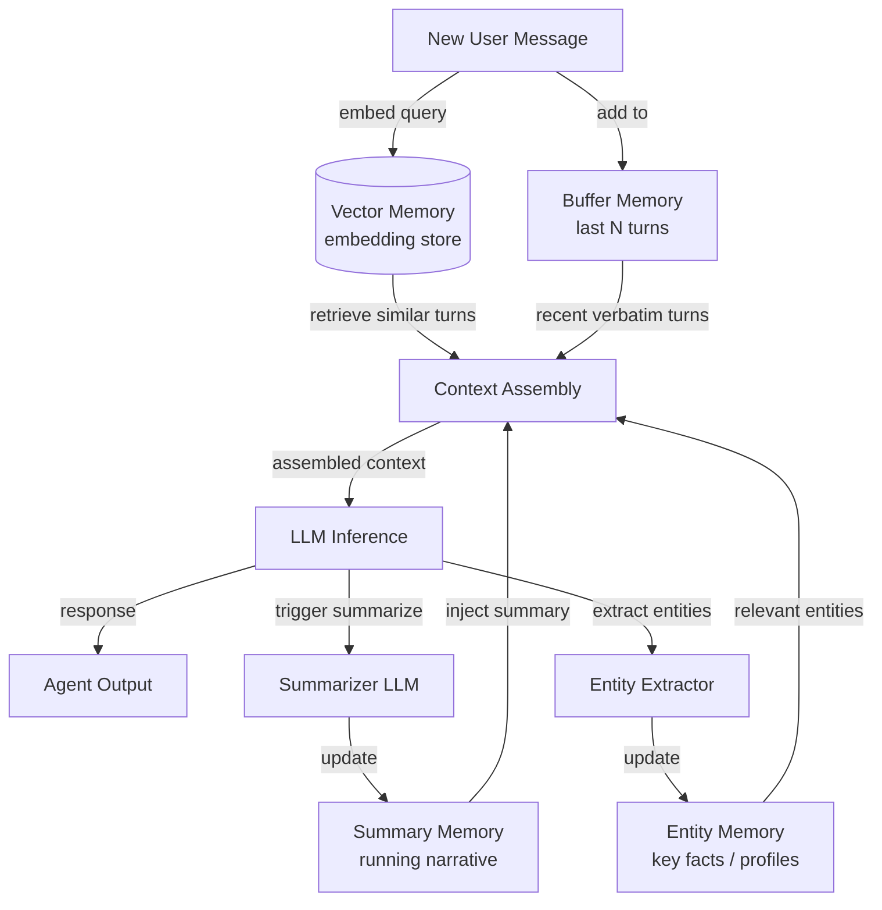

# 对话记忆

## 定义

对话记忆是指允许聊天代理在对话中保留和利用先前轮次信息的一组技术。与检索增强生成（引入外部文档）不同，对话记忆专门关注用户和代理之间已经说过的内容。正确处理这一点是区分令人沮丧的聊天机器人（要求你重复）和感觉真正专注的代理的关键。

管理对话历史有几种不同的策略，每种策略在成本、保真度和可扩展性之间有不同的权衡。最简单的方法——逐字保留每条消息——对短对话效果很好，但很快会耗尽模型的上下文窗口。更复杂的模式使用摘要或语义索引来压缩或选择性地检索当前轮次最相关的历史。

选择正确的记忆模式在很大程度上取决于预期的对话长度、精确措辞相对于语义含义的重要性，以及部署的成本约束。在实践中，生产聊天代理经常结合两种或更多模式：用于即时连贯性的短期逐字缓冲区和用于长期回忆的摘要或向量层。

## 工作原理

### 缓冲记忆

缓冲记忆是最直接的模式：代理维护最近 N 条消息对的有序列表，并将它们预置到每个新的上下文窗口中。当缓冲区达到容量时，最旧的对被丢弃（FIFO）。这确保代理始终可以访问最近的交流，无需任何转换或有损压缩。缓冲记忆非常适合中短对话，不会产生额外的 LLM 调用。其主要弱点是较旧的上下文会悄无声息地丢失，没有任何摘要。

### 摘要记忆

摘要记忆通过使用 LLM 定期生成到目前为止对话的运行摘要来解决遗忘问题。当缓冲区增长过大时，代理将其压缩成简洁的叙述——捕获关键事实、决策和情感——然后丢弃原始消息。摘要占用的 token 远少于原始轮次，使长对话变得可管理。权衡是每个摘要步骤需要一个次级 LLM 调用，这增加了延迟和成本。

### 向量记忆

向量记忆嵌入每个对话轮次并将其存储在向量数据库中。在每个新轮次，通过相似性搜索检索语义上最相关的过去交流，并将其注入上下文窗口。当对话非常长或当前问题涉及很多轮次之前说过的内容时，这种模式表现出色。向量记忆需要嵌入基础设施并引入检索延迟。

### 实体记忆

实体记忆从对话中提取命名实体——人、地点、产品、偏好——并维护代理对每个实体知晓内容的结构化记录。当再次提及某个实体时，其存储的档案被注入上下文。实体记忆非常适合个人助手用例，在那里记住"Alice 偏好早上开会"或"项目截止日期是 6 月 10 日"比记住过去消息的确切措辞更有价值。



## 何时使用 / 何时不使用

| 使用场景 | 避免场景 |
|---|---|
| 对话超过几个轮次 | 任务是无需历史的单轮 |
| 用户期望代理记住他们之前说过的内容 | 出于隐私或合规原因无法存储对话数据 |
| 上下文窗口成本显著且历史很长 | 对话总是短到可以完全放入上下文窗口 |
| 用户在整个会话中讨论多个实体或主题 | 摘要延迟对用例不可接受 |
| 需要跨会话回忆（向量/实体模式） | 增加的基础设施复杂性超过保真度收益 |

## 比较

| 标准 | 缓冲记忆 | 摘要记忆 | 向量记忆 |
|---|---|---|---|
| 每轮成本 | 低（无额外 LLM 调用） | 中（偶尔的摘要器调用） | 中（嵌入调用 + DB 查询） |
| 回忆保真度 | 精确但限于最近 N 轮 | 较旧轮次的有损压缩 | 对语义相关内容较高 |
| 上下文长度处理 | 差——最旧的轮次被悄悄丢弃 | 好——摘要压缩旧轮次 | 优秀——只检索相关片段 |
| 延迟 | 最小 | 适中（摘要增加一个步骤） | 适中（嵌入 + 最近邻搜索） |
| 跨会话回忆 | 否（内存缓冲区） | 如果摘要被持久化则可能 | 是（向量存储是持久化的） |
| 实现复杂度 | 非常低 | 低–中 | 中–高 |

## 代码示例

```python
"""
Conversational memory patterns using LangChain.

Demonstrates:
1. ConversationBufferMemory  — keep verbatim last N messages
2. ConversationSummaryMemory — compress history into a running summary
3. ConversationBufferWindowMemory — sliding window variant
"""
# pip install langchain langchain-openai openai
from langchain.memory import (
    ConversationBufferMemory,
    ConversationSummaryMemory,
    ConversationBufferWindowMemory,
)
from langchain.chains import ConversationChain
from langchain_openai import ChatOpenAI


# ---------------------------------------------------------------------------
# 1. Buffer memory — keeps ALL messages (use for short conversations)
# ---------------------------------------------------------------------------
def demo_buffer_memory():
    llm = ChatOpenAI(model="gpt-4o-mini", temperature=0)
    memory = ConversationBufferMemory(return_messages=True)
    chain = ConversationChain(llm=llm, memory=memory, verbose=False)

    reply1 = chain.predict(input="My name is Alice. I enjoy hiking.")
    reply2 = chain.predict(input="What outdoor activities would you recommend for me?")

    # The second call has access to the first turn verbatim
    print("Buffer memory — reply 2:", reply2)
    print("History length:", len(memory.chat_memory.messages), "messages\n")


# ---------------------------------------------------------------------------
# 2. Summary memory — LLM compresses history on each turn
# ---------------------------------------------------------------------------
def demo_summary_memory():
    llm = ChatOpenAI(model="gpt-4o-mini", temperature=0)
    # The same LLM is used to generate summaries; you can use a cheaper model here
    memory = ConversationSummaryMemory(llm=llm, return_messages=True)
    chain = ConversationChain(llm=llm, memory=memory, verbose=False)

    chain.predict(input="I'm planning a trip to Japan next spring.")
    chain.predict(input="I'm most interested in traditional temples and local food.")
    reply3 = chain.predict(input="Can you suggest a one-week itinerary?")

    print("Summary memory — reply 3:", reply3)
    # The buffer contains only the latest summary, not all past raw messages
    print("Summary:", memory.moving_summary_buffer[:200], "...\n")


# ---------------------------------------------------------------------------
# 3. Window memory — keeps only the last k turns (sliding window)
# ---------------------------------------------------------------------------
def demo_window_memory(k: int = 3):
    llm = ChatOpenAI(model="gpt-4o-mini", temperature=0)
    # k=3 means only the last 3 HumanMessage+AIMessage pairs are retained
    memory = ConversationBufferWindowMemory(k=k, return_messages=True)
    chain = ConversationChain(llm=llm, memory=memory, verbose=False)

    for i in range(6):
        reply = chain.predict(input=f"This is message number {i + 1}.")
        print(f"Turn {i + 1}: {reply[:80]}")

    print(
        f"\nWindow memory keeps {len(memory.chat_memory.messages)} messages "
        f"(max {k * 2} for k={k} turn pairs)\n"
    )


# ---------------------------------------------------------------------------
# Manual entity-style memory (illustrative, no extra dependency)
# ---------------------------------------------------------------------------
def demo_entity_memory_manual():
    """
    Minimal entity memory: parse key facts from each turn and inject them.
    In production, use LangChain's ConversationEntityMemory or a dedicated NER model.
    """
    entity_store: dict[str, str] = {}

    def extract_entities_mock(text: str) -> dict[str, str]:
        """Mock extraction — real impl would call an LLM or NER model."""
        entities = {}
        if "my name is" in text.lower():
            name = text.lower().split("my name is")[-1].strip().split()[0].rstrip(".,")
            entities["user_name"] = name.capitalize()
        if "deadline" in text.lower():
            entities["deadline"] = "mentioned but not parsed in this mock"
        return entities

    turns = [
        ("user", "My name is Bob and my project deadline is end of July."),
        ("user", "Can you help me prioritize my tasks?"),
    ]
    for role, msg in turns:
        entity_store.update(extract_entities_mock(msg))
        entity_context = "; ".join(f"{k}={v}" for k, v in entity_store.items())
        print(f"[{role}] {msg}")
        print(f"  Entity context injected: {entity_context}\n")


if __name__ == "__main__":
    import os

    if os.getenv("OPENAI_API_KEY"):
        demo_buffer_memory()
        demo_summary_memory()
        demo_window_memory()
    else:
        print("Set OPENAI_API_KEY to run LangChain demos.")
    demo_entity_memory_manual()
```

## 实用资源

- [LangChain 记忆文档](https://python.langchain.com/docs/concepts/memory/) — 所有 LangChain 记忆类的综合参考，包含使用示例。
- [Rethinking Memory in Conversational AI（Lilian Weng）](https://lilianweng.github.io/posts/2023-06-23-agent/#memory) — 深度博客文章，涵盖代理系统中的记忆分类和设计权衡。
- [MemoryOS: Memory-based Operating System for LLM Agents](https://arxiv.org/abs/2506.06326) — 受 OS 设计启发的分层记忆管理研究。
- [OpenAI Assistants Thread Management](https://platform.openai.com/docs/assistants/how-it-works/managing-threads) — OpenAI 的托管 API 如何处理持久对话线程。

## 另请参阅

- [代理记忆](/docs/agents/memory)
- [AI 代理](/docs/agents)
- [RAG 嵌入](/docs/rag/embeddings)
