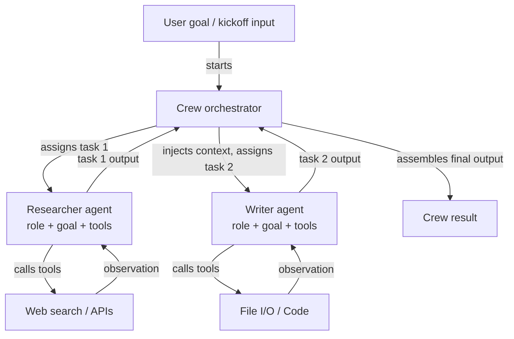

# CrewAI

## 定义

CrewAI 是一个用于编排**基于角色的多代理系统**的开源 Python 框架。团队中的每个代理由三个要素定义：**角色**（代理的职责，例如"高级研究员"）、**目标**（代理试图实现的目标，例如"找到准确且最新的信息"）和**背景故事**（塑造代理行为和语气的角色描述）。这种结构使代理行为易于指定且易于理解——它模仿了您如何为人类团队成员入职。

CrewAI 中的任务是分配给代理的离散工作单元。任务有描述、预期输出，并可选择包含来自先前任务的上下文。任务被分组到一个**团队（Crew）**中，它定义了执行流程：**顺序**（任务依次运行，每个任务的输出传入下一个）或**层级**（管理代理委派并协调工人之间的任务）。这种声明式模型抽象了消息传递循环，让开发者专注于*需要做什么*，而不是*代理如何相互交谈*。

CrewAI 内置工具集成，支持 LangChain 工具、用 `@tool` 装饰的自定义 Python 函数以及不断增长的内置工具库（网页搜索、文件 I/O、代码执行）。代理还可以获得记忆（短期、长期、实体记忆），以在任务执行和团队运行之间维持上下文。

## 工作原理

### 代理：角色、目标和背景故事

代理是 CrewAI 中的基本工作单元。您使用角色、目标和背景故事实例化一个 `Agent`，以及可选的工具和 LLM 覆盖。背景故事为代理的系统提示设定基调，在所有任务交互中给予其一致的角色。代理可以配置 `verbose=True` 以展示其内部推理步骤。每个代理在团队的编排层内独立运行，从流程管理器接收任务并返回结构化输出。代理记忆（启用时）在任务之间持久保存观察结果，这对于长期运行的研究或分析工作流至关重要。

### 任务：描述、预期输出和上下文

`Task` 对象描述代理必须做什么、好的输出是什么样子，以及哪个代理应该执行它。任务可以声明对其他任务的 `context` 依赖，使其输出自动注入为上下文。预期输出描述引导 LLM 产生结构化、可用的结果。任务支持输出格式：纯文本、通过 Pydantic 模型的 JSON 或文件输出。使用层级流程时，管理代理使用任务描述来动态决定分配和排序，无需开发者硬编码依赖项。

### 流程：顺序和层级

`Crew` 对象将代理和任务联系在一起，并指定一个 `Process`。在 `Process.sequential` 中，任务按列表顺序执行，每个任务的输出传递给下一个。在 `Process.hierarchical` 中，自动实例化一个管理 LLM 来分解目标、分配工作和审查结果——无需显式布线即可实现自然涌现的协调。顺序流程可预测且易于测试；层级流程更灵活但确定性较低。选择取决于您的工作流是否有固定的 DAG（顺序）或需要动态任务分配（层级）。

### 内置工具集成

CrewAI 附带一个与 LangChain 工具兼容的 `@tool` 装饰器，可以轻松为代理配备网页搜索（SerperDev、DuckDuckGo）、代码执行、文件读/写和自定义 API 调用。工具按代理注册，因此研究代理可以拥有搜索工具，而写作代理拥有文件工具。工具描述包含在代理的提示中，框架透明地处理工具调用循环。对于生产使用，`CrewAI Tools` 包提供了一套精心策划的预构建集成。



## 适用场景 / 不适用场景

| 适用场景 | 不适用场景 |
|---|---|
| 您的问题自然映射到不同的人类角色（研究员、写作者、审查员） | 您只需要一个带有工具的单一代理——CrewAI 的开销是不必要的 |
| 您想要一个隐藏消息传递复杂性的声明式高级 API | 您需要精确控制代理之间交换的每条消息 |
| 您在构建内容流水线、研究工作流或分析系统 | 您的工作流需要顺序/层级不支持的复杂条件分支或循环 |
| 您希望内置记忆和工具集成，配置最少 | 实时延迟至关重要——多代理顺序运行增加开销 |
| 您的团队在代理框架方面不是专家，需要直觉式 API | 您需要对图级别的每个代理交互进行细粒度可观测性 |

## 比较

| 标准 | CrewAI | AutoGen | LangGraph |
|---|---|---|---|
| **抽象级别** | 高：声明式角色、目标、任务 | 中：基于消息的 API 的对话代理 | 低：显式图节点和边 |
| **多代理模型** | 基于角色的团队，顺序或层级流程 | 对话驱动的代理对或群聊 | 子图；每个代理有多个节点的单一有状态图 |
| **状态管理** | 隐式：通过任务上下文和团队记忆传递 | 隐式：消息历史 | 显式：跨所有节点共享的 TypedDict 状态 |
| **设置难易程度** | 非常容易：10-20 行代码即可构建有效的多代理团队 | 中等：需要理解代理类型和启动模式 | 较难：需要图构建思维模型 |
| **条件/循环流程** | 有限：顺序是线性的，层级是不透明的 | 有限：取决于代理响应 | 一等功能：条件边和循环是核心特性 |

## 代码示例

```python
import os
from crewai import Agent, Task, Crew, Process
from crewai_tools import SerperDevTool

# --- Tool setup ---
# Requires SERPER_API_KEY environment variable for web search
search_tool = SerperDevTool()

# --- Agent definitions ---
# Each agent has a role, a goal that guides its behavior, and a backstory
# that sets its persona. Tools are assigned per-agent.

researcher = Agent(
    role="Senior AI Research Analyst",
    goal="Uncover the latest developments and practical applications of AI agent frameworks",
    backstory=(
        "You are an expert AI researcher with 10 years of experience evaluating "
        "LLM frameworks. You excel at finding accurate, up-to-date information "
        "and synthesizing it into clear technical summaries."
    ),
    tools=[search_tool],
    verbose=True,  # shows reasoning steps
    allow_delegation=False,
)

writer = Agent(
    role="Technical Content Writer",
    goal="Transform technical research into clear, engaging documentation",
    backstory=(
        "You are a seasoned technical writer who specializes in AI and machine learning. "
        "You turn dense research into accessible content without losing precision."
    ),
    tools=[],  # writer does not need search tools
    verbose=True,
)

reviewer = Agent(
    role="Editorial Reviewer",
    goal="Ensure accuracy, clarity, and completeness of technical content",
    backstory=(
        "You are a detail-oriented editor with a background in computer science. "
        "You catch technical inaccuracies, improve clarity, and verify all claims."
    ),
    verbose=True,
)

# --- Task definitions ---
# Tasks describe what to do, what output to expect, and which agent executes them.
# Context dependencies are declared explicitly.

research_task = Task(
    description=(
        "Research the current state of AI agent frameworks in 2024-2025. "
        "Focus on CrewAI, AutoGen, LangGraph, and Anthropic Tool Use. "
        "Cover: architecture, use cases, community size, and key differentiators."
    ),
    expected_output=(
        "A structured research report with sections for each framework, "
        "covering architecture, strengths, weaknesses, and best use cases. "
        "Include specific version numbers and recent updates where available."
    ),
    agent=researcher,
)

writing_task = Task(
    description=(
        "Using the research report, write a 500-word technical blog post comparing "
        "the four agent frameworks. Target audience: senior software engineers "
        "who are evaluating frameworks for production use."
    ),
    expected_output=(
        "A well-structured blog post with an introduction, per-framework sections, "
        "a comparison table, and a recommendation section. "
        "Use clear headings and avoid jargon where possible."
    ),
    agent=writer,
    context=[research_task],  # injects research_task output as context
)

review_task = Task(
    description=(
        "Review the blog post for technical accuracy, clarity, and completeness. "
        "Fix any errors and improve readability without changing the core content."
    ),
    expected_output=(
        "A polished, publication-ready blog post with all inaccuracies corrected "
        "and prose improved. Return the full revised text."
    ),
    agent=reviewer,
    context=[writing_task],
)

# --- Crew assembly ---
# Process.sequential runs tasks in order, passing outputs as context.
# Switch to Process.hierarchical for dynamic task allocation by a manager LLM.

crew = Crew(
    agents=[researcher, writer, reviewer],
    tasks=[research_task, writing_task, review_task],
    process=Process.sequential,
    verbose=True,
)

# --- Execution ---
result = crew.kickoff(inputs={"topic": "AI agent frameworks comparison 2025"})
print(result.raw)
```

## 实用资源

- [CrewAI 官方文档](https://docs.crewai.com/) — 完整参考，涵盖代理、任务、团队、流程、工具和记忆配置。
- [CrewAI GitHub 仓库](https://github.com/crewAIInc/crewAI) — 开源框架的源代码、示例和问题跟踪器。
- [CrewAI 工具文档](https://docs.crewai.com/concepts/tools) — 预构建工具集成：网页搜索、文件 I/O、代码执行和自定义工具创建。
- [CrewAI + LangChain 集成指南](https://docs.crewai.com/how-to/llm-connections) — 如何配置不同的 LLM 提供商，包括 OpenAI、Anthropic 和本地模型。

## 另请参阅

- [代理框架概述](/docs/agents/frameworks-overview)
- [AutoGen](/docs/agents/autogen)
- [LangGraph](/docs/agents/langgraph)
- [多代理系统](/docs/agents/multi-agent-systems)
- [AI 代理](/docs/agents)
