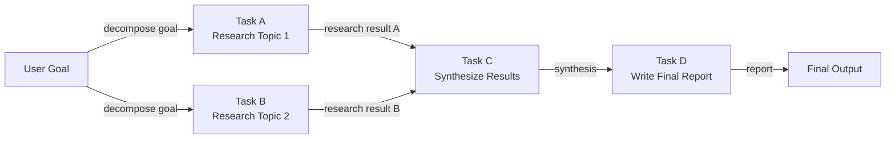

# 基于 DAG 的代理

## 定义

基于 DAG 的代理将其工作组织为**有向无环图（DAG）**：一组节点（任务或代理步骤）通过有向边连接，编码节点间的依赖关系。"无环"意味着没有循环依赖——执行严格地从输入流向输出。与顺序流水线相比，关键优势是**独立节点可以并行执行**，从而大幅减少复杂多步骤工作流的挂钟时间。

在实践中，DAG 中的每个节点可以是 LLM 调用、工具调用、数据转换，甚至是子代理。一旦所有前驱节点成功完成，节点就会触发，将它们的输出作为输入传入。这个模型自然地映射到竞争分析（并行研究三家公司，然后综合）、代码审查（同时检查安全性、风格和测试，然后报告）或数据流水线（并行获取多个数据源，合并，然后聚合）等任务。

动态 DAG 构建更进一步：代理不是在设计时定义固定图，而是在运行时根据中间结果构建或修改图。规划代理可能会生成一个任务列表，其依赖关系在看到数据之前是未知的，然后即时构建并执行适当的 DAG。这将 DAG 的结构化并行性与规划代理的适应性相结合，但代价是增加了实现复杂性。

## 工作原理

### 图定义和节点类型

DAG 由一组节点和一组有向边定义。每个节点携带一个函数（要做的工作）、一个输入规范（接受哪些上游节点输出）和一个输出规范（它产生什么）。边定义为 `(上游节点, 下游节点)` 对。没有入边的节点是入口点；没有出边的节点是出口点。节点函数可以是同步或异步的——异步节点对于在 I/O 密集型工作流中实现真正的并行性至关重要。

### 拓扑排序和调度

在执行之前，调度器计算图的**拓扑排序**：节点的线性序列，使每个节点出现在其所有前驱之后。如果多个节点在同一深度（彼此之间没有依赖），它们可以并发分派。标准算法是 Kahn 算法，逐层处理节点。在运行时，队列保存所有依赖都已满足的节点；工作者从队列中取出节点并执行，然后将新解锁的下游节点加入队列。

### 并行执行

没有共享依赖的独立节点使用线程、异步协程或进程池并行执行。并行度受 DAG 结构的限制：完全顺序链不提供并行性，而宽扇出后接扇入聚合可以同时运行数十个任务。在代理工作流中，这对于批量网络搜索、多源数据获取或独立子代理调用等任务特别有价值。

### 动态 DAG 构建

在动态模式下，规划步骤首先运行并输出图规范（例如，JSON 格式的节点和边列表）。调度器实例化 DAG，验证无环性，然后开始执行。动态 DAG 必须在调度开始之前包含环检测——通常通过 DFS 实现。这种模式比静态 DAG 更脆弱，因为格式错误的计划会产生无效图，但它允许更丰富的适应性。



## 适用场景 / 不适用场景

| 适用场景 | 不适用场景 |
|---|---|
| 工作流有多个可并行运行的独立子任务 | 所有任务都是严格顺序的，没有并行机会 |
| 执行时间是优先级，任务是 I/O 密集型 | 依赖图足够简单，线性流水线即可满足 |
| 任务依赖项明确定义，可以提前指定 | 动态重新规划比并行执行更重要 |
| 您需要对哪些任务通过或失败进行细粒度可观测性 | 团队对图调度概念不熟悉 |
| 工作流类似于具有扇出和扇入阶段的数据流水线 | 任务执行速度如此之快，调度开销超过了并行收益 |

## 比较

| 标准 | 基于 DAG 的代理 | 顺序流水线 | 规划器-执行器 |
|---|---|---|---|
| 并行性 | 原生——独立分支并发运行 | 无 | 默认无 |
| 灵活性/动态适应 | 低-中（固定图） | 低 | 高（重新规划循环） |
| 实现复杂度 | 高（调度器、环检测、异步） | 非常低 | 中等 |
| 可审计性 | 高——图结构是显式的 | 中等 | 高——计划工件是显式的 |
| 失败处理 | 每节点重试，可能部分重新运行 | 从头重启 | 失败时重新规划 |
| 最适合 | 宽泛、可并行化的工作流 | 简单顺序任务 | 多步骤自适应任务 |

## 代码示例

```python
"""
Simple DAG execution engine with topological sort.

Nodes are Python callables. Edges encode dependencies.
Independent nodes execute concurrently using asyncio.
"""
from __future__ import annotations

import asyncio
from collections import defaultdict, deque
from dataclasses import dataclass, field
from typing import Any, Callable, Coroutine


# ---------------------------------------------------------------------------
# DAG data structures
# ---------------------------------------------------------------------------

@dataclass
class Node:
    """A single unit of work in the DAG."""
    name: str
    # func receives a dict of {upstream_node_name: result} for all predecessors
    func: Callable[..., Coroutine[Any, Any, Any]]
    depends_on: list[str] = field(default_factory=list)


class DAGExecutionError(Exception):
    pass


# ---------------------------------------------------------------------------
# DAG engine
# ---------------------------------------------------------------------------

class DAGExecutor:
    """
    Executes a DAG of async nodes respecting dependencies.
    Independent nodes are dispatched concurrently.
    """

    def __init__(self):
        self._nodes: dict[str, Node] = {}

    def add_node(self, node: Node) -> "DAGExecutor":
        self._nodes[node.name] = node
        return self

    def _validate(self) -> list[str]:
        """
        Kahn's topological sort algorithm.
        Returns an ordered list of node names, or raises on cycle detection.
        """
        in_degree: dict[str, int] = {n: 0 for n in self._nodes}
        dependents: dict[str, list[str]] = defaultdict(list)

        for node in self._nodes.values():
            for dep in node.depends_on:
                if dep not in self._nodes:
                    raise DAGExecutionError(f"Dependency '{dep}' not found in DAG.")
                in_degree[node.name] += 1
                dependents[dep].append(node.name)

        queue = deque(n for n, deg in in_degree.items() if deg == 0)
        order: list[str] = []

        while queue:
            current = queue.popleft()
            order.append(current)
            for downstream in dependents[current]:
                in_degree[downstream] -= 1
                if in_degree[downstream] == 0:
                    queue.append(downstream)

        if len(order) != len(self._nodes):
            raise DAGExecutionError("Cycle detected in DAG — cannot execute.")

        return order

    async def run(self) -> dict[str, Any]:
        """Execute the DAG and return a mapping of node_name -> result."""
        self._validate()

        results: dict[str, Any] = {}
        completed: set[str] = set()
        pending: dict[str, asyncio.Task] = {}
        in_degree: dict[str, int] = {n: len(self._nodes[n].depends_on) for n in self._nodes}

        async def execute_node(node: Node) -> Any:
            upstream = {dep: results[dep] for dep in node.depends_on}
            return await node.func(upstream)

        # Start nodes with no dependencies immediately
        ready = [n for n, deg in in_degree.items() if deg == 0]
        for name in ready:
            pending[name] = asyncio.create_task(execute_node(self._nodes[name]))

        # Build reverse adjacency for unblocking
        dependents: dict[str, list[str]] = defaultdict(list)
        for node in self._nodes.values():
            for dep in node.depends_on:
                dependents[dep].append(node.name)

        while pending:
            # Wait for any one task to finish
            done_tasks, _ = await asyncio.wait(
                pending.values(), return_when=asyncio.FIRST_COMPLETED
            )
            for task in done_tasks:
                # Find the node name for this task
                finished_name = next(n for n, t in pending.items() if t is task)
                results[finished_name] = task.result()
                completed.add(finished_name)
                del pending[finished_name]

                # Unblock downstream nodes
                for downstream in dependents[finished_name]:
                    in_degree[downstream] -= 1
                    if in_degree[downstream] == 0 and downstream not in completed:
                        pending[downstream] = asyncio.create_task(
                            execute_node(self._nodes[downstream])
                        )

        return results


# ---------------------------------------------------------------------------
# Example: Research DAG (mirrors the Mermaid diagram above)
# ---------------------------------------------------------------------------

async def research_topic_1(upstream: dict) -> str:
    await asyncio.sleep(0.1)  # Simulate async I/O (e.g., web search)
    return "Research result for Topic 1: renewable energy trends in Europe."

async def research_topic_2(upstream: dict) -> str:
    await asyncio.sleep(0.1)  # Runs in parallel with research_topic_1
    return "Research result for Topic 2: renewable energy adoption in Asia."

async def synthesize(upstream: dict) -> str:
    result_a = upstream["task_a"]
    result_b = upstream["task_b"]
    return f"Synthesis of:\n  A: {result_a}\n  B: {result_b}"

async def write_report(upstream: dict) -> str:
    synthesis = upstream["task_c"]
    return f"Final report based on synthesis:\n{synthesis}"


async def main():
    dag = DAGExecutor()
    dag.add_node(Node("task_a", research_topic_1, depends_on=[]))
    dag.add_node(Node("task_b", research_topic_2, depends_on=[]))
    dag.add_node(Node("task_c", synthesize, depends_on=["task_a", "task_b"]))
    dag.add_node(Node("task_d", write_report, depends_on=["task_c"]))

    import time
    start = time.perf_counter()
    results = await dag.run()
    elapsed = time.perf_counter() - start

    print(f"DAG completed in {elapsed:.3f}s (task_a and task_b ran in parallel)\n")
    for name, result in results.items():
        print(f"[{name}]\n{result}\n")


if __name__ == "__main__":
    asyncio.run(main())
```

## 实用资源

- [LangGraph 文档](https://langchain-ai.github.io/langgraph/) — 用于 LLM 代理的生产级图执行框架，对分支、并行执行和循环提供一等支持。
- [LLM Compiler：并行函数调用（Kim 等人，2023）](https://arxiv.org/abs/2312.04511) — 介绍 LLM 代理基于 DAG 的并行工具调用的论文，具有显著的延迟改进。
- [Apache Airflow DAG 概念](https://airflow.apache.org/docs/apache-airflow/stable/core-concepts/dags.html) — 数据工程领域经过验证的 DAG 编排模型；许多代理 DAG 引擎借鉴了这些概念。
- [Prefect——工作流编排](https://docs.prefect.io/latest/concepts/flows/) — 具有内置并行任务执行的现代工作流编排，适用于代理工作流。

## 另请参阅

- [规划器-执行器架构](/docs/agents/planner-executor)
- [AI 代理](/docs/agents)
- [Airflow](/docs/mlops/data-engineering/airflow)
