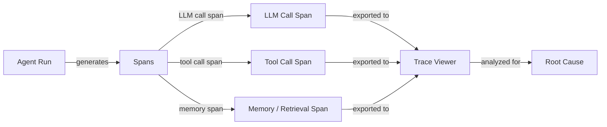

# 代理调试与可观测性

## 定义

代理调试与可观测性是使 AI 代理系统足够透明，以便识别、诊断和修复故障、回归和低效的学科。与传统软件调试（堆栈追踪指向确切的行）不同，代理故障通常是涌现性的：正确的 LLM 调用产生看似合理但错误的输出，这种错误在后续工具调用中级联，破坏代理状态，产生没有任何异常的错误最终答案。可观测性为您提供重建所发生情况所需的数据。

可观测性的三大支柱——日志、指标和追踪——适用于代理，就像适用于分布式系统一样，但需要重要的调整。日志不仅必须捕获错误，还必须捕获 LLM 输入和输出的语义内容。指标必须包括令牌计数、每个跨度的延迟和工具调用频率，以及通常的系统指标。追踪必须对代理运行的层级结构进行建模：整个任务的根跨度、每个 LLM 调用的子跨度、每个工具调用的孙跨度，以此类推。这些共同为您提供每次代理执行的完整、可重放记录。

没有良好的可观测性，调试就变成了猜谜：您重新运行代理，可能由于非确定性得到不同的结果，无法确定您的修复是否解决了根本原因。有了它，您可以精确定位推理出错的确切 LLM 调用，识别哪个工具返回了意外数据，测量每个步骤的延迟贡献，并将两次运行并排比较以了解发生了什么变化。

## 工作原理



### 结构化日志

结构化日志意味着发出机器可读的 JSON 日志，而不是自由文本字符串。对于代理，每条日志条目应包括：运行 ID、步骤编号、跨度类型（llm/tool/memory）、输入负载、输出负载、时间戳、令牌计数和任何错误。结构化日志使过滤、聚合和关联分布式运行中的事件成为可能，无需手动字符串解析。Python 的 `structlog` 或 `loguru` 等库使这变得简单直接。

### 分布式追踪和跨度

追踪是表示单次代理执行的跨度有向无环图。根跨度涵盖整个运行；子跨度涵盖 LLM 调用、工具调用和内存查找。每个跨度携带一个追踪 ID（在整个运行中共享）和一个跨度 ID（每个跨度唯一），从而实现完整重建。OpenTelemetry（OTel）是发出追踪的开放标准；它有 Jaeger、Zipkin、Phoenix 和 LangSmith 的导出器。使用 OTel 跨度对代理进行检测需要用跨度上下文管理器包装 LLM 调用和工具调用。

### 追踪可视化

追踪查看器以可视方式呈现跨度树，显示每个跨度的时间线、持续时间、输入、输出和错误。LangSmith 为 LangChain 代理提供专门构建的追踪查看器，具有令牌级详细信息。Phoenix（Arize）是一个支持任何 OpenTelemetry 兼容源的开源替代方案。Weights & Biases Traces 与 W&B 运行集成，适合已经将其用于实验追踪的团队。良好的追踪查看器让您可以并排比较两次运行，按类型过滤跨度，并深入到导致失败的确切令牌级输入/输出。

### 根本原因分析

有了追踪，根本原因分析遵循系统化的过程：找到输出与预期偏离的第一个跨度，检查其输入（它们是否正确？），并确定失败是在 LLM 推理、工具返回错误数据还是内存/上下文问题中。非确定性使这更难——对同一输入运行两次可能产生不同结果——因此捕获每次运行的追踪（不仅仅是失败的运行）并与已知良好的追踪进行比较至关重要。用元数据（用户 ID、任务类型、提示版本）标记追踪，可以进行群体分析以在许多运行中发现模式。

### 常见调试挑战

非确定性意味着同一个 bug 可能不会在下一次运行中重现，需要对许多追踪进行统计分析。多步骤失败会累积：第 2 步的错误可能直到第 7 步才会出现，因此您必须向后追踪错误传播。工具错误——网络超时、格式错误的 API 响应、权限错误——通常是无声的（代理将错误字符串作为工具结果接收并继续运行）。提示注入和上下文窗口限制可能会导致突然的行为变化，在没有追踪上下文的情况下看起来是随机的。

## 适用场景 / 不适用场景

| 适用场景 | 不适用场景 |
|---|---|
| 诊断生产中的特定代理故障 | 在部署后将可观测性视为事后考虑 |
| 比较两个提示版本以了解行为差异 | 在低延迟、高吞吐量流水线中过度记录每个令牌，而不进行采样 |
| 识别哪个工具调用是延迟瓶颈 | 仅依赖最终答案来判断运行是否成功 |
| 构建需要追踪级别断言的回归测试套件 | 在多租户系统中未经脱敏地记录原始 PII |
| 审计工具调用频率和参数分布 | 使用打印语句代替结构化、关联的追踪 |

## 优缺点

| 优点 | 缺点 |
|---|---|
| 实现对多步骤失败的精确根本原因分析 | 检测增加了代码复杂性和轻微的延迟开销 |
| 为合规性和调试提供完整的审计追踪 | 存储完整的 LLM I/O 追踪会产生大量数据量 |
| 通过运行比较使非确定性行为可处理 | 追踪查看器对新团队成员有学习曲线 |
| 与现有 MLOps 和监控堆栈集成 | 必须调整采样策略以平衡覆盖率与成本 |
| 结构化日志实现自动异常检测 | 追踪中的敏感用户数据需要谨慎的访问控制 |

## 代码示例

```python
# Agent observability with OpenTelemetry + Phoenix (Arize)
# pip install opentelemetry-api opentelemetry-sdk openinference-instrumentation-openai arize-phoenix

import os
import time
import json
import structlog
from opentelemetry import trace
from opentelemetry.sdk.trace import TracerProvider
from opentelemetry.sdk.trace.export import BatchSpanProcessor
from opentelemetry.exporter.otlp.proto.http.trace_exporter import OTLPSpanExporter
from opentelemetry.sdk.resources import Resource


# --- Configure structured logger ---
structlog.configure(
    processors=[
        structlog.processors.TimeStamper(fmt="iso"),
        structlog.stdlib.add_log_level,
        structlog.processors.JSONRenderer(),
    ]
)
log = structlog.get_logger()


# --- Set up OpenTelemetry tracer pointing at Phoenix (default port 6006) ---
resource = Resource.create({"service.name": "my-agent", "service.version": "0.1.0"})
provider = TracerProvider(resource=resource)
otlp_exporter = OTLPSpanExporter(
    endpoint="http://localhost:6006/v1/traces",  # Phoenix local endpoint
)
provider.add_span_processor(BatchSpanProcessor(otlp_exporter))
trace.set_tracer_provider(provider)
tracer = trace.get_tracer("agent.tracer")


# --- Simulated LLM call (replace with real client) ---
def call_llm(messages: list[dict], run_id: str) -> dict:
    """Wrap an LLM call in an OTel span."""
    with tracer.start_as_current_span("llm.call") as span:
        span.set_attribute("llm.model", "gpt-4o-mini")
        span.set_attribute("llm.prompt_tokens", sum(len(m["content"]) for m in messages))
        span.set_attribute("run.id", run_id)

        # Simulate LLM response with a tool call decision
        time.sleep(0.05)  # Simulate network latency
        response = {
            "content": None,
            "tool_call": {"name": "search_web", "args": {"query": messages[-1]["content"]}},
            "completion_tokens": 42,
        }
        span.set_attribute("llm.completion_tokens", response["completion_tokens"])
        log.info("llm_call_complete", run_id=run_id, tool_call=response.get("tool_call"))
        return response


# --- Simulated tool call ---
def call_tool(name: str, args: dict, run_id: str) -> str:
    """Wrap a tool call in an OTel span."""
    with tracer.start_as_current_span(f"tool.{name}") as span:
        span.set_attribute("tool.name", name)
        span.set_attribute("tool.input", json.dumps(args))
        span.set_attribute("run.id", run_id)

        start = time.time()
        # Simulate tool execution
        time.sleep(0.1)
        result = f"Search results for: {args.get('query', '')}"
        duration_ms = (time.time() - start) * 1000

        span.set_attribute("tool.output", result)
        span.set_attribute("tool.duration_ms", round(duration_ms, 1))
        log.info("tool_call_complete", run_id=run_id, tool=name, duration_ms=duration_ms)
        return result


# --- Agent run with full trace ---
def run_agent(task: str, run_id: str, max_steps: int = 5) -> str:
    """Run a simple ReAct-style agent with full OTel tracing."""
    with tracer.start_as_current_span("agent.run") as root_span:
        root_span.set_attribute("agent.task", task)
        root_span.set_attribute("run.id", run_id)
        log.info("agent_run_start", run_id=run_id, task=task)

        messages = [
            {"role": "system", "content": "You are a helpful assistant with tool access."},
            {"role": "user", "content": task},
        ]

        for step in range(max_steps):
            with tracer.start_as_current_span(f"agent.step.{step}") as step_span:
                step_span.set_attribute("agent.step", step)

                response = call_llm(messages, run_id)

                if response.get("tool_call"):
                    tool_call = response["tool_call"]
                    tool_result = call_tool(tool_call["name"], tool_call["args"], run_id)
                    # Append tool result to conversation
                    messages.append({"role": "assistant", "content": str(response["content"])})
                    messages.append({"role": "tool", "content": tool_result})
                else:
                    # No tool call: agent has a final answer
                    final_answer = response.get("content", "")
                    root_span.set_attribute("agent.final_answer", str(final_answer))
                    log.info("agent_run_complete", run_id=run_id, steps=step + 1)
                    return final_answer

        root_span.set_attribute("agent.stopped", "max_steps_reached")
        log.warning("agent_max_steps_reached", run_id=run_id, max_steps=max_steps)
        return "Agent stopped: max steps reached."


# --- Run the agent ---
if __name__ == "__main__":
    import uuid
    run_id = str(uuid.uuid4())
    answer = run_agent("What are the latest developments in AI agents?", run_id)
    print(f"Answer: {answer}")
    # Traces are now visible at http://localhost:6006 in Phoenix UI
```

## 实用资源

- [LangSmith 文档](https://docs.smith.langchain.com/) — 完整的追踪、数据集管理和评估平台，专为基于 LangChain 的代理构建，具有专用追踪查看器。
- [Arize 的 Phoenix 文档](https://docs.arize.com/phoenix) — 支持 OpenTelemetry 追踪的开源 LLM 可观测性平台；适用于任何代理框架。
- [OpenTelemetry Python 文档](https://opentelemetry-python.readthedocs.io/) — 使用分布式追踪、指标和日志对 Python 应用程序进行检测的官方文档。
- [Weights & Biases Weave](https://wandb.github.io/weave/) — W&B 针对 LLM 应用程序的追踪和评估工具，与 W&B 实验追踪集成。
- [OpenInference 检测](https://github.com/Arize-ai/openinference) — 用于 LLM、代理和向量存储的基于 OTel 的开源检测库（Phoenix 使用）。

## 另请参阅

- [代理评估与测试](/docs/agents/evaluation)
- [代理](/docs/agents)
- [MLOps 监控](/docs/mlops/monitoring)
