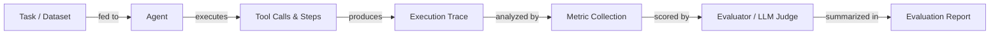

# 代理评估与测试

## 定义

代理评估是测量 AI 代理完成任务的程度、正确使用工具、在成本和延迟预算内运行以及产生准确输出的实践。与静态模型评估——将固定输出与参考进行比较——不同，代理评估必须考虑多步骤轨迹、非确定性路径、中间工具调用以及跨步骤错误的累积效应。单个任务可以通过许多不同的执行路径成功，使传统的准确性分数本身不够充分。

严格的评估是将演示与生产系统区分开来的关键。没有它，您无法知道提示更改是改善了还是回退了行为，新的工具定义是否被正确使用，或者延迟是否在真实负载下可接受。评估应在多个层次进行：单工具的单元级测试、完整代理运行的集成级测试，以及针对代表性任务黄金数据集的回归测试。

成熟的评估策略将自动化指标（任务完成率、准确性、延迟、成本、工具使用效率）与针对边缘案例和主观质量的人工审查相结合。AgentBench 和 SWE-bench 等基准提供了跨模型和框架比较的标准化任务集，而 LangSmith、Ragas 和 DeepEval 等框架提供了大规模运行评估和随时间追踪结果的基础设施。

## 工作原理



### 任务和数据集准备

良好的评估数据集包含从真实或逼真的用户请求中抽取的代表性任务，每个任务都有预期结果或参考答案。任务应涵盖正常路径、边缘案例、对抗性输入和多步骤工作流。对于代理评估，每个任务应指定预期的最终答案，以及可选的预期工具调用序列。数据集质量是影响评估质量的最大杠杆——垃圾进，垃圾出。

### 执行和追踪收集

代理运行数据集中的每个任务，每个步骤——LLM 调用、工具调用、内存读取和输出——都被捕获为结构化追踪。追踪记录每个跨度的输入、输出、时间戳、令牌计数和错误。这是所有下游指标的原材料，对于调试失败也非常宝贵。通过固定随机种子和温度可以提高确定性，但应预期一些变异性，并通过每个任务运行多次试验来处理。

### 指标收集

代理评估的核心指标包括：**任务完成率**（代理是否成功完成了任务？）、**准确性**（最终答案是否正确？）、**延迟**（端到端挂钟时间）、**成本**（总令牌 × 价格）和**工具使用效率**（工具是否以正确的次数和正确的参数调用？）。次要指标包括步骤计数、重试率、幻觉率和对检索上下文的忠实度。指标按任务计算，并在数据集中聚合。

### 评估和评分

许多指标——尤其是开放式输出的正确性——需要评判者。LLM 评判者（例如 GPT-4 或 Claude）接收任务、代理的答案，以及可选的参考答案，并根据评分标准评估质量。这有时被称为"LLM 作为评判者"，是 Ragas 和 DeepEval 等框架的支柱。对于确定性任务（代码执行、SQL 查询、结构化提取），基于规则的检查更可靠且成本更低。应使用人工审查来校准 LLM 评判者并捕获系统性偏差。

### 报告和回归追踪

评估结果聚合成报告，并与代理版本、提示版本和模型版本一起存储。这使回归追踪成为可能：您可以将当前代理与基线进行比较，并在部署之前检测回归。LangSmith 等工具中的仪表板显示随时间变化的指标趋势，帮助团队在个别测试运行会遗漏的情况下捕捉细微的退化。

## 适用场景 / 不适用场景

| 适用场景 | 不适用场景 |
|---|---|
| 在部署前比较两个代理版本或提示 | 因为任务在演示中"看起来正确"而跳过评估 |
| 构建回归套件以捕捉破坏提示的变更 | 仅在项目启动时运行一次评估，之后不再评估 |
| 测量成本和延迟以满足 SLA | 使用单一指标（例如只有准确性）来判断整体质量 |
| 验证工具调用行为和参数正确性 | 使用只包含简单、干净任务而没有边缘案例的数据集 |
| 引入新模型以检查能力转移 | 将 LLM 评判者分数视为无需人工校准的事实依据 |

## 比较

| 标准 | LangSmith | DeepEval | Ragas |
|---|---|---|---|
| **易用性** | 与 LangChain 紧密集成，LangChain 用户快速设置；对其他人较陡 | 干净的 Python API，最少的样板代码，易于添加到任何流水线 | 针对 RAG 流水线优化；对检索任务直接明了 |
| **指标覆盖范围** | 追踪、自定义评估器、数据集管理；内置 LLM 指标较少 | 20+ 内置指标（幻觉、忠实度、工具正确性、毒性） | 以 RAG 为中心的指标（忠实度、答案相关性、上下文召回、精确度） |
| **追踪集成** | 一等功能：完整追踪捕获、跨度可视化、运行比较 | 通过装饰器进行追踪捕获；本机可视化较少 | 无内置追踪；通过 LangSmith 或 W&B 集成 |
| **定价** | 免费层 + 付费托管计划；可自托管 | 开源；云仪表板可用 | 开源；无托管仪表板 |
| **自定义** | 通过 Python 或提示模板的自定义评估器 | 通过子类化指标类进行扩展 | 通过 Python 自定义指标；强大的 NLP 指标库支持 |

## 优缺点

| 优点 | 缺点 |
|---|---|
| 在到达用户之前捕捉回归 | 构建良好的数据集耗时 |
| 为提示/模型决策提供客观证据 | LLM 评判者可能有偏差或不一致 |
| 实现成本和延迟预算 | 非确定性需要多次试验，增加成本 |
| 通过自动化扩展到大型数据集 | 代理追踪可能很大且存储成本高 |
| 集成到 CI/CD 以实现持续质量门控 | 指标选择困难且特定于领域 |

## 代码示例

```python
# Agent evaluation with DeepEval
# pip install deepeval langchain-openai

from deepeval import evaluate
from deepeval.metrics import (
    TaskCompletionMetric,
    ToolCorrectnessMetric,
    HallucinationMetric,
)
from deepeval.test_case import LLMTestCase, ToolCall
from langchain_openai import ChatOpenAI
from langchain.agents import AgentExecutor, create_openai_tools_agent
from langchain_core.prompts import ChatPromptTemplate
from langchain_core.tools import tool


# --- Define a simple tool for the agent ---
@tool
def get_weather(city: str) -> str:
    """Return the current weather for a city."""
    # In production this would call a real API
    return f"The weather in {city} is sunny and 22°C."


# --- Build a minimal agent ---
llm = ChatOpenAI(model="gpt-4o-mini", temperature=0)
prompt = ChatPromptTemplate.from_messages([
    ("system", "You are a helpful assistant. Use tools when needed."),
    ("human", "{input}"),
    ("placeholder", "{agent_scratchpad}"),
])
agent = create_openai_tools_agent(llm, [get_weather], prompt)
agent_executor = AgentExecutor(agent=agent, tools=[get_weather], verbose=False)


def run_agent(user_input: str) -> tuple[str, list[ToolCall]]:
    """Run the agent and return (final_answer, tool_calls)."""
    result = agent_executor.invoke({"input": user_input})
    # In a real setup, parse the intermediate steps for tool call records
    actual_output = result["output"]
    tool_calls_used = [
        ToolCall(name="get_weather", input_parameters={"city": "Paris"})
    ]  # Extracted from result["intermediate_steps"] in production
    return actual_output, tool_calls_used


# --- Build DeepEval test cases from an evaluation dataset ---
dataset = [
    {
        "input": "What is the weather in Paris?",
        "expected_output": "The weather in Paris is sunny and 22°C.",
        "expected_tools": [
            ToolCall(name="get_weather", input_parameters={"city": "Paris"})
        ],
        "context": ["get_weather tool returns current conditions"],
    },
    {
        "input": "Tell me the weather in London.",
        "expected_output": "The weather in London is sunny and 22°C.",
        "expected_tools": [
            ToolCall(name="get_weather", input_parameters={"city": "London"})
        ],
        "context": ["get_weather tool returns current conditions"],
    },
]

test_cases = []
for item in dataset:
    actual_output, tool_calls_used = run_agent(item["input"])

    test_case = LLMTestCase(
        input=item["input"],
        actual_output=actual_output,
        expected_output=item["expected_output"],
        tools_called=tool_calls_used,
        expected_tools=item["expected_tools"],
        context=item["context"],
    )
    test_cases.append(test_case)

# --- Define metrics ---
task_completion = TaskCompletionMetric(
    threshold=0.7,
    model="gpt-4o-mini",
    include_reason=True,
)
tool_correctness = ToolCorrectnessMetric()  # Checks tool name + args match
hallucination = HallucinationMetric(
    threshold=0.3,
    model="gpt-4o-mini",
)

# --- Run evaluation ---
results = evaluate(
    test_cases=test_cases,
    metrics=[task_completion, tool_correctness, hallucination],
)

# --- Print summary ---
for tc, result in zip(test_cases, results.test_results):
    print(f"Input: {tc.input}")
    for metric_result in result.metrics_data:
        status = "PASS" if metric_result.success else "FAIL"
        print(f"  [{status}] {metric_result.name}: {metric_result.score:.2f}")
        if metric_result.reason:
            print(f"         Reason: {metric_result.reason}")
    print()
```

## 实用资源

- [DeepEval 文档](https://docs.confident-ai.com/) — DeepEval 指标、测试用例和 LLM 及代理评估 CI/CD 集成的综合指南。
- [Ragas 文档](https://docs.ragas.io/) — 用于评估 RAG 流水线和代理忠实度的 Ragas 框架，具有答案相关性和上下文召回等指标。
- [LangSmith 文档](https://docs.smith.langchain.com/) — LangSmith 针对基于 LangChain 代理的评估、追踪和数据集管理功能。
- [AgentBench 论文和排行榜](https://github.com/THUDM/AgentBench) — 在包括网页、编码和操作系统环境在内的各种真实世界任务中评估 LLM 代理的基准。
- [SWE-bench](https://www.swebench.com/) — 测量代理解决软件工程存储库中真实 GitHub 问题的能力的基准。

## 另请参阅

- [代理](/docs/agents)
- [代理调试与可观测性](/docs/agents/debugging)
- [评估指标](/docs/evaluation-metrics)
- [基准测试](/docs/benchmarks)
