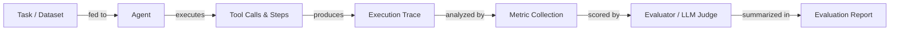

# 代理评估与测试

## 定义

Agenten-Evaluation ist die Praxis, zu messen, wie gut ein KI-Agent Aufgaben erfüllt, Werkzeuge korrekt einsetzt, innerhalb von Kosten- und Latenzbudgets bleibt und genaue Ausgaben erzeugt. Anders als bei der statischen Modell-Evaluation – wo man eine feste Ausgabe mit einer Referenz vergleicht – muss die Agenten-Evaluation mehrstufige Trajektorien, nicht-deterministische Pfade, intermediäre Werkzeugaufrufe und den kumulativen Effekt von Fehlern über Schritte hinweg berücksichtigen. Eine einzelne Aufgabe kann durch viele verschiedene Ausführungspfade erfolgreich sein, was traditionelle Genauigkeitswerte allein unzureichend macht.

Rigorose Evaluation ist das, was eine Demo von einem Produktionssystem unterscheidet. Ohne sie können Sie nicht wissen, ob eine Prompt-Änderung das Verhalten verbessert oder verschlechtert hat, ob eine neue Werkzeugdefinition korrekt verwendet wird oder ob die Latenz unter realer Last akzeptabel ist. Evaluation sollte auf mehreren Ebenen stattfinden: Unit-Level-Testing einzelner Werkzeuge, Integration-Level-Testing vollständiger Agenten-Läufe und Regressionstesting gegen einen goldenen Datensatz repräsentativer Aufgaben.

Eine ausgereifte Evaluierungsstrategie kombiniert automatisierte Metriken (Aufgabenabschlussrate, Genauigkeit, Latenz, Kosten, Werkzeugnutzungseffizienz) mit menschlicher Überprüfung für Randfälle und subjektive Qualität. Benchmarks wie AgentBench und SWE-bench bieten standardisierte Aufgabensets für den Vergleich über Modelle und Frameworks hinweg, während Frameworks wie LangSmith, Ragas und DeepEval Infrastruktur für das Ausführen von Evaluierungen im großen Maßstab und die Verfolgung von Ergebnissen im Laufe der Zeit bereitstellen.

## 工作原理



### Aufgaben- und Datensatz-Vorbereitung

Ein guter Evaluierungsdatensatz enthält repräsentative Aufgaben aus echten oder realistischen Benutzeranfragen, jeweils mit erwarteten Ergebnissen oder Referenzantworten. Aufgaben sollten Happy Paths, Randfälle, adversarielle Eingaben und mehrstufige Workflows abdecken. Für die Agenten-Evaluation sollte jede Aufgabe die erwartete Endantwort und optional die erwartete Sequenz von Werkzeugaufrufen spezifizieren. Die Datensatzqualität ist der größte Hebel für die Evaluierungsqualität – Müll rein, Müll raus.

### Ausführung und Trace-Sammlung

Der Agent führt jede Aufgabe im Datensatz aus, und jeder Schritt – LLM-Aufrufe, Werkzeugaufrufungen, Speicherlesungen und Ausgaben – wird als strukturierter Trace erfasst. Traces zeichnen Eingaben, Ausgaben, Zeitstempel, Token-Zählungen und Fehler für jeden Span auf. Dies ist das Rohmaterial für alle nachgelagerten Metriken und ist auch für das Debugging von Fehlern unschätzbar. Determinismus kann durch das Fixieren von Zufalls-Seeds und Temperatur verbessert werden, aber einige Variabilität ist zu erwarten und sollte durch das Ausführen mehrerer Trials pro Aufgabe berücksichtigt werden.

### Metrikerfassung

Kernmetriken für die Agenten-Evaluation umfassen: **Aufgabenabschlussrate** (hat der Agent die Aufgabe erfolgreich abgeschlossen?), **Genauigkeit** (ist die Endantwort korrekt?), **Latenz** (End-to-End-Wanduhrzeit), **Kosten** (Gesamttokens × Preis) und **Werkzeugnutzungseffizienz** (wurden Werkzeuge die richtige Anzahl von Malen mit korrekten Argumenten aufgerufen?). Sekundäre Metriken umfassen Schrittanzahl, Wiederholungsrate, Halluzinationsrate und Treue zum abgerufenen Kontext. Metriken werden pro Aufgabe berechnet und über den Datensatz aggregiert.

### Evaluation und Bewertung

Viele Metriken – insbesondere Korrektheit für offene Ausgaben – erfordern einen Richter. Ein LLM-Richter (z. B. GPT-4 oder Claude) erhält die Aufgabe, die Antwort des Agenten und optional eine Referenzantwort und bewertet die Qualität auf einer Rubrik. Dies wird manchmal als „LLM-as-a-judge" bezeichnet und ist das Rückgrat von Frameworks wie Ragas und DeepEval. Für deterministische Aufgaben (Code-Ausführung, SQL-Abfragen, strukturierte Extraktion) sind regelbasierte Prüfungen zuverlässiger und günstiger. Menschliche Überprüfung sollte verwendet werden, um LLM-Richter zu kalibrieren und systematische Verzerrungen zu erkennen.

### Berichterstattung und Regressionsverfolgung

Evaluierungsergebnisse werden in einem Bericht aggregiert und neben der Agenten-Version, Prompt-Version und Modell-Version gespeichert. Dies ermöglicht Regressionsverfolgung: Sie können den aktuellen Agenten mit einer Baseline vergleichen und Regressionen erkennen, bevor sie bereitgestellt werden. Dashboards in Tools wie LangSmith zeigen Metriktrends über die Zeit und helfen Teams, subtile Degradierungen zu erkennen, die einzelne Testläufe übersehen würden.

## 何时使用 / 何时不使用

| 使用场景 | 避免场景 |
|---|---|
| Zwei Agenten-Versionen oder Prompts vor der Bereitstellung vergleichen | Evaluation überspringen, weil die Aufgabe in einer Demo „richtig aussieht" |
| Eine Regressionssuite aufbauen, um Prompt-brechende Änderungen zu erkennen | Evaluation nur einmal zu Projektbeginn durchführen und nie wieder |
| Kosten und Latenz messen, um SLAs zu erfüllen | Eine einzelne Metrik (z. B. nur Genauigkeit) zur Beurteilung der Gesamtqualität verwenden |
| Werkzeugaufruf-Verhalten und Argumentkorrektheit validieren | Einen Datensatz mit nur einfachen, sauberen Aufgaben ohne Randfälle verwenden |
| Ein neues Modell einbinden, um die Fähigkeitsübertragung zu prüfen | LLM-Richterbewertungen als absolute Wahrheit ohne menschliche Kalibrierung behandeln |

## 比较

| Kriterium | LangSmith | DeepEval | Ragas |
|---|---|---|---|
| **Benutzerfreundlichkeit** | Enge LangChain-Integration, schnelle Einrichtung für LangChain-Benutzer; steiler für andere | Saubere Python-API, minimaler Boilerplate, einfach zu jeder Pipeline hinzuzufügen | Für RAG-Pipelines optimiert; unkompliziert für Abruf-Aufgaben |
| **Metrikabdeckung** | Tracing, benutzerdefinierte Evaluatoren, Datensatz-Management; weniger integrierte LLM-Metriken | 20+ integrierte Metriken (Halluzination, Treue, Werkzeugkorrektheit, Toxizität) | RAG-fokussierte Metriken (Treue, Antwortrelevanz, Kontext-Recall, Präzision) |
| **Tracing-Integration** | Erstklassig: vollständige Trace-Erfassung, Span-Visualisierung, Lauf-Vergleich | Trace-Erfassung über Dekoratoren; weniger native Visualisierung | Kein eingebautes Tracing; integriert über LangSmith oder W&B |
| **Preisgestaltung** | Kostenloser Tarif + bezahlte gehostete Pläne; selbst-hostbar | Open Source; Cloud-Dashboard verfügbar | Open Source; kein gehostetes Dashboard |
| **Anpassbarkeit** | Benutzerdefinierte Evaluatoren über Python oder Prompt-Vorlagen | Erweiterbar durch Unterklassen von Metrik-Klassen | Benutzerdefinierte Metriken über Python; starke NLP-Metrik-Bibliotheksunterstützung |

## 优缺点

| 优点 | 缺点 |
|---|---|
| Erkennt Regressionen, bevor sie Benutzer erreichen | Das Aufbauen eines guten Datensatzes ist zeitaufwendig |
| Liefert objektive Belege für Prompt-/Modellentscheidungen | LLM-Richter können voreingenommen oder inkonsistent sein |
| Ermöglicht Kosten- und Latenzbudgetierung | Nicht-Determinismus erfordert mehrere Trials und erhöht die Kosten |
| Skaliert auf große Datensätze mit Automatisierung | Agenten-Traces können groß und teuer zu speichern sein |
| Integriert sich in CI/CD für kontinuierliche Qualitätsgates | Metrikauswahl ist schwierig und domänenspezifisch |

## 代码示例

```python
# Agent evaluation with DeepEval
# pip install deepeval langchain-openai

from deepeval import evaluate
from deepeval.metrics import (
    TaskCompletionMetric,
    ToolCorrectnessMetric,
    HallucinationMetric,
)
from deepeval.test_case import LLMTestCase, ToolCall
from langchain_openai import ChatOpenAI
from langchain.agents import AgentExecutor, create_openai_tools_agent
from langchain_core.prompts import ChatPromptTemplate
from langchain_core.tools import tool


# --- Define a simple tool for the agent ---
@tool
def get_weather(city: str) -> str:
    """Return the current weather for a city."""
    # In production this would call a real API
    return f"The weather in {city} is sunny and 22°C."


# --- Build a minimal agent ---
llm = ChatOpenAI(model="gpt-4o-mini", temperature=0)
prompt = ChatPromptTemplate.from_messages([
    ("system", "You are a helpful assistant. Use tools when needed."),
    ("human", "{input}"),
    ("placeholder", "{agent_scratchpad}"),
])
agent = create_openai_tools_agent(llm, [get_weather], prompt)
agent_executor = AgentExecutor(agent=agent, tools=[get_weather], verbose=False)


def run_agent(user_input: str) -> tuple[str, list[ToolCall]]:
    """Run the agent and return (final_answer, tool_calls)."""
    result = agent_executor.invoke({"input": user_input})
    # In a real setup, parse the intermediate steps for tool call records
    actual_output = result["output"]
    tool_calls_used = [
        ToolCall(name="get_weather", input_parameters={"city": "Paris"})
    ]  # Extracted from result["intermediate_steps"] in production
    return actual_output, tool_calls_used


# --- Build DeepEval test cases from an evaluation dataset ---
dataset = [
    {
        "input": "What is the weather in Paris?",
        "expected_output": "The weather in Paris is sunny and 22°C.",
        "expected_tools": [
            ToolCall(name="get_weather", input_parameters={"city": "Paris"})
        ],
        "context": ["get_weather tool returns current conditions"],
    },
    {
        "input": "Tell me the weather in London.",
        "expected_output": "The weather in London is sunny and 22°C.",
        "expected_tools": [
            ToolCall(name="get_weather", input_parameters={"city": "London"})
        ],
        "context": ["get_weather tool returns current conditions"],
    },
]

test_cases = []
for item in dataset:
    actual_output, tool_calls_used = run_agent(item["input"])

    test_case = LLMTestCase(
        input=item["input"],
        actual_output=actual_output,
        expected_output=item["expected_output"],
        tools_called=tool_calls_used,
        expected_tools=item["expected_tools"],
        context=item["context"],
    )
    test_cases.append(test_case)

# --- Define metrics ---
task_completion = TaskCompletionMetric(
    threshold=0.7,
    model="gpt-4o-mini",
    include_reason=True,
)
tool_correctness = ToolCorrectnessMetric()  # Checks tool name + args match
hallucination = HallucinationMetric(
    threshold=0.3,
    model="gpt-4o-mini",
)

# --- Run evaluation ---
results = evaluate(
    test_cases=test_cases,
    metrics=[task_completion, tool_correctness, hallucination],
)

# --- Print summary ---
for tc, result in zip(test_cases, results.test_results):
    print(f"Input: {tc.input}")
    for metric_result in result.metrics_data:
        status = "PASS" if metric_result.success else "FAIL"
        print(f"  [{status}] {metric_result.name}: {metric_result.score:.2f}")
        if metric_result.reason:
            print(f"         Reason: {metric_result.reason}")
    print()
```

## 实用资源

- [DeepEval documentation](https://docs.confident-ai.com/) — Umfassender Leitfaden zu DeepEval-Metriken, Testfällen und CI/CD-Integration für LLM- und Agenten-Evaluation.
- [Ragas documentation](https://docs.ragas.io/) — Ragas-Framework für die Evaluierung von RAG-Pipelines und Agenten-Treue, mit Metriken wie Antwortrelevanz und Kontext-Recall.
- [LangSmith documentation](https://docs.smith.langchain.com/) — LangSmith's Evaluierungs-, Tracing- und Datensatz-Management-Funktionen für LangChain-basierte Agenten.
- [AgentBench paper and leaderboard](https://github.com/THUDM/AgentBench) — Benchmark für die Evaluierung von LLM-Agenten über verschiedene Aufgaben aus der realen Welt, einschließlich Web, Coding und OS-Umgebungen.
- [SWE-bench](https://www.swebench.com/) — Benchmark, der die Fähigkeit von Agenten misst, echte GitHub-Issues in Software-Engineering-Repositories zu lösen.

## 另见

- [Agents](/docs/agents)
- [Agent debugging and observability](/docs/agents/debugging)
- [Evaluation metrics](/docs/evaluation-metrics)
- [Benchmarks](/docs/benchmarks)
