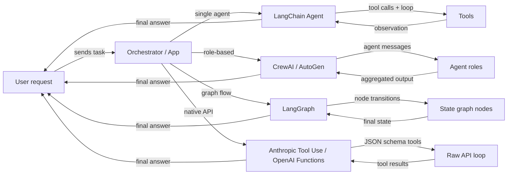

# 代理框架概述

## 定义

**代理框架**是处理构建 AI 代理的基础设施问题的库或 SDK：工具注册、消息传递、状态管理、编排以及与 LLM 提供商的集成。没有框架，您需要自己编写这些管道层；有了框架，您描述*代理应该做什么*，它负责处理*循环如何运行*。

代理框架生态系统迅速发展，现在跨越几个不同的类别。一些框架专注于带工具的单一代理（LangChain 代理），另一些优先考虑多个代理之间的基于角色的协作（CrewAI、AutoGen），还有一些将代理行为建模为显式有状态图（LangGraph），而有些则完全跳过框架，依赖模型提供商的原生能力（Anthropic 工具使用、OpenAI 函数调用）。每个类别反映了关于控制和复杂性应该在哪里的不同理念。

选择正确的框架不仅仅是技术决策——它塑造了您如何推理系统、调试失败以及扩展到生产。构建简单研究助手的初学者与在生产流水线中连接十几个专业代理的平台团队需求大相径庭。

## 工作原理

### 单代理框架（LangChain 代理）

单代理框架为一个 LLM 提供一组工具并运行一个循环：模型决定调用哪个工具，框架执行它，观察结果被附加到对话中，循环继续直到模型发出最终答案。LangChain 是典型示例，为直接的 ReAct 风格代理提供 `create_react_agent` 和 `AgentExecutor`。开发者注册工具（带文档字符串或 Pydantic schema 的 Python 函数），框架处理提示构建和结果解析。单代理是正确的起点：延迟更低、更易于调试、更简单测试。当您需要多个专业角色并行工作或状态变得太大而无法放入一个上下文窗口时，复杂性就会增加。

### 多代理框架（CrewAI、AutoGen）

多代理框架协调多个 LLM 支持的代理，每个代理有自己的角色、指令和工具，朝共同目标努力。CrewAI 使用带有角色、目标和背景故事的团队隐喻；AutoGen 使用代理交换消息的对话隐喻。两者都支持顺序和并行执行模式。框架管理消息路由、代理间的输出传递，以及可选的人机协作检查点。当问题自然分解为不同专业（研究员、写作者、评论者）时，或者当您需要冗余和辩论来提高输出质量时，多代理方法表现出色。

### 基于图的框架（LangGraph）

基于图的框架将代理行为表示为显式有向图：节点是 Python 函数（每个可能调用 LLM 或工具），边是节点间的转换，共享状态是类型化字典。LangGraph 建立在 LangChain 之上，普及了这种方法。图中的循环使代理能够循环直到满足终止条件；条件边允许基于中间结果的动态路由。图的显式性使复杂流程更容易推理、独立测试，并在中断后持久化。当您需要对执行流程进行细粒度控制、检查点或在特定步骤进行人机协作审批时，这是首选模式。

### 原生工具使用（Anthropic 工具使用、OpenAI 函数调用）

原生工具使用完全跳过框架层，使用模型提供商的内置结构化函数调用机制。Anthropic 的 API 接受带有 JSON schema 定义的 `tools` 参数；模型返回您的代码执行的 `tool_use` 块，然后您反馈 `tool_result` 块。OpenAI 的等价物是带有 `function_call` 响应的 `functions` / `tools`。这种方法具有最小的抽象开销、对循环的完全控制，以及与流式传输和并行工具调用等模型特定功能的最紧密集成。权衡是您需要自己编写编排逻辑，对于简单用例来说很好，但在规模扩展时变得复杂。



## 适用场景 / 不适用场景

| 适用场景 | 不适用场景 |
|---|---|
| 您需要超出单一提示的工具增强 LLM 行为 | 您的任务是无需外部数据的一次性提示 |
| 您的问题分解为多个专业角色（多代理） | 您需要超低延迟，无法承受多步骤循环 |
| 您想要可重现、可检查的代理流程（基于图） | 您的团队缺乏调试非确定性代理循环的专业知识 |
| 您希望接近提供商 API，最少抽象（原生） | 您需要快速原型开发，不想编写编排样板代码 |
| 您在构建需要检查点和持久性的生产系统 | 任务可以通过简单的 RAG 流水线或单一提示链解决 |

## 比较

| 标准 | CrewAI | AutoGen | LangGraph | Anthropic 工具使用 |
|---|---|---|---|---|
| **架构** | 基于角色的团队，带任务和流程 | 对话驱动的代理对和群聊 | 带节点和边的显式状态图 | 带有 JSON schema 工具定义的原始 API |
| **多代理支持** | 一等功能：代理是带角色和目标的团队成员 | 一等功能：代理通过消息总线对话 | 通过子图可行，但主要是单代理图 | 手动：您自己实现多代理协调 |
| **状态管理** | 隐式：通过团队上下文在任务间传递 | 隐式：对话中的消息历史 | 显式：跨所有节点共享的 TypedDict 状态 | 手动：您维护自己的状态字典 |
| **学习曲线** | 低：声明式 YAML 风格 API | 中等：需要理解代理角色和群聊 | 中-高：需要图论直觉 | 低：只是 Python + JSON schema，但更多样板代码 |
| **社区和生态系统** | 快速增长，强大的教程 | 大型（微软支持），强大的研究社区 | 快速增长，紧密的 LangChain 集成 | 官方 Anthropic SDK，文档齐全 |
| **最适合** | 结构化的基于角色的流水线、内容工作流 | 研究、代码生成、人机协作实验 | 复杂的分支流程、生产流水线 | 简单到中等的工具，紧密的模型集成 |
| **流式传输支持** | 有限 | 有限 | 通过 LangChain 流式传输支持 | 通过 Anthropic SDK 完全支持流式传输 |

## 代码示例

```python
# --- LangChain agent (single-agent, ReAct) ---
from langchain_anthropic import ChatAnthropic
from langchain.agents import create_react_agent, AgentExecutor
from langchain_core.tools import tool

@tool
def search(query: str) -> str:
    """Search the web for information."""
    return f"Results for: {query}"

llm = ChatAnthropic(model="claude-3-5-sonnet-20241022")
agent = create_react_agent(llm, tools=[search])
executor = AgentExecutor(agent=agent, tools=[search])
result = executor.invoke({"input": "What is LangGraph?"})


# --- CrewAI minimal setup ---
from crewai import Agent, Task, Crew

researcher = Agent(role="Researcher", goal="Find accurate information", backstory="Expert researcher")
task = Task(description="Research LangGraph", agent=researcher)
crew = Crew(agents=[researcher], tasks=[task])
result = crew.kickoff()


# --- AutoGen minimal setup ---
import autogen

assistant = autogen.AssistantAgent(name="assistant", llm_config={"model": "gpt-4o"})
user = autogen.UserProxyAgent(name="user", human_input_mode="NEVER")
user.initiate_chat(assistant, message="Explain LangGraph in one paragraph.")


# --- LangGraph minimal setup ---
from langgraph.graph import StateGraph, END
from typing import TypedDict

class State(TypedDict):
    message: str

def process(state: State) -> State:
    return {"message": f"Processed: {state['message']}"}

graph = StateGraph(State)
graph.add_node("process", process)
graph.set_entry_point("process")
graph.add_edge("process", END)
app = graph.compile()
result = app.invoke({"message": "hello"})


# --- Anthropic Tool Use minimal setup ---
import anthropic

client = anthropic.Anthropic()
tools = [{"name": "search", "description": "Search the web", "input_schema": {"type": "object", "properties": {"query": {"type": "string"}}, "required": ["query"]}}]
response = client.messages.create(
    model="claude-opus-4-5",
    max_tokens=1024,
    tools=tools,
    messages=[{"role": "user", "content": "Search for LangGraph documentation."}]
)
```

## 实用资源

- [LangChain 代理文档](https://python.langchain.com/docs/concepts/agents/) — 使用 LangChain 构建代理的综合指南，包括 ReAct、工具使用和记忆。
- [CrewAI 官方文档](https://docs.crewai.com/) — CrewAI 中角色、任务、团队和流程的完整参考。
- [AutoGen 文档（微软）](https://microsoft.github.io/autogen/) — 涵盖 ConversableAgent、群聊、代码执行和人机协作模式。
- [LangGraph 文档](https://langchain-ai.github.io/langgraph/) — 基于图的代理状态机、持久化和人机协作检查点。
- [Anthropic 工具使用指南](https://docs.anthropic.com/en/docs/build-with-claude/tool-use) — 使用 JSON schema 定义工具以及处理 tool_use / tool_result 消息类型的官方指南。
- [AgentsKit](https://emersonbraun.github.io/agentskit/) — 用于构建具有记忆、工具和多代理编排的 AI 代理的生产就绪框架

## 另请参阅

- [CrewAI](/docs/agents/crewai)
- [AutoGen](/docs/agents/autogen)
- [LangGraph](/docs/agents/langgraph)
- [Anthropic 工具使用](/docs/agents/anthropic-tool-use)
- [多代理系统](/docs/agents/multi-agent-systems)
- [AI 代理](/docs/agents)
