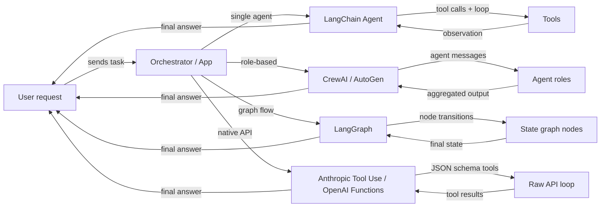

# 代理框架概述

## 定义

Ein **Agenten-Framework** ist eine Bibliothek oder ein SDK, das sich um die Infrastrukturaspekte beim Aufbau von KI-Agenten kümmert: Werkzeugregistrierung, Nachrichtenübermittlung, Zustandsverwaltung, Orchestrierung und Integration mit LLM-Anbietern. Ohne ein Framework schreiben Sie diese Infrastrukturschichten selbst; mit einem Framework beschreiben Sie *was* Ihr Agent tun soll, und es kümmert sich um *wie* die Schleife läuft.

Die Agenten-Framework-Landschaft ist schnell gewachsen und umfasst nun mehrere unterschiedliche Kategorien. Einige Frameworks konzentrieren sich auf einen einzigen Agenten mit Werkzeugen (LangChain-Agenten), andere priorisieren die rollenbasierte Zusammenarbeit zwischen vielen Agenten (CrewAI, AutoGen), andere modellieren das Agentenverhalten als explizite zustandsbehaftete Graphen (LangGraph), und einige überspringen das Framework vollständig und verlassen sich auf die nativen Fähigkeiten des Modellanbieters (Anthropic Tool Use, OpenAI Function Calling). Jede Kategorie spiegelt eine andere Philosophie darüber wider, wo Kontrolle und Komplexität liegen sollten.

Die Wahl des richtigen Frameworks ist nicht nur eine technische Entscheidung – sie beeinflusst, wie Sie über Ihr System nachdenken, Fehler debuggen und in die Produktion skalieren. Ein Anfänger, der einen einfachen Forschungsassistenten entwickelt, hat ganz andere Bedürfnisse als ein Plattform-Team, das ein Dutzend spezialisierter Agenten in einer Produktionspipeline verbindet.

## 工作原理

### Single-Agent-Frameworks (LangChain-Agenten)

Single-Agent-Frameworks geben einem LLM Zugang zu einer Menge von Werkzeugen und führen eine Schleife aus: Das Modell entscheidet, welches Werkzeug aufgerufen werden soll, das Framework führt es aus, die Beobachtung wird dem Gespräch hinzugefügt, und die Schleife setzt fort, bis das Modell eine Endantwort ausgibt. LangChain ist das kanonische Beispiel und stellt `create_react_agent` und `AgentExecutor` für unkomplizierte ReAct-Style-Agenten bereit. Der Entwickler registriert Werkzeuge (Python-Funktionen mit Docstrings oder Pydantic-Schemas) und das Framework übernimmt die Prompt-Konstruktion und Ergebnisverarbeitung. Single-Agent ist der richtige Ausgangspunkt: geringere Latenz, einfacher zu debuggen und einfacher zu testen. Die Komplexität wächst, wenn Sie mehrere spezialisierte Rollen benötigen, die parallel arbeiten, oder wenn der Zustand zu groß für ein Kontextfenster wird.

### Multi-Agent-Frameworks (CrewAI, AutoGen)

Multi-Agent-Frameworks koordinieren mehrere LLM-gestützte Agenten, jeweils mit ihrer eigenen Rolle, Anweisungen und Werkzeugen, auf ein gemeinsames Ziel hin. CrewAI verwendet eine Crew-Metapher mit Rollen, Zielen und Hintergrundgeschichten; AutoGen verwendet eine Konversationsmetapher, bei der Agenten Nachrichten austauschen. Beide unterstützen sequentielle und parallele Ausführungsmuster. Das Framework verwaltet das Nachrichtenrouting, die Ausgabe-Übergabe zwischen Agenten und optional Human-in-the-Loop-Checkpoints. Multi-Agent-Ansätze glänzen, wenn das Problem sich natürlich in distinkte Spezialisierungen zerlegt (Forscher, Autor, Kritiker) oder wenn Sie Redundanz und Debatte benötigen, um die Ausgabequalität zu verbessern.

### Graphbasierte Frameworks (LangGraph)

Graphbasierte Frameworks stellen das Agentenverhalten als expliziten gerichteten Graphen dar: Knoten sind Python-Funktionen (jede kann ein LLM oder ein Werkzeug aufrufen), Kanten sind Übergänge zwischen Knoten, und der gemeinsame Zustand ist ein typisiertes Dictionary. LangGraph, das auf LangChain aufbaut, hat diesen Ansatz populär gemacht. Zyklen im Graphen ermöglichen dem Agenten, zu loopen, bis eine Abbruchbedingung erfüllt ist; bedingte Kanten ermöglichen dynamisches Routing basierend auf Zwischenergebnissen. Die Explizitheit eines Graphen macht komplexe Flows einfacher zu verstehen, isoliert zu testen und über Unterbrechungen hinweg fortzusetzen. Dies ist das bevorzugte Muster, wenn Sie feinkörnige Kontrolle über den Ausführungsfluss, Checkpointing oder Human-in-the-Loop-Genehmigungen bei bestimmten Schritten benötigen.

### Natives Werkzeug-Nutzung (Anthropic Tool Use, OpenAI Function Calling)

Natives Werkzeug-Nutzung überspringt die Framework-Schicht vollständig und verwendet den eingebauten Mechanismus des Modellanbieters für strukturiertes Function Calling. Anthropics API akzeptiert einen `tools`-Parameter mit JSON-Schema-Definitionen; das Modell gibt `tool_use`-Blöcke zurück, die Ihr Code ausführt, dann fügen Sie `tool_result`-Blöcke zurück ein. OpenAIs Äquivalent sind `functions` / `tools` mit `function_call`-Antworten. Dieser Ansatz hat minimalen Abstraktions-Overhead, vollständige Kontrolle über die Schleife und die engste Integration mit modellspezifischen Funktionen wie Streaming und parallelen Werkzeugaufrufen. Der Tradeoff ist, dass Sie die Orchestrierungslogik selbst schreiben, was für einfache Anwendungsfälle in Ordnung ist, aber bei skalierenden Szenarien komplex wird.



## 何时使用 / 何时不使用

| 使用场景 | 避免场景 |
|---|---|
| Werkzeuggestütztes LLM-Verhalten über einen einzigen Prompt hinaus benötigt wird | Die Aufgabe ein einmaliger Prompt ohne externe Datenbedarfe ist |
| Das Problem sich in mehrere spezialisierte Rollen zerlegt (Multi-Agent) | Ultra-niedrige Latenz benötigt wird und mehrstufige Schleifen nicht leistbar sind |
| Reproduzierbare, inspizierbare Agenten-Flows gewünscht werden (graphbasiert) | Das Team nicht über die Expertise verfügt, nicht-deterministische Agenten-Schleifen zu debuggen |
| Nahe an der Anbieter-API mit minimaler Abstraktion bleiben wollen (nativ) | Schnelles Prototyping gewünscht wird und kein Orchestrierungs-Boilerplate geschrieben werden soll |
| Ein Produktionssystem gebaut wird, das Checkpointing und Persistenz benötigt | Die Aufgabe mit einer einfachen RAG-Pipeline oder einer einzigen Prompt-Kette lösbar ist |

## 比较

| Kriterium | CrewAI | AutoGen | LangGraph | Anthropic Tool Use |
|---|---|---|---|---|
| **Architektur** | Rollenbasierte Crew mit Aufgaben und Prozessen | Konversationsgesteuerte Agenten-Paare und Gruppenchats | Expliziter Zustandsgraph mit Knoten und Kanten | Rohe API mit JSON-Schema-Werkzeugdefinitionen |
| **Multi-Agent-Unterstützung** | Erstklassig: Agenten sind Crew-Mitglieder mit Rollen und Zielen | Erstklassig: Agenten kommunizieren über einen Message Bus | Möglich über Subgraphen, aber primär Single-Agent-Graphen | Manuell: Sie implementieren Multi-Agent-Koordination selbst |
| **Zustandsverwaltung** | Implizit: wird zwischen Aufgaben über den Crew-Kontext übergeben | Implizit: Nachrichtenverlauf im Gespräch | Explizit: TypedDict geteilter Zustand über alle Knoten | Manuell: Sie pflegen Ihr eigenes Zustandsdictionary |
| **Lernkurve** | Niedrig: deklarative YAML-ähnliche API | Mittel: erfordert Verständnis von Agenten-Rollen und Gruppenchat | Mittel-Hoch: erfordert Graph-Theorie-Intuition | Niedrig: nur Python + JSON-Schema, aber mehr Boilerplate |
| **Community & Ökosystem** | Wächst schnell, starke Tutorials | Groß (Microsoft-gestützt), starke Forschungsgemeinschaft | Wächst rasch, enge LangChain-Integration | Offizielles Anthropic SDK, gut dokumentiert |
| **最适合** | Strukturierte rollenbasierte Pipelines, Content-Workflows | Forschung, Code-Gen, Human-in-the-Loop-Experimente | Komplexe Verzweigungsflows, Produktionspipelines | Einfache bis mittlere Werkzeuge, enge Modellintegration |
| **Streaming-Unterstützung** | Begrenzt | Begrenzt | Unterstützt über LangChain-Streaming | Vollständiges Streaming über Anthropic SDK |

## 代码示例

```python
# --- LangChain agent (single-agent, ReAct) ---
from langchain_anthropic import ChatAnthropic
from langchain.agents import create_react_agent, AgentExecutor
from langchain_core.tools import tool

@tool
def search(query: str) -> str:
    """Search the web for information."""
    return f"Results for: {query}"

llm = ChatAnthropic(model="claude-3-5-sonnet-20241022")
agent = create_react_agent(llm, tools=[search])
executor = AgentExecutor(agent=agent, tools=[search])
result = executor.invoke({"input": "What is LangGraph?"})


# --- CrewAI minimal setup ---
from crewai import Agent, Task, Crew

researcher = Agent(role="Researcher", goal="Find accurate information", backstory="Expert researcher")
task = Task(description="Research LangGraph", agent=researcher)
crew = Crew(agents=[researcher], tasks=[task])
result = crew.kickoff()


# --- AutoGen minimal setup ---
import autogen

assistant = autogen.AssistantAgent(name="assistant", llm_config={"model": "gpt-4o"})
user = autogen.UserProxyAgent(name="user", human_input_mode="NEVER")
user.initiate_chat(assistant, message="Explain LangGraph in one paragraph.")


# --- LangGraph minimal setup ---
from langgraph.graph import StateGraph, END
from typing import TypedDict

class State(TypedDict):
    message: str

def process(state: State) -> State:
    return {"message": f"Processed: {state['message']}"}

graph = StateGraph(State)
graph.add_node("process", process)
graph.set_entry_point("process")
graph.add_edge("process", END)
app = graph.compile()
result = app.invoke({"message": "hello"})


# --- Anthropic Tool Use minimal setup ---
import anthropic

client = anthropic.Anthropic()
tools = [{"name": "search", "description": "Search the web", "input_schema": {"type": "object", "properties": {"query": {"type": "string"}}, "required": ["query"]}}]
response = client.messages.create(
    model="claude-opus-4-5",
    max_tokens=1024,
    tools=tools,
    messages=[{"role": "user", "content": "Search for LangGraph documentation."}]
)
```

## 实用资源

- [LangChain Agents documentation](https://python.langchain.com/docs/concepts/agents/) — Umfassender Leitfaden zum Aufbau von Agenten mit LangChain, einschließlich ReAct, Werkzeug-Nutzung und Speicher.
- [CrewAI official documentation](https://docs.crewai.com/) — Vollständige Referenz für Rollen, Aufgaben, Crews und Prozesse in CrewAI.
- [AutoGen documentation (Microsoft)](https://microsoft.github.io/autogen/) — Behandelt ConversableAgent, Gruppenchats, Code-Ausführung und Human-in-the-Loop-Muster.
- [LangGraph documentation](https://langchain-ai.github.io/langgraph/) — Graphbasierte Agenten-Zustandsmaschinen, Persistenz und Human-in-the-Loop-Checkpoints.
- [Anthropic Tool Use guide](https://docs.anthropic.com/en/docs/build-with-claude/tool-use) — Offizieller Leitfaden zum Definieren von Werkzeugen mit JSON-Schema und Behandeln von tool_use / tool_result Nachrichtentypen.
- [AgentsKit](https://emersonbraun.github.io/agentskit/) — Produktionsreifes Framework zum Aufbau von KI-Agenten mit Speicher, Werkzeugen und Multi-Agent-Orchestrierung

## 另见

- [CrewAI](/docs/agents/crewai)
- [AutoGen](/docs/agents/autogen)
- [LangGraph](/docs/agents/langgraph)
- [Anthropic Tool Use](/docs/agents/anthropic-tool-use)
- [Multi-agent systems](/docs/agents/multi-agent-systems)
- [AI agents](/docs/agents)
