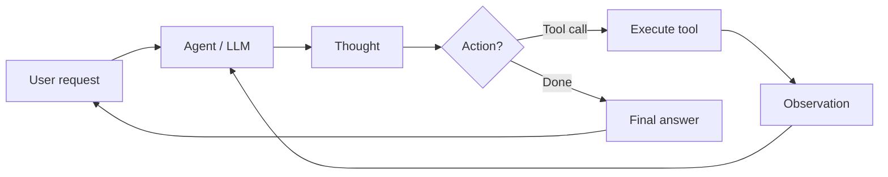

# AI 智能体

## 定义

An **AI agent** 是一个感知其环境的系统 (例如 user input, tool outputs), reasons (possibly with an LLM), and takes actions (例如 calling APIs, writing code) to achieve goals. Agents often use tools and loops of thought–action–observation.

更正式地说：**代理是一个自主程序，它与 AI 模型通信，使用其拥有的工具和上下文执行基于目标的操作，is capable of autonomous 决策-making grounded in truth.** Agents bridge the gap between a one-off prototype (例如 in AI Studio) and a scalable application: you define tools, give the agent access to them, and it decides when to call which tool and how to combine results to satisfy the user's goal.

## 工作原理

Typical loop: receive task → plan or reason → choose action (例如 tool call) → observe result → repeat until done or limit. The **user** sends a request; the **agent** (backed by an LLM) produces a **thought** (推理) and a **决策**: either call a **tool** (例如 search, API, code runner) and get an **observation**, or return a **final answer**. The observation is fed back into the agent for the next step. LLMs provide 推理 and tool selection; frameworks (LangChain, LlamaIndex, Google ADK) handle orchestration, tool registration, and message passing. [Multi-agent](/docs/agents/multi-agent-systems) and [subagent](/docs/subagents) setups extend this with multiple agents or a parent delegating to children.



```python
# Conceptual agent loop (pseudocode)
def agent_loop(task):
    state = {"messages": [user_message(task)]}
    while not done(state):
        response = llm.invoke(state["messages"])
        if response.tool_calls:
            for call in response.tool_calls:
                result = tools.execute(call)
                state["messages"].append(tool_result(result))
        else:
            return response.content
    return state
```

## 应用场景

当任务需要多个步骤、工具使用或超出单次 LLM 调用的决策时，智能体是合适的选择。

- 任务自动化（调度、数据管道、表单填写）
- 具有文件和 API 访问权限的代码生成和编辑
- 搜索、总结和引用的研究助手
- Multi-step workflows that combine tools and human-in-the-loop

## 优缺点

| Pros | Cons |
|------|------|
| Flexible, can use many tools | Unpredictable, can loop or fail |
| Handles multi-step tasks | Latency and cost from many LLM calls |
| Enables automation | Needs good tool 设计 and safety |
| Scale from prototype to production | Requires monitoring and guardrails |

## 外部文档

- [From Prototypes to Agents with ADK – Google Codelabs](https://codelabs.developers.google.com/your-first-agent-with-adk#0) — Build your first agent with Google's Agent Development Kit (ADK)
- [LangChain – Agents](https://python.langchain.com/docs/concepts/agents/) — Agent concepts and tool use
- [LlamaIndex – Agents](https://docs.llamaindex.ai/en/stable/module_guides/deploying/agents/) — Agent and query engine guides
- [OpenAI Assistants API](https://platform.openai.com/docs/assistants/overview) — Managed agents with tools

## 另请参阅

- [Multi-agent systems](/docs/agents/multi-agent-systems)
- [Subagents](/docs/subagents)
- [ReAct](/docs/reasoning-patterns/react)
- [RDD](/docs/reasoning-patterns/rdd)
