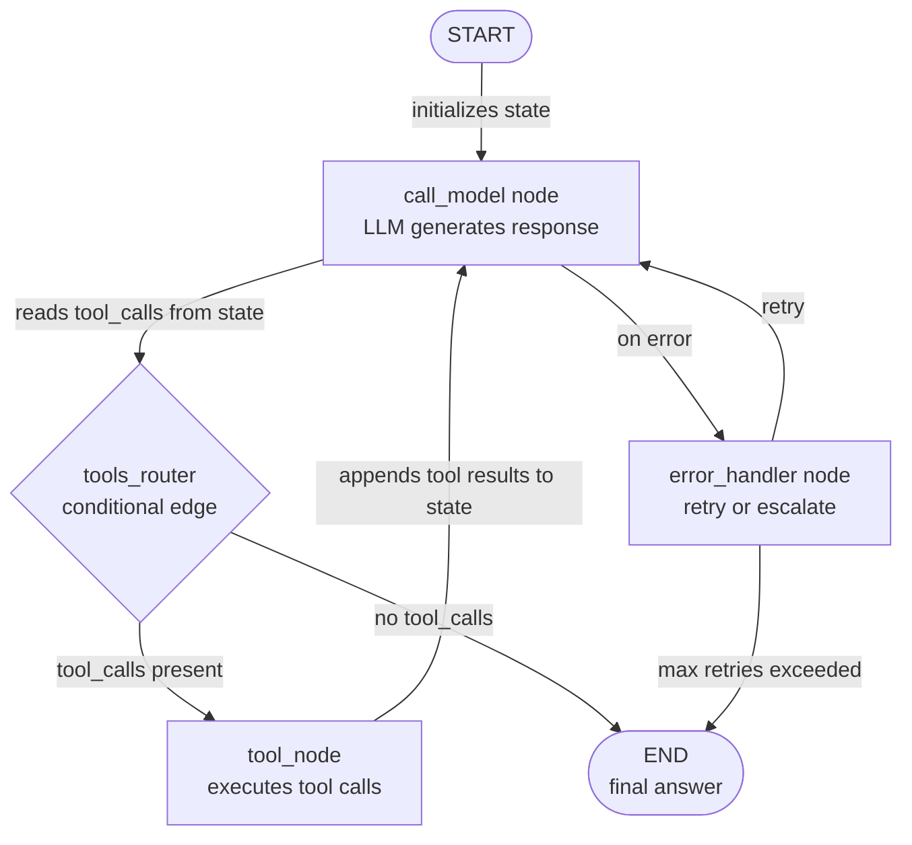

# LangGraph

## 定义

LangGraph 是一个基于 LangChain 构建的开源 Python 库，用于将**有状态代理工作流构建为显式有向图**。大多数代理框架将执行循环隐藏在不透明的 `run()` 调用后面，而 LangGraph 将其作为您可以检查、测试和修改的一等图对象公开。节点是普通的 Python 函数（每个可能调用 LLM、工具或任意逻辑）；边是节点间的转换；整个工作流共享一个**状态**对象——每个节点都可以读取和写入的类型化字典。

LangGraph 的关键洞察是，许多看似复杂的代理行为——循环直到满足条件、基于 LLM 响应内容进行分支、暂停等待人工批准、从保存的检查点恢复——都清晰地映射到图原语：循环、条件边、中断和持久化状态。这种显式性有成本（比 CrewAI 或 AutoGen 更多的样板代码），但在生产中有所回报：您可以隔离地对每个节点进行单元测试，精确追踪执行所走的路径，并从任何检查点重放工作流。

LangGraph 同时支持**单代理**模式（带几个节点在循环中调用工具的图）和**多代理**模式（组合在一起的多个子图，具有跨图状态共享）。它与 LangChain 的工具生态系统、聊天模型和 LangSmith 可观测性原生集成。该框架是 LangChain 自 2024-2025 年起推荐的生产代理架构的基础。

## 工作原理

### 节点：作为执行单元的 Python 函数

LangGraph 中的节点是任何接受当前状态并返回（部分）更新状态的 Python 可调用对象。节点通过 `graph.add_node("name", function)` 添加到图中。函数签名始终是 `(state: State) -> dict`——它从状态读取所需内容，执行工作（LLM 调用、工具执行、数据转换），并只返回它想要更新的键。这使节点易于独立测试：传入模拟状态，断言返回的字典。LangChain 的 `ToolNode` 是一个预构建节点，执行来自 LLM 响应的工具调用，涵盖了最常见的代理模式。

### 边：路由和条件分支

边连接节点并确定执行顺序。简单边（`graph.add_edge("a", "b")`）总是从节点 `a` 转换到节点 `b`。条件边（`graph.add_conditional_edges`）使用当前状态调用路由函数，并使用返回的字符串决定下一个节点。这是动态控制流的机制：LLM 生成响应后，路由器检查它是否包含工具调用（路由到 `tools`）或最终答案（路由到 `END`）。条件边使 LangGraph 比顺序流水线强大得多——您可以将复杂的决策树、重试逻辑和升级路径表示为可读的图结构。

### 状态：跨所有节点共享的 TypedDict

状态是 LangGraph 应用程序的支柱。您定义一个 `TypedDict`（或 Pydantic 模型），包含您的工作流需要的所有字段：消息、中间结果、标志、计数器。每个节点接收完整状态并只返回它修改的字段。LangGraph 使用**归约器**将部分更新与当前状态合并——默认情况下，赋值覆盖；使用 `add_messages` 归约器，消息列表是追加而不是替换。显式的状态类型意味着类型检查器可以在运行时之前捕获错误，任何检查点的状态快照是发生事情的完整、可检查记录。

### 循环、持久化和人机协作

LangGraph 原生处理循环：节点可以基于条件边回到前一个节点（或自身），支持代理重试循环、自我纠正模式和多轮工具使用，无需任何特殊处理。持久化由**检查点器**提供（SQLite、Postgres、Redis 或内存）：图在每次节点执行后保存完整状态，因此您可以在崩溃或中断后从任意点恢复。人机协作通过 `interrupt_before` 和 `interrupt_after` 实现——图在指定节点暂停，将当前状态呈现给调用者，接受人工输入，然后继续。这使 LangGraph 成为需要可审计、可中断、生产级代理流水线时的最佳选择。



## 适用场景 / 不适用场景

| 适用场景 | 不适用场景 |
|---|---|
| 您需要对代理执行的每个步骤进行细粒度控制 | 您想要声明式的高级 API，不需要步骤级控制 |
| 您需要持久化和在执行中途恢复工作流的能力 | 您的工作流简单而线性——链或单代理循环就足够了 |
| 需要在特定步骤进行人机协作审批 | 团队不熟悉图论，更喜欢更简单的思维模型 |
| 您正在构建需要完整可观测性和重放的生产系统 | 您的代理是不需要生产级可靠性的研究原型 |
| 您的工作流有难以线性表达的复杂条件分支或循环 | 多代理角色协调是您的主要需求——CrewAI 或 AutoGen 更简单 |

## 比较

| 标准 | LangGraph | CrewAI | AutoGen |
|---|---|---|---|
| **抽象级别** | 低：显式图、节点、边和状态 | 高：声明式角色、目标、任务 | 中等：带消息历史的对话代理 |
| **控制流** | 显式的条件边和循环 | 顺序或层级流程（不透明） | 消息驱动、轮次制（不透明） |
| **持久化** | 一等功能：SQLite、Postgres、Redis 的检查点器 | 未内置 | 未内置 |
| **人机协作** | 一等功能：`interrupt_before` / `interrupt_after` | 仅手动 | 一等功能：每个代理的 `human_input_mode` |
| **可测试性** | 高：节点是纯函数，易于单元测试 | 中等：任务可以测试，但团队执行是不透明的 | 低：对话流程难以确定性地进行单元测试 |

## 代码示例

```python
import os
from typing import Annotated, TypedDict, Literal
from langchain_anthropic import ChatAnthropic
from langchain_core.tools import tool
from langchain_core.messages import HumanMessage, AIMessage, BaseMessage
from langgraph.graph import StateGraph, END
from langgraph.graph.message import add_messages
from langgraph.prebuilt import ToolNode

# --- State definition ---
# add_messages is a reducer: it appends to the messages list instead of replacing it.
class AgentState(TypedDict):
    messages: Annotated[list[BaseMessage], add_messages]
    step_count: int  # track how many steps we have taken

# --- Tool definitions ---
# Tools are standard LangChain tools decorated with @tool.
# The docstring becomes the tool description sent to the LLM.

@tool
def search_web(query: str) -> str:
    """Search the web for current information on a topic."""
    # In production, replace with a real search API (Serper, Tavily, etc.)
    return f"Search results for '{query}': LangGraph is a stateful agent framework by LangChain."

@tool
def add_numbers(a: float, b: float) -> str:
    """Add two numbers together and return the result."""
    return f"Result: {a + b}"

tools = [search_web, add_numbers]

# --- LLM setup ---
# Bind tools to the model so it knows what functions are available.
llm = ChatAnthropic(model="claude-opus-4-5")
llm_with_tools = llm.bind_tools(tools)

# --- Node definitions ---
# Each node is a plain Python function: (state) -> partial state update.

def call_model(state: AgentState) -> dict:
    """Primary agent node: calls the LLM and returns its response."""
    response = llm_with_tools.invoke(state["messages"])
    return {
        "messages": [response],  # add_messages reducer will append this
        "step_count": state["step_count"] + 1,
    }

def handle_error(state: AgentState) -> dict:
    """Error handling node: appends a fallback message if something went wrong."""
    fallback = AIMessage(content="I encountered an error. Let me try a different approach.")
    return {"messages": [fallback]}

# --- Routing function (conditional edge) ---
# Returns the name of the next node based on the current state.

def should_continue(state: AgentState) -> Literal["tools", "end"]:
    """Route to tools if the LLM made tool calls, otherwise end."""
    last_message = state["messages"][-1]
    # Safety limit: stop after 10 steps to prevent infinite loops
    if state["step_count"] >= 10:
        return "end"
    if hasattr(last_message, "tool_calls") and last_message.tool_calls:
        return "tools"
    return "end"

# --- Graph construction ---
tool_node = ToolNode(tools)  # prebuilt node that executes tool calls

graph = StateGraph(AgentState)

# Add nodes
graph.add_node("agent", call_model)
graph.add_node("tools", tool_node)
graph.add_node("error_handler", handle_error)

# Set entry point
graph.set_entry_point("agent")

# Add conditional edge from agent: either call tools or end
graph.add_conditional_edges(
    "agent",
    should_continue,
    {
        "tools": "tools",  # route to tool execution
        "end": END,        # route to terminal node
    },
)

# After tool execution, always return to the agent (creates a cycle)
graph.add_edge("tools", "agent")

# Error handler routes back to agent for a retry
graph.add_edge("error_handler", "agent")

# Compile the graph into a runnable application
app = graph.compile()

# --- Optional: add persistence with a checkpointer ---
# from langgraph.checkpoint.sqlite import SqliteSaver
# memory = SqliteSaver.from_conn_string(":memory:")
# app = graph.compile(checkpointer=memory)
# Use config={"configurable": {"thread_id": "session-1"}} to resume sessions.

# --- Run the agent ---
initial_state = {
    "messages": [HumanMessage(content="What is LangGraph and what is 42 plus 17?")],
    "step_count": 0,
}

result = app.invoke(initial_state)
print("Final answer:", result["messages"][-1].content)
print("Total steps:", result["step_count"])

# --- Inspect the graph structure ---
# app.get_graph().print_ascii()  # print ASCII diagram of the graph
```

## 实用资源

- [LangGraph 官方文档](https://langchain-ai.github.io/langgraph/) — 图构建、状态管理、检查点器和人机协作模式的完整参考。
- [LangGraph GitHub 仓库](https://github.com/langchain-ai/langgraph) — 源代码、问题跟踪器和涵盖常见模式的示例笔记本。
- [LangGraph "How-to" 指南](https://langchain-ai.github.io/langgraph/how-tos/) — 持久化、流式传输、子图、多代理协调等实用配方。
- [LangGraph 的 LangSmith 追踪](https://docs.smith.langchain.com/) — 用于追踪 LangGraph 执行、检查每个节点状态和调试失败的可观测性平台。

## 另请参阅

- [代理框架概述](/docs/agents/frameworks-overview)
- [CrewAI](/docs/agents/crewai)
- [AutoGen](/docs/agents/autogen)
- [LangChain](/docs/tools/langchain)
- [多代理系统](/docs/agents/multi-agent-systems)
- [ReAct](/docs/reasoning-patterns/react)
