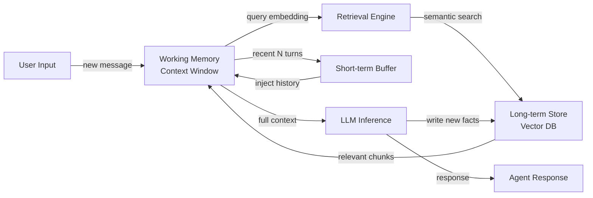

# 代理记忆

## 定义

Agentengedächtnis bezieht sich auf die Mechanismen, durch die ein KI-Agent Informationen im Verlauf seines Betriebs speichert, indiziert und abruft. Ohne Gedächtnis beginnt jede Interaktion bei einem leeren Blatt – der Agent kann nicht aus vergangenen Gesprächen lernen, Fakten akkumulieren oder den Zustand einer lang laufenden Aufgabe verfolgen. Gedächtnis verwandelt einen zustandslosen LLM-Aufruf in ein persistentes, zielorientiertes System.

In der Kognitionswissenschaft wird Gedächtnis in mehrere Typen unterteilt: Arbeitsgedächtnis (aktive Informationen, die gerade im Kopf gehalten werden), Kurzzeitgedächtnis (kürzliche Ereignisse, die für einen begrenzten Zeitraum behalten werden) und Langzeitgedächtnis (dauerhaftes Wissen, das unbegrenzt persistiert). KI-Agenten spiegeln diese Taxonomie eng wider. Das Kontextfenster des LLM fungiert als Arbeitsgedächtnis; ein gleitender Puffer kürzlicher Nachrichten dient als Kurzzeitgedächtnis; und ein externer Speicher – oft eine Vektordatenbank – dient als Langzeitgedächtnis.

Gedächtnis ermöglicht mehrstufiges Reasoning. Wenn ein Agent eine Folgefrage beantworten, einen Plan über mehrere Schritte ausführen oder sich an die Präferenzen eines Benutzers aus einer früheren Sitzung erinnern muss, greift er auf eine oder mehrere dieser Gedächtnisschichten zurück. Die richtige Gestaltung des Gedächtnisses bestimmt, ob ein Agent sich wie ein kenntnisreicher Assistent oder ein amnestischer Chatbot anfühlt.

## 工作原理

### Arbeitsgedächtnis und das Kontextfenster

Das Kontextfenster ist die unmittelbarste Form des Gedächtnisses, die für jeden LLM-gestützten Agenten verfügbar ist. Alle Nachrichten, Werkzeug-Ergebnisse und Zwischengedanken innerhalb eines einzigen Inferenzaufrufs befinden sich im Arbeitsgedächtnis. Typische Kontextfenster reichen von 8K bis 200K Token und setzen eine harte Obergrenze dafür, worüber der Agent aktiv nachdenken kann. Wenn diese Grenze erreicht wird, müssen ältere Informationen entweder zusammengefasst, komprimiert oder entfernt werden, um Platz zu schaffen. Arbeitsgedächtnis ist schnell und nulllatentig, aber vollständig flüchtig – es verschwindet, wenn der Aufruf endet.

### Kurzzeit-Pufferspeicher

Kurzzeitgedächtnis wird als rollierender Puffer implementiert, der die letzten N Gesprächsrunden hält. Wenn eine neue Runde eintrifft, wird die älteste Runde verworfen, wenn der Puffer voll ist. Dieser Ansatz ist einfach, günstig und ausreichend für Gesprächskontinuität innerhalb einer einzigen Sitzung. Der Puffer wird üblicherweise serialisiert und zu Beginn jedes neuen Inferenzaufrufs zurück in das Kontextfenster übergeben. Seine Hauptbeschränkung ist, dass er nicht für lange Sitzungen oder sitzungsübergreifenden Abruf skaliert.

### Langzeit-Semantikspeicher

Langzeitgedächtnis verwendet einen externen persistenten Speicher – typischerweise eine Vektordatenbank – um Einbettungen vergangener Ereignisse, Fakten und Zusammenfassungen zu halten. Wenn der Agent sich an etwas erinnern muss, bettet er die aktuelle Anfrage ein und führt eine Approximate-Nearest-Neighbor-Suche durch, um die semantisch relevantesten Erinnerungen abzurufen. Abgerufene Chunks werden vor der Inferenz in das Kontextfenster eingefügt. Dieses Muster skaliert auf Millionen gespeicherter Fakten und unterstützt sitzungsübergreifenden Abruf, fügt aber Abruf-Latenz hinzu und erfordert ein Einbettungsmodell.

### Episodisches vs. semantisches Gedächtnis

Episodisches Gedächtnis speichert spezifische vergangene Ereignisse mit ihrem Kontext: „In Sitzung 23 fragte der Benutzer nach der Rückgaberichtlinie und war frustriert." Semantisches Gedächtnis speichert allgemeines Weltwissen oder akkumulierte Fakten: „Das Rückgabefenster beträgt 30 Tage." Beide Typen können im selben Vektorspeicher koexistieren, unterschieden durch Metadaten. Episodisches Gedächtnis ist wertvoll für Personalisierung; semantisches Gedächtnis ist wertvoll, um den Agenten in Domänenwissen zu verankern.

### Abrufschleife

Die Abrufschleife verbindet alle Schichten. Bei jeder Runde fragt der Agent das Langzeitgedächtnis nach relevantem Kontext, fügt diesen mit dem Kurzzeit-Puffer zusammen und speist den kombinierten Kontext in das Arbeitsgedächtnis des LLM ein. Nach der Generierung können wichtige Fakten aus der neuen Runde zurück in den Langzeitspeicher geschrieben werden, was die Schleife schließt.



## 何时使用 / 何时不使用

| 使用场景 | 避免场景 |
|---|---|
| Der Agent Informationen aus früheren Sitzungen oder Runden abrufen muss | Die Aufgabe vollständig in einem einzigen Prompt selbstenthalten ist und keine Folgefragen hat |
| Benutzer Personalisierung basierend auf vergangenen Interaktionen erwarten | Speicherkosten oder Latenz für den Anwendungsfall inakzeptabel sind |
| Der Agent lang laufende Aufgaben mit vielen Zwischenergebnissen verfolgt | Das Kontextfenster groß genug ist, um alle relevanten Informationen zu halten |
| Domänenwissen das hineinpasst, was in ein einzelnes Kontextfenster passt, übersteigt | Datenschutzanforderungen das Speichern von Benutzergesprächen verbieten |
| Konsistentes Verhalten über mehrere Agenten-Aufrufe hinweg benötigt wird | Die hinzugefügte Komplexität den marginalen Nutzen der Persistenz überwiegt |

## 优缺点

| 优点 | 缺点 |
|---|---|
| Ermöglicht mehrstufige und sitzungsübergreifende Kontinuität | Langzeitspeicher fügen Abruf-Latenz hinzu |
| Unterstützt Personalisierung und benutzerspezifischen Kontext | Vektordatenbanken führen Infrastrukturkomplexität ein |
| Skaliert jenseits von Kontextfenstergrenzen | Abrufqualität hängt von der Genauigkeit des Einbettungsmodells ab |
| Episodisches Gedächtnis verbessert die Benutzererfahrung erheblich | Gedächtnisveralterung erfordert Eviktions- oder Update-Strategien |
| Semantisches Gedächtnis verankert den Agenten in Domänenwissen | Datenschutz- und Datenhaltungsrichtlinien müssen explizit verwaltet werden |

## 代码示例

```python
"""
Simple agent memory implementation combining a list-based short-term buffer
with a vector-based long-term store using sentence-transformers and numpy.
"""
from __future__ import annotations

import json
import numpy as np
from dataclasses import dataclass, field
from typing import Optional
from sentence_transformers import SentenceTransformer  # pip install sentence-transformers


# ---------------------------------------------------------------------------
# Short-term buffer memory (last N turns)
# ---------------------------------------------------------------------------

@dataclass
class ShortTermMemory:
    """Keeps the most recent `max_turns` conversation turns in a list."""
    max_turns: int = 10
    turns: list[dict] = field(default_factory=list)

    def add(self, role: str, content: str) -> None:
        self.turns.append({"role": role, "content": content})
        # Evict oldest turn when capacity is exceeded
        if len(self.turns) > self.max_turns:
            self.turns.pop(0)

    def get_history(self) -> list[dict]:
        """Return all buffered turns for injection into the context window."""
        return list(self.turns)


# ---------------------------------------------------------------------------
# Long-term vector memory (semantic retrieval)
# ---------------------------------------------------------------------------

@dataclass
class LongTermMemory:
    """
    Simple in-memory vector store backed by numpy.
    In production, replace with Chroma, Pinecone, or pgvector.
    """
    model_name: str = "all-MiniLM-L6-v2"
    _model: Optional[SentenceTransformer] = field(default=None, init=False, repr=False)
    _texts: list[str] = field(default_factory=list, init=False)
    _embeddings: Optional[np.ndarray] = field(default=None, init=False)

    @property
    def model(self) -> SentenceTransformer:
        if self._model is None:
            self._model = SentenceTransformer(self.model_name)
        return self._model

    def store(self, text: str) -> None:
        """Embed and store a piece of text in long-term memory."""
        embedding = self.model.encode([text])  # shape: (1, dim)
        self._texts.append(text)
        if self._embeddings is None:
            self._embeddings = embedding
        else:
            self._embeddings = np.vstack([self._embeddings, embedding])

    def retrieve(self, query: str, top_k: int = 3) -> list[str]:
        """Return the top_k most semantically similar stored memories."""
        if not self._texts:
            return []
        query_emb = self.model.encode([query])  # shape: (1, dim)
        # Cosine similarity
        norms = np.linalg.norm(self._embeddings, axis=1, keepdims=True)
        normed = self._embeddings / (norms + 1e-9)
        query_norm = query_emb / (np.linalg.norm(query_emb) + 1e-9)
        scores = (normed @ query_norm.T).flatten()
        top_indices = np.argsort(scores)[::-1][:top_k]
        return [self._texts[i] for i in top_indices]


# ---------------------------------------------------------------------------
# Agent with combined memory
# ---------------------------------------------------------------------------

class MemoryAgent:
    """
    A simple agent that combines short-term buffer and long-term vector memory.
    Uses a mock LLM call for illustration; replace with openai.chat.completions.create.
    """

    def __init__(self, max_short_term_turns: int = 6):
        self.short_term = ShortTermMemory(max_turns=max_short_term_turns)
        self.long_term = LongTermMemory()
        self.system_prompt = "You are a helpful assistant with access to past context."

    def _build_context(self, user_message: str) -> list[dict]:
        """Combine long-term retrieval + short-term buffer into a message list."""
        # Retrieve relevant memories from long-term store
        memories = self.long_term.retrieve(user_message, top_k=3)
        memory_block = "\n".join(f"- {m}" for m in memories) if memories else "None"

        messages = [
            {"role": "system", "content": self.system_prompt},
            {"role": "system", "content": f"Relevant past context:\n{memory_block}"},
        ]
        # Append recent conversation history
        messages.extend(self.short_term.get_history())
        # Append the current user message
        messages.append({"role": "user", "content": user_message})
        return messages

    def chat(self, user_message: str) -> str:
        """Process a user message and return the agent's response."""
        messages = self._build_context(user_message)

        # --- Replace this mock with a real LLM call ---
        # import openai
        # response = openai.chat.completions.create(model="gpt-4o", messages=messages)
        # reply = response.choices[0].message.content
        reply = f"[Mock LLM reply to: {user_message!r} with {len(messages)} context messages]"
        # ----------------------------------------------

        # Update short-term buffer
        self.short_term.add("user", user_message)
        self.short_term.add("assistant", reply)

        # Write important facts to long-term memory (in production, use LLM to decide)
        self.long_term.store(f"User said: {user_message}")
        self.long_term.store(f"Assistant replied: {reply}")

        return reply


# ---------------------------------------------------------------------------
# Example usage
# ---------------------------------------------------------------------------
if __name__ == "__main__":
    agent = MemoryAgent(max_short_term_turns=4)

    turns = [
        "My name is Alice and I prefer concise answers.",
        "What is the capital of France?",
        "What did I say my name was?",
    ]
    for turn in turns:
        print(f"User: {turn}")
        print(f"Agent: {agent.chat(turn)}\n")
```

## 实用资源

- [LangChain Memory Concepts](https://python.langchain.com/docs/concepts/memory/) — Offizielle LangChain-Dokumentation zu allen eingebauten Gedächtnistypen und wann jeder angewendet werden sollte.
- [MemGPT: Towards LLMs as Operating Systems](https://arxiv.org/abs/2310.08560) — Forschungspaper, das virtuelles Kontextverwaltung für unbegrenzte Agenten-Gedächtniskapazität einführt, vergleichbar mit virtuellem OS-Speicher.
- [Chroma – Open-source embedding database](https://docs.trychroma.com/) — Beliebter leichtgewichtiger Vektorspeicher, der in vielen Agenten-Gedächtnisimplementierungen verwendet wird.
- [OpenAI Assistants Threads](https://platform.openai.com/docs/assistants/how-it-works/managing-threads) — Wie OpenAIs verwaltete Agenten-API Gesprächs-Threads und persistenten Speicher behandelt.

## 另见

- [AI agents](/docs/agents)
- [Conversational memory](/docs/agents/conversational-memory)
- [RAG](/docs/rag)
