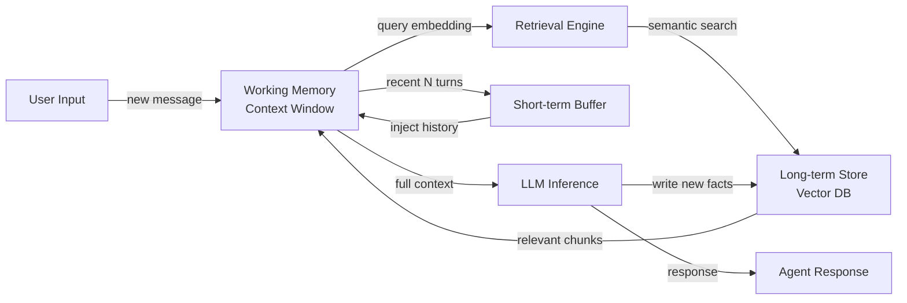

# 代理记忆

## 定义

代理记忆是指 AI 代理在其操作过程中存储、索引和检索信息的机制。没有记忆，每次交互都从空白状态开始——代理无法从过去的对话中学习、积累事实或追踪长期运行任务的状态。记忆将无状态的 LLM 调用转化为持久的、目标导向的系统。

在认知科学中，记忆分为几种类型：工作记忆（当前活跃在脑中的信息）、短期记忆（在有限时间内保留的近期事件）和长期记忆（无限期持续的持久知识）。AI 代理与这种分类紧密对应。LLM 的上下文窗口充当工作记忆；最近消息的滑动缓冲区充当短期记忆；外部存储——通常是向量数据库——充当长期记忆。

记忆是实现多轮推理的关键。当代理需要回答后续问题、在多个步骤中执行计划，或记住上一次会话中用户的偏好时，它就在使用这些记忆层中的一个或多个。正确设计记忆决定了代理是感觉像知识渊博的助手还是健忘的聊天机器人。

## 工作原理

### 工作记忆和上下文窗口

上下文窗口是任何 LLM 支持的代理可用的最直接的记忆形式。单次推理调用中的所有消息、工具结果和中间思维都驻留在工作记忆中。典型的上下文窗口从 8K 到 200K 令牌不等，为代理可以主动推理的内容设置了硬性上限。当接近这个限制时，旧信息必须被摘要、压缩或驱逐以腾出空间。工作记忆快速且零延迟，但完全是挥发性的——调用结束时就消失了。

### 短期缓冲区记忆

短期记忆实现为持有最后 N 次对话轮次的滚动缓冲区。当新轮次到来时，如果缓冲区已满，最旧的轮次被丢弃。这种方法简单、廉价，足以在单次会话内保持对话连贯性。缓冲区通常在每次新推理调用开始时被序列化并传回上下文窗口。其主要限制是不能扩展到长会话或跨会话回忆。

### 长期语义记忆

长期记忆使用外部持久存储——通常是向量数据库——来保存过去事件、事实和摘要的嵌入。当代理需要回忆某些内容时，它嵌入当前查询并执行近似最近邻搜索以检索最语义相关的记忆。检索到的块在推理之前注入到上下文窗口中。这种模式可以扩展到数百万个存储的事实并支持跨会话回忆，但增加了检索延迟并需要嵌入模型。

### 情节记忆与语义记忆

情节记忆（Episodic memory）存储带有上下文的特定过去事件："在第 23 次会话中，用户询问了退款政策并感到沮丧。"语义记忆（Semantic memory）存储一般世界知识或积累的事实："退款窗口为 30 天。"两种类型可以共存于同一向量存储中，通过元数据区分。情节记忆对个性化有价值；语义记忆对将代理植根于领域知识有价值。

### 检索循环

检索循环连接所有层。在每轮，代理查询长期记忆以获取相关上下文，将其与短期缓冲区合并，并将组合上下文输入 LLM 的工作记忆。生成后，新轮次的重要事实可以写回长期存储，完成循环。



## 适用场景 / 不适用场景

| 适用场景 | 不适用场景 |
|---|---|
| 代理必须回忆来自以前会话或轮次的信息 | 任务在单一提示中完全自包含，无需后续跟进 |
| 用户期望基于过去交互的个性化 | 记忆存储成本或延迟对用例不可接受 |
| 代理追踪带有许多中间结果的长期运行任务 | 上下文窗口足够大以容纳所有相关信息 |
| 领域知识超出单一上下文窗口的容量 | 隐私要求禁止存储用户对话数据 |
| 您需要跨多次代理调用的一致行为 | 增加的复杂性超过了持久性的边际收益 |

## 优缺点

| 优点 | 缺点 |
|---|---|
| 支持多轮和跨会话连续性 | 长期存储增加检索延迟 |
| 支持个性化和用户特定上下文 | 向量数据库引入基础设施复杂性 |
| 可扩展超出上下文窗口限制 | 检索质量取决于嵌入模型准确性 |
| 情节记忆显著改善用户体验 | 记忆过时需要驱逐或更新策略 |
| 语义记忆将代理植根于领域知识 | 必须明确管理隐私和数据保留政策 |

## 代码示例

```python
"""
Simple agent memory implementation combining a list-based short-term buffer
with a vector-based long-term store using sentence-transformers and numpy.
"""
from __future__ import annotations

import json
import numpy as np
from dataclasses import dataclass, field
from typing import Optional
from sentence_transformers import SentenceTransformer  # pip install sentence-transformers


# ---------------------------------------------------------------------------
# Short-term buffer memory (last N turns)
# ---------------------------------------------------------------------------

@dataclass
class ShortTermMemory:
    """Keeps the most recent `max_turns` conversation turns in a list."""
    max_turns: int = 10
    turns: list[dict] = field(default_factory=list)

    def add(self, role: str, content: str) -> None:
        self.turns.append({"role": role, "content": content})
        # Evict oldest turn when capacity is exceeded
        if len(self.turns) > self.max_turns:
            self.turns.pop(0)

    def get_history(self) -> list[dict]:
        """Return all buffered turns for injection into the context window."""
        return list(self.turns)


# ---------------------------------------------------------------------------
# Long-term vector memory (semantic retrieval)
# ---------------------------------------------------------------------------

@dataclass
class LongTermMemory:
    """
    Simple in-memory vector store backed by numpy.
    In production, replace with Chroma, Pinecone, or pgvector.
    """
    model_name: str = "all-MiniLM-L6-v2"
    _model: Optional[SentenceTransformer] = field(default=None, init=False, repr=False)
    _texts: list[str] = field(default_factory=list, init=False)
    _embeddings: Optional[np.ndarray] = field(default=None, init=False)

    @property
    def model(self) -> SentenceTransformer:
        if self._model is None:
            self._model = SentenceTransformer(self.model_name)
        return self._model

    def store(self, text: str) -> None:
        """Embed and store a piece of text in long-term memory."""
        embedding = self.model.encode([text])  # shape: (1, dim)
        self._texts.append(text)
        if self._embeddings is None:
            self._embeddings = embedding
        else:
            self._embeddings = np.vstack([self._embeddings, embedding])

    def retrieve(self, query: str, top_k: int = 3) -> list[str]:
        """Return the top_k most semantically similar stored memories."""
        if not self._texts:
            return []
        query_emb = self.model.encode([query])  # shape: (1, dim)
        # Cosine similarity
        norms = np.linalg.norm(self._embeddings, axis=1, keepdims=True)
        normed = self._embeddings / (norms + 1e-9)
        query_norm = query_emb / (np.linalg.norm(query_emb) + 1e-9)
        scores = (normed @ query_norm.T).flatten()
        top_indices = np.argsort(scores)[::-1][:top_k]
        return [self._texts[i] for i in top_indices]


# ---------------------------------------------------------------------------
# Agent with combined memory
# ---------------------------------------------------------------------------

class MemoryAgent:
    """
    A simple agent that combines short-term buffer and long-term vector memory.
    Uses a mock LLM call for illustration; replace with openai.chat.completions.create.
    """

    def __init__(self, max_short_term_turns: int = 6):
        self.short_term = ShortTermMemory(max_turns=max_short_term_turns)
        self.long_term = LongTermMemory()
        self.system_prompt = "You are a helpful assistant with access to past context."

    def _build_context(self, user_message: str) -> list[dict]:
        """Combine long-term retrieval + short-term buffer into a message list."""
        # Retrieve relevant memories from long-term store
        memories = self.long_term.retrieve(user_message, top_k=3)
        memory_block = "\n".join(f"- {m}" for m in memories) if memories else "None"

        messages = [
            {"role": "system", "content": self.system_prompt},
            {"role": "system", "content": f"Relevant past context:\n{memory_block}"},
        ]
        # Append recent conversation history
        messages.extend(self.short_term.get_history())
        # Append the current user message
        messages.append({"role": "user", "content": user_message})
        return messages

    def chat(self, user_message: str) -> str:
        """Process a user message and return the agent's response."""
        messages = self._build_context(user_message)

        # --- Replace this mock with a real LLM call ---
        # import openai
        # response = openai.chat.completions.create(model="gpt-4o", messages=messages)
        # reply = response.choices[0].message.content
        reply = f"[Mock LLM reply to: {user_message!r} with {len(messages)} context messages]"
        # ----------------------------------------------

        # Update short-term buffer
        self.short_term.add("user", user_message)
        self.short_term.add("assistant", reply)

        # Write important facts to long-term memory (in production, use LLM to decide)
        self.long_term.store(f"User said: {user_message}")
        self.long_term.store(f"Assistant replied: {reply}")

        return reply


# ---------------------------------------------------------------------------
# Example usage
# ---------------------------------------------------------------------------
if __name__ == "__main__":
    agent = MemoryAgent(max_short_term_turns=4)

    turns = [
        "My name is Alice and I prefer concise answers.",
        "What is the capital of France?",
        "What did I say my name was?",
    ]
    for turn in turns:
        print(f"User: {turn}")
        print(f"Agent: {agent.chat(turn)}\n")
```

## 实用资源

- [LangChain 记忆概念](https://python.langchain.com/docs/concepts/memory/) — 官方 LangChain 文档，涵盖所有内置记忆类型及何时应用每种类型。
- [MemGPT：面向 LLM 的操作系统](https://arxiv.org/abs/2310.08560) — 介绍无限代理记忆的虚拟上下文管理的研究论文，类比操作系统虚拟内存。
- [Chroma——开源嵌入数据库](https://docs.trychroma.com/) — 许多代理记忆实现中使用的流行轻量级向量存储。
- [OpenAI Assistants Threads](https://platform.openai.com/docs/assistants/how-it-works/managing-threads) — OpenAI 托管代理 API 如何处理对话线程和持久记忆。

## 另请参阅

- [AI 代理](/docs/agents)
- [对话记忆](/docs/agents/conversational-memory)
- [RAG](/docs/rag)
