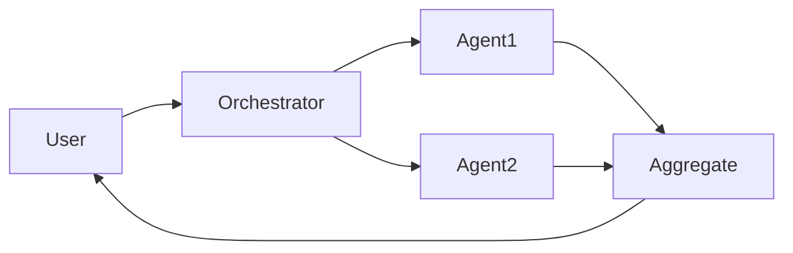

# 多智能体系统

## 定义

多智能体系统涉及多个 AI 智能体交互以解决任务: collaboration (divide work, share state), debate (argue and refine answers), or specialized roles (planner, executor, critic).

They extend single [agents](/docs/agents) when one model or one loop is insufficient: 例如 one agent for [RAG](/docs/rag) 检索, another for generation, another for critique. [Subagents](/docs/subagents) are a hierarchical form where a root agent delegates to children; here we focus on flat or peer-to-peer multi-agent patterns.

## 工作原理

**用户**向**编排器**（可以是 LLM 或固定工作流）发送任务。编排器将工作分配给 **Agent1**、**Agent2** 等tc., each with its own role, tools, and optionally model. Agents may share a common state, pass messages, or be invoked in sequence/parallel. Their outputs are **aggregated** (例如 combined, voted, or summarized) and returned to the user. Design choices include role assignment, communication protocol, and conflict resolution. MAS are useful when you want **modularity** (each agent has a clear responsibility), **specialization** (different models or tools per role), **reusability** (same agent in different workflows), and **structured control flow**.

## 应用场景

当单个智能体不够时，多智能体系统可以提供帮助：你需要不同的角色、辩论或模块化管道。

- Orchestrating planner, executor, and critic agents for complex tasks
- Debate or review flows where multiple agents refine an answer
- Specialized pipelines (例如 one agent for 检索, one for generation)

## 外部文档

- [From Prototypes to Agents with ADK – Google Codelabs](https://codelabs.developers.google.com/your-first-agent-with-adk#0) — ADK supports composing multiple agents into a multi-agent system
- [LangChain – Multi-agent](https://python.langchain.com/docs/concepts/multi_agent/) — Multi-agent orchestration patterns

## 另请参阅

- [Agents](/docs/agents)
- [Subagents](/docs/subagents)
- [Autonomous agents](/docs/autonomous-agents)
