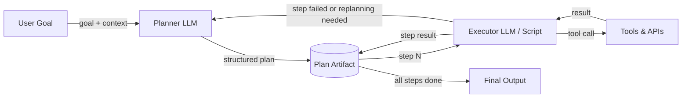

# 规划器-执行器架构

## 定义

规划器-执行器架构将*决定做什么*的关注点与*执行它*的关注点分离。**规划器** LLM 接收高级目标并生成结构化的逐步计划——共同完成目标的子任务序列。**执行器** LLM（或确定性程序）然后逐步执行计划，调用工具并产生结果。两个组件通过共享的计划工件而不是单个整体提示进行通信。

这种关注点分离解决了单代理 ReAct 循环的基本限制：当任务复杂时，要求一个 LLM 同时推理策略、选择下一个行动并处理低级工具细节会导致错误和幻觉。通过将高级分解委托给规划器和低级执行委托给执行器，每个组件都可以独立优化、提示和监控。规划器可以使用更有能力的模型；执行器可以是更快、更便宜的模型，甚至是非 LLM 程序。

计划细化和重新规划是基本架构的关键扩展。现实世界的任务很少按预期展开：工具调用可能失败、网页可能返回意外数据，或者中间结果可能揭示原始计划是错误的。健壮的规划器-执行器系统监控执行结果，并在需要重新规划时重新调用规划器。这个反馈循环将脆弱的流水线变成了自适应代理。

## 工作原理

### 规划器

规划器接收用户的目标以及可用工具和任何相关上下文。它输出结构化计划——通常是步骤对象的 JSON 列表，每个步骤描述子任务、预期输入/输出，以及可选的使用哪个工具。良好的规划提示包含工具 schema，以便规划器可以准确地引用它们。规划器自身不调用任何工具；它只推理所需的操作序列。温度通常应较低，以产生确定性、结构良好的计划。

### 计划工件

计划是规划器和执行器之间的契约。它是一个机器可读的文档（JSON 或结构化文本），编码步骤序列、它们的依赖关系和预期结果。将计划存储为显式工件——而不是隐式保留在模型的思维链中——使系统可审计、可暂停和可恢复。可以在此处插入人机协作审批步骤，允许用户在执行开始前审查和编辑计划。

### 执行器

执行器逐步读取计划，解析对先前步骤输出的任何输入引用，调用适当的工具，并记录结果。执行器可以是第二个 LLM（当步骤需要自然语言推理时有用）、确定性脚本（对于像 API 调用这样的结构化步骤有用）或两者的混合。每个步骤后，结果写回计划工件，以便后续步骤可以引用它。如果步骤失败，执行器标记它并可选地触发重新规划。

### 重新规划循环

当执行与计划偏离时——由于工具失败、意外输出或条件变化——控制权返回给规划器，并带有部分执行记录。规划器根据新信息修改剩余步骤。重新规划可以自动触发（例如，在任何步骤失败时）或在每个步骤后触发以实现最大适应性。限制重新规划迭代可防止无限循环。



## 适用场景 / 不适用场景

| 适用场景 | 不适用场景 |
|---|---|
| 任务需要难以提前枚举的多个顺序步骤 | 任务对于单次 LLM 调用或 ReAct 循环足够简单 |
| 您希望在执行开始前进行人工审查或批准 | 延迟至关重要，额外的规划器调用不可接受 |
| 执行步骤具有明确的依赖关系，可以独立验证 | 计划结构是微不足道的，增加了不必要的复杂性 |
| 您需要审计代理做了什么以及每个步骤为什么被采取 | 任务是探索性的，根本无法提前规划 |
| 失败时的重新规划对可靠性很重要 | 工具 API 非常不可靠，以至于任何计划都无法在第一次接触时存活 |

## 比较

| 标准 | 规划器-执行器 | 单一 ReAct 代理 | 基于 DAG 的代理 |
|---|---|---|---|
| 关注点分离 | 高——规划和执行是不同的 | 无——一个代理同时完成两者 | 高——每个节点是独立的单元 |
| 适应性/重新规划 | 中等——重新规划增加一次往返 | 高——代理在每个步骤调整 | 低——DAG 结构通常是固定的 |
| 可审计性 | 高——计划工件是显式的 | 低——推理只在上下文中 | 高——图结构是显式的 |
| 并行性 | 默认无 | 无 | 原生——独立分支并行运行 |
| 实现复杂度 | 中等 | 低 | 高 |
| 最适合 | 具有顺序依赖的多步骤任务 | 探索性、动态任务 | 具有已知可并行化子任务的任务 |

## 代码示例

```python
"""
Planner-Executor implementation using the OpenAI API.

The Planner produces a JSON plan; the Executor steps through it,
calling mock tools and writing results back. Replanning is triggered
on step failure.
"""
from __future__ import annotations

import json
import os
from typing import Any

from openai import OpenAI  # pip install openai

client = OpenAI(api_key=os.environ.get("OPENAI_API_KEY", "sk-placeholder"))

# ---------------------------------------------------------------------------
# Mock tools
# ---------------------------------------------------------------------------

def web_search(query: str) -> str:
    """Mock web search tool."""
    return f"[Search result for '{query}': Found 5 relevant pages about {query}.]"

def summarize_text(text: str) -> str:
    """Mock summarizer tool."""
    return f"[Summary of: {text[:40]}...]"

def write_report(sections: list[str]) -> str:
    """Mock report writer tool."""
    return f"[Report written with {len(sections)} sections.]"

TOOLS: dict[str, Any] = {
    "web_search": web_search,
    "summarize_text": summarize_text,
    "write_report": write_report,
}

# ---------------------------------------------------------------------------
# Planner
# ---------------------------------------------------------------------------

PLANNER_SYSTEM = """
You are a planning assistant. Given a goal and available tools, produce a JSON plan.
The plan is a list of steps. Each step has:
  - "id": int (1-indexed)
  - "description": str (what this step does)
  - "tool": str (tool name from the available list, or "none")
  - "input": str (what to pass to the tool, may reference prior steps as {step_N_result})
  - "depends_on": list[int] (ids of steps that must complete first)

Return ONLY valid JSON — no markdown, no prose.
Available tools: web_search, summarize_text, write_report
"""

def create_plan(goal: str, context: str = "") -> list[dict]:
    """Call the Planner LLM to create a structured plan for the given goal."""
    user_msg = f"Goal: {goal}\n\nAdditional context: {context}" if context else f"Goal: {goal}"
    response = client.chat.completions.create(
        model="gpt-4o-mini",
        temperature=0,
        response_format={"type": "json_object"},
        messages=[
            {"role": "system", "content": PLANNER_SYSTEM},
            {"role": "user", "content": user_msg},
        ],
    )
    raw = response.choices[0].message.content
    parsed = json.loads(raw)
    # Handle both {"steps": [...]} and bare [...]
    return parsed.get("steps", parsed) if isinstance(parsed, dict) else parsed


# ---------------------------------------------------------------------------
# Executor
# ---------------------------------------------------------------------------

def resolve_input(template: str, results: dict[int, str]) -> str:
    """Replace {step_N_result} placeholders with actual results."""
    for step_id, result in results.items():
        template = template.replace(f"{{step_{step_id}_result}}", result)
    return template

def execute_plan(plan: list[dict]) -> dict[int, str]:
    """
    Execute each step sequentially, respecting dependencies.
    Returns a mapping of step_id -> result string.
    """
    results: dict[int, str] = {}

    for step in plan:
        step_id = step["id"]
        tool_name = step.get("tool", "none")
        raw_input = step.get("input", "")
        resolved_input = resolve_input(raw_input, results)

        print(f"  Step {step_id}: {step['description']}")

        if tool_name != "none" and tool_name in TOOLS:
            try:
                result = TOOLS[tool_name](resolved_input)
            except Exception as exc:
                # Signal failure for potential replanning
                result = f"ERROR: {exc}"
                print(f"    [FAILED] {result}")
        else:
            result = f"[No tool — step noted: {resolved_input}]"

        results[step_id] = result
        print(f"    Result: {result}\n")

    return results


# ---------------------------------------------------------------------------
# Planner-Executor orchestration with simple replanning
# ---------------------------------------------------------------------------

def run_planner_executor(goal: str, max_replan_attempts: int = 2) -> str:
    """
    Full Planner-Executor loop with replanning on failure.
    Returns the result of the last step as the final output.
    """
    attempt = 0
    context = ""

    while attempt <= max_replan_attempts:
        print(f"\n--- Planning (attempt {attempt + 1}) ---")
        plan = create_plan(goal, context=context)
        print(f"Plan has {len(plan)} steps.")

        print("\n--- Executing ---")
        results = execute_plan(plan)

        # Check for failures
        failures = {sid: r for sid, r in results.items() if r.startswith("ERROR")}
        if not failures:
            # Return the result of the last step
            last_id = max(results.keys())
            return results[last_id]

        # Build replanning context
        context = (
            f"Previous plan failed at steps: {list(failures.keys())}. "
            f"Errors: {failures}. Please revise the plan to avoid these failures."
        )
        attempt += 1

    return "Max replanning attempts reached. Could not complete goal."


if __name__ == "__main__":
    goal = "Research the latest trends in renewable energy and write a brief report."
    final = run_planner_executor(goal)
    print(f"\nFinal output:\n{final}")
```

## 实用资源

- [Plan-and-Solve Prompting（Wang 等人，2023）](https://arxiv.org/abs/2305.04091) — 展示将规划与解决分离比标准思维链提高推理准确性的论文。
- [LangGraph——计划并执行代理](https://langchain-ai.github.io/langgraph/tutorials/plan-and-execute/plan-and-execute/) — 实现带重新规划的规划器-执行器循环的官方 LangGraph 教程。
- [LLM Compiler（Kim 等人，2023）](https://arxiv.org/abs/2312.04511) — 通过并行执行独立计划步骤扩展规划器-执行器。
- [Anthropic——构建有效代理](https://www.anthropic.com/research/building-effective-agents) — 关于代理架构的实用指导，包括编排器-子代理模式。

## 另请参阅

- [AI 代理](/docs/agents)
- [基于 DAG 的代理](/docs/agents/dag-agents)
- [思维链推理](/docs/reasoning-patterns/cot)
