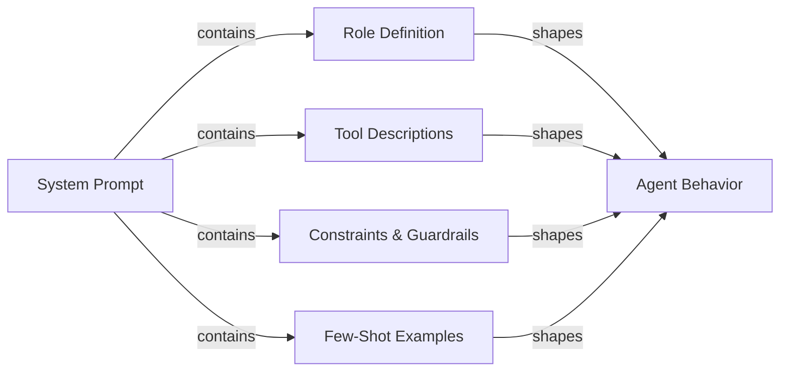

# 代理提示工程

## 定义

代理提示工程（Prompt Engineering）是编写系统提示和工具定义的技艺，能够可靠地从 AI 代理产生您想要的行为。与面向单轮聊天机器人的提示工程——您主要关注格式和语气——不同，代理提示必须在无限步骤序列中控制多步骤推理、工具选择纪律、约束遵守、错误恢复和终止条件。编写不好的代理提示会产生无休止循环、以错误参数调用工具、忽视用户约束或在工具失败时编造结果的代理。

系统提示是代理的宪法。它定义了代理是什么、能做什么、绝不能做什么、应该如何推理以及其输出应该是什么样子。由于 LLM 对措辞、结构和顺序高度敏感，系统提示的微小变化可能产生巨大的行为影响。因此，代理提示工程是一个迭代的、经验性的学科：您编写提示、针对任务数据集评估它、识别失败模式并进行改进。LangSmith 和 DeepEval 等工具（参见[评估](/docs/agents/evaluation)）使这个反馈循环更快。

良好的代理提示是模块化和明确的。它们将角色定义、能力声明、约束规范、输出格式规则和少样本示例分为明确划分的部分。这种结构使提示更易于维护、审计和扩展，随着代理能力的发展。它还帮助 LLM 为每个部分激活正确的"模式"，而不是混合关注点。

## 工作原理



### 角色定义

角色定义告诉代理它是谁、其主要目的是什么，以及采用什么角色。良好的角色定义是具体的："您是一位专攻 Python 和 PostgreSQL 的高级软件工程师，帮助开发者调试生产问题"比"您是一个有用的助手"更有用。具体性激活相关知识并设置适当的响应语气。角色还应建立代理与用户的关系（同伴、助手、专家），这影响代理如何处理不确定性和不同意见。保持角色定义简洁（3-5 句话），并将其放在系统提示的第一位，以便它框架所有后续指令。

### 工具描述和工具选择

代理可以访问的每个工具都必须被精确描述。工具名称、描述、参数名称、参数类型和返回格式都应该说明清楚。模糊的工具描述是工具选择不正确和参数格式错误的最常见原因之一。包括：工具做什么、何时使用它（以及关键的，何时不使用），它期望什么输入，以及期望什么输出格式。对于具有相似用途的工具，添加明确的消歧义："使用 `search_web` 查找当前事件和新闻；使用 `search_documents` 查询内部公司知识库。"正确工具调用的少样本示例（在系统提示中或作为对话历史）显著减少工具选择错误。

### 代理的思维链

思维链（CoT）提示要求代理在行动之前明确推理。对于代理，这意味着思考：用户在要求什么、我有什么信息、我需要什么信息、接下来我应该调用哪个工具，以及我期望结果是什么样的。指示代理在行动前推理（"在调用任何工具之前，简要说明您的计划"）提高了复杂多步骤任务的准确性，并使追踪更易于解释。一些框架（ReAct，参见 [ReAct](/docs/reasoning-patterns/react)）将此形式化为思想/行动/观察循环。在提示中明确说明推理是否应该在输出中还是只在草稿本中。

### 提示中的约束和护栏

约束定义了代理不能做的事情。它们应该尽可能以积极方式表述（"在删除数据之前始终寻求确认"）而不仅仅是负面的（"永远不要在不询问的情况下删除数据"）。包括：范围约束（只回答关于 X 的问题）、输出约束（始终用英语响应，始终使用有效 JSON）、行为约束（永远不要编造 URL 或文件路径）和安全约束（永远不要生成有害内容）。提示中的护栏是第一道防线，而不是技术控制的替代品（参见[安全](/docs/agents/security)）；当它们指定边界情况中预期的确切行为时，它们最有效。

### 输出格式规范

产生结构化输出（JSON、markdown、函数调用）的代理需要明确的格式指令。指定确切的 schema、字段名称、类型以及必填与可选字段。在提示中包含有效示例。对于工具调用代理，澄清何时返回最终答案与继续调用工具，以及终止条件是什么样子。如果代理与下游系统交互，输出格式是一个契约；这里的模糊性会传播到破损的集成中。

## 适用场景 / 不适用场景

| 适用场景 | 不适用场景 |
|---|---|
| 代理调用多个工具且工具选择不一致 | 将系统提示视为一次性设置，永不修订 |
| 代理在未完成任务的情况下循环或过早终止 | 编写没有结构或部分的巨大文字墙提示 |
| 代理忽视用户约束或违反安全策略 | 完全依赖模型的默认值，没有任何角色或约束规范 |
| 引入新 LLM 并需要从以前模型转移行为 | 以临时方式添加新指令而不评估回归 |
| 构建具有确定性输出格式要求的多步骤工作流 | 期望提示单独处理安全威胁（也要使用技术控制） |

## 比较

| 提示元素 | 目的 | 常见错误 |
|---|---|---|
| 角色定义 | 设置角色、专业知识和语气 | 太模糊（"有用的助手"）或太长；放在其他部分之后 |
| 工具描述 | 引导正确的工具选择和参数形成 | 缺少使用时机/不使用时机指导；没有调用示例 |
| 约束 | 强制范围、安全和格式边界 | 只有负面约束（"永远不要做 X"）而没有指定正确的替代方案 |
| 思维链指令 | 提高复杂任务的推理准确性 | 当推理应该留在草稿本中时，将其混入工具调用输出 |
| 少样本示例 | 演示工具使用和输出格式的预期行为 | 示例太简单，无法代表真实的边缘情况 |

## 优缺点

| 优点 | 缺点 |
|---|---|
| 立即见效：无需微调（fine-tuning）或重新训练 | 提示敏感性意味着措辞的微小变化可能破坏行为 |
| 模块化结构使维护和审计简单明了 | 长提示在每次调用时消耗令牌，增加成本 |
| 少样本示例显著减少工具选择错误 | 指令可能冲突；LLM 可能优先考虑后面的指令 |
| 约束提供对误用的第一道防线 | 提示对模型可见，但不受加密保护 |
| 思维链提高准确性和追踪可解释性 | 过度指定行为可能使代理在边缘情况下变得脆弱 |

## 代码示例

```python
# Well-structured agent system prompt with tool definitions
# pip install anthropic

import os
import json
import anthropic

# ---------------------------------------------------------------------------
# Tool definitions with precise descriptions
# ---------------------------------------------------------------------------

TOOLS = [
    {
        "name": "search_documents",
        "description": (
            "Search the internal company knowledge base for documents, policies, and procedures. "
            "Use this tool when the user asks about internal processes, company policies, or "
            "historical project information. Do NOT use this for current news or external information."
        ),
        "input_schema": {
            "type": "object",
            "properties": {
                "query": {
                    "type": "string",
                    "description": "The search query. Use specific keywords; avoid vague terms.",
                },
                "max_results": {
                    "type": "integer",
                    "description": "Maximum number of results to return. Default 5. Max 20.",
                    "default": 5,
                },
            },
            "required": ["query"],
        },
    },
    {
        "name": "create_ticket",
        "description": (
            "Create a support ticket in the project management system. "
            "Use this ONLY after confirming the details with the user. "
            "Never call this tool without explicit user confirmation of the ticket content."
        ),
        "input_schema": {
            "type": "object",
            "properties": {
                "title": {
                    "type": "string",
                    "description": "Short, descriptive title (under 80 characters).",
                },
                "description": {
                    "type": "string",
                    "description": "Full description of the issue or request.",
                },
                "priority": {
                    "type": "string",
                    "enum": ["low", "medium", "high", "critical"],
                    "description": "Ticket priority. Ask the user if unclear.",
                },
                "assignee": {
                    "type": "string",
                    "description": "Email address of the assignee. Optional.",
                },
            },
            "required": ["title", "description", "priority"],
        },
    },
]

# ---------------------------------------------------------------------------
# System prompt with all sections
# ---------------------------------------------------------------------------

SYSTEM_PROMPT = """
## Role
You are a senior IT support specialist for Acme Corp, helping internal employees resolve
technical issues and navigate company processes. You are thorough, patient, and always
confirm destructive actions before proceeding. You do not have access to external systems
or the public internet.

## Capabilities
You have access to two tools:
- `search_documents`: Search the internal knowledge base. Use this to find policies,
  procedures, troubleshooting guides, and historical decisions.
- `create_ticket`: Create a support ticket. ALWAYS confirm ticket details with the user
  before calling this tool.

## Reasoning approach
Before calling any tool, briefly state your plan in one sentence (e.g., "I'll search for
the VPN setup guide first."). After receiving tool results, summarize what you found and
what you'll do next. If a tool returns no results, say so and ask the user for more
details rather than guessing.

## Constraints
- Only answer questions about Acme Corp's internal systems and processes.
- If asked about external topics (competitor products, news, general knowledge),
  politely decline and redirect to your area of expertise.
- Never make up document names, ticket IDs, or employee contact information.
- If you do not know the answer and cannot find it in the knowledge base, say so clearly.
- Never create a ticket without explicit user confirmation of the title, description,
  and priority.
- Always respond in clear, professional English, regardless of the user's language.

## Output format
- For search results: summarize the key points in 2-4 bullet points, then offer to help
  with a follow-up action.
- For ticket creation: confirm the ticket details in a structured block before calling
  the tool, wait for user approval, then report the created ticket ID.
- Keep responses concise: under 300 words unless the user asks for more detail.

## Examples of correct tool use

Example 1 — searching the knowledge base:
User: "How do I request VPN access?"
Plan: I'll search the knowledge base for VPN access request procedures.
[call search_documents with query="VPN access request procedure"]
Response: summarize results in bullet points.

Example 2 — creating a ticket with confirmation:
User: "Can you create a ticket to fix my broken monitor?"
Response: "I'll create a ticket with these details — please confirm:
- Title: Broken monitor replacement request
- Description: User's monitor is not functioning; replacement needed.
- Priority: medium
Shall I proceed?"
[wait for user confirmation before calling create_ticket]
"""

# ---------------------------------------------------------------------------
# Simulated tool implementations
# ---------------------------------------------------------------------------

def search_documents(query: str, max_results: int = 5) -> list[dict]:
    """Simulated knowledge base search."""
    # In production, this calls a vector database or search API
    return [
        {
            "title": "VPN Access Request Process",
            "summary": "Submit an IT request form via the portal. Approval takes 1-2 business days.",
            "url": "internal://kb/vpn-access",
        }
    ][:max_results]


def create_ticket(title: str, description: str, priority: str, assignee: str = "") -> dict:
    """Simulated ticket creation."""
    return {
        "ticket_id": "TICK-4821",
        "title": title,
        "priority": priority,
        "status": "open",
        "assignee": assignee or "unassigned",
    }


def dispatch_tool(tool_name: str, tool_input: dict) -> str:
    """Route tool calls to their implementations."""
    if tool_name == "search_documents":
        results = search_documents(**tool_input)
        return json.dumps(results, indent=2)
    elif tool_name == "create_ticket":
        result = create_ticket(**tool_input)
        return json.dumps(result, indent=2)
    else:
        return json.dumps({"error": f"Unknown tool: {tool_name}"})


# ---------------------------------------------------------------------------
# Agent loop
# ---------------------------------------------------------------------------

def run_support_agent(user_message: str) -> str:
    """Run the support agent with the structured system prompt."""
    client = anthropic.Anthropic(api_key=os.environ["ANTHROPIC_API_KEY"])
    messages = [{"role": "user", "content": user_message}]

    while True:
        response = client.messages.create(
            model="claude-opus-4-5",
            max_tokens=1024,
            system=SYSTEM_PROMPT,
            tools=TOOLS,
            messages=messages,
        )

        # Append assistant response to conversation history
        messages.append({"role": "assistant", "content": response.content})

        if response.stop_reason == "end_turn":
            # Extract text response
            for block in response.content:
                if hasattr(block, "text"):
                    return block.text
            return ""

        elif response.stop_reason == "tool_use":
            # Process all tool calls in this response
            tool_results = []
            for block in response.content:
                if block.type == "tool_use":
                    print(f"  [Tool call] {block.name}({json.dumps(block.input)})")
                    result = dispatch_tool(block.name, block.input)
                    tool_results.append({
                        "type": "tool_result",
                        "tool_use_id": block.id,
                        "content": result,
                    })

            messages.append({"role": "user", "content": tool_results})

        else:
            # Unexpected stop reason
            return f"Agent stopped unexpectedly: {response.stop_reason}"


# ---------------------------------------------------------------------------
# Example run
# ---------------------------------------------------------------------------
if __name__ == "__main__":
    queries = [
        "How do I request VPN access for a new employee?",
        "What's the weather like in São Paulo today?",  # Out of scope — should be declined
    ]
    for query in queries:
        print(f"\nUser: {query}")
        answer = run_support_agent(query)
        print(f"Agent: {answer}")
```

## 实用资源

- [Anthropic——提示工程概述](https://docs.anthropic.com/en/docs/build-with-claude/prompt-engineering/overview) — Anthropic 关于 Claude 模型系统提示结构、角色定义和思维链的官方指导。
- [Anthropic——工具使用文档](https://docs.anthropic.com/en/docs/build-with-claude/tool-use) — 编写工具定义、处理工具调用以及使用 Claude 构建工具使用对话的完整参考。
- [OpenAI——提示工程指南](https://platform.openai.com/docs/guides/prompt-engineering) — 结构化提示的基础技术，包括少样本示例、明确的格式指令和约束规范。
- [ReAct：在语言模型中协同推理和行动](https://arxiv.org/abs/2210.03629) — 描述大多数代理框架基础的思想/行动/观察提示模式的原始论文。

## 另请参阅

- [代理](/docs/agents)
- [提示工程](/docs/prompt-engineering)
- [代理工具和行动](/docs/agents/tools-actions)
- [Anthropic 工具使用](/docs/agents/anthropic-tool-use)
