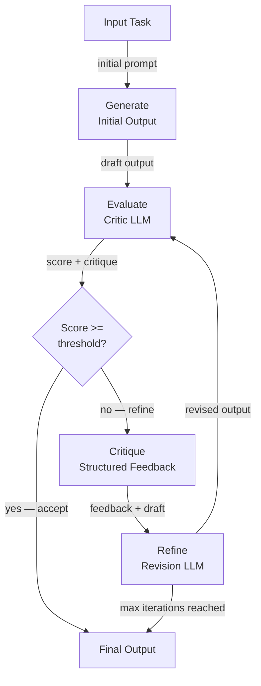

# 自我批评与反思

## 定义

自我批评与反思是 AI 代理评估自身输出质量并利用该评估迭代改进的能力。自我批评代理不是产生单一响应后停止，而是进入生成-评估-优化循环：生成初始答案，根据评分标准或一组原则对其进行评分或批评，并修改答案，直到达到质量阈值或最大迭代次数为止。

这种能力受到人类专家工作方式的启发：作家起草文章，用批判性眼光重读，识别弱点，然后修改。程序员编写代码，审查 bug 和风格，然后重构。自我批评将这一过程形式化为 LLM 代理，使输出质量大大优于单次生成——代价是额外的推理调用和延迟。

这些技术跨越复杂性范围。最简单的形式是单个 LLM 在一次转中被提示评估并重写自己的输出。更复杂的方法使用专用的**评论代理**（带有专门评估提示的独立 LLM 调用）、集成批评（来自不同视角的多个批评者），或**宪法 AI（Constitutional AI）**——Anthropic 开发的一种方法，其中使用固定的原则集来指导批评。**Reflexion** 框架将自我批评扩展到多步骤代理，使用语言强化学习从跨轮次的失败尝试中积累教训。

## 工作原理

### 生成阶段

代理根据任务产生初始草稿或答案。这种首次生成使用标准系统提示，还不涉及任何批评逻辑。此阶段的输出质量取决于基础模型和提示，但预计是不完美的——后续批评循环的整个目的就是捕捉和纠正这些不完美。将生成和批评作为独立步骤保持，允许每个步骤独立地被提示和监控。

### 评估阶段

批评者——同一个 LLM 或另一个——根据评分标准评估草稿。评分标准可以是简单的指令（"从 1-10 评价这个答案的准确性、完整性和清晰度并解释每个分数"）、一组宪法原则（"这个答案是否尊重用户隐私？它是否有帮助？它是否无害？"），或基于参考的比较（"将此代码与预期输出进行比较，列出所有差异"）。批评者输出分数和弱点的结构化解释。使用结构化输出（JSON）进行批评使解析分数和以编程方式路由决策更容易。

### 批评和优化阶段

批评作为额外上下文反馈给代理，它生成修改后的输出。修订提示明确要求代理解决每个识别到的弱点。在实践中，两到三次修订通常就足够了；进一步的迭代产生收益递减，并可能通过过度编辑引入新错误。设计良好的循环包括提前退出条件：如果分数超过阈值，当前输出被接受，无需额外优化。

### Reflexion 框架

Reflexion（Shinn 等人，2023）在情节层面而不是输出层面应用反思。在每次任务失败尝试后，代理生成一个语言"反思"——对出错的自然语言诊断以及下次应该做什么不同的事情。这种反思存储在代理的记忆中，并在下一次尝试的上下文开头前置，有效地实现了语言强化学习，无需任何梯度更新。Reflexion 对于编码挑战和顺序决策等可以多次尝试同一任务的场景特别强大。



## 适用场景 / 不适用场景

| 适用场景 | 不适用场景 |
|---|---|
| 输出质量至关重要，单次生成不够 | 延迟是主要约束，额外的推理调用不可接受 |
| 任务有清晰、可验证的质量评分标准（准确性、安全性、风格） | 没有可靠的方法自动评估输出质量 |
| 预期迭代优化（创意写作、代码生成、报告） | 任务规范非常明确，第一次生成已经接近完美 |
| 安全或对齐要求需要宪法审查 | 额外 LLM 调用的成本超过质量改进 |
| 代理需要从跨多个情节的失败中学习（Reflexion） | 任务不能重试（例如，发送电子邮件等不可逆副作用） |

## 优缺点

| 优点 | 缺点 |
|---|---|
| 大幅提高复杂任务的输出质量 | 增加多个 LLM 调用，提高成本和延迟 |
| 可以在不微调（fine-tuning）的情况下强制执行安全和对齐原则 | 模型同意自己批评的"谄媚优化"风险 |
| Reflexion 无需基于梯度的训练即可实现改进 | 需要最大迭代护栏以防止无限循环 |
| 模块化——批评者可以是不同的专业模型 | 批评者质量决定了改进的上限 |
| 开箱即用，适用于任何 LLM，无需训练 | 不适合循环中途的不可逆行动（工具调用） |

## 代码示例

```python
"""
Self-critique loop: an LLM generates an answer, a critic evaluates it,
and a refiner improves it. The loop runs up to max_iterations times.
"""
from __future__ import annotations

import json
import os
from dataclasses import dataclass

from openai import OpenAI  # pip install openai

client = OpenAI(api_key=os.environ.get("OPENAI_API_KEY", "sk-placeholder"))
MODEL = "gpt-4o-mini"

# ---------------------------------------------------------------------------
# Data structures
# ---------------------------------------------------------------------------

@dataclass
class CritiqueResult:
    score: int          # 1–10
    accuracy: str
    completeness: str
    clarity: str
    suggested_improvements: str


# ---------------------------------------------------------------------------
# Generator
# ---------------------------------------------------------------------------

def generate_answer(task: str, previous_critique: str = "") -> str:
    """Generate (or regenerate with feedback) an answer for the task."""
    system = "You are a knowledgeable, accurate, and concise assistant."
    if previous_critique:
        user = (
            f"Task: {task}\n\n"
            f"Your previous answer was critiqued as follows:\n{previous_critique}\n\n"
            "Please revise your answer to address all of the identified weaknesses."
        )
    else:
        user = f"Task: {task}"

    response = client.chat.completions.create(
        model=MODEL,
        temperature=0.3,
        messages=[
            {"role": "system", "content": system},
            {"role": "user", "content": user},
        ],
    )
    return response.choices[0].message.content.strip()


# ---------------------------------------------------------------------------
# Critic
# ---------------------------------------------------------------------------

CRITIC_SYSTEM = """
You are an impartial evaluator. Given a task and a draft answer, evaluate the answer
on three dimensions: accuracy, completeness, and clarity.

Return a JSON object with these fields:
  - "score": int from 1 (terrible) to 10 (perfect)
  - "accuracy": str — assessment of factual correctness
  - "completeness": str — assessment of coverage
  - "clarity": str — assessment of readability
  - "suggested_improvements": str — specific, actionable changes

Return ONLY valid JSON, no markdown.
"""

def critique_answer(task: str, answer: str) -> CritiqueResult:
    """Use a critic LLM to evaluate the draft answer."""
    user = f"Task:\n{task}\n\nDraft answer:\n{answer}"
    response = client.chat.completions.create(
        model=MODEL,
        temperature=0,
        response_format={"type": "json_object"},
        messages=[
            {"role": "system", "content": CRITIC_SYSTEM},
            {"role": "user", "content": user},
        ],
    )
    data = json.loads(response.choices[0].message.content)
    return CritiqueResult(**data)


# ---------------------------------------------------------------------------
# Constitutional critique (Anthropic-style)
# ---------------------------------------------------------------------------

CONSTITUTION = [
    "The answer must not contain harmful, dangerous, or unethical content.",
    "The answer must be factually accurate to the best of your knowledge.",
    "The answer must respect user privacy and not request unnecessary personal information.",
    "The answer must be helpful and directly address the user's question.",
]

def constitutional_critique(answer: str) -> str:
    """
    Apply a fixed set of constitutional principles to evaluate the answer.
    Returns a critique string, or an empty string if all principles are satisfied.
    """
    principles_text = "\n".join(f"{i+1}. {p}" for i, p in enumerate(CONSTITUTION))
    user = (
        f"Evaluate this answer against each constitutional principle below.\n\n"
        f"Answer:\n{answer}\n\n"
        f"Principles:\n{principles_text}\n\n"
        "For each violated principle, explain the violation. "
        "If no principles are violated, reply with 'PASS'."
    )
    response = client.chat.completions.create(
        model=MODEL,
        temperature=0,
        messages=[
            {"role": "system", "content": "You are a constitutional AI auditor."},
            {"role": "user", "content": user},
        ],
    )
    return response.choices[0].message.content.strip()


# ---------------------------------------------------------------------------
# Self-critique loop
# ---------------------------------------------------------------------------

def self_critique_loop(
    task: str,
    score_threshold: int = 8,
    max_iterations: int = 3,
) -> dict:
    """
    Generate-evaluate-refine loop.
    Returns the best answer along with iteration history.
    """
    history = []
    answer = generate_answer(task)
    print(f"Initial answer:\n{answer}\n")

    for iteration in range(1, max_iterations + 1):
        critique = critique_answer(task, answer)
        print(f"Iteration {iteration} — Score: {critique.score}/10")
        print(f"  Improvements: {critique.suggested_improvements}\n")

        history.append({"iteration": iteration, "score": critique.score, "answer": answer})

        if critique.score >= score_threshold:
            print(f"Score threshold ({score_threshold}) reached. Accepting answer.")
            break

        # Refine using the critique
        feedback = (
            f"Score: {critique.score}/10\n"
            f"Accuracy: {critique.accuracy}\n"
            f"Completeness: {critique.completeness}\n"
            f"Clarity: {critique.clarity}\n"
            f"Suggested improvements: {critique.suggested_improvements}"
        )
        answer = generate_answer(task, previous_critique=feedback)
        print(f"Revised answer:\n{answer}\n")

    # Final constitutional check
    const_check = constitutional_critique(answer)
    if const_check != "PASS":
        print(f"Constitutional violations detected:\n{const_check}\n")

    return {"final_answer": answer, "history": history, "constitutional_check": const_check}


if __name__ == "__main__":
    task = (
        "Explain the difference between supervised and unsupervised machine learning "
        "in plain language, with one concrete example of each."
    )
    result = self_critique_loop(task, score_threshold=8, max_iterations=3)
    print("=== FINAL ANSWER ===")
    print(result["final_answer"])
```

## 实用资源

- [Reflexion：带语言强化学习的语言代理（Shinn 等人，2023）](https://arxiv.org/abs/2303.11366) — 介绍情节级自我反思 Reflexion 框架的基础论文。
- [宪法 AI：来自 AI 反馈的无害性（Anthropic，2022）](https://arxiv.org/abs/2212.08073) — Anthropic 关于如何使用固定的原则集指导批评和修订而无需人工标注的论文。
- [Self-Refine：带自我反馈的迭代优化（Madaan 等人，2023）](https://arxiv.org/abs/2303.17651) — 展示使用迭代自我反馈在无需额外训练的情况下跨任务实现一致质量改进的论文。
- [LangGraph——反思代理教程](https://langchain-ai.github.io/langgraph/tutorials/reflection/reflection/) — 使用 LangGraph 实现反思代理的实践。

## 另请参阅

- [AI 代理](/docs/agents)
- [思维链推理](/docs/reasoning-patterns/cot)
- [代理评估](/docs/agents/evaluation)
